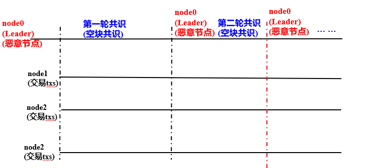
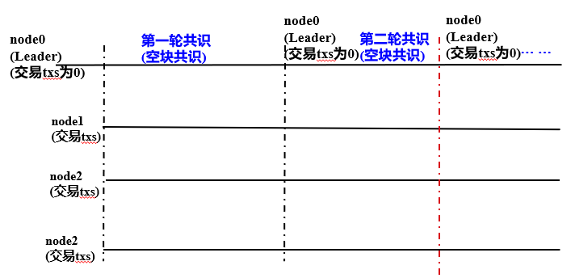
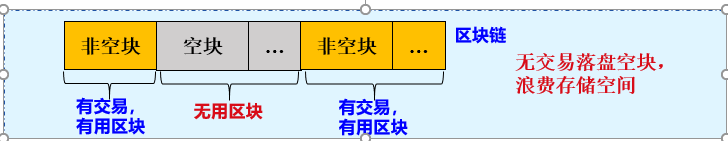

# PBFT empty block processing for FISCO BCOS

Author ： Chen Yujie ｜ FISCO BCOS Core Developer

**Author language**

In order to ensure the normal operation of the system, confirm that the leader is available, and prevent the leader from deliberately doing evil, the blockchain system based on the PBFT consensus algorithm(Such as Algorand) In the absence of a transaction, an empty block is generated。

In common blockchain networks, the bookkeeper usually continues to block according to the algorithm, in order to ensure the normal operation of the system, to prevent evil, etc., even if the block does not contain transactions, empty blocks will be consensus confirmation and drop storage。

While consensus on empty blocks has a role to play, falling empty blocks consumes storage space and reduces hard drive utilization(Number of transactions that can be stored)and to some extent affect the efficiency of block-oriented data backtracking and retrieval。

Therefore, FISCO BCOS is based on the PBFT consensus algorithm, which implements an efficient empty block processing method to ensure that each block participates in the PBFT consensus process without falling into the empty block, which improves the efficiency of disk utilization and ensures the security and robustness of the system。

## noun explanation

### Node Type

- **Leader/Primary**: The consensus node is responsible for packaging transactions into blocks and block consensus. There is only one leader in each round of consensus. To prevent leaders from forging blocks, the leader is switched after each round of PBFT consensus；
- **Replica**: Replica node, which is responsible for block consensus. There are multiple Replica nodes in each round of consensus. The process of each Replica node is similar；
- **Observer**: The observer node, which is responsible for obtaining the latest block from the consensus node or the replica node, and after executing and verifying the block execution result, the resulting block is on the chain。

where Leader and Replica are collectively referred to as consensus nodes。

### View(view)

PBFT consensus algorithm using**The view records the consensus phase of each node, and the same view node maintains the same list of Leader and Replica nodes**。When a Leader fails, a view switch occurs and a new Leader is selected based on the new view。

In the FISCO BCOS system, the calculation formula of Leader is as follows:

```
leader_idx = (view + block_number) % node_num
```

## Why must the consensus empty block switch Leader

### Prevent Leader from Deliberate Evil



As shown in the preceding figure, node0 is an untrusted current leader. If you do not switch the leader after the consensus is empty, the node always broadcasts empty blocks to other nodes, making the leader always node0, causing the system to be unable to process normal transactions。After an empty block is agreed upon, switch the leader to a trusted node, effectively preventing the leader from doing evil。

### Prevent system exceptions caused by switching to no-trade leader



As shown in the figure above, node0 is a trusted current leader, but the number of transactions that can be packaged in its trading pool is 0. If you do not switch the leader after the consensus empty block, the node will always broadcast empty blocks to other nodes, and the system leader will always be node0, unable to process normal transactions。After the consensus is empty, switch the leader, which can be switched to a node with transactions, to ensure the normal operation of the system。

## Problems with the empty block of the falling plate

### Waste of storage space

Some businesses have busy periods of the day, for example, in the middle of the night, there may be a large period of time and no users in the transaction, this time if the continued out of the block, will continue to have free blocks generated。

Example: a blockchain system 1s out of a block, 1 day 50% of the time there is no transaction, each empty block size is 1KB, if these empty blocks are down, then a sky block occupies the disk space: 3600s / h* 24h * 50% * 1KB ≈ 43.2MB, 1 year empty blocks occupy approximately 15.7GB of disk space。Assuming an average transaction size of 1KB, this 15.7GB of disk space can be used to store 15.7GB / 1KB = 15,700 transactions。



## FISCO BCOS PBFT Empty Block Processing Scheme

As shown in the figure below, the FISCO BCOS PBFT consensus algorithm triggers fast view switching through empty blocks to achieve the purpose of switching leaders without falling into empty blocks。


### Core Process

In conjunction with the above figure, the following describes the main process of the FISCO BCOS PBFT empty block processing algorithm

1. Leader(node0)node at a specified interval(Currently 1 second)Without packaging to transactions, an empty block is constructed based on the highest block, with 0 transactions；
2. Leader encapsulates the empty block in the Prepare package and broadcasts it to all other consensus nodes；
3. After receiving the Prepare packet, other consensus nodes take out the block, and if the block is empty, set the view toView to be switched by the node to the current view plus one, and broadcast the view switch request to each other viewchange _ request, the view in viewchange _ request is toView, that is, the view is increased by the current view；
4. Consensus node collection view switching package: node collection full n-f(n is the number of consensus nodes, at least 3*f+1；f is the number of fault-tolerant nodes in the system) After a view switch request from a different node, the view and the node toView value are consistent, the view switch is triggered and the current view is switched to toView；
5. Due to view switching, the Leader of the next round of consensus switches to the next node(That is, node1)。

## SUMMARY

In summary, the FISCO BCOS PBFT consensus algorithm triggers fast view switching through empty blocks, and switches the leader to optimize the empty block processing process, which solves the system exception caused by the consensus empty block not switching the leader, and realizes the storage of empty blocks without falling to disk, which improves disk utilization efficiency, accelerates the efficiency of data traceability, and reduces the complexity of data analysis。