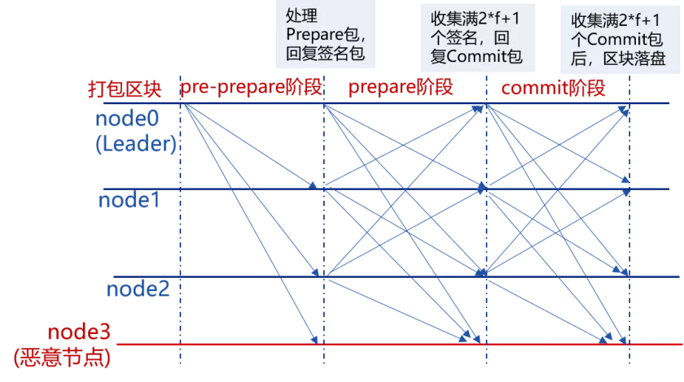
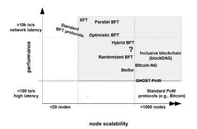
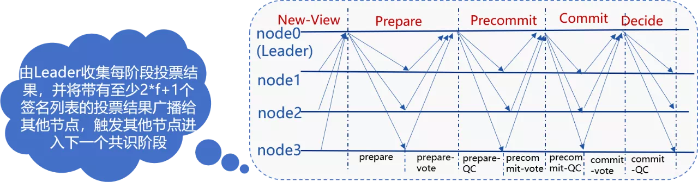
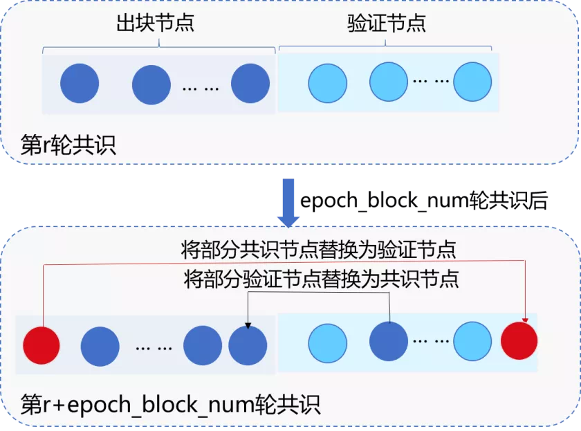
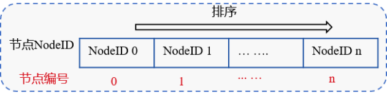
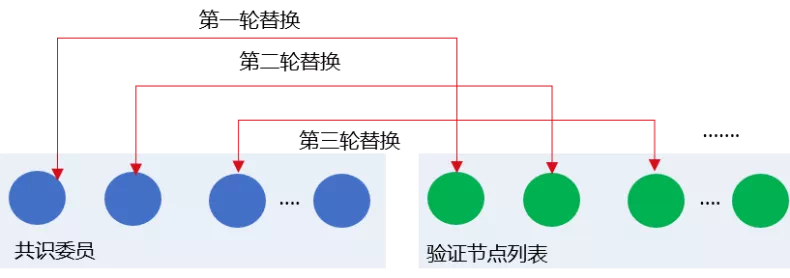
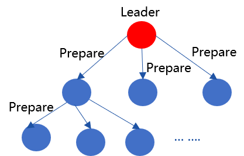
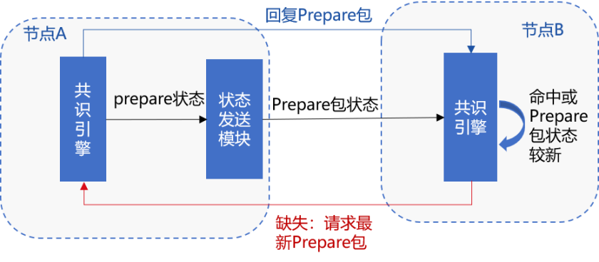

# Why we design RPBFT this way？

Author ： Chen Yujie ｜ FISCO BCOS Core Developer

## Foreword

The consensus module is the engine of the blockchain system and plays a vital role in ensuring the data consistency of each blockchain node。After FISCO BCOS introduces a pluggable consensus engine, it supports both PBFT and Raft consensus algorithms. Compared with blockchain systems using POW consensus algorithm, transaction confirmation latency is lower and throughput is higher, which can meet the performance requirements of most current alliance chain systems。

The PBFT consensus algorithm is more naturally applicable to blockchain systems because of its tolerance of Byzantine errors。The PBFT consensus algorithm also has the problem of low scalability。The FISCO BCOS team has been working on new consensus algorithms since 2019 to simultaneously guarantee the performance and scalability of blockchain systems。The RPBFT consensus algorithm released in FISCO BCOS version 2.3 is one of the research results。This paper will introduce the design purpose and technical implementation of RPBFT consensus algorithm in detail。

## PBFT Consensus Algorithm Challenge

Before introducing the RPBFT consensus algorithm, let's take a look at the challenges of the PBFT consensus algorithm and the corresponding solutions from academia。PBFT consensus algorithm originated in the last century。In 1999, Miguel Castro(Castro)and Barbara Liskov(Liskov)The PBFT consensus algorithm is proposed to reduce the complexity of the BFT algorithm from the exponential level to the polynomial level, so that the PBFT consensus algorithm can be applied to the actual system。Unlike the POW consensus algorithm, PBFT guarantees the ultimate consistency of distributed systems based on the principle of distributed consistency。Due to the abandonment of computing power, the PBFT consensus algorithm has higher performance and lower transaction confirmation latency, and the anti-evil mechanism based on cryptography technology is naturally suitable for alliance blockchain systems。The PBFT consensus algorithm also has"soft rib", a glimpse of its three-stage consensus process。

As can be seen from the above figure, in the PBFT consensus process, nodes need to broadcast consensus packets to each other, and the network complexity is proportional to the square of the number of nodes, which severely limits the scalability of PBFT。

The following chart, compiled from IBM researcher Marko research, reflects the relationship between node size and transaction latency in blockchain systems using different consensus algorithms

It can be seen that the BFT class consensus algorithm has high performance, but it supports a maximum of 1000 nodes。In 2019, HotStuff will become a consensus algorithm for blockchain platforms to study, and compared to PBFT, HotStuff has many advantages such as simple algorithm, linear relationship between network complexity and node size, and so on。The following figure shows the core process of HotStuff:

Because the complexity of HotStuff is still proportional to the size of the node, the scalability of the consensus algorithm cannot be fundamentally solved, and each stage of HotStuff relies on the Leader to collect and broadcast message packets, the Leader will become the bottleneck of each round of consensus。Based on the above research, the FISCO BCOS team has implemented the PBFT packet consensus algorithm and the HotStuff consensus algorithm。However, as the node size increases, the performance and throughput of these consensus algorithms gradually decline。Therefore, we began to explore a consensus mechanism that will not cause a rapid linear decline in the performance of the blockchain system due to the increase in the number of nodes. The RPBFT consensus algorithm came into being in this case。

## The core idea of RPBFT consensus algorithm

The goal of the RPBFT consensus algorithm is to decouple the network complexity of the consensus algorithm from the consensus node size and improve the scalability of the blockchain system while ensuring the performance and security of the blockchain system。In order to achieve this goal, the FISCO BCOS team refers to the DPOS idea and randomly selects some nodes as "consensus member nodes" to participate in each round of PBFT consensus under the large node scale。In addition, in order to ensure the security of the system and prevent the consensus member nodes from joining forces, the RPBFT algorithm periodically replaces the consensus member nodes, as shown in the following figure

## Implementation Scheme of RPBFT Consensus Algorithm

The RPBFT algorithm mainly includes two system parameters:

-epoch _ sealer _ num: the number of nodes participating in the consensus process in each round of consensus. You can dynamically configure this parameter by sending transactions on the console。
- epoch_block_num: The consensus node replacement cycle. To prevent the selected consensus nodes from jointly doing evil, RPBFT replaces several consensus member nodes for each epoch _ block _ num block. This parameter can be dynamically configured by issuing transactions on the console。

These two configuration items are recorded in the system configuration table. The configuration table mainly includes three fields: configuration keyword, configuration corresponding value, and effective block height. The effective block height records the latest effective block height configured with the latest value. For example, in a 100-block transaction, set epoch _ sealer _ num and epoch _ block _ num to 4 and 10000 respectively. The system configuration table is as follows:

| key              | value | enable_num |
| ---------------- | ----- | ---------- |
| epoch_sealer_num | 4     | 101        |
| epoch_block_num  | 10000 | 101        |

The core algorithm flow of RPBFT consensus algorithm is as follows:

### Determine each consensus node number IDX

Sort the NodeIDs of all consensus nodes, as shown in the following figure. The NodeID index after the nodes are sorted is the consensus node number:

### chain initialization

During chain initialization, RPBFT needs to select epoch _ sealer _ num consensus nodes to participate in consensus among consensus members. Currently, the initial implementation is to select nodes with indexes from 0 to epoch _ sealer _ num-1 to participate in pre-epoch _ block _ num block consensus。

### The consensus member node runs the PBFT consensus algorithm

The selected epoch _ sealer _ num consensus committee nodes run the PBFT consensus algorithm to verify node synchronization and verify the blocks generated by the consensus of these verification nodes. The verification steps include:

- Checked list of block signatures: each block must contain at least the signatures of two-thirds of the consensus member nodes
- Check the block execution result: the local execution result must be consistent with the block execution result generated by the consensus committee

### Dynamic replacement consensus member node list

To ensure system security, the RPBFT algorithm removes several nodes from the consensus member list and adds several validation nodes after each epoch _ block _ num block

In the current implementation of the RPBFT algorithm, the consensus committee list nodes are replaced by validation nodes in turn. If the current ordered consensus committee node list is CommitteeSealersList and the total number of consensus nodes is N, then after the consensus epoch _ block _ num blocks, the CommitteeSealersList [0] is removed from the consensus committee list and the index is added as follows(CommitteeSealersList[0].IDX + epoch_sealer_num) Authentication node for% N。In the i-th replacement cycle, the CommitteeSealersList [i% epoch _ sealer _ num] is removed from the consensus member list and indexed as(CommitteeSealersList[i%epoch_sealer_num].IDX + epoch_sealer_num) Authentication node for% N。

## RPBFT Network Optimization

Considering that Prepare packets are large and account for a large portion of the network overhead, in order to further improve the scalability of the RPBFT consensus algorithm, we introduced Prepare packet broadcast optimization in FISCO BCOS 2.3。Allocate the outgoing bandwidth generated by the leader's broadcast of the Prepare packet to its subordinate child nodes, that is, after the leader generates the Prepare packet, it propagates the packet to other nodes along the tree topology, as shown in the following figure:

To ensure that the Prepare packet can still reach each node when the tree broadcast is turned on in the event of node disconnection, RPBFT introduces a fault tolerance mechanism based on state packets, as shown in the following figure

The main processes include:

1. After receiving Prepare, node A randomly selects 33% of nodes to broadcast the Prepare packet status, which is recorded as prepareStatus, including{blockNumber, blockHash, view, idx}。

2. After receiving the prepareStatus randomly broadcast by node A, node B determines whether the status of the Prepare package of node A is newer than the localPrepare status of the current Prepare package of node B。The main judgment basis includes:

   (1) Is prepareStatus.blockNumber greater than the current block height

   (2) Is prepareStatus.blockNumber greater than localPrepare.blockNumber

   (3) Is prepareStatus.view greater than localPrepare.view when prepareStatus.blockNumber equals localPrepare.blockNumber

   Any of the above conditions holds, indicating that the Prepare package state of node A is newer than the state of node B。

3. If the state of node B lags behind that of node A and node B is disconnected from its parent node, node B sends a prepareRequest request to node A, requesting the corresponding Prepare package。

4. If the state of node B is behind node A, but node B is connected to its parent node, if node B waits up to 100ms(Can be matched)node B sends a prepareRequest request to node A, requesting the corresponding Prepare package。

5. After receiving the prepareRequest request from node A, node B replies to the corresponding Prepare message package。

6. After receiving the Prepare message packet from node B, node A executes the handlePrepare process to process the received Prepare packet。

After the block is released, in order to reduce the impact of the network bandwidth of the consensus member node on the network scalability when multiple verification nodes and observation nodes synchronize the block to the consensus member node, RPBFT adopts the block state tree broadcast strategy. For details, please refer to [Optimization Strategy of FISCO BCOS Synchronization Module](https://mp.weixin.qq.com/s?__biz=MzA3MTI5Njg4Mw==&mid=2247485447&idx=1&sn=2bb8fa3dcf9f9276154ce83f9a75be82&scene=21#wechat_redirect)。

## Prospect of RPBFT Algorithm Optimization

FISCO BCOS 2.3 initially implements the RPBFT consensus algorithm, eliminating the impact of node size on the complexity of the consensus algorithm。However, the current implementation of the RPBFT consensus algorithm, there is still room for improvement, such as: consensus committee node selection replacement rules are relatively simple。Future plans to introduce VRF verifiable random number algorithm to achieve private, random, non-interactive consensus committee node selection method, welcome to experience and feedback。

## Summary

This paper describes the challenges of BFT-like algorithms and the initial results of the FISCO BCOS team's exploration in the field of consensus algorithms。Distributed system consensus is a large and complex field. The RPBFT algorithm released by FISCO BCOS 2.3 only decouples the influence of node size on network complexity, which is the first step to realize high-security and scalable consensus algorithm. In the future, VRF algorithm will be introduced to ensure the security of consensus committee node selection。