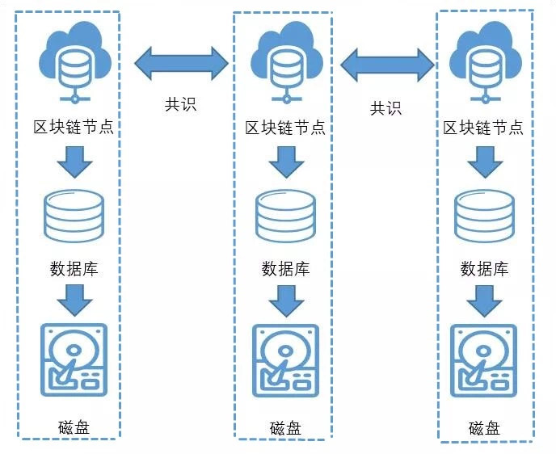

# Does blockchain data exist on the chain or in the database?？

Author: Mo Nan ｜ Senior Architect, FISCO BCOS

Before you answer this question, you must first clarify. "**Blockchain data**"和"**On-chain data**The concept of。

## Blockchain data

"Blockchain data" broadly includes blockchain**Block Data**and blockchain**Status data:**

-Block data records every transaction that occurs on the blockchain, such as Xiaoming's transfer of 50 yuan to Xiao Wang, Xiao Wang's recharge of 20 yuan, and so on；
- Status data records the current status of each account or smart contract on the blockchain, such as Xiao Ming's current balance of $50 and Xiao Wang's current balance of $100。

Both block data and state data are used and stored by blockchain nodes。A blockchain node is a program that runs on our personal computer, virtual machine, or server。Multiple blockchain nodes distributed on different computers or servers are connected to each other through the network to form a complete blockchain network。

Blockchain nodes typically store blockchain data on a PC, virtual machine, or server, and the most common medium for storing blockchain data is disk。

Blockchain nodes do not have direct access to disks, they manipulate data through a specific database, such as a stand-alone or distributed database like LevelDB, RocksDB, or MySQL。Compared with direct disk operation, the database abstracts a specific data access model and is more friendly to blockchain nodes。

Therefore, when we say: "Blockchain data is stored in a database," it can be considered that the blockchain node stores the blockchain data in MySQL (or other database), and MySQL stores the blockchain data on disk。



The database has**freestanding**与**Embedded**Points:

-Standalone databases, such as MySQL and Oracle, are commonly understood databases. Standalone databases run as independent processes and need to be deployed and started and stopped separately。The standalone database can be deployed on the same server as the blockchain node or on a different server. It also supports distributed and clustered deployment。Regardless of the deployment method, the standalone database is the storage component of the blockchain node, belongs to the blockchain node, and has nothing to do with the blockchain network。
- Embedded databases such as LevelDB and RocksDB, which are integrated with blockchain nodes in the same process in the form of dynamic or static dependency libraries, start and stop at the same time, and users will not be aware of their existence。

## On-chain data

The block data and state data of blockchain data are not generated out of thin air。The transaction in the block data is generated by the user of the block chain. The user sends the transaction to the block chain node. The block chain node packages multiple transactions into the block. The block will broadcast and agree on the block. After the block chain network reaches a consensus on the block, it agrees with the transaction in the block and saves the execution result of the transaction in the status data。

Assuming that the original status data of the blockchain is: Xiao Ming's current balance is 50 yuan, Xiao Wang's current balance is 100 yuan, then after the execution of the "Xiao Ming to Xiao Wang transferred 50 yuan" transaction, the status data will change, Xiao Ming's current balance will become 0 yuan, Xiao Wang's current balance becomes 150 yuan。

Blocks require blockchain consensus, and state data is generated by executing transactions in the block, both of which are directly or indirectly related to blockchain consensus and can be referred to as "on-chain data."。Well, the clear definition of "on-chain data" is: on-chain data is data generated directly or indirectly by blockchain consensus。

**Back to the original question**

Obviously, "on-chain data" and "database" are not the same level of concept, "blockchain data is there on the chain or there is a database."？This problem is not true, blockchain data, whether stored in LevelDB, RocksDB, MySQL database or directly stored on disk, as long as it is directly or indirectly generated by blockchain consensus, can be regarded as on-chain data。

## On-chain data for FISCO BCOS

The blockchain data of FISCO BCOS is saved in the disk through RocksDB by default。If you want to save data to a MySQL database, you can deploy a MySQL database and modify the group configuration file under the blockchain node. The group configuration file is usually located in the configuration directory of the blockchain node: conf / group.1.ini

```
[storage]
    type=mysql
    db_ip=127.0.0.1
    db_port=3306
    db_username=root
    db_name=db_Group1_A
    db_passwd=******
```

Among them:

-type indicates the storage type of the blockchain node, which is configured as mysql, indicating that MySQL is used to store blockchain data；
-db _ ip is the IP address of the MySQL database. If it is deployed on this machine, it is 127.0.0.1；
-db _ port indicates the port of the MySQL database. The default value is 3306；
-db _ username is the login user name of the MySQL database；
-db _ name is the name of the database used to store blockchain data in the MySQL database；
-db _ passwd is the login password for the MySQL database。

For other unmentioned configuration items, you can leave the default values unchanged. After completing the filling of these information, ensure that the database is running normally, and then restart the blockchain node, the blockchain node will save the blockchain data to the MySQL database。FISCO BCOS's blockchain, whether stored in RocksDB or MySQL, can be considered as on-chain data。Using MySQL, you can easily view the size and structure of the data on the chain, such as the size of the block, the size of the account, and so on。

## SUMMARY

FISCO BCOS provides a flexible data storage mechanism, for the pursuit of convenience and performance scenarios, you can use the default RocksDB；For scenarios that focus on auditing and governance, you can use MySQL to meet different needs。

**For FISCO BCOS storage, refer to [FISCO BCOS Distributed Storage Documentation](../../../manual/distributed_storage.html)**

------

#### "Group chat interaction"

【Q】 **What a small world**: The data on the blockchain is added to the top, can not be deleted, so long time use, will the efficiency of the node continue to decline？

【A】 **CUHK Liu Zhongnan**The transaction and status data stored in the node header, which is the root hash value with a limited length。

【A】**Mo Nan**: Blockchain will indeed continue to grow with its use, but the data access model of blockchain is usually kv, and the query efficiency of kv model is little affected by the amount of data, so it will not significantly affect performance。

【Q】 **What a small world**If you add a node to the blockchain network, the node will automatically copy data from other nodes via broadcast, right?？

【A】**Mo Nan**Add a node to the blockchain network. This node automatically synchronizes the data of other nodes。