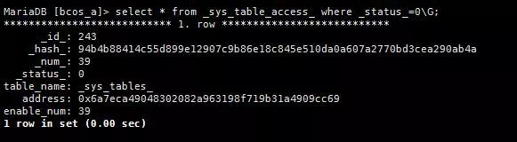

# FISCO BCOS Table-based Storage Structure

Author ： YIN Qiangwen ｜ FISCO BCOS Core Developer

The underlying storage data structure of FISCO BCOS does not use the traditional MPT storage structure, but uses a table-based structure。On the one hand, it avoids the problem of performance degradation caused by the rapid expansion of the world state；On the other hand, the table structure can be compatible with various storage engines, making business development more convenient。

## Classification of FISCO BCOS tables

Each FISCO BCOS table has a primary key field and one or more value fields. Tables are divided into system tables (beginning with _ sys _), user tables (beginning with _ user _), and StorageState account tables (beginning with _ contract _ data _)。
All records of the table structure have built-in fields of '_ id _', '_ status _', '_ num _', '_ hash _'。The user table and StorageState account table key fields are of type varchar(255)value is of type mediumtext。

## System tables

The system table exists by default. When the node process or the amdb-proxy process starts, the system table is created. The description of each table is as follows。

- **_sys_tables_**

Stores the structure of all tables. Each table has a record in this table to record the structure of the table, including the key and field fields of the table。The table structure is as follows:

| Field| table_name | key_field | value_field              |
| ---- | ---------- | --------- | ------------------------ |
| Description| Table Name| Primary key name| List of value names, separated by ','|

Taking the table name _ sys _ tx _ hash _ 2 _ block _ as an example, the data of each field in _ sys _ tables _ is as follows:

```
table_name=_sys_tx_hash_2_block_key_field=hashvalue_field=value,index
```

The underlying creation table and read structure table are based on the _ sys _ tables _ table. As can be seen from the created _ sys _ tx _ hash _ 2 _ block _ table, this table contains three fields, namely the main key field hash, and the value field has two values, namely value and index。

- **_sys_consensus_**

Stores a list of consensus and observation nodes。The table structure is as follows:

| Field| name             | type                                           | node_id | enable_num |
| ---- | ---------------- | ---------------------------------------------- | ------- | ---------- |
| Description| primary key, fixed to node| The node type. The sealer is the consensus node and the observer is the observation node| node id| Effective block height|

For example, a chain consists of four nodes, the initialization is a consensus node, you can see that the four nodes are sealer (consensus node), the effective block height is 0, as shown in the figure:


Remove the '149f3777a0...' node from the console and add it to the observer list. Query the data in the _ sys _ consensus _ table and find that the type of this record has been changed to observer and the effective block height has been changed to 3。As shown in the figure:


- **_sys_current_state_**

Stores the latest status of the current blockchain. Every time block data is stored, this table will update the information, including the current allocated self-increasing id, the current block height, the number of failed transactions, and the total number of transactions。The table structure is as follows:

| Field| key  | value |
| ---- | ---- | ----- |
|      |      |       |

The stored information is as follows:

| key                            | Meaning|
| ------------------------------ | -------------------- |
| current_id                     | the auto - increment id currently allocated|
| current_number                 | Current block height|
| total_failed_transaction_count | Number of failed transactions|
| total_transaction_count        | Total transactions|

- **_sys_config_**

Stores the group configuration items that require consensus. The table structure is the same as _ sys _ current _ state _. Currently, two numeric items are configured, which are the maximum number of transactions contained in a block and the value of gas。When writing to the Genesis block, two configuration items, consensus.max _ trans _ num and tx.gas _ limit, are read from the group. [groupid] .genesis file and written to the table。The stored information is as follows:

| key            | Meaning|
| -------------- | ------------------------ |
| tx_count_limit | Maximum number of transactions contained in a block|
| tx_gas_limit   | gas value|

- **_sys_table_access_**

Store external account addresses with write permissions。The table structure is as follows:

| Field| table_name | address              | enable_num |
| ---- | ---------- | -------------------- | ---------- |
| Description| Table Name| External address with write permission| Effective block height|

By default, this table has no data, indicating that all external accounts have read and write permissions. If you use the 'grantDeployAndCreateManager' command to authorize an account in the console, an entry will be added to the '_ sys _ table _ access _' table。



At the same time, you can see that in addition to authorized external accounts that can deploy contracts, other accounts will be prompted to deploy contracts without permission。


- **_sys_number_2_hash_**

Storage block number to block hash mapping, can be mapped to block hash value based on block number。The table structure is as follows:

| Field| number | value      |
| ---- | ------ | ---------- |
| Description| Block No| Block hash value|

- **_sys_hash_2_block_**

Store hash to serialized block data mapping, which can be mapped to block values based on block hash values。The table structure is as follows:

| Field| hash       | value  |
| ---- | ---------- | ------ |
| Description| Block hash value| Block value|

- **_sys_block_2_nonces_**

The nonces of the transaction in the storage block, which can be mapped to the nonces value used when the block is generated based on the block number。The table structure is as follows:

| Field| number | value                    |
| ---- | ------ | ------------------------ |
| Description| Block No| nonces value used to generate the block|

- **_sys_tx_hash_2_block_**

The mapping from a transaction hash to a block number. The table structure is as follows:

| Field| hash     | value  | index                |
| ---- | -------- | ------ | -------------------- |
| Description| Transaction hash| Block No| Number of the transaction in the block|

A block may include multiple transactions. Therefore, a block hash and a transaction hash are in a one-to-many relationship. Therefore, a block generates multiple pieces of data in this table。

- **_sys_cns_**

Store the mapping from contract name to contract address. The table structure is as follows:

| Field| name          | version    | address  | abi                                                          |
| ---- | ------------- | ---------- | -------- | ------------------------------------------------------------ |
| Description| Primary key, contract name| Contract version number| Contract Address| The interface description of the contract, which describes the contract field name, field type, method name, parameter name, parameter type, and method return value type|

Contracts deployed with CNS can be called by contract name, specifically by finding a list of contract addresses with multiple version numbers based on the contract name, filtering out the contract address with the correct version number, and then using '_ contract _ data _'+`Address`+'_' as the table name, to query the value of the code, execute the contract code。

For example, through the TableTest contract deployed by CNS, you can query the following data in the '_ sys _ cns _' table:


## User Table

The table created by the user calling the CRUD interface to '_ user _<TableName>'For the table name, the bottom layer automatically adds the '_ user _' prefix。

The table name and table structure are determined by the contract. For example, the contract code for creating a table is:

```
 TableFactory tf = TableFactory(0x1001); int count = tf.createTable("t_test", "name", "item_id,item_name"); return count;
```

The created table is named '_ user _ t _ test', including three fields, namely the main key field 'name', of type varchar(255)；value contains two fields, 'item _ id' and 'item _ name'；As shown in the figure:


## StorageState Account Table

`_contract_data_`+`Address`+'_' as table name。Table stores information about external accounts。The storage information is as follows:

| key      | value |
| -------- | ----- |
| alive    |       |
| balance  |       |
| code     |       |
| codeHash |       |
| nonce    |       |

Take deploying the 'TableTest' contract as an example, 'deploy TableTest' will return an address, as shown in the figure:


At the same time, you can see that a table named '_ contract _ data _ a582f529ff55e6ca2ada7ad3bab3b97e1c7013f2 _' is generated in the database, and the storage information is as follows (consistent with the above statement):


## SUMMARY

The table-based storage method abstracts the underlying storage model of the blockchain, implements an SQL-like abstract storage interface, and supports a variety of back-end databases。
After the introduction of table-based storage, data read and write requests directly access the storage without MPT, combined with the cache mechanism, the storage performance is greatly improved compared to MPT-based storage。MPT data structure remains as an option。

### "Group Questions"

**Q**: Tenglong(He Zhiqun): Is there a comparison of the advantages and disadvantages of table and smart contract internal storage?？

**A**: Wheat: table is a design similar to the traditional database usage, which can make the development of writing business logic easier to get started。Table-based data storage, management is more convenient。Table format performance is also higher than contract mpt format for storing data。

**Q**Mr. Wang: I'm a little confused, isn't table storage the same as traditional database storage, and what's the use of blockchain?？

**A**: Yin Qiangwen: What storage structure to use, essentially does not change the blockchain has the characteristics of decentralization, non-tampering, irreversible, anonymous, etc。Just use table-based storage, there are some advantages, one is the data is based on table storage, management is more convenient。Compared with contract mpt format to store data, table format performance is also higher, while the table structure can be compatible with a variety of storage engines, making business development more convenient。