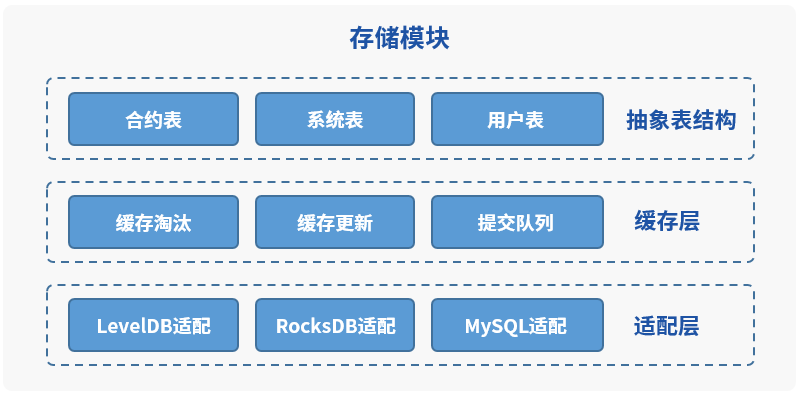
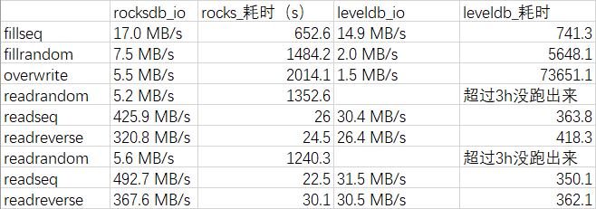

# Why switch from LevelDB to RocksDB？

Author ： Bai Xingqiang ｜ FISCO BCOS Core Developer

The storage module is one of the cores of the underlying blockchain platform and is responsible for storing all the data in the blockchain that needs to be persisted to disk.。An excellent blockchain underlying platform must have a strong storage module support。FISCO BCOS storage modules have been refactored and optimized many times to provide strong support for performance breakthroughs.。Currently, FISCO BCOS single chain TPS reaches 20,000+and supports parallel expansion of parallel multi-chain。

2.0.0-Before rc3, FISCO BCOS supported LevelDB and MySQL as data storage engines. After rc3, the embedded storage engine was switched from LevelDB to RocksDB.。Why Switch?？What can you bring after switching RocksDB？This article will take you all together to review our considerations in making this decision.。

## FISCO BCOS Storage Module Overview

### Data submission process

The data that needs to be stored in FISCO BCOS can be divided into two parts, one is consensus-based on-chain data, including transaction, receipt, block, and contract data.；The other part is the data required by each node to maintain the operation of the blockchain, including the current block height, the number of transactions on the chain, and the index information related to some transaction blocks.。New blocks on the blockchain come from the synchronization module and the consensus module。Take the synchronization module as an example, when a new block is obtained, the synchronization module calls the BlockVerifier module to execute and verify the block, and if the verification passes, the BlockChain module is called to submit the data generated by the block and the execution block to the storage module, which is responsible for serializing the data into the database.。

### Storage Module Overview

After the data is submitted to the storage module, it is an abstract table structure. The storage module first adds the submitted data to the cache layer to improve query performance。After the cache is updated, the data to be submitted is added to the submission queue, and the cache layer is responsible for asynchronous submission to the adaptation layer.。

The adaptation layer needs to convert the submitted data from the abstract table structure organization form of FISCO BCOS to the organization form of the back-end corresponding storage, for MySQL this kind of relational database, then directly the table structure of the storage module corresponds to the database table structure, for example _ sys _ config _ this table in MySQL as shown in the following figure。

For KV storage modes such as RocksDB or LevelDB, the table name and the primary key set during insertion are combined as the database KEY, and the corresponding data is serialized as VALUE。The data corresponding to the table _ sys _ config _ and the main key tx _ conut _ limit. The KEY in the KV database is _ sys _ config _ _ tx _ conut _ limit.。

## Why choose RocksDB?？

FISCO BCOS has been using LevelDB as the underlying data storage engine since version 1.0, and we have encountered some minor problems during use, such as high memory footprint, overrun file descriptors causing processes to be killed, and possible DB damage after nodes are killed.。

When refactoring version 2.0, for higher performance, we need a better storage engine, which should meet the following conditions:

1. Open source and ongoing maintenance；

2. Read and write performance is higher than LevelDB；

3. Embedded KV database, which can support reading and writing in large data scenarios；

4. Interface similar to LevelDB to reduce migration costs。 

Based on the above conditions, RocksDB entered our field of vision。

RocksDB fork comes from LevelDB and is open source and maintained by backbook. Compared with LevelDB, it has obvious performance improvement, maintains the same interface as LevelDB, and has extremely low migration cost.。From the data, it is very consistent with our needs.。 

### Performance comparison between LevelDB and RocksDB

The following test data is in a 4 vCPU E5-26xx 2.4GHz 8G 500GB Tengxun cloud hard disk machine, provided by Yin Qiangwen, the core developer of FISCO BCOS。

The length of the test key is 16 bytes, the length of VALUE is 100 bytes, the compression algorithm uses Snappy, and other parameters use default values. In the case of 10 million pieces of data and 100 million pieces of data, we can see the performance comparison between LevelDB and RocksDB: under the two data volumes, RocksDB has achieved no worse or better performance than LevelDB in all scenarios.。

### Using RocksDB in FISCO BCOS

On the official wiki of RocksDB, there is a page called Features Not in LevelDB. This page describes all the new features in RocksDB, such as support for column families, support for logical database partitioning, support for backup and checkpoint, support for backup to HDFS, and two compaction methods. It allows users to choose between STD compression algorithms such as read amplification, write amplification, and space amplification. Statistics comes with modules for easy tuning.。

The official wiki also mentions RocksDB's optimizations to improve performance, including multi-threaded Compact, multi-threaded memtable insertion, reduced DB lock holding time, write lock optimization, and fewer comparison operations when skipping table searches.。According to the official documentation, RocksDB uses multi-threaded compaction in scenarios where the insertion key is ordered, making RocksDB's performance significantly higher than LevelDB's.。

When using RocksDB, FISCO BCOS only uses the default parameters and the read-write interface compatible with LevelDB, and does not do further parameter tuning. RocksDB has pointed out in the official document that the default parameters can already achieve good performance, and further tuning parameters cannot bring significant performance improvement.。

In the future, as we learn more about RocksDB, if we find better parameter settings, we will also use the。

## SUMMARY

Why change to RocksDB? In fact, in a word, RocksDB has higher performance！Anything that can make FISCO BCOS better, we are willing to do。Recently, FISCO BCOS released version v2.2.0, which has been further optimized in terms of performance. Every time the performance improvement is the result of the developers of FISCO BCOS, we will continue to do this. I hope that the students in the community will also participate in it.！

------

#### Reference Links

[Features Not in LevelDB](https://github.com/facebook/rocksdb/wiki/Features-Not-in-LevelDB)

[RocksDB official wiki](https://github.com/facebook/rocksdb/wiki/Performance-Benchmarks)

[Benchmarking LevelDB vs. Rocks DB vs. HyperLevel DB vs. LMDB Performance for Influx DB](https://www.influxdata.com/blog/benchmarking-leveldb-vs-rocksdb-vs-hyperleveldb-vs-lmdb-performance-for-influxdb/)