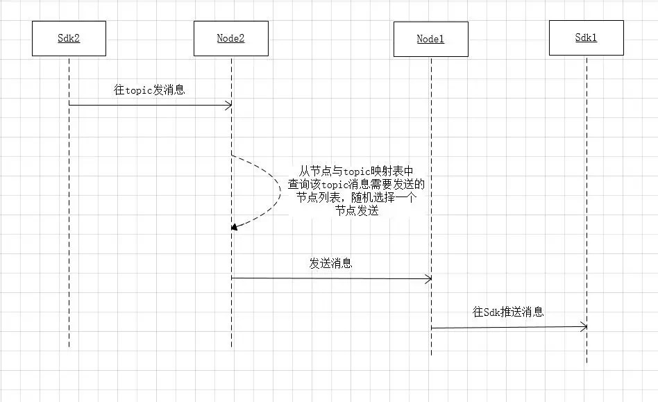
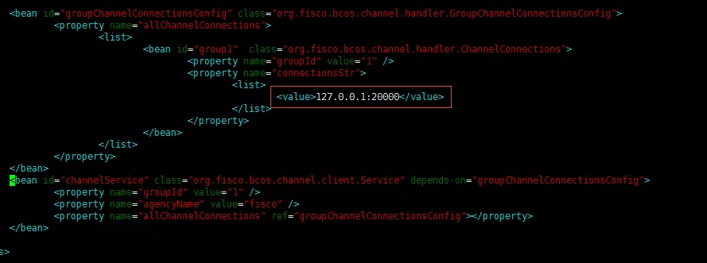

# Introduction to the use of AMOP by FISCO BCOS

Author ： YIN Qiangwen ｜ FISCO BCOS Core Developer

**Introduction to AMOP**: The Advanced Messages Onchain Protocol (AMOP) is designed to provide a secure and efficient message transmission channel for all agencies in the alliance chain, supporting real-time message communication across agencies, point-to-point, and providing a standardized interface for interaction between off-chain systems. AMOP is based on SSL communication encryption to ensure that messages cannot be eavesdropped.。

## logical architecture

AMOP uses the underlying P2P communication of FISCO BCOS. The logical architecture is as follows:


The regions are summarized as follows:

- **out-chain region**: The business service area within the organization. The business subsystems in this area use the blockchain SDK to connect to the blockchain nodes.。

- **P2P network area inside blockchain**: This area is a logical area. The blockchain nodes of each organization are deployed. The blockchain nodes can also be deployed inside the organization.。

## **Core implementation**

AMOP's messaging is based on**Sub-Pub subscription mechanism**, the server first sets a topic, the client sends a message to the topic, the server receives。

AMOP supports multiple topics in the same blockchain network to send and receive messages, and supports any number of servers and clients. When multiple servers pay attention to the same topic, the messages of the topic are randomly distributed to one of the available servers.。

**AMOP includes two processes**：

1. Set the topic on the server to listen for messages from the topic；

2. The client sends a message to the topic。

The following is an example to illustrate the internal implementation. As shown in the following figure, there are two SDKs, SDK1 and SDK2, and two nodes, Node1 and Node2, respectively.。Set the topic T1 in the SDK1 connection to Node1, and send the message that the topic is T1 in the SDK2 connection to Node2。

### 1. The server sets the topic to listen to the message timing of the topic.


**The main processes are as follows**：

1. SDK1 sends a request to listen for a topic message to its directly connected node Node1, which maintains the mapping relationship between the node and the topic list. This mapping relationship is used for message routing and is a map structure, key is NodeId, value is a set, and set stores the list of topics that the NodeId can receive messages。
2. After Node1 adds a new topic, the node updates the mapping table between the node and the topic。
3. Node1 updates seq: seq is mainly used to ensure that the mapping table of each node is consistent. After adding a topic, the seq of this node will be increased by 1, and the heartbeat packet between nodes will be sent to other nodes. After receiving the heartbeat packet, other nodes (Node2) will compare the seq in the parameter with the seq of this node.(Node1)Request the mapping relationship between the node and the topic list, update the latest mapping relationship to this node and update seq。This ensures the consistency of the global mapping relationship.。

### 2. Timing of the message sent by the client to the topic



- SDK2 sends a message to Node2。
- Node2 finds the list of nodes to which the topic can be sent from the mapping between nodes and the topic list, and randomly selects a node Node1 to send。
- Node 1 receives the message and pushes it to SDK1。

## Profile Configuration

AMOP does not require any additional configuration. The following is the reference configuration of Web3Sdk. Please refer to [Reference Document] for details.(https://fisco-bcos-documentation.readthedocs.io/zh_CN/latest/docs/sdk/sdk.html)。



The configuration files of different SDKs are different because of the different node addresses. Take the logical architecture diagram at the beginning of the article as an example, assume that the listening address of Node1 is 127.0.0.1.:20200, the listening address of Node2 is 127.0.0.1:20201, then SDK1 is configured as 127.0.0.1:20200, SDK2 Configuration 127.0.0.1:20201。

## TEST

After configuring according to the above instructions, the user specifies a topic and executes the following two commands to test。 

### Start amop server

```
java -cp 'conf/:apps/*:lib/*' org.fisco.bcos.channel.test.amop.Channel2Server [topic]
```

### Start amop client

```
java -cp 'conf/:apps/*:lib/*' org.fisco.bcos.channel.test.amop.Channel2Client [topic] [Number of messages]
```

The client and server have the following effect after execution:


## Common error codes and problem location

- **99**Failed to send the message. After AMOP attempts to send the message through all links, the message cannot be sent to the server. It is recommended to use the 'seq' generated during sending to check the processing of each node on the link.。

- **100**: After attempting to pass through all links between blockchain nodes, the message cannot be sent to the node that can receive the message. Like the error code '99', it is recommended to use the 'seq' generated at the time of sending to check the processing of each node on the link.。

- **101**: The blockchain node pushes the message to the Sdk. After attempting to pass through all links, the message fails to reach the Sdk. Like the error code '99', it is recommended to use the 'seq' generated during sending to check the processing status of each node on the link and the Sdk.。

- **102**: The message timed out. It is recommended to check whether the server correctly handles the message and whether the bandwidth is sufficient。

## Future plans

In the future, we will continue to enrich the functions of AMOP, supporting binary transmission, message multicast protocol and topic authentication mechanism. We also welcome you to use AMOP and put forward optimization suggestions.。