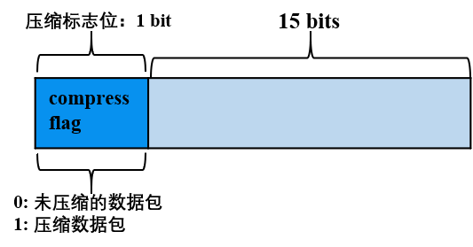

# How does FISCO BCOS network compression function？

Author ： Chen Yujie ｜ FISCO BCOS Core Developer

**Author language**

In the external network environment, the performance of the blockchain system is limited by the network bandwidth. In order to minimize the impact of the network bandwidth on the system performance, FISCO BCOS-2.0.0-rc2 began to support the network compression function, which mainly compresses network packets at the sending end, unpacks the data at the receiving end, and passes the unpacked data to the upper module.。

This article is about the FISCO BCOS network compression function, the author from the FISCO BCOS system framework, core implementation, processing flow, test results and other aspects of the analysis.。

## Part 1. System framework

Network compression is mainly implemented at the P2P network layer, and the system framework is as follows.

Network compression consists of two main processes:
- **Send-side compressed data packets**When the group layer sends data through the P2P layer, if the packet size exceeds 1KB, the packet is compressed and sent to the destination node；
- **Receiver Decompressed Data Packets**After the node receives the data packet, it first determines whether the received data packet is compressed. If the data packet is a compressed data packet, it will be decompressed and passed to the specified group.。 

## Part 2. Core implementation

Considering performance, compression efficiency, etc., we selected the**Snappy**to achieve packet compression and decompression。

### Data compression flag bit

The network packet structure of FISCO BCOS is as follows:

The network data packet mainly includes two parts: packet header and data. The packet header occupies 16 bytes. The meanings of each field are as follows:

- Length: Packet Length
- Version: Extension bits for extending network module functionality
- ProtocolID: Stores the packet destination group ID and module ID for**Multi-group packet routing, currently supports up to 32767 groups**
- PaketType: Packet type marked
- Seq: Packet Sequence Number

**The network compression module only compresses network data, not packet headers。**

Considering that compressing and decompressing small data packets cannot save data space and waste performance, in the data compression process, do not compress too small data packets, only compress data packets larger than 'c _ compressThreshold'. C _ compressThreshold 'defaults to 1024(1KB)。We extended the highest bit of Version as the packet compression flag:

- The highest bit of Version is 0, indicating that the data data corresponding to the data packet is uncompressed data；
- The highest bit of Version is 1, indicating that the data data corresponding to the data packet is compressed data。

## Part 3. Process Flow

The following is an example of a node in group 1 sending a network message packet packetA to other nodes in the group (for example, sending transactions, blocks, consensus message packets, etc.) to describe in detail the key processing flow of the network compression module.。

#### Send-side processing flow:

- The group module of group 1 passes packetA to the P2P layer.;
- If P2P determines that the packet of packetA is greater than 'c _ compressThreshold', it calls the compression interface to compress packetA, otherwise it directly passes packetA to the encoding module.；
- The encoding module adds a packet header to packetA, along with data compression information, that is, if packetA is a compressed packet, set the highest position of the packet header Version to 1, otherwise set it to 0.；
- P2P transmits the encoded data packet to the destination node。

#### Receiving end processing flow:

- After the target machine receives the data packet, the decoding module separates the packet header and determines whether the network data is compressed by whether the highest bit of the packet header Version field is 1.；
- If the network data packet has been compressed, the decompression interface is called to decompress the data part, and according to the GID and PID attached to the data packet header, the decompressed data is passed to the specified module of the specified group.；Otherwise, the data packet is directly passed to the upper module.。

## Part 4. Configuration and Compatibility

#### Configuration Description

- Compression on: 2.0.0-rc2 and later versions support network compression. Set 'config.ini' to '[p2p] .enable _ compresss = true'
- Turn off compression: '[p2p] .enable _ compresss = false for' config.ini'

#### Compatibility Description

- **Data Compatibility**Changes that do not involve stored data；
- **Network compatible with rc1**: Forward compatible, currently only**release-2.0.0-rc2 and above**With network compression

## Part 5. Test Results

To test the effect of network compression, respectively.**Intranet and Extranet**environment, to**Same pressure test procedure and QPS**Pressure measurement**Network compression turned on and not turned on**of the four-node blockchain, the test results are as follows。

Through the test results can be seen:

- **under the intranet environment**：**Turning on compression has little impact on blockchain system performance**, Run**Serial Solidity Pressure Measurement Contract**when the network bandwidth consumption is reduced to**Two-thirds**；Run**parallel precompile pressure test contract**, the network bandwidth consumption is reduced to the**One third**；
- **Extranet environment**: Enable compression to improve blockchain system performance

### Figure 1: Bandwidth comparison
(When compression is turned off and compression is turned on, the parallel solidity contract and the serial precompile contract of the pressure test are used.)

As can be seen from Figure 1, the implementation of**Serial Solidity Contract**, open compression can**Save a third of bandwidth**；Execute**Parallel Precompile Contracts Save Two-Thirds of Bandwidth**。 

### Figure 2: TPS comparison
(In intranet and extranet environments, TPS when compression is turned off and compression is turned on)

As can be seen from Figure 2,**In the intranet environment, turning on compression has little effect on the performance of the blockchain system.**；In the external network environment, the performance of the blockchain is improved by about one third because the compression can process more transactions under the limited bandwidth limit.。

### Figure 3: Detailed Data

#### Test results of intranet environment

| Serial Solidity Contract(PerformanceOk) |   Before compression| After Snappy compression|
| :------------------------------ | :---------: | :----------: |
| TPS                             |   1961.5    |    1939.4    |
| Inbound bandwidth| 10.88MBit/s |  6.93MBit/s  |
| out bandwidth| 9.08MBit/s  |  5.70MBit/s  |

| Parallel Precompile Contract(PerformanceDT) |   Before compression| After Snappy compression|
| :-------------------------------- | :---------: | :----------: |
| TPS                               |    9725     |     9741     |
| Inbound bandwidth| 76.06MBit/s | 22.72MBit/s  |
| out bandwidth| 80.48MBit/s | 24.17MBit/s  |

#### External network environment test results

| Pressure measurement scenario|  Before compression| After Snappy compression|
| :--------------------------------------- | :------: | :----------: |
| Four-node, serial solidity contract(PerformanceOk)  |  1125.8  |     1740     |
| four-node, serial solidity contract(PerformanceOkD) | Less than 1000|     1407     |

------

#### Group Friends Q & A

**@ nameless**: What software is used to test bandwidth?？

**@ Chen Yujie**: At that time, when testing bandwidth, it was an exclusive machine, directly using nload, of course, in a multi-process environment, you can also use nethogs, etc.。

**@elikong**Ask two questions:

1. Why choose snappy? Have you done compression performance analysis and comparison, including compression rate, cpu time, typical messages, etc.。

2. The bandwidth of the intranet before and after compression varies greatly, but what is the reason why the tps increase is not obvious？

**@ Chen Yujie**

1, there is a preliminary research, when the research of various compression library compression ratio, compression and decompression speed, license and so on.。The primaries are lz4 and snappy, and a version that supports both library compression algorithms is implemented, and pressure tests are performed, which show that the test results of the two libraries are not much different.。Since snappy is already integrated into our system, in order to avoid introducing additional libraries, snappy was eventually chosen.。

2. In the case of intranet, the performance bottleneck is CPU(Including transaction execution speed, checking performance, etc.), IO, etc., the network is not a bottleneck, so even if compression is turned on, it saves network resources and has little impact on performance。Of course, this also shows that compression and decompression themselves have little performance loss.；In the external network environment, the network is the bottleneck, at this time most of the time is spent on the network, open compression, saving a lot of network bandwidth, so that in the same time, more packets can be transmitted between nodes, thus improving performance.。

