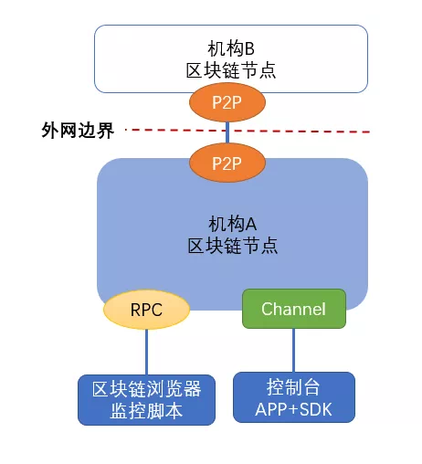
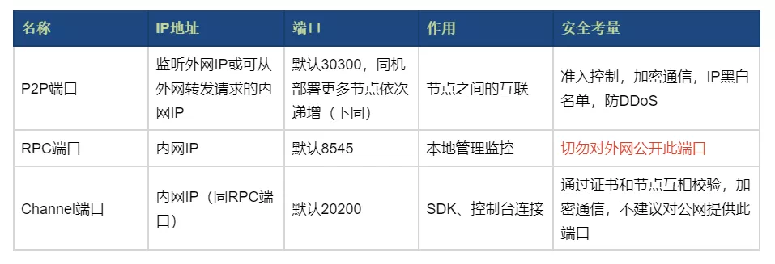

# FISCO BCOS Network Port Explanation

Author: Zhang Kaixiang ｜ Chief Architect, FISCO BCOS

**Author language**

The blockchain network consists of multiple interconnected nodes, each of which is in turn connected to client browser monitoring tools, etc.；Clarifying the existence of various network ports and achieving smooth network flow while ensuring security is the basis for building a blockchain network.。
At the same time, there are some hot issues in the process of chaining, such as why the node opens so many ports？Or why the network doesn't work？Node cannot connect？No consensus out of blocks？is the so-called"General rule does not hurt"，**A smooth network can link everything.**。

This article is about the network port interworking this matter, the author from the FISCO BCOS network port, FISCO BCOS 2.0 typical network configuration, design network security group of some strategies and so on。

## Three types of ports for FISCO BCOS 2.0 networks

FISCO BCOS 2.0 network includes P2P port, RPC port, Channel port。




### 1. P2P Port

P2P ports for interconnection between blockchain nodes, including multiple nodes within an institution, and interconnection of nodes and nodes across multiple institutions。If other nodes are outside the organization, the connection should listen to the public network address, or listen to the intranet, and the gateway connected to the public network (such as nginx) forwards the network connection.。
Connections between nodes are controlled by the admission mechanism of the federation chain, and connections between nodes rely on node certificate verification to exclude unauthorized dangerous connections.。The data on this link is encrypted by SSL, using strong keys, which can effectively protect the security of communication.。

[P2P network detailed design](https://fisco-bcos-documentation.readthedocs.io/zh_CN/latest/docs/design/p2p/p2p.html)

[Cybersecurity and Access Control](https://fisco-bcos-documentation.readthedocs.io/zh_CN/latest/docs/design/security_control/index.html)

### 2. Channel Port

Channel port, console and client SDK connect to the Channel port, each other through the certificate authentication, only the authenticated client can initiate a request to the node, the communication data is also encrypted by SSL。The channel port uses the long connection of TCP, detects and keeps alive with heartbeat packets, has high communication efficiency, supports point-to-point communication of AMOP protocol, and is quite flexible and powerful。
The channel port should only listen to the intranet IP address for other application servers in the organization to connect through the SDK, and should not listen to the external network address or accept public network connections to avoid unnecessary security problems, and should not only listen to the local address (127.0.0.1 or localhost), otherwise other application servers will not be able to connect to the node。

[SDK Documentation](https://fisco-bcos-documentation.readthedocs.io/zh_CN/latest/docs/sdk/index.html)

[AMOP Protocol](https://fisco-bcos-doc.readthedocs.io/zh_CN/latest/docs/design/amop_protocol.html)

### 3. RPC Port

RPC is a set of protocols and interfaces for the client to interact with the blockchain system. Users can query blockchain-related information (such as block height, block, node connection, etc.) and send transactions through the RPC interface.。

RPC port accepts JSON-RPC format requests, the format is more intuitive and clear, using CURL, JavaScript, Python, Go and other languages can be assembled JSON format requests, sent to the node to process.。Of course, when sending a transaction, you need to implement a transaction signature on the client side.。It should be noted that the RPC connection does not do certificate verification, and the network transmission is clear by default, the security is relatively low, it is recommended to only listen to the intranet port, for monitoring, operation management, status query and other internal workflow.。Currently, in the monitoring script, the blockchain browser is connected to the RPC port.。

[RPC Port Documentation](https://fisco-bcos-doc.readthedocs.io/zh_CN/latest/docs/develop/api.html)

## A typical network configuration for FISCO BCOS 2.0

A typical network configuration for FISCO BCOS 2.0 is shown below. You can see that RPC and channel ports share the same IP, and P2P connections listen to one IP separately, that is, a blockchain node uses two IPs and three ports.。 

The config.ini file under the node:

```
[rpc]listen_ip=127.0.0.1channel_listen_port=20200jsonrpc_listen_port=8545[p2p]listen_ip=0.0.0.0listen_port=30300
```

## Typical network addresses of several computers

**1. Special address**: 0.0.0.0, which means that all local addresses, including local, intranet, and public (if any) addresses, are monitored.。This address should generally not be monitored unless it is convenient and safe to do so.。

**2. Local address**: 127.0.0.1 (some configurations can be written as localhost), only other processes on the same machine can connect to this address, other machines are not connected.。For security and simplicity, this address is written by default in some sample scripts of FISCO BCOS, including the default configuration of the build _ chain script.。Users sometimes find that other machines running client programs can not connect, the probability is that this is the reason, or you can also check whether the network policy has enabled the interconnection, it is recommended that you can use the system's telnet [ip] [port] command to quickly check whether the first can connect。

**3. Intranet address**Usually 192.168.xxx.xxx, 172.xxx.xxx.xxx, 10.xxx.xxx.xxx start address is the intranet address, such as listening to this address, only other machines in the same LAN can access it。

**4. External network address**: The public address exposed on the Internet, or the address that can be accessed from the external network of the organization, in short, the external server can connect to the external address.。

## Some strategies for designing a network security group

In different network topologies, this may be involved: although the server can access the external network, it is forwarded by the gateway, router, NAT, and then you need to understand the specific network structure and configure it.。If you listen to an intranet address, configure the intranet address and the listening port on the forwarder, you can also receive connections from the external network.。

In terms of network security, it is necessary to carefully design the network security group policy, IP and port black and white list, and accurately control the two-way connection.。Including but not limited to the following strategies:

- **1. Set an external IP whitelist**Only these external IPs (usually other organizations that have established alliances) can be connected.；
- **2. Set IP blacklist**, Deny some specific IP connections without waiting for it to connect to the node before making admission control judgments；
- **3. Control RPC Port**, (such as port 8545) is only open to this machine, and other intranet servers cannot connect to this port；
- **4. Control Channel Port**It is only open to a certain intranet network segment or a few IPs, and its application is deployed to the server corresponding to the open network segment or IP, and other applications in the intranet cannot access the blockchain node.；
- **5. Whenever there is an external network port**It is recommended to set anti-DDoS measures to avoid frequent connections and massive concurrent connection attacks.。

## SUMMARY

IP addresses, ports, roles, and security considerations of the three network ports



------

### Group Friends Q & A

**Q**Using P2P communication between nodes and SSL authentication, how does each node obtain and verify the public key certificate, preset root certificate, and certificate chain of the linked node?？When a node communicates with other nodes, which side is the Server and which side is the Client？

**A**When the chain is created, the root certificate of the chain is assigned.；When each node communicates with other nodes, each node is a Server Client。

**Q**: The external IP is recommended to protect against DDoS attacks, which is a standard centralized defense logic。The implementation logic of blockchain is decentralization, does it make no sense to attack a single node？Can the mechanism arrange more nodes？

**A**On the issue of DDoS, for the alliance chain, an organization generally deploys two nodes, if attacked, it may affect the organization's business, but not the entire network.。The mechanism can arrange multiple nodes, such as 4, 5, or 10。

Thank you for participating in this topic discussion of small partners！Open source community, because you are more beautiful！

**Welcome more friends to join FISCO BCOS official technical exchange group and participate in more topic exchanges**。(into the group please scan the two-dimensional code below to add a small assistant [FISCOBCOS010])


