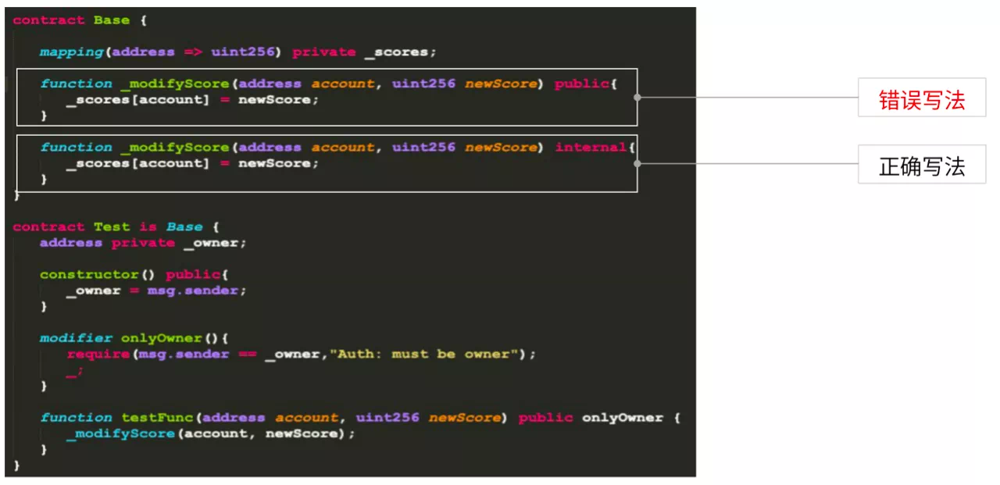
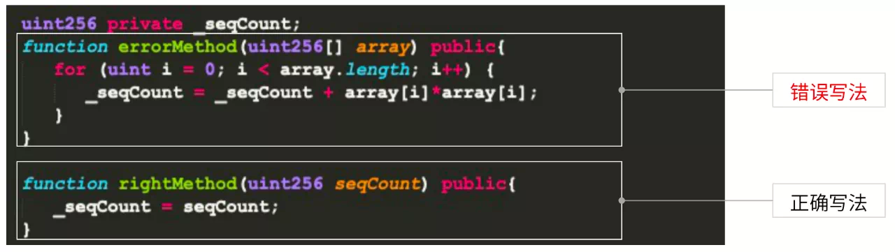

# 16 Tips to Quickly Achieve High-Level Smart Contracts

Author ： ZHANG Long ｜ FISCO BCOS Core Developer

## What is a smart contract?？

Smart contract refers to the contract / agreement terms in the form of code electronically placed on the blockchain network, through the call of the relevant terms of the interface to achieve execution, can also be regarded as an automatically executable program fragments。As a participant in the blockchain, smart contracts can both receive and store value, as well as send out information and value。
In the blockchain, smart contracts are very important and run through the entire blockchain application development process。

From another perspective, let's look at the importance of smart contracts in the execution of transactions。
First of all, in the transaction construction, we will carry out contract deployment and function calls, contract deployment depends on the binary encoding of smart contracts。Function calls rely on the ABI of the smart contract, where the ABI is generated during the smart contract compilation phase。
Transaction signing is the signing of a constructed transaction, which is then broadcast and packaged on the network。
Before the transaction is executed, the contract deployment needs to be completed and the binary encoding of the smart contract is stored on the blockchain network。During the transaction execution phase, the callback will also obtain the binary code of the entire smart contract, parse the corresponding binary fragment according to the constructed transaction, the binary fragment corresponds to the execution instruction set of the transaction, and the transaction will be executed according to the instruction set。

Thus, smart contracts are also very important in the entire transaction process。

## **Types of smart contracts for the FISCO BCOS platform**

The FISCO BCOS platform currently supports two main types of smart contracts: Solidity smart contracts and pre-compiled smart contracts。
Precompiled contracts are mainly used for the underlying blockchain platform, such as the implementation of system contracts。At the application development level, we recommend using Solidity contracts and pre-compiled contracts based on the CRUD interface。
The biggest difference between the two is that the Solidity contract uses the EVM engine, and the precompiled contract and the precompiled contract developed based on the CRUD contract interface use the precompiled engine。There is a very big difference in execution effectiveness between the two engines, which will be described in detail later。
The Solidity contract originated from Ethereum and is now supported on many platforms。Similar to other development languages, writing a Solidity contract requires writing the contract name before defining its state variable, which is similar to a member variable in the java language, except that it defines modifiers, which are used for conditional or permission verification。

This is followed by the definition of function events, which focus on the execution of method calls to facilitate business-level monitoring of the transaction execution of smart contracts。Defining a constructor is the same as creating an instantiated object of a class。
Finally, we'll do some operations or business processing on the defined state variables, and we'll need to write some contract functions。This is the structure of the Solidity contract。
The advantage of the Solidity contract is that it covers a wide range of users and applications, it is powerful, and after years of development, it has gradually matured and stabilized。

However, compared to native contracts, the Solidity language has a certain learning threshold for developers；At the same time, EVM needs to be used during execution, performance is limited, and EVM objects have a large memory overhead；Finally, the data and logic of smart contracts are relatively coupled, making it difficult to upgrade contracts and expand storage capacity。
FISCO BCOS designed pre-compiled contracts to address the shortcomings of Solidity contracts。

Pre-compiled contracts also have some shortcomings, such as assigning some fixed contract addresses, compiling the underlying source code。In order to solve these problems, we have developed the CRUD contract interface, the development process as long as the user inherits the Table contract, by introducing the abstract interface file Table.sol can develop pre-compiled contracts based on the CRUD interface。

Pre-compiled contracts based on the CRUD interface are not particularly different from Solidity contracts in nature。There are three main differences:

1. The Table.sol contract interface needs to be introduced。
2. When conducting an on-chain transaction, first create a table with the functionality provided by the interface, so that the data and logic can be separated。
3. During the operation of contract-related state variables, use the Table contract-related interface to manipulate contract data。For example, insert through the Table.insert interface。

The advantages of pre-compiled contracts based on the CRUD interface are clear:

1. Similar to the operation of the database, interface-oriented programming, reduce the learning threshold and cost。
2. The bottom layer is executed by the reservation engine and can be executed in parallel, so its performance is very high。
3. The underlying layer stores data in the form of tables, separating data and logic to facilitate contract upgrades and storage expansion。

But it also has some shortcomings。

1. Based on FISCO BCOS platform, not cross-platform。
2. Applicable to some scenarios with simple business logic, such as the certificate deposit business。

## 16 tips for writing smart contracts quickly

In the development of smart contracts, we often face three mountains。

1. Contract security。Security is the foundation and lifeblood of smart contracts and blockchain applications。Throughout the history of blockchain development, there have been many incidents that have caused significant losses to users and platforms due to smart contract vulnerabilities。
2. Contract Performance。Performance is an important indicator to measure the availability of blockchain applications, which determines the load capacity and user experience of the system。
3. Scalability。Scalability is an effective means for smart contracts and blockchain application systems to respond to business changes and upgrades, ensuring the timeliness and cost of system upgrades。

For these three mountains, we have compiled 16 tips to help you quickly get started with smart contract development。

### Contract Safety

Here, we summarize several smart contract security issues。

- Program error: initialization method error, variable hiding caused by mixed use
- Insufficient checks: insufficient permissions and boundary checks
- Logical flaw: out of the block can be manipulated, re-entry attacks
- Malicious contract: scam tx.origin, RTLO character attack

For the security issues in the development of smart contracts, give you a few suggestions。

#### Tip 1: Do a good job of encrypting private data

The data on smart contracts is completely transparent, so some data privacy protection schemes are needed to ensure data security。For example, the data on the chain is encrypted by hash, homomorphic encryption or zero knowledge proof。

The two methods in this contract are simple: add an employee。In the above method, the contract-related information is written directly, while the following method writes the contract hash。Encrypt contracts to ensure user privacy。We recommend the second way。

#### Tip 2: Set the visible range of state variables and functions reasonably

Here are two modifyScores, one using public and the other using internal。The difference between the two is that the following Test contract inherits the Base contract and uses onlyOwner to call modifyScore in testFunction。
If you directly use the public modifier, it does not work here, it will not check onlyOwner, because the public function method is exposed to the outside world, the user does not need to call onlyOwner through testFunction, but directly call。So be sure to pay attention to the visible range of state variables and functions。

#### Tip 3: Function Permissions and Variable Boundary Checking

Here's an example of variable boundary checking:

We want to add points to the student's score, assuming that its type is uint8, in Solidity uint8 according to the data conversion is 0 to 255 data range, if you do not do verification to add the two, may cause finalScore direct overflow, resulting in incorrect results。
So we need to check the legality after addition or similar variable operations。If you add a require condition here, you can check in time to ensure the correctness of the business logic。

#### Tip 4: Learn to use security tools

Use Securify, Mythx, Slither and other tools to scan smart contracts for security, there are many such tools, some of which are completely free, you can learn about and try to use the tools you are interested in。Other smart contract security implementation techniques will not be repeated here。

### Contract Performance

Ensuring the performance of smart contracts is critical. If the performance of the system does not meet the requirements, it will affect the availability of the entire system。
Performance depends on the use of machine resources during code execution。Machine resources mainly include CPU, memory, network, etc。
Unlike centralized systems, blockchain requires each node to execute each transaction during the consensus phase, and the machine configuration of each node may be different, while the shortest machine affects the performance of the entire blockchain network。So under certain machine configuration, some resource consumption can be saved through smart contracts。
Here we also give you some optimization suggestions。

#### Tip 5: Reduce CPU overhead by reducing unnecessary computation and validation logic

Both methods sum the squares of an array and square each number in the errorMethod。
The following method does not calculate and directly outputs the results, because a large number of complex calculations will have a great impact on the blockchain network and performance, it is recommended that such complex calculations and verification logic do not need to appear in the blockchain smart contract, but in the chain or business system implementation。

#### Tip 6: Reduce unnecessary data and reduce memory, network, and storage overhead

The state variables of the two companies are defined here, and the companyInduction variable in Company1 holds the company's profile。This is commented out in Company2。This is because the company profile does not have much impact on the on-chain transaction logic, but from a performance perspective, it occupies a large amount of blockchain network node memory, network and storage overhead, thus causing great pressure on the overall network performance。
Therefore, it is suggested that you only need to link the core data and lightweight data associated with the business。

#### Tip 7: Use different forms of data assembly to reduce cross-contract calls

In cross-contract calls, the blockchain network node will rebuild an EVM, a time-consuming process that has a significant impact on memory overhead and blockchain network performance。
Therefore, it is recommended to use different forms of data assembly flexibly, for example, using structs to avoid cross-contract calls, thus saving blockchain node memory, network and time overhead。

#### Tip 8: Reduce cross-contract calls through advanced features provided by smart contracts, such as inheritance

The above two examples, one is to introduce direct calls through contracts, and the other is to call getName in contracts through inheritance。
Inheritance in a smart contract refers to the compilation phase, where all the parent contract code is copied into the child contract for compilation。That is, in the final contract, the parent contract is integrated into the child contract。When the parent contract is called, it is not a cross-contract call。

#### Tip 9: Change the data type and learn to trade space for time

The above example avoids the use of arrays by mapping and improves query performance。However, according to past experience, mapping takes up four times as much space as an array, and whether it is used depends on the specific needs of the business: for performance reasons, mapping can be used to change the data type to improve the efficiency of smart contract execution。

#### **Tip 10: Compact state variable packaging to reduce memory and storage overhead**

What is a compact state variable？The execution of smart contracts in the EVM is based on the stack, which has corresponding card slots, each of which is about 32 bits。If you do not pay attention to the order of variables, it will occupy more card slots and consume more resources。The following gasUsed is the cost of computer resources。

In the above example, if you define a bytes1, bytes31, bytes32, the same is occupied by 64 bytes, here because bytes1 and bytes31 in the same position, EVM automatically into a card slot。In the wrong way, the EVM is placed in two different card slots。Therefore, the upper structure occupies two card slots, and the lower one occupies three card slots. They use different resources. In actual operation, you need to pay attention to these details。

#### Tip 11: Pay attention to function modifiers to reduce unnecessary execution

Function modifiers generally include pure, view, etc. If these modifiers are not added, the blockchain network will automatically understand the smart contract as a transaction。According to the definition of Ethereum Yellow Book, query operations are calls, and changes to state data can be understood as transactions。
Transactions need to go through the execution, consensus process, call without。In a smart contract, if the view modifier is set, it is a call that does not need to execute consensus and enter the EVM, but directly queries the local node data, so the performance will be greatly improved。

### Expandable

In the smart contract development process, after the deployment of the chain, the upgrade of the smart contract is a very complex matter。The value of smart contract scalability lies in the following:

- Minimize costs (time+manpower) for business upgrades
- as an emergency treatment of system anomalies
- Easy for others to take over and maintain

Here are some tips to help you improve smart contract scalability。

#### Tip 12: Separation of logic and data: Adopting the classic three-tier architecture

The smart contract on the left manages the results through setScore, but if you want to add other attributes to the student's results, the entire contract needs to be redefined and deployed, resulting in the inability to use the data on the previous chain。
Adopting a three-tier architecture can solve this problem。
First, we put the data separately in the Score contract, manage it through datamap, and then operate on the data through the ScoreManager。This is the classic three-tier architecture, which ensures the separation of logic and data。
If you want to add other fields in Score, such as studentid, we only need to update the Score contract and the ScoreManager contract to be compatible。Since the data in the datamap is completely immutable, we only need to perform different logical processing on different data entities in the Manage contract to ensure the scalability of the contract。

#### Tip 13: Abstract General Logic

In the contract on the left, each contract has the onlyOwner modifier, and if 10 contracts use this modifier at the same time, the maintenance cost will be very high。Therefore, it is recommended that you refactor the Base contract and inherit it in a specific business contract so that it can be reused。This is the extensibility of the abstract general logic implementation contract。When the next contract is upgraded, simply modify the Base contract。

#### Tip 14: Modular Programming: Single Responsibility Model

The single responsibility model is a coding specification。

The Rolemanager on the top left includes two roles, account and company, as well as operations on both, which clearly violates the single responsibility model。Once the operation of the account is modified, the operation of the company will also change, resulting in a greater impact。
Separate the operations of different entities by means of the lower right。When the account operation is modified, the company operation is not affected, thereby reducing the maintenance cost of the smart contract。

#### Tip 15: Try to reuse mature libraries

The first benefit of reusing mature libraries as much as possible is to improve the efficiency of smart contract development；The second is to reduce the loopholes in the writing of smart contracts, after all, the mature library is summed up by a large number of previous business practices, and its security is guaranteed。

#### Tip 16: Reserve free fields appropriately

In the ScoreManager contract above, the Score structure consists of two fields, the score itself and the status score status。If you need to add studentid or other comments, you need to redeploy and upgrade the smart contract。Therefore, its usability can be improved by adding a reserved field for resever。But in fact, this way will also affect the safety and performance。

Today, I mainly share with you two smart contracts of FISCO BCOS。At the same time, for smart contract security, performance and scalability, to provide the corresponding development skills。The development process of smart contracts is a game of security, performance and scalability。Developers should choose the applicable skills and solutions according to the actual business needs。

------

### Q&A

 **Q** Contract upgrade and redeployment, how to make data reusable？Two contract addresses, my SDK layer needs to modify the adaptation。

 **A** After the contract is logically separated from the data through the three-tier model, if the contract needs to be upgraded, different contract data needs to be processed differently at the data processing layer, and the SDK level also needs to be adapted。

 **Q** : In uint256, how many card slots are in the EVM stack?？

 **A** : Occupy one card slot。

 **Q** : Can smart contracts blur queries?？How to deal with traceability？

 **A** Fuzzy queries and historical data queries on the blockchain are not recommended because the blockchain is not suitable for large data processing。At present, we provide data export tools, which are open source and can help businesses quickly process big data。

 **Q** : How do you handle percentages safely in smart contracts?？

 **A** Smart contracts do not have decimal types, they can be multiplied by 100 or 1000 according to the accuracy before they are chained, and they can be processed under the chain by dividing them

 **Q** Can you bind a smart contract to run on a node?？Can the same smart contract open multiple instances on a node？

 **A** : No, the deployment of smart contracts and the execution of transactions will be a network-wide consensus, executed at all consensus nodes, and placed at all nodes (or synchronized ledger)。Smart contract deployment is equivalent to creating a smart contract instance. Multiple deployments result in multiple instances。