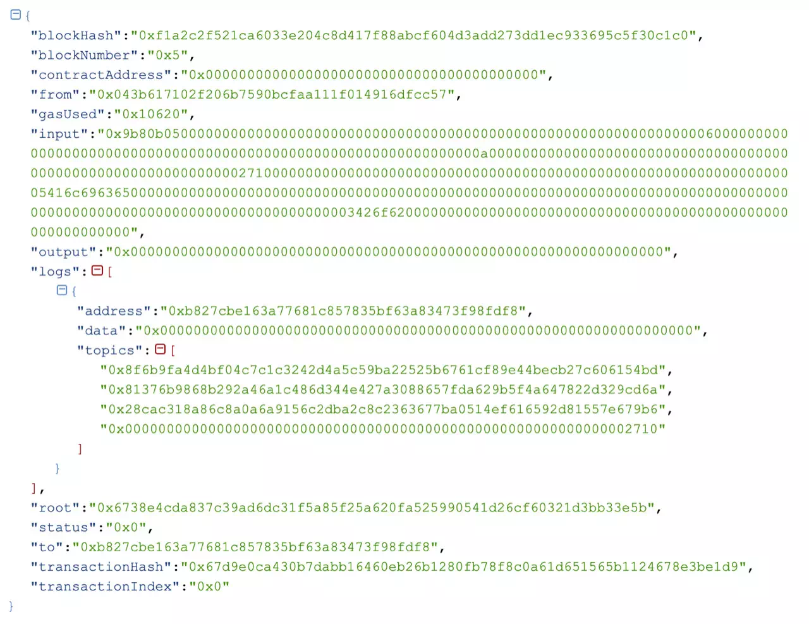
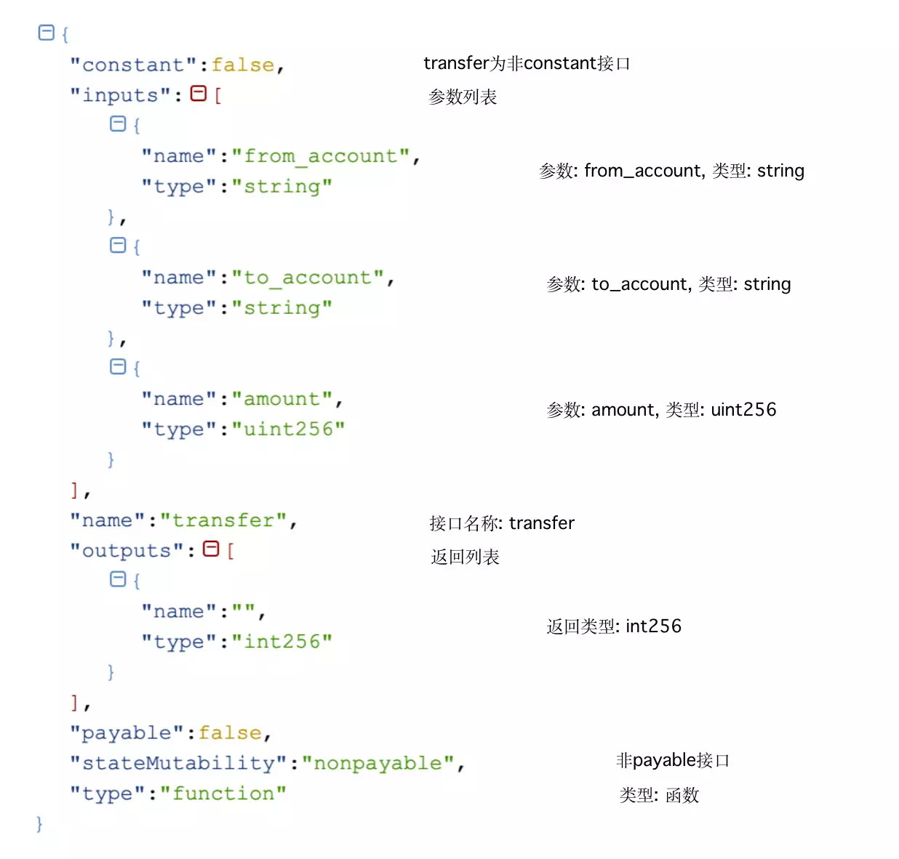
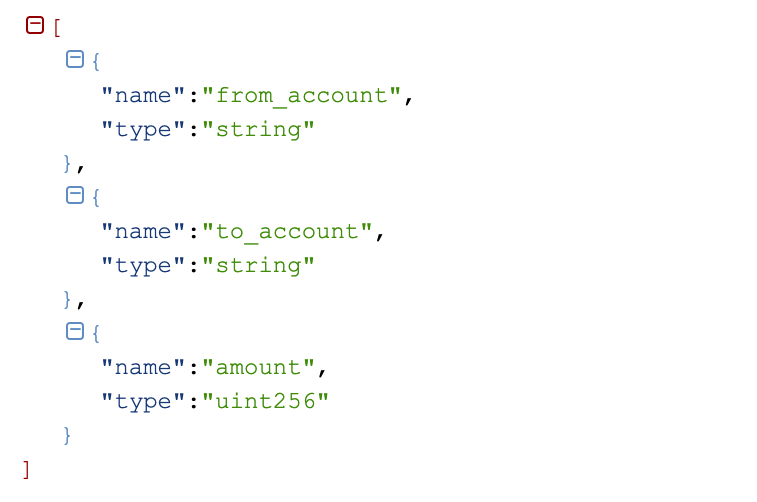

# Talk about contract ABI

Author ： WANG Zhang ｜ FISCO BCOS Core Developer

## Introduction

When the contract interface is called, you can send a transaction to the blockchain and obtain the transaction receipt, which saves the input parameters, output, Event log, execution status and other information of the transaction.。An example of a transaction receipt is shown in the following figure.



[Transaction Receipt Details](https://fisco-bcos-documentation.readthedocs.io/zh_CN/latest/docs/api.html#gettransactionreceipt)如下。 In the transaction receipt, the input and output fields can represent the input parameters of the transaction and the return value after the EVM executes the transaction, respectively.。

## What is contract ABI?

"Contract ABI is the standard way to interact with contracts in the Ethereum ecosystem, whether it's external client interaction with contracts or contract-to-contract interaction.。The above is the definition given by the official Ethereum document, which is more popular and contains two aspects:

1. ABI is a description of the contract interface.。
2. ABI defines data encoding rules for interacting with contracts.。

Below we will explain ABI from these two aspects.。

### ABI Interface Description

ABI is the description of the contract interface, including the contract interface list, interface name, parameter name, parameter type, return type, etc.。This information is saved in JSON format and can be generated by the contract compiler when the solidity file is compiled.(https://fisco-bcos-documentation.readthedocs.io/zh_CN/latest/docs/console/console.html#id12)。

Take the Asset.sol contract as an example.:


#### Asset Contract ABI：

```
[
  {
    "constant": true,
    "inputs": [
      {
        "name": "account",
        "type": "string"
      }
    ],
    "name": "select",
    "outputs": [
      {
        "name": "",
        "type": "int256"
      },
      {
        "name": "",
        "type": "uint256"
      }
    ],
    "payable": false,
    "stateMutability": "view",
    "type": "function"
  },
  {
    "constant": false,
    "inputs": [
      {
        "name": "from_account",
        "type": "string"
      },
      {
        "name": "to_account",
        "type": "string"
      },
      {
        "name": "amount",
        "type": "uint256"
      }
    ],
    "name": "transfer",
    "outputs": [
      {
        "name": "",
        "type": "int256"
      }
    ],
    "payable": false,
    "stateMutability": "nonpayable",
    "type": "function"
  },
  {
    "constant": false,
    "inputs": [
      {
        "name": "account",
        "type": "string"
      },
      {
        "name": "asset_value",
        "type": "uint256"
      }
    ],
    "name": "register",
    "outputs": [
      {
        "name": "",
        "type": "int256"
      }
    ],
    "payable": false,
    "stateMutability": "nonpayable",
    "type": "function"
  },
  {
    "inputs": [

    ],
    "payable": false,
    "stateMutability": "nonpayable",
    "type": "constructor"
  },
  {
    "anonymous": false,
    "inputs": [
      {
        "indexed": false,
        "name": "ret",
        "type": "int256"
      },
      {
        "indexed": true,
        "name": "account",
        "type": "string"
      },
      {
        "indexed": true,
        "name": "asset_value",
        "type": "uint256"
      }
    ],
    "name": "RegisterEvent",
    "type": "event"
  },
  {
    "anonymous": false,
    "inputs": [
      {
        "indexed": false,
        "name": "ret",
        "type": "int256"
      },
      {
        "indexed": true,
        "name": "from_account",
        "type": "string"
      },
      {
        "indexed": true,
        "name": "to_account",
        "type": "string"
      },
      {
        "indexed": true,
        "name": "amount",
        "type": "uint256"
      }
    ],
    "name": "TransferEvent",
    "type": "event"
  }
]
```

As you can see, the ABI is a JSON object array that contains information about the interface and Event.。The transfer interface of the Asset contract and its ABI are as follows.

#### Interface:

`function transfer(string from_account, string to_account, uint256 amount) public returns(int256)`

#### Interface ABI:



### ABI coding

Assuming that the user needs to call the transfer interface of the Asset contract, the known conditions are as follows。

#### Asset Contract Address:

`0x1386bf8e0138e821994140503ee214a9019eb0ec`

#### Transfer interface definition:

`function transfer(string from_account, string to_account, uint256 amount) public returns(int256);` 

#### User parameters:

`String fromAccount = "Alice";`

`String toAccount = "Bob"`

`BigInteger amount = 10000;`

How the user passes these parameters to the EVM that finally executes the transaction, so that the EVM knows that the interface called by the user is the transfer interface, and the EVM can correctly read the parameters entered by the user？The return value of EVM and how the user should use it.？

This is another role of ABI, defining the encoding format of the data。

Here, the input field of the transaction receipt in the introduction is used as an example to analyze the input code of the transaction.

`"input": "0x9b80b050000000000000000000000000000000000000000000000000000000000000006000000000000000000000000000000000000000000000000000000000000000a000000000000000000000000000000000000000000000000000000000000027100000000000000000000000000000000000000000000000000000000000000005416c6963650000000000000000000000000000000000000000000000000000000000000000000000000000000000000000000000000000000000000000000003426f620000000000000000000000000000000000000000000000000000000000"`

Input data can be divided into two parts: function selector and parameter encoding.。

### 1. Function Selector

Used to specify the function called, the first four bytes of the function signature Keccak hash, EVM determines which interface of the contract the user is calling based on the function selector。

In the transfer interface call:

`bytes4(sha3(“transfer(string,string,uint256)”)) = 0x9b80b050` 

### 2. Parameter coding

Encoding of parameters(Decoding also applies)You need to combine the content of the ABI description information and encode the parameters according to the list of interface types in the ABI description information.。

#### List of transfer types:



#### Parameter List:

`String fromAccount = "Alice";`

`String toAccount = "Bob"`

`BigInteger amount = 10000;`

#### Coding process:

`enc(string("Alice"),string("Bob"),uint256(10000)) = "000000000000000000000000000000000000000000000000000000000000006000000000000000000000000000000000000000000000000000000000000000a000000000000000000000000000000000000000000000000000000000000027100000000000000000000000000000000000000000000000000000000000000005416c6963650000000000000000000000000000000000000000000000000000000000000000000000000000000000000000000000000000000000000000000003426f620000000000000000000000000000000000000000000000000000000000"`

Merge the Function selector with the parameter encoding to get the input。 

## Advantages and Limitations of Contract ABI

### Why contract ABI?

As can be seen from the definition of ABI, ABI is a standard form of interaction with contracts, which is equivalent to defining the interface protocol specification for access contracts, unifying the form of interaction between contracts and contracts, and between clients and contracts on different platforms.。

### Limitations of Contract ABI

Here are some of the limitations of contract ABI coding:

- The rules of the ABI encoding itself are complex, which makes it more difficult for users to implement, but except for individual ABI library authors, ordinary users do not need to implement them themselves.。
- ABI's encoding forces 32-byte alignment on all data encodings, which eventually need to be persisted with the transaction, wasting a lot of storage space.。
- Difficult to upgrade: When ABI adds new type support or even new rules, the implementation of all platforms needs to be upgraded, and these new features are not necessarily easy to support on some platforms.。For example: ABIEncoderV2 So far, the support of each library is still not very perfect.。

# SUMMARY

This paper introduces the concept of contract ABI, the JSON description information of ABI and ABI codec, and finally analyzes the advantages and limitations of ABI codec, so that users have a preliminary understanding of contract ABI.。If you have more in-depth requirements, you can check [ABI's official document](https://solidity.readthedocs.io/en/develop/abi-spec.html)。

------

#### References

- [Asset.sol source code](https://github.com/FISCO-BCOS/LargeFiles/raw/master/tools/asset-app.tar.gz )
- [Contract ABI JSON format](https://solidity.readthedocs.io/en/latest/abi-spec.html#json)
- [Function Selector](https://solidity.readthedocs.io/en/develop/abi-spec.html#function-selector)
- [ABI code](https://solidity.readthedocs.io/en/develop/abi-spec.html#argument-encoding)

