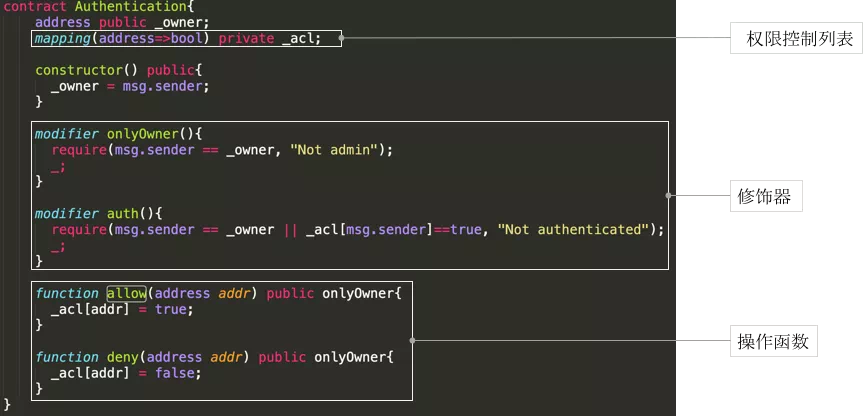
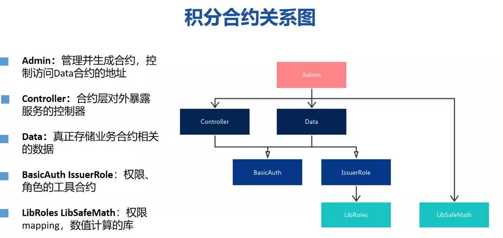

# Depository & Points Scenario Contract Design Skills and Example Code Analysis

Author ： MAO Jiayu ｜ FISCO BCOS Core Developer

## Scenario 1: Blockchain+Compilation of authority contract for certificate of deposit

Electronic data storage certificate is a way to record the whole process of "user authentication - data creation - storage - transmission," applying a series of security technologies to ensure the authenticity, integrity and security of electronic data in an all-round way, and has complete legal effect in the administration of justice。

The following features of blockchain technology help reduce costs, improve efficiency, and ensure the security of stored data。

- Improved tamper-proof mechanism: the use of blockchain technology to preserve evidence, further strengthening the immutability of evidence；
- The validity of the evidence is recognized by the institution: the judiciary, as the node on the chain, participates in the recognition and signature of the chain data, which can be confirmed afterwards from the chain；
- The service continues to be effective: after the data is multi-party consensus on the chain, even if some consensus parties exit, it will not cause data loss or invalidation。

### Brief business process of certificate deposit scenario

Three types of typical users can be abstracted in the certificate storage scenario**Depository, Auditor and Forensics**。

- The depositary submits an application for the deposit of a certificate。
- The reviewer reviews and signs the certificate data based on the content。In actual business scenarios, the reviewer may be involved in the multi-sign process of voting and multi-party review。
- After the certificate is put on the chain, the forensics can query the address, timestamp, audit details and other relevant information of the depositor at any time for verification。

### Example Explanation of Permission Contract in Certificate Deposit Scenario

Let's explain it with the permission contract in the deposit scenario。

#### Summary Design of Deposit Contract

**First separate the logic and data layers**。Because the Solidity smart contract language does not have an independent data layer, in order to facilitate the subsequent expansion and upgrade of the contract, the logic and data layer need to be separated, as reflected in the figure below is to distinguish the data layer and the control layer。

**Secondly, the introduction of permission layer**。All nodes on a consortium chain have free access to the data on the chain, and smart contracts provide a decorator mechanism that controls the access of contracts to designated authorized users, abstracting this layer according to the principle of a single responsibility of the contract。

At the same time, we need to control the permissions of the data layer to prevent the interface permissions written to the data layer from being open to everyone, so we need to rely on and introduce permission contracts。

#### Permission contract example explanation

Permission contracts are relatively simple, do not need to rely on other contracts, in many contract development needs, can be reused。

The Authentication contract first defines two member variables, the contract owner and the permission control mapping list acl(access control list)。

- **owner**: Owner is automatically assigned to msg.sender during contract construction, which is the caller of the contract, and the decorator onlyOwner can be used to determine whether the subsequent caller is the creator of the original contract。
- **acl**: The acl variable is a mapping of the address to bool type. Let's look at the allow and deny functions. Allow sets the bool value mapped by the address of the incoming parameter to true and deny to false. After setting, you can use the auth decorator to determine the contract visitor permissions。

##### Depository Data

The following figure shows the evidence data layer, the code of the deposit data contract。

EvidenceRepository is a depository data warehouse that inherits the rights contract, and the methods and modifiers in the rights contract can be used in the depository contract。

-The deposit data contract defines a struct structure, EvidenceData, which is used to store the deposit data。To simplify the model, we have defined only three core data fields: the Hash value of the depository data, the submitter address, and the depository timestamp, which can be extended according to the required fields in the actual business depository scenario。
-mapping variable, which is the mapping relationship between byte32 and the structure. In fact, the data of this structure is mapped with the storage hash as the main key。The key is a hash, and the value is the above structure. You can use the hash value to retrieve, query, and save the stored certificate data。
- Only the core setData and getData functions are identified in the defined functions。Note that the contract itself inherits the Authentication contract, so you can use the auth decorator in setData to control access only to authorized users, preventing malicious attacks or calls to the smart contract after it is deployed on the chain。The getData function queries the stored data as a whole according to the incoming hash and returns。

As you can see, all the depository data is saved to the data contract。This can play a unified storage, unified management effect。Of course, this is not necessarily the optimal solution。
In business scenarios, if the contract has a large amount of certificate data, it may become a performance bottleneck, and it is more reasonable to adopt a split design scheme。

##### Request Data

When the depositary begins to submit the depositary data, it will not be written directly into the depositary warehouse, but will only be submitted after the signature of the auditor。

After understanding the purpose of the contract, let's take a closer look at the contract。

- The contract structure of the requested data is consistent with the deposited data。The first part is the data structure, SaveRequest is a structure, which defines a detailed data structure of the depository request, including the core depository hash, submitters, and approved votes。
-ext is a description field, status records the reviewers who have passed the voting signature, threshold is the voting threshold, voters is the list of addresses of the reviewers, saveRequests defines the mapping between the request hash and the request itself。Similar to a depository data contract, in a request data contract, all request data is also stored in a single data warehouse contract。
- Finally, look at the two core functions: create request and vote review。auth modifier control permissions in both functions。When creating a request, the function uses the require statement to check whether the request already exists；When voting, the function uses the require statement to check whether the reviewer has voted, whether the request itself exists, and whether the reviewer is legal。If the check is passed, the number of audit votes is increased by one, marking that the auditor has signed。

##### Controller

The controller introduces two data warehouse contracts, and we can complete all user interface interactions by simply calling the controller；Its constructor parameter variables contain the parameters required to request contract construction: the list of auditors and the voting threshold, and this constructor automatically constructs and creates the contract。

The controller defines two methods, one is to create a certificate request, and the other is for the reviewer to vote based on the request。
The creation request function is simpler and will directly call the creation request function in the request data warehouse contract。
Dealing with voting functions is relatively complex。After verifying that the hash data is not empty, the audit interface will be called, and if the audit is successful, it will trigger a check to see if the number of passes of the current request exceeds the threshold, and once it does, it will be automatically saved to the certificate data contract and the request will be deleted。

In addition, three event events are defined in this contract, which have the following effects

- Record event-defined parameters and store them in the blockchain transaction log, providing cheap storage。
-Provide a callback mechanism. After the event is successfully executed, the node sends a callback notification to the SDK registered for listening, triggering the callback function to be executed。
- Provide a filter that supports parameter retrieval and filtering。 

For example, the createSaveRequest log records the hash and call address。If we cooperate with the SDK, we can listen to this specific event and automatically trigger a custom callback function。

#### Summary of Examples of Depository Contracts

The above is a complete deposit certificate scenario permission contract demo。In order to facilitate understanding, we did not design the example to cover all aspects, I hope you can better understand the design idea of demo:

- Separation of data and logic；
- It is recommended to adopt bottom-up development, first develop the least dependent part, modular, hierarchical design and implementation；
- Focus on permission control and inspection to avoid unauthorized access；
- Define uniform and clear interfaces；
- save certificate data hash chain。

## Scenario 2: Blockchain+Examples of Points Contracts

Here's another typical application scenario for smart contracts - the integration scenario。

How can blockchain technology solve these pain points in the integration scenario?？

- Increase brand exposure: multiple agencies form a point alliance, points can be effectively exchanged, to achieve customer resource drainage, improve marketing effect。
-Ensure the security of points: all points generated and transferred to the chain to prevent merchants from tampering and denial。
- Improve user experience: different merchants and users to achieve points flow, interoperability, more convenient。

Figure: Example of a typical points business scenario

One idea is based on blockchain technology, where multiple merchants form a points alliance to achieve points pass-through and mutual diversion of customer resources。We abstract a manager who deploys and manages contracts, and merchants have the authority to issue points, pull in other merchants, and revoke the issuer's identity；Consumers have the right to open an account, close an account, spend points and transfer points。

### Integral Scenario Contract Example Explanation

Let's start with the summary design of the points contract。In the deposit contract, we introduce the idea of separation of data and logic；In the points contract, we will introduce the idea of separation of management, data and logic。
Why add a management contract?？In the original two-tier structure, the control contract automatically creates the data contract, while the data-tier contract says that the owner is the control contract。
With the introduction of management contracts, a similar effect of control reversal is achieved, and both control and data contracts are created by management contracts；At the same time, the management contract can also set the address of the control contract in the data contract at any time。In this way, control contracts can be upgraded smoothly to business logic at any time；Separating management contracts also facilitates on-chain authority governance。
In addition, we abstract common permissions, role functions into contracts, and abstract the library for permission mapping and data calculation。

Below we will look at the specific code implementation of the points contract。

#### Contract Library - Secure Computing

Secure computing is very important in Solidity。When it comes to numerical calculations, preference may be given to using mature open source libraries。Share a tip, because the chain resources are very valuable, it is recommended that you use the library can cut off redundant code, saving resources。
Secure computing library, will re-check the value after execution, to avoid overflow, to avoid attacks。

#### Library - Role Management

The role management library provides the functions of creating roles, deleting roles, and querying roles。There is a basic mapping bearer, which is the mapping from address to bool and maintains the role identity in mapping。

#### Basic Permission Contract

In BasicAuth's underlying permissions contract, we provide a judgment of the owner。

#### Issuer Contracts

The issuer contract relies on LibRole's contract above。To simplify the rules and make them easy to understand, let's define it this way: issuers are allowed to add new issuers and can also revoke their own issuer identity。With the publisher role, we can release points。

#### Points Data Contract

Now enter the main body of the point contract - admin-controller-data three-tier architecture。
First of all, the points data contract is introduced。It will save all user credits, as well as role information, into the credits data contract。

-balances maintains the balance of each user；
-accounts Maintains registered accounts；
-totalAmount is the total number of points issued in the system；
-description comment or note information
-latestVersion for access control；
-upgradeVersion method, authorized users can call this method to upgrade the contract, here by the Admin contract to initiate and call；
-setBalance method, set the balance of an account must be checked by onlyLatestVersion, only the owner with permission can call this data contract。

#### Management contract

The role of management contracts is to create all contracts。The constructor updates the version number held in the data contract, and once the controller needs to be upgraded, just call this method。

#### control contract

Finally, the control contract is introduced。Due to the long controller code, only the two most typical functions are shown here。
Balance check balance adjustment is the interface of data check balance。The consumption of points is realized through transfer, where there will be many modifiers to check whether the account has been registered, whether it is valid, etc. In addition, smart contract events are used to output and print logs。

#### Summary of Points Contract Examples

Summarize some design ideas in the integral scene demo:

- Reference to a three-tier architecture: using data, logic, and management to manage contracts；
- Abstracts libraries and encapsulates commonly used contracts for reuse；
- You must always pay attention to contract security, such as whether the contract value calculation is correct and whether the permissions are appropriate；
- Abstracts responsibilities on a contractual basis to achieve as single contractual responsibilities as possible。

## How to Write High Quality Design Documentation

### The "Technique" of Document Writing

The "technique" is mainly the structural elements needed to write a document, which is divided into three categories

-Business background: first, do not presuppose that others can understand all the technical terms when writing the document, and secondly, clearly introduce the pain points of the business, and whether the blockchain can solve these pain points。
- Technical scheme design: need to clearly explain the basic business requirements (such as participants, scenarios, activities), design ideas summary, detailed contract responsibilities, functions, parameters, etc。
- Instructions for use: the actual use of the scene, the finger on the south and the use of manual, etc。

### The "Way" of Document Writing

With the technique, the integrity of the document's content structure is ensured, and the document has a skeleton and flesh and blood；However, the "Tao" is the soul and essence of the document, and here are five concerns

- Highlights: show the uniqueness of the program (creative / design / function / specification / documentation)；
- Pain point: explain the problem and the solution；
-Key points: code, comments, documentation to be clear, readable, around the problem and solution, not to show off；
- Difficulty: Based on smart contract features, trade-off specification, efficiency and security；
-Key points: take explanation as the basic guide, do not presume that others can understand all business and technical terms。

This article mainly shares the contract design ideas and example code analysis of two typical application scenarios, namely, deposit certificate and integration, and summarizes the relevant development skills and document writing skills for everyone。
In the smart contract development process, developers need to choose the applicable skills and solutions according to the actual business needs。As the so-called "soldiers are impermanent, water is impermanent," there is no optimal design, only the most suitable design。

------

### Q&A

**Q** How to get previous data in a smart contract？

**A** : There are two main methods: 1. Define the function that needs to query historical data in the smart contract, and query it through the contract query interface。2. Use the WeBASE-Collect-Bee data export component to export the on-chain data to the off-chain database, you can query all the data。

**Q** : The variable in the contract defines a private attribute, can it also be publicly available on the chain?？

**A** : All data on the chain is public, even if a variable with a private attribute is defined, it can be obtained by technical means。

**Q** : Can other external interfaces be called within the smart contract?？

**A** : Other contract interfaces can be called in smart contracts, but external interfaces cannot be accessed。

**Q** : If the points will decrease within a certain period of time, how can this integration scenario be achieved？

**A** : First define a business rule with reduced points；Secondly, it is technically feasible to implement this scenario, for example, you can design a points destruction function, which can be called to reduce the number of points for a given account and reduce the total number of points at the same time。Finally, the specific implementation logic and approach depends on the business rules。In addition, it should be noted that smart contracts do not support similar timing scripting mechanisms and require external calls to trigger。

**Q** : Do you have to write smart contracts according to a three-tier structure?？

**A** : Not necessarily, depending on the specific business scenario, you need to analyze the pros and cons from the actual business scenario and choose the appropriate solution。In general scenarios, we recommend layering, which is more flexible and more conducive to contract upgrades and maintenance。

**Q** How to control the data read and write permissions of different users in the same group through smart contracts？

**A** : Once the data is on the chain, it is open and transparent to all participants on the chain. Therefore, it is not feasible to control the data read and write permissions of different users in the same group on the chain。But we can achieve a similar effect by encrypting the data itself before it is put on the chain。

**Q** Is the hash value in the certificate of deposit the hash value of the contract or invoice?？

**A** This rule depends on the specific application requirements. It can be a hash of the file or a hash value calculated after assembling other information. It depends on the specific scenario requirements。

**Q** : What to do if the data on the chain is wrong？

**A** Once the data is on the chain, it cannot be tampered with and physically deleted；However, you can design a contract logic deletion mechanism, such as adding a status field to a specific data contract to mark whether the data has been deleted。