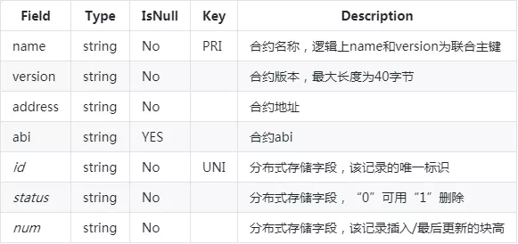
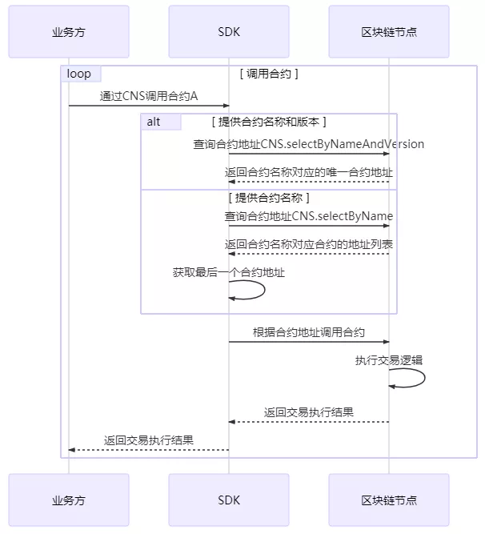
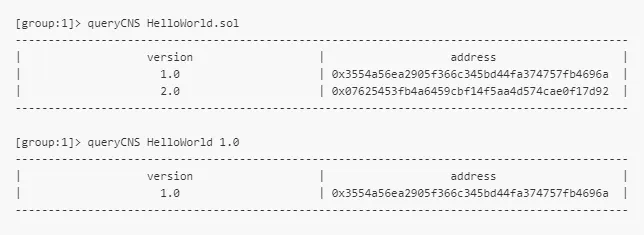

# CNS Contract Naming Service for FISCO BCOS

Author ： CHEN Yu ｜ FISCO BCOS Core Developer

## Why is CNS born?？

The original FISCO BCOS call smart contract process is:

1. Preparation of contracts；
2. Compile the contract to get the contract interface abi description.；
3. Deploy the contract to get the contract address.；
4. Encapsulate the abi and address of the contract and call the contract through the SDK.。

As can be seen from the above contract call process, the business party must obtain the contract abi and the contract address before calling the contract, which is a common method for calling contracts in the industry.。

However, through follow-up user research, we have collected the following suggestions from the business side:

1. For longer contract abi strings, a location needs to be provided for storage instead of the business party's own storage.；
2. For a 20-byte contract address magic number, its loss will result in inaccessibility of the contract, reducing the cost of memory for the business side.；
3. After the contract is redeployed, the relevant multiple businesses can quickly and imperceptibly update the contract address.；
4. Easy version management of contracts。

In order to provide a better experience for business parties to invoke smart contracts, FISCO BCOS proposes a CNS contract naming service solution.。

## How the CNS is implemented？

CNS provides a record of the mapping between the contract name and the contract address on the chain and the corresponding query function, which facilitates the business party to call the contract on the chain by memorizing the simple contract name.。In order to facilitate the business party to call the contract, the SDK encapsulates the CNS way to call the contract interface, the interface internal implementation of the contract address to find, the business party is not aware of this.。

### Information record

CNS records include: contract name, contract version, contract address, and contract abi。where contract abi refers to the interface description of the contract, describing the contract field name, field type, method name, parameter name, parameter type, method return value type。The above CNS information is stored as a system table, and the nodes in the ledger are consistent, but each ledger is independent.。The CNS table is defined as follows:




### Interface Description

The interface between the SDK and the blockchain node is provided in the form of a contract.。The CNS contract is logically implemented as a precompiled contract, declaring the following interfaces.

```
pragma solidity ^0.4.2;
contract CNS
{
    / / CNS information on the chain
    function insert(string name, string version, string addr, string abi) public returns(uint256);
    / / The query returns all the records of different versions of the contract in the table, in JSON format.
    function selectByName(string name) public constant returns(string);
    / / The query returns the unique address of the contract version in the table.
    function selectByNameAndVersion(string name, string version) public constant returns(string);
}
```

The SDK provides the CnsService class corresponding to the precompiled contract to support the CNS.。CnsService can be called by business parties to configure and query CNS information. Its API is as follows:

- `String registerCns(String name, String version, String address, String abi)': Registration of CNS information according to contract name, contract version, contract address and contract abi。
- `String getAddressByContractNameAndVersion(String contractNameAndVersion)': Query the contract address based on the contract name and contract version (the contract name and contract version are connected by a colon)。If the contract version is missing, the latest contract version is used by default.。
- `List<CnsInfo> queryCnsByName(String name)': Query CNS information based on contract name。

- `List<CnsInfo> queryCnsByNameAndVersion(String name, String version)': Query CNS information based on contract name and contract version。

   

### Interaction process

#### Deployment contract

The process for a business party to deploy a contract through the CNS consists of two steps, both of which are performed by the SDK。The first is to send the deployment contract on the transaction chain.；The second is to associate the contract name with the contract address by sending an on-chain transaction。


#### Call Contract

When the SDK receives a request from a business party to invoke a contract based on the CNS, it first queries for the contract address corresponding to the contract name, and then invokes the contract based on the contract address.。




## CNS use demonstration

Let's take the console that calls CnsService as an example to describe the CNS-related registration, invocation, and query functions.。

#### deployByCNS

Run deployByCNS with deployment contract。Contracts deployed with CNS, which can be called directly by the contract name。

##### Parameters:

- Contract Name: The contract name of the deployment。
- Contract Version: The contract version deployed。

##### Example:

```
# Deploying HelloWorld Contract Version 1.0
[group:1]> deployByCNS HelloWorld.sol 1.0
contract address:0x3554a56ea2905f366c345bd44fa374757fb4696a

# Deploying HelloWorld Contract Version 2.0
[group:1]> deployByCNS HelloWorld.sol 2.0
contract address:0x07625453fb4a6459cbf14f5aa4d574cae0f17d92

# Deploying TableTest Contracts
[group:1]> deployByCNS TableTest.sol 1.0
contract address:0x0b33d383e8e93c7c8083963a4ac4a58b214684a8
```

#### queryCNS

Run queryCNS to query the CNS table record information based on the contract name and contract version (optional parameters)。

##### Parameters:

- Contract Name: The contract name of the deployment。
- Contract Version: Deployed contract version (optional)。

##### Example:



#### **callByCNS**

Run callByCNS to invoke the contract with CNS, that is, invoke the contract directly with the contract name。

##### Parameters:

- Contract name and contract version: The contract name and version are separated by an English colon, such as HelloWorld:1.0 or HelloWorld.sol:1.0。

  When a contract version is omitted, such as HelloWorld or HelloWorld.sol, the latest version of the contract is invoked。

- Contract Interface Name: The name of the contract interface to call。

- Parameters: Determined by contract interface parameters。

##### Example:

```
# Call HelloWorld contract version 1.0 and set the name string through the set interface
[group:1]> callByCNS HelloWorld:1.0 set "Hello,CNS"
transaction hash:0x80bb37cc8de2e25f6a1cdcb6b4a01ab5b5628082f8da4c48ef1bbc1fb1d28b2d

# Call the HelloWorld contract version 2.0 and set the name string through the set interface
[group:1]> callByCNS HelloWorld:2.0 set "Hello,CNS2"
transaction hash:0x43000d14040f0c67ac080d0179b9499b6885d4a1495d3cfd1a79ffb5f2945f64

# Call the HelloWorld contract version 1.0 to obtain the name string through the get interface
[group:1]> callByCNS HelloWorld:1.0 get
Hello,CNS

# Invoking the latest version of the HelloWorld contract(That is, version 2.0)Get the name string through the get interface
[group:1]> callByCNS HelloWorld get
Hello,CNS2
```

## SUMMARY

FISCO BCOS simplifies the way business parties invoke contracts through CNS, and facilitates business parties to manage and upgrade contracts.。At the same time, CNS focuses on implementing address mapping functions。The address type mapped by CNS can be mapped to an account address in addition to a contract address.。When CNS maps the account address, the contract abi content is empty。