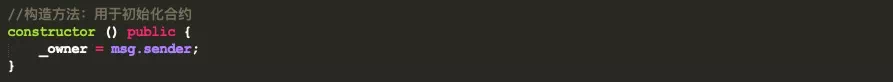
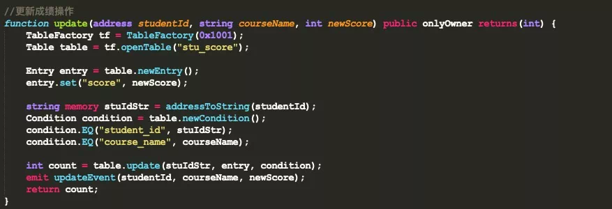
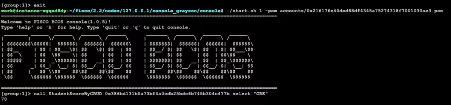

# FISCO BCOS Smart Contract Development Quick Start

Author ： ZHANG Long ｜ FISCO BCOS Core Developer

Currently, the FISCO BCOS platform supports two types of smart contracts, Solidity and Precompiled. At the same time, it provides an interactive console tool (Console) to facilitate developers to interact with the chain, deploy and invoke smart contracts.。
In order to let everyone quickly get started with smart contracts, FISCO BCOS has launched a series of smart contract tutorials. This article will take you to get started quickly and use FISCO BCOS to develop and deploy a simple smart contract.。

## Introduction to Smart Contracts

As we all know, the emergence of smart contracts enables blockchain not only to handle simple transfer functions, but also to implement complex business logic, which greatly promotes the development of blockchain technology and accelerates application landing.。

Currently, most of the numerous blockchain platforms integrate the Ethereum Virtual Machine and use Solidity as the smart contract development language.。As a contract-oriented high-level programming language, Solidity draws on C.++The design of languages such as Python, Python, and JavaScript uses static typing, which not only supports basic / complex data type operations and logical operations, but also provides high-level language-related features such as inheritance, overloading, libraries, and user-defined types.。

As the largest and most active domestic open source alliance chain community, FISCO BCOS seamlessly supports Solidity contracts and provides full-link tools and complete solutions from development, compilation, deployment to invocation, making smart contract and blockchain application development simple.。
In addition, based on a lot of exploration and practice, FISCO BCOS not only supports Solidity contracts, but also supports Precompiled contracts, and provides CRUD contract interfaces at the user level.。CRUD contracts for library table development are not only more in line with user development habits, further reducing the difficulty of contract development, improving performance, and enabling blockchain applications to meet the demands of high concurrency scenarios.。

## Smart Contract Classification

The FISCO BCOS platform supports two types of smart contracts: Solidity contracts and Precompiled contracts。

### Solidity Contract

The Solidity contract runs on the EVM, which is an Ethereum virtual machine with a Harvard architecture that completely separates instructions, data, and stack.。
During the running of the smart contract, first create a sandbox environment (EVM instance), the sandbox environment is completely isolated from the external environment, can not access the network, file system and other processes, the smart contract in the EVM only allows limited operations.。When the transaction is executed, the EVM obtains the opcode of the contract, converts the opcode into the corresponding EVM instruction, and executes it in accordance with the instruction.。

In terms of the number of applications landed, Solidity contracts are the most widely used, supported by almost all blockchain platforms, but Solidity also has many shortcomings。As follows:

- Contracts execute serially in EVM, poor performance；
- Cross-contract calls create a new EVM with high memory overhead；
- Contract variables and data exist in the MPT number, which is not convenient for contract upgrade.；
- Logic and data coupling, not easy to expand storage capacity。

### Precompiled contract

Precompiled contracts are precompiled contracts.。The precompiled contract is executed through the precompiled engine, using C++Write contract logic, contract compilation integrated into the FISCO BCOS underlying node。
Call contracts do not enter the EVM and can be executed in parallel to break the EVM performance bottleneck.；Provide a standard development framework, just inherit the base class and implement the call interface；Suitable for scenarios where logic is relatively certain and high concurrency is sought.；Data exists in the table, separated from the contract, and the contract logic can be upgraded.。

Of course, there are certain thresholds for the use of precompiled contracts。As follows:

- For data storage, you need to create a FISCO BCOS-specific table structure；
- Inherit the Precompiled class when writing contracts, and then implement the Call interface function；
- After completing the contract development, you need to register the address for the precompiled contract at the bottom level.；
- After writing the contract, you need to recompile the FISCO BCOS source code。

In order to mask the threshold of pre-compiled contracts in development and use, FISCO BCOS designed the CRUD contract interface based on pre-compiled contracts and distributed storage.。When writing a Solidity contract, you only need to introduce the abstract contract interface file Table.sol to use the CRUD function, and you don't need to care about the underlying implementation.。

## Smart Contract Development

This section will be based on the global English certification test score management as a scenario, based on the FISCO BCOS platform for the development of smart contracts.。Global certification exams include GRE, TOEFL, IELTS and more。In order to simplify the contract logic, all scores are issued and managed by the examination management center, and students can query their test scores according to their account (address).。

### Solidity Contract Development

In Solidity, a contract is similar to a class in an object-oriented programming language。The Solidity contract has its own code structure and consists of several parts, as shown below。

- State variables: State variables are values that are permanently stored in the contract
- Constructor: used to deploy and initialize the contract
- Events: Events are interfaces that make it easy to call the logging function of Ethereum virtual machines
- Decorators: Function decorators can be used to change the behavior of functions, such as auto-checking, similar to Spring's AOP
- Functions: A function is an executable unit of code in a contract

#### Create contract

Start by creating a contract called StudentScoreBySol to manage students' grades。As shown in the following code, the contract version needs to be introduced at the beginning.。


#### Define state variables

State variables are used to store and manage student test scores。
Define two variables in the current scenario, where _ owner is the creator of the contract, Exam Manager；_ scores is used to store student scores. It is a nested mapping type. The key of the first mapping(address)For the student's account (the address corresponding to the private key), value is also a mapping type, corresponding to the results of each subject, in the second mapping key (bytes32) is the subject name, such as GRE, TOEFL, etc., value(uint8)for achievement。As shown below。


#### Define events

Define an event setScoreEvent to track the addition / modification of student scores, which can be monitored at the business level。The definition of the event is optional, and it doesn't matter if there is no definition, at the business level you can judge whether the transaction is successful based on the return value of the method, but you can't do a more granular problem positioning.。


#### Define decorator

Modifiers in smart contracts are similar to AOP in object-oriented programming, and follow-up actions are performed only when conditions are met.。As shown below, the decorator requires the owner of the contract to follow up, where the owner is the exam management center。


#### Defining Construction Methods

The construction method is used to instantiate the contract, and in the current construction method, the Owner is specified as the deployer of the contract.。



#### Write function

In the current contract, two functions are defined, the setScore function is used to add / modify / delete (score set to 0) student scores, and the onlyOwner modifier is used, only the Owner(Exam Management Center) to operate and track the contents of each operation through the setScoreEvent event。The getScore method is used for score queries, where the view modifier indicates that the state variable will not be modified。


The complete code for the Solidity contract is shown below。Contract development based on the Solidity language seems simple, but requires in-depth study of the Solidity programming language in order to write highly available contracts, with a certain learning cost.。
Through the smart contract topic launched by FISCO BCOS open source community, developers can learn more about the methods and techniques of using Solidity to write smart contracts.。
For more details, please refer to the official Solidity documentation: https://solidity-cn.readthedocs.io/zh/develop/


### CRUD Contract Development

The CRUD contract is the core of the CRUD function. Users can directly reference the CRUD interface file Table.sol in the contract and call the CRUD interface in the Solidity contract.。The development of CRUD contracts fully complies with the operating habits of the database and is easier to understand and use.。

CRUD contract for more development details can refer to: https://fisco-bcos-documentation.readthedocs.io/zh_CN/latest/docs/manual/smart_contract.html#crud

#### Create contract

The contract created by CRUD is not much different from that created by Solidity. The only difference is that the CRUD interface file Table.sol needs to be introduced, as shown below。Decorators and constructors function in the same way as Solidity contracts。


#### Event Definition

In the Solidity contract, you can add / modify / delete scores through setScore, but in the CRUD contract, you need to use different interfaces of the CRUD interface file to implement different functions, so you need to define different events for different functions, as shown below.。


- createEvent: used to track table creation operations；
- insertEvent: Used to track insert grade actions；
- updateEvent: Used to track updated grade actions；
- removeEvent: Used to track delete grade actions。

#### Create Table Function

The CRUD contract implements business functions by first creating a table for storing data, just like a database operation.。
The underlying layer of FISCO BCOS provides the TableFactory contract, the address of which is fixed at 0x1001, and the table can be created by the method provided by the TableFactory object.(createTable)and open(openTable), as shown below。
If the value returned by the createTable interface is 0, the creation is successful。Note that in order for the created table to be shared by multiple contracts, the table name must be globally visible and unique within the group. You cannot create multiple tables with the same name in the same group on the same chain.。


#### New grade function

When operating on a table, you first need to open the corresponding table through TableFactory to obtain the table object, and then insert the data through the table object's insert method。Before inserting data, you first need to build an instance of the Entry object, as shown in the following code。


Note that the return values of the INSERT, REMOVE, UPDATE, and SELECT functions of the Table interface contract are similar to those of a database, all of which are the number of affected record rows, and the key in the interface is of type string.。
In the current scenario, the student's studentId is of the address type, so you need to convert the address type to the string type inside the function. The code is as follows。


#### Update grade function

The steps to update the grade include opening the table through the TableFactory object and then constructing the filter criteria like a database.。
In the CRUD contract interface, a Condition object is provided that provides a series of conditional methods such as greater than, equal to, and less than。After constructing the condition object, you can call the udpdate interface of the table object to complete the update operation. The code is as follows。



#### Delete Grade Operation

The delete operation is similar to the update operation. You need to call the table.remove interface to complete the operation.。


#### Query score operation

Query results operation is very simple, you need to call the table.select interface to complete, the code is as follows。


The CRUD-based contract development is now complete.。

In terms of the number of lines of code in the current scenario, the CRUD contract is more complex and the Solidity contract is relatively simple.。But it's just an illusion, and that may not be the case.。And the development of CRUD contracts is more in line with developer habits, no extra learning costs, easier to understand and get started.。

## Contract deployment and invocation

After the smart contract is developed, the contract needs to be compiled and deployed before it can be called.。The FISCO BCOS platform provides interactive Console tools that make it easy to interact with the chain。The following will take the above smart contract as an example, using the console tool for deployment and invocation.。
Console installation and use can refer to: https://fisco-bcos-documentation.readthedocs.io/zh_CN/latest/docs/console/console.html

### Preparations

Three things to do before deploying and invoking a contract。First copy the written contract to the console directory console / contracts / consolidation。As shown in the following figure。


Secondly, compile the contract. You can use the sol2java.sh script in the console directory to compile the contract. After compilation, the following folder will be generated in the console / contracts / sdk directory, as shown in the following figure。
```eval_rst
.. note::
    If the console version is greater than or equal to v2.8.0, run bash sol2java.sh-H command to view the script usage
```


Where abi stores the ABI of the contract, bin stores the secondary coding file of the contract.(BINARY)The corresponding JAVA contract is in the JAVA folder, which is easy to interact with the chain through the SDK.。
Note that when the CRUD contract is compiled。You must put the CRUD interface contract Table.sol in the console / contracts / consolidation directory. Otherwise, an error will be reported.。
Finally, when deploying contracts, you rely on external accounts, so you first need to generate accounts。The account generation tool get _ account.sh is provided in the console. Running the script generates the account in the console / accounts directory。

We use the account generation tool to generate two accounts。An account for Exam Management Center to deploy and add / modify / delete student scores；An account for students to view test scores。As shown below。


###  Solidity contract deployment and invocation

First, use the exam management center account to start the console, as shown in the following figure, which means that the console is successfully started。


Then use the deploy command to deploy the contract. After the contract is successfully deployed, the contract address is returned, as shown in the following figure。


After the contract is deployed, you can call the contract function through the call command in the console.。As shown in the figure below, the new student's GRE score is 70 (both modification and deletion can be operated by calling the setScore method), and the function return value is true, which means that the transaction was successful。The specific usage of the call command can be passed through the call-h View。


Use the student account to start the console, check the score through the getScore function, as shown in the figure below, the return value is 70, indicating that there is no problem。You can also use the student account to call the setScore method, which will report an error and print without permission, so I won't repeat it.。


### CRUD contract deployment and invocation

The deployment and invocation of the CRUD contract is no different from the Solidity contract, which is also done in the console.。

Start the console with the exam management center account and deploy the Student ScoreByCRUD contract。As shown in the following figure。


After the contract is deployed, call the create function to create the stu _ score table, as shown below, and the return result is 0, indicating that the creation is successful。


After creating the table, you can call the relevant interface to operate on student scores, first call the insert function to add student scores。As shown below, the return result is 1, indicating that the insertion score was successful。


After the score is inserted successfully, close the current console, log in to the console with the student account, and call the select function to query the score, as shown in the figure below, return 70, indicating that the query was successful。The residual function test can be done on its own and will not be repeated.。



## Conclusion

This article focuses on the development of smart contracts on the FISCO BCOS platform.。In the FISCO BCOS platform, you can develop smart contracts using either the native Solidity language or the precompiled contract model.。Solidity contracts have poor performance and high learning costs；Precompiled contracts, using precompiled engines, support parallel computing, higher performance, and support storage expansion.。 
However, due to the use of pre-compiled contracts there is a certain threshold, based on this, FISCO BCOS platform developed the CRUD contract interface, users do not need to care about the underlying implementation logic, only need to introduce the Table.sol contract interface file, by calling the relevant interface to complete the development of the contract.。
