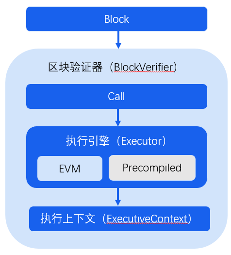

# FISCO BCOS 2.0 Principle Analysis: Design of Precompiled Contract Architecture

Author ： Bai Xingqiang ｜ FISCO BCOS Core Developer

FISCO BCOS 2.0 proposes a pre-compiled contract framework that allows users to use C++Write a smart contract.。Precompiled contracts can achieve higher performance because they do not enter EVM execution, which is suitable for scenarios where the contract logic is simple but frequently called, or where the contract logic is fixed and computationally intensive.。

This article describes the origin and implementation of precompiled contracts, including the following.

- Solidity contract use and encountered problems；
- FISCO BCOS 2.0 adds precompiled contracts, its architecture design and execution process flow；
- Why precompiled contracts are better than Solidity in some specific scenarios；
- Use of Precompiled Contracts in FISCO BCOS Version 2.0。

## Use and Deficiency of Solidity Contract

Using the Solidity contract in the FISCO BCOS platform generally requires the following five steps。After the Solidity contract is developed, the compiled contract must be deployed to the underlying platform, and the contract interface can be called based on the address returned by the platform.。

The advantage of the Solidity contract is that it is fully compatible with Ethereum, rich in development resources and more general, but the Solidity contract also has the problems of low virtual machine execution performance, high cost and complex development.。Especially for the scenario of alliance chain governance, some parameters need to be consistent for all nodes on the chain, which is very suitable for contract management, but if you use Solidity implementation, the deployment steps are not！Often！Compound！miscellaneous！

FISCO-BCOS version 1.3 uses Solidity to implement a set of system contracts, using a proxy contract to manage other system contracts。The deployment process is shown in the following figure:

After deploying the system contract, you need to configure the system contract address in the proxy contract, and then configure the proxy contract address in the node configuration file and restart, in order to call this set of system governance contracts, and the subsequent node expansion also needs to be based on the creation node configuration operations, in order to be consistent.。

## FISCO BCOS 2.0 adds precompiled contracts

FISCO BCOS 2.0, inspired by Ethereum's built-in contracts, implements a pre-compiled contract framework。In the future, we will also try to abstract the existing typical business scenarios and develop them into pre-compiled contract templates as the basic capability provided by the underlying layer to help users use FISCO BCOS in their business faster and more conveniently.。

### Benefits of Precompiled Contracts

**Access to distributed storage interfaces**Based on this framework, users can access the local DB storage state and implement any logic they need.。

**Better performance**Since the implementation is C++The code will be compiled in the underlying layer without entering the EVM for execution, which can have better performance。

**Get started without learning Solidity language**Based on the FISCO BCOS pre-compiled contract framework, developers can use C.++Develop your own pre-compiled contracts to quickly implement the required business logic without learning the Solidity language。

**Parallel models greatly improve processing power**In version 2.0, we implemented parallel execution of contracts based on precompiled contracts and DAGs. Users only need to specify the interface conflict domain, and the underlying layer will automatically build a transaction dependency graph according to the conflict domain, and execute transactions in parallel as much as possible according to the dependencies, thus greatly improving the transaction processing capacity.。

### Precompiled Contracts vs. Ethereum Built-in Contracts

As mentioned above, the FISCO BCOS precompiled contract is inspired by the Ethereum built-in contract, but the implementation principle is very different.。

Ethereum uses built-in contracts to avoid the cost of complex calculations in EVM. Ethereum currently implements 8 functions using built-in contracts (as shown in the following table)。As you can see, the Ethereum built-in contract takes up 0x1-0x8 These 8 addresses, each built-in contract is actually a local function call, can only be used for state-independent calculations。

To use the built-in contract in Solidity, you need to use the call operation to enter the following parameters in sequence

call(gasLimit, to, value, inputOffset, inputSize, outputOffset, outputSize)

Including built-in contract address, input parameter offset, input parameter size, output parameter offset, and output parameter size, this is not a simple matter for users。

The pre-compiled contract framework of FISCO BCOS supports complex parameter types and supports reading and storing data through AMDB.。The address of each pre-compiled contract is fixed, and multiple interfaces can be implemented in the contract, which is called in exactly the same way as the native Solidity.。

**The following figure is a more intuitive comparison**：

**Note:**√ Represents support, x represents no support

## FISCO BCOS Precompiled Contract Architecture

This section gives you a clear understanding of the location of the precompiled contract module in FISCO BCOS and the execution process of the precompiled contract.。

As shown in the following figure, the precompiled contract is called by the block execution engine, and the block validator executes the block through the block execution engine. When the execution engine executes the block, it determines whether to use the EVM or the precompiled contract engine based on the address of the called contract.。

When the called contract address is an EVM contract, the execution engine creates and executes the EVM to execute the transaction；When the called contract address is a registered precompiled contract address, the execution engine executes the transaction by calling the precompiled contract interface corresponding to the address.。

**The precompiled contract execution process is shown in the following figure.**：

The execution engine first gets the contract object based on the precompiled contract address, and then gets the execution result by calling the call interface of the contract object.。The operations in the call interface mainly include:

1. Resolve the called interface based on the call parameters.
2. Parse the incoming parameters according to the ABI encoding.
3. Execute the called contract interface.
4. The result ABI encoding will be executed and returned.

Therefore, if a developer wants to develop a precompiled contract, he only needs to implement the call interface of his precompiled contract and register the address of the implemented contract in the execution engine.。

## Application of Precompiled Contracts in FISCO BCOS 2.0

### System contract

FISCO BCOS 2.0 implements a set of system contracts based on pre-compiled contracts, which are used to manage the chain configuration that requires consensus, including the addition and deletion of nodes in the group, the transformation of node identities, the management of CNS services, the management of chain permissions, and the use of CRUD contracts.。

**The current system contract and address of FISCO BCOS are as follows**：

### CRUD Contract Support

FISCO BCOS 2.0 implements a pre-compiled contract corresponding to AMDB storage based on a pre-compiled contract, enabling users to access AMDB storage in Solidity, which is the CRUD contract of FISCO BCOS 2.0.。In this way, users can store contract data in the underlying AMDB storage, separating contract logic from data, improving contract processing performance on the one hand, and making it easier to upgrade contract logic on the other.。