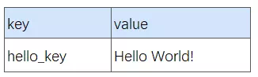
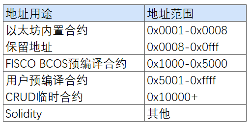
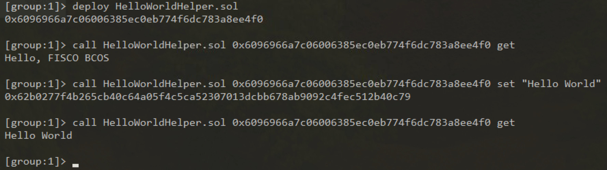

# Pre-compiled contract speed development guide (with complete steps)+Practical operation template)

Author ： Bai Xingqiang ｜ FISCO BCOS Core Developer

In the previous article, we highlighted [the architectural design of the FISCO BCOS precompiled contract](https://mp.weixin.qq.com/s?__biz=MzA3MTI5Njg4Mw==&mid=2247485333&idx=1&sn=5561ae72507526380381856c307ffe61&chksm=9f2ef589a8597c9f6ed68bd2eb7f46fb8083f302dfdd47ae5ef75dd9d5f114631d21dfbedc9c&token=422221390&lang=zh_CN#rd)The framework has many advantages such as fixed address, no need to deploy, and higher local execution performance。Because precompiled contracts are used in exactly the same way as ordinary Solidity contracts, the framework can achieve extremely high running speeds without changing the client developer experience, which can be described as a butcher's knife for scenarios with relatively certain logic and the pursuit of high speed and concurrency。

Today, I will use the HelloWorld contract as an example to show you how to use the pre-compiled contract version of HelloWorld。Note that this chapter requires you to have a certain C++Development experience, and read in detail [FISCO BCOS 2.0 Principle Analysis:](http://mp.weixin.qq.com/s?__biz=MzU5NTg0MjA4MA==&mid=2247483970&idx=1&sn=eb2049961515acafe8a2d29e8b0e28e9&chksm=fe6a870dc91d0e1b016fe96e97d519ff1e65bd7d79143f94467ff15e0cdf79ccb44293e52a7b&scene=21#wechat_redirect)[Distributed Storage Architecture Design](https://mp.weixin.qq.com/s?__biz=MzA3MTI5Njg4Mw==&mid=2247485336&idx=1&sn=ea3a7119634c1c27daa4ec2b9a9f278b&chksm=9f2ef584a8597c9288f8c5000c7def47c3c5b9dc64f25221985cd9e3743b9364a93933e51833&token=422221390&lang=zh_CN#rd)。The five steps shown in the following figure are the only way to develop a precompiled contract. I will implement the HelloWorld precompiled contract step by step, and then use the console and Solidity contract to call the HelloWorld precompiled contract。


## HelloWorld Precompiled Contract Development


Let's first look at the Solidity version of the HelloWorld contract we want to implement。Solidity version of HelloWorld, there is a member name for storing data, two interfaces get(),set(string)for reading and setting the member variable respectively。

```
pragma solidity ^0.4.24;

contract HelloWorld{
    string name;
    constructor() public {
       name = "Hello, World!";
    }
    function get() public constant returns(string){
        return name;
    }
    function set(string n) public{
      name = n;
    }
}
```

### step1 Defining the HelloWorld Interface

Solidity's interface calls are encapsulated as a transaction, where transactions that call read-only interfaces are not packaged into blocks, while write-interface transactions are packaged into blocks。Since the underlying layer needs to determine the called interface and parse the parameters based on the ABI code in the transaction data, the interface needs to be defined first。The ABI interface rules for precompiled contracts are exactly the same as Solidity. When defining a precompiled contract interface, you usually need to define a Solidity contract with the same interface**Interface Contract**。The interface contract needs to be used when calling the precompiled contract。

```
pragma solidity ^0.4.24;

contract HelloWorldPrecompiled{
    function get() public constant returns(string);
    function set(string n);
}
```

### step2 Design storage structure

When precompiled contracts involve storage operations, you need to determine the stored table information(Table name and table structure. The stored data is abstracted into a table structure in FISCO BCOS)。This is in the previous article [Distributed Storage Architecture Design](https://mp.weixin.qq.com/s?__biz=MzA3MTI5Njg4Mw==&mid=2247485336&idx=1&sn=ea3a7119634c1c27daa4ec2b9a9f278b&chksm=9f2ef584a8597c9288f8c5000c7def47c3c5b9dc64f25221985cd9e3743b9364a93933e51833&token=422221390&lang=zh_CN#rd)have introduced。If variable storage is not involved in the contract, you can ignore this step。For HelloWorld, we design the following table。The table only stores a pair of key-value pairs. The key field is hello _ key, and the value field is hello _ value to store the corresponding string value(string)Interface modification, through get()interface acquisition。




### step3 Implementing contract logic

To implement the invocation logic for the new contract, a new C++class, which needs to inherit the Precompiled class, overload the call function, and implement the calling behavior of each interface in the call function。

```
virtual bytes call(std::shared_ptr<ExecutiveContext> _context, 
    bytesConstRef _param, Address const& _origin) = 0;
```

The call function has three parameters, _ context saves the context of the transaction execution, _ param is the parameter information of the calling contract, the corresponding contract interface and the parameters of the interface can be obtained from _ param parsing, _ origin is the transaction sender, used for permission control。 Next, we have the source code**FISCO-BCOS/libprecompiled/extension**directory implements the HelloWorldPrecompiled class, overloads the call function, and implements get()/set(string)Two interfaces。 

##### Interface Registration:

```
/ / Define all interfaces in the class
const char* const HELLO_WORLD_METHOD_GET = "get()";
const char* const HELLO_WORLD_METHOD_SET = "set(string)";

/ / interface registration in constructor
HelloWorldPrecompiled::HelloWorldPrecompiled()
{/ / name2Selector is a member of the Precompiled class, which saves the mapping relationship of interface calls
    name2Selector[HELLO_WORLD_METHOD_GET] = getFuncSelector(HELLO_WORLD_METHOD_GET);
    name2Selector[HELLO_WORLD_METHOD_SET] = getFuncSelector(HELLO_WORLD_METHOD_SET);
}
```

##### To create a table:

```
/ / Define table name
const std::string HELLO_WORLD_TABLE_NAME = "_ext_hello_world_";
/ / Primary key field
const std::string HELLOWORLD_KEY_FIELD = "key";
/ / Other fields, multiple fields are separated by commas, such as"field0,field1,field2"
const std::string HELLOWORLD_VALUE_FIELD = "value";
```

##### Add the logic to open the table in the call function:

```
/ / In the call function, open when the table exists, otherwise create the table first
Table::Ptr table = openTable(_context, HELLO_WORLD_TABLE_NAME);
if (!table)
{/ / table does not exist, first create
    table = createTable(_context, HELLO_WORLD_TABLE_NAME, HELLOWORLD_KEY_FIELD,
        HELLOWORLD_VALUE_FIELD, _origin);
    if (!table)
    {/ / Failed to create table, error code returned
    }
}
```

##### Distinguish the calling interface:

```

uint32_t func = getParamFunc(_param);
if (func == name2Selector[HELLO_WORLD_METHOD_GET])
{// get() Interface Call Logic
}
else if (func == name2Selector[HELLO_WORLD_METHOD_SET])
{// set(string) Interface Call Logic
}
else
{/ / Unknown interface, call error, error code returned
}
```

##### Parsing and returning parameters:

The parameters when calling the contract are included in the _ param parameter of the call function and are encoded in the Solidity ABI format, using dev::eth::The ContractABI tool class can parse parameters, and the return value of the same interface needs to be encoded according to the encoding grid。

dev::eth::In the ContractABI class, we need to use abiIn / abiOut two interfaces, the former is serialized for user parameters, and the latter can parse parameters from serialized data。

##### HelloWorldPrecompiled implementation:

Considering the reading experience on the mobile phone, we introduce the internal implementation of the call interface in blocks and omit some error handling logic. For detailed code implementation, please refer to the FISCO BCOS 2.0 document user manual->Smart Contract Development ->[Precompiled Contract Development](https://fisco-bcos-documentation.readthedocs.io/zh_CN/latest/docs/manual/smart_contract.html#id2)。

```
bytes HelloWorldPrecompiled::call(dev::blockverifier::ExecutiveContext::Ptr _context,
    bytesConstRef _param, Address const& _origin)
{
    / / parse function interface
    uint32_t func = getParamFunc(_param);
    / / Parse function parameters
    bytesConstRef data = getParamData(_param);
    bytes out;
    dev::eth::ContractABI abi;

    / / Open _ ext _ hello _ world _ table, omit
........
```

get()interface implementation

```
/ / Distinguish calling interfaces. The specific calling logic of each interface
    if (func == name2Selector[HELLO_WORLD_METHOD_GET])
    {  // get() interface invocation
        / / Default return value
        std::string retValue = "Hello World!";
        auto entries = table->select(HELLOWORLD_KEY_FIELD_NAME, table->newCondition());
        if (0u != entries->size())
        { 
            auto entry = entries->get(0);
            retValue = entry->getField(HELLOWORLD_VALUE_FIELD);
        }
        out = abi.abiIn("", retValue);
    }
```

set interface implementation

```
else if (func == name2Selector[HELLO_WORLD_METHOD_SET])
    {  // set(string) The interface call is omitted, please refer to the previous link
        std::string strValue;
        abi.abiOut(data, strValue);
        auto entries = table->select(HELLOWORLD_KEY_FIELD_NAME, table->newCondition());
        auto entry = table->newEntry();
        entry->setField(HELLOWORLD_KEY_FIELD, HELLOWORLD_KEY_FIELD_NAME);
        entry->setField(HELLOWORLD_VALUE_FIELD, strValue);

        int count = 0;
        if (0u != entries->size())
        {  // update
            count = table->update(HELLOWORLD_KEY_FIELD_NAME, entry, table->newCondition(), 
                                  std::make_shared<AccessOptions>(_origin));
        }
        else
        {  // insert
            count = table->insert(HELLOWORLD_KEY_FIELD_NAME, entry, 
                                  std::make_shared<AccessOptions>(_origin));
        }
        if (count == storage::CODE_NO_AUTHORIZED)
        { / / No table operation permission
        }
        / / Return the error code
        out = abi.abiIn("", u256(count));
    }
    else
    {  / / Parameter error, unknown interface call
        out = abi.abiIn("", u256(CODE_UNKNOW_FUNCTION_CALL));
    }
    return out;
}
```

### step4 Assign and register a contract address

When FSICO BCOS 2.0 executes a transaction, the contract address is used to distinguish whether it is a pre-compiled contract, so after the pre-compiled contract is developed, it needs to be registered as the pre-compiled contract registration address at the bottom。The version 2.0 address space is divided as follows:



The user-allocated address space is 0x5001-0xffff, and the user needs to allocate an unused address for the newly added precompiled contract**Precompiled contract addresses must be unique and non-conflicting**。

Developers need to modify the FISCO-BCOS / cmake / templates / UserPrecompiled.h.in file to register the address of the HelloWorldPrecompiled contract in the registerUserPrecompiled function(**Requires v2.0.0-rc2 or later**)register the HelloWorldPrecompiled contract as follows:

```
void ExecutiveContextFactory::registerUserPrecompiled(ExecutiveContext::Ptr context)
{
    / / User precompiled contract address range [0x5001, 0xffff]
    context->setAddress2Precompiled(Address(0x5001), std::make_shared<precompiled::HelloWorldPrecompiled>());
}
```

### Step5 compiled source code

Refer to FISCO BCOS 2.0 manual ->Get executable program ->[source code compilation](https://fisco-bcos-documentation.readthedocs.io/zh_CN/latest/docs/manual/get_executable.html)。Note that the implementations of HelloWorldPrecompiled.cpp and HelloWorldPrecompiled.h need to be placed in the FISCO-BCOS / libprecompiled / extension directory。

## HelloWorld precompiled contract call

### Invoking the HelloWorld precompiled contract using the console

Create a HelloWorldPrecompiled.sol file in the solidity / contracts console. The file content is the interface declaration of the HelloWorld precompiled contract, as follows

```
pragma solidity ^0.4.24;
contract HelloWorldPrecompiled{
    function get() public constant returns(string);
    function set(string n);
}
```

After using the compiled binary to build a node, deploy console v1.0.2 or later, and then execute the following statement to call the


### Invoking the HelloWorld precompiled contract in Solidity

We try to create a precompiled contract object in the Solidity contract and call its interface。Create a HelloWorldHelper.sol file in the Solidity / contracts console. The file content is as follows

```
pragma solidity ^0.4.24;
import "./HelloWorldPrecompiled.sol";

contract HelloWorldHelper {
    HelloWorldPrecompiled hello;
    function HelloWorldHelper() {
        / / Call the HelloWorld precompiled contract
        hello = HelloWorldPrecompiled(0x5001); 
    }
    function get() public constant returns(string) {
        return hello.get();
    }
    function set(string m) {
        hello.set(m);
    }
}
```

Deploy the HelloWorldHelper contract, and then call the HelloWorldHelper contract interface. The result is as follows



Here, you can congratulate you on the smooth completion of the development of the HelloWorld precompiled contract, the development process of other precompiled contracts is the same。

