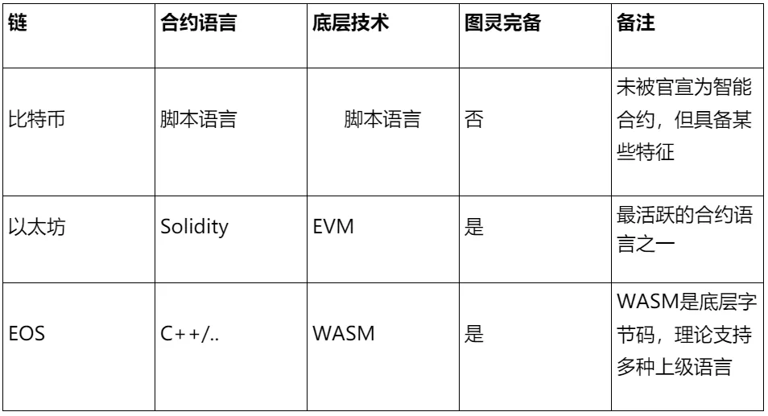

# Smart Contracts: Concepts and Evolution

Author: Chu Yuzhi ｜ FISCO BCOS Core Developer

## Foreword

Since Bitcoin started the blockchain era in 2009, in the past 10 years, with the development of technology and ecology, blockchain-based distributed applications (dapps) have shown a blowout trend, and the underlying technology supporting dapps is "blockchain."+Smart Contracts "。
The combination of smart contracts and blockchain is widely regarded as a landmark upgrade in the blockchain world.。The first platform that combines blockchain and smart contract technology--The birth of Ethereum is believed to have started"Blockchain 2.0"Times。

## What is a smart contract?

In 1996, Nick Szabo wrote in the article "Smart Contracts.": Building Blocks For Digital Markets introduces the concept of smart contracts。
The so-called "contract" is the provisions, contracts and other things, which record the conditions of occurrence and the corresponding implementation of the terms, in order to support the right and other operations.；Called"Intelligent", which means automated, programmable。

So, a smart contract is a programmable contract, which can also be understood as an automatically executed clause contract, which in a computer is an automatically executed program fragment.。It is easier to save the contract and is run by a defined algorithm, given the input, you get the corresponding output, which greatly guarantees the execution of the contract.。
Using the analogy of vending machines can help us better understand the core features of smart contracts。
When the user selects the goods to be purchased and completes the payment, the shipping logic is triggered and the user gets the goods he wants, a process that does not require manual intervention and saves the labor cost of selling the goods.。If you're going to break this contract, you're going to have to physically destroy the vending machine.。Like POS card swipers, EDI (Electronic Data Interchange), etc., can also be used for this type of ratio.。

## Smart Contracts and Blockchain

Smart contracts were proposed in the last century, and blockchain was only born in 2009, and by definition, smart contracts have little to do with blockchain.。
Why are smart contracts and blockchain so closely related in these 10 years?？Because the blockchain can ensure that the smart contract can not be tampered with, not only the content of the contract can not be tampered with, each call record can not be tampered with.。
The most basic prerequisite for smart contracts to generate value is to have a strong underlying medium for storage so that they cannot be physically destroyed。

However, the ontology of a smart contract is a piece of code that can be easily tampered with, and how to provide a powerful storage medium for it becomes a problem.。This is exactly what blockchain is good at solving - through the practice of Bitcoin, it proves that blockchain can make electronic records immutable in a distributed environment.。
At the same time, smart contracts are also feeding the blockchain, which greatly expands the business scenario of the blockchain.。

Combined with smart contracts, blockchain no longer serves a single currency payment, which can be extended to all aspects of life.。The rich application scenarios also create new challenges to the capabilities of the blockchain.。

## Blockchain 2.0: The Birth of Ethereum

Bitcoin, born in 2009, uses blockchain and other technologies to ensure ecology, creating the era of blockchain 1.0。
Users can customize some content through script code, such as how to unlock a fund。These script codes are saved with the transaction, thus enjoying the immutable qualities and being deterministic。So in a way, these scripts can also be seen as smart contracts.。But they don't work。
First, the script code is not Turing-complete, which limits the functionality of the implementation；Secondly, the development threshold is high, the experience of writing complex logic will be very poor, such as using JVM bytecode to write programs.。

In 2013, a young V-god proposed Ethereum, the core of which is to update and verify blockchain data through the state of the world。The biggest difference between Ethereum and Bitcoin is that complex logical operations can be performed through smart contracts.。
On Ethereum, the language of smart contracts is Solidity, which is a Turing-complete and upper-level language, which greatly expands the scope of smart contracts and reduces the difficulty of writing smart contracts.。
Because of this, the birth of Ethereum also marks the beginning of the blockchain 2.0 era.。Subsequently, smart contract technology has gradually penetrated multiple business scenarios such as traceability, depository, and supply chain.。

## Status and Prospects of Smart Contracts

From a programming perspective, a smart contract is a piece of code。Smart contracts have many differences and limitations compared to conventional code, such as:

- single-threaded execution
- Code execution consumes resources and cannot exceed resource limits
- It is currently difficult to obtain off-chain data, such as weather information, race results, etc.
- Other restrictions, such as TPS

These characteristics make the current smart contract ecology take the governance of resources on the chain as the core.。Like the various ERC standards and governance solutions on Ethereum；There are various resource models on EOS, such as CPU, RAM, economic model, Rex, Bancor protocol, etc.。
Clearly, with the current ecology, smart contracts have limited impact on the real world.。
But things are always evolving。There has been a lot of research dedicated to breaking through these limitations, typically Oracle (the oracle, but often called the oracle), which allows smart contracts to interact with off-chain, thus greatly improving the use of smart contracts, as if a computer were connected to the Internet.；Another example is those attempts to break through the performance bottlenecks of the chain itself, such as payment channels, cross-chain, plasma, rollups, all of which break the shackles of security and performance from different perspectives.。
There is no doubt that smart contracts will play an increasingly important role, and in the future, with the landing of Ethereum 2.0, a new blockchain era may be opened.。

## Smart Contract Technology

Ethereum uses Solidity as the smart contract language, a high-level programming language created to implement smart contracts that can run on nodes that allow Ethereum programs。The language absorbs C.++Some features of JavaScript, for example, it is a statically typed language, supports inheritance, libraries, etc.。
In addition to Solidity, the smart contract technology of each platform is also different. Next, we will introduce the technology adopted by other platforms from the public chain and alliance chain.。

### Public Chain

First of all, you might want to know the smart contract technology of the three public chains.。



### Alliance Chain

In addition to the public chain, the alliance chain is also an important type of blockchain。Compared to the public chain, the complexity of the alliance chain consensus is greatly reduced and therefore has higher execution efficiency。
Alliance chains are favored by enterprise-level organizations, and in general, alliances are formed between relevant organizations to share data through alliance chains.。The alliance chain can cover supply chain finance, judicial deposit, traceability and other scenarios, and will be combined with IOT, AI and other technologies in the future.。
In today's alliance chain ecology, except for the Fabric that uses chaincode, most platforms use Solidity as a smart contract language, as is the case with FISCO BCOS.。

Nowadays, Solidity can be said to occupy the C position of smart contracts, and mastering Solidity is an important part of learning smart contracts and blockchain.。Later series will also provide an in-depth introduction to how to write, run, and test smart contracts with Solidity.。
In addition to Solidity, some smart contract languages such as WebAssembly and Libra's Move are also in development, so you can keep an eye on them.。

## Smart contract operation analysis

Here's a basic smart contract: HelloWorld。

```
pragma solidity 0.4.22;

contract HelloWorld{

    uint private _num;
    function store(uint256 num) public {
        _num = num;   
    }

    function get() public view returns (uint256){
        return _num;
    }
}
```

The function of this Solidity code is to access the _ num field。This field is called a "state variable" and is persisted by the blockchain.。
Users can deploy this code on Ethereum or similar blockchains, and successful deployment means that the smart contract can no longer be modified, as long as the underlying blockchain is not destroyed, the contract will always exist.。Anyone can call the contract interface through the "contract address," and each call will be recorded on the chain.。
Before explaining how this code works, let's review how traditional java programs work.。

First, after the user compiles the java code, it will be saved on the disk as bytecode；The user then invokes the program, which is hosted by the JVM for execution；Call parameters may be logged during program execution, or IO with disk。
The execution of Solidity is similar to this。The difference is that the media has changed from hard drives to blockchains and from stand-alone to distributed.。
After the code is deployed, it is stored as bytecode on each node。When the user asks to call a function, the call request will be included in the transaction and packaged on a block, which means that the call is legal once the whole network has reached a consensus on the block.。
Next, the EVM calls the bytecode, which is responsible for accessing the underlying state variables, like the IO of traditional programming.。


From the code alone, contract development seems to be nothing more than that, a single contract only needs to operate around the field, for many simple businesses, it's just CRUD.。
But its complexity lies precisely in this, the contract is executed on the blockchain environment, is not modifiable。
So if a bug occurs, a new contract must be deployed, which challenges the maintainability of the contract。And, once the business becomes complex, it is prone to security vulnerabilities, resulting in the loss of assets on the chain.。Also consider the cost of completing code writing, logic execution, and data storage。 
In summary, writing a contract is not difficult, but writing a good contract requires a certain level of skill.。

## Conclusion

This article introduces the concept and historical evolution of smart contracts.。
Smart contracts are a technology proposed in the last century that has taken on new life under the blockchain wave。On the other hand, the wide application of smart contracts has greatly promoted the development of blockchain.。

To learn smart contracts, it is recommended to choose the Solidity language because it has some characteristics of traditional languages, and the execution environment is completely based on the blockchain, so the actual business development experience will be different from the previous programming experience.。
Readers can try to quickly build a blockchain environment based on FISCO BCOS, deploy the simplest contract, be familiar with the deployment and invocation methods, and then go further into the world of Solidity.。

