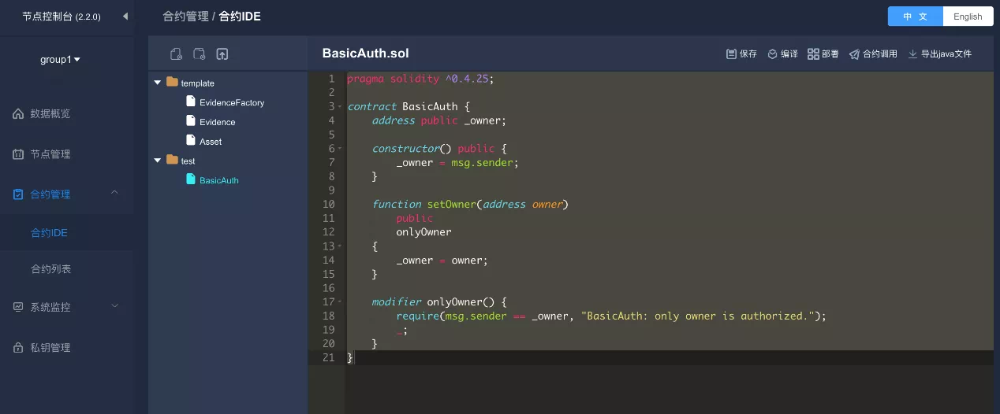
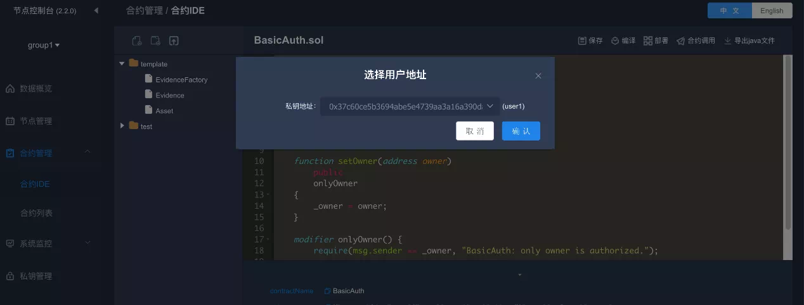
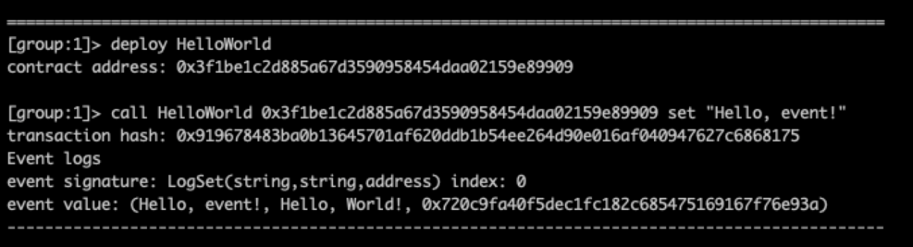
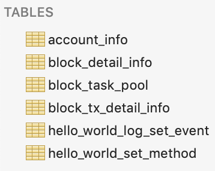

# Skills and Practice of Smart Contract Testing

Author ： MAO Jiayu ｜ FISCO BCOS Core Developer

## Foreword

The development of blockchain is accompanied by the topic of information security。In the short history of Solidity, there has been more than one appalling and far-reaching security attack that has caused irreparable damage to some institutions and organizations。"Misfortune is born of negligence, testing precedes delivery," and if these defects and vulnerabilities are found in the testing process, losses can be effectively avoided。Testing is a vital part of smart contract development and delivery。It can effectively check whether the actual results meet the design expectations, help identify errors, check for gaps and leaks。At the same time, high-quality, reusable testing also helps to improve overall development efficiency。The previous section describes Solidity's past lives, syntax features, design patterns, programming strategies, and underlying principles。As the final part of the series, this article will focus on and share Solidity's test scenarios, methods, and practices。

## Pre-preparation

Before entering the test, you need to complete the following steps: chain building, console installation, smart contract development, smart contract compilation and deployment, and developing an application using Java and other SDKs。

Detailed preparation can refer to the "[FISCO BCOS zero-based entry, five-step easy to build applications](http://mp.weixin.qq.com/s?__biz=MzA3MTI5Njg4Mw==&mid=2247485305&idx=1&sn=5a8dc012880aac6f5cd3dacd7db9f1d9&chksm=9f2ef565a8597c73b87fd248c41d1a5b9b0e6a6c6c527baf873498e351e3cb532b77eda9377a&scene=21#wechat_redirect)and FISCO BCOS official documentation, which will not be repeated here。[FISCO BCOS Official Documentation](https://fisco-bcos-documentation.readthedocs.io/zh_CN/latest/docs/installation.html)Address。


## Test Environment

FISCO BCOS provides console, WeBASE-Front, and SDK code testing. These three environments are suitable for different test scenarios:

- Console: Provides a command line interface for simple debugging by creating contracts and entering call and query instructions in the console。For very simple contracts。
- WeBASE-Front: Provides a visual interface and a simple IDE environment。Applicable to contracts with uncomplicated business logic. It is recommended that developers perform some debugging。
- SDK: For example, integrate with the Java SDK, create a Java project, and write applications and test code。For scenarios that require high quality smart contracts, reusable test cases, complex business logic, or continuous integration。

### Console Test

FISCO BCOS 2.0 and above provides an easy-to-use command line terminal and an "out-of-the-box" blockchain tool. For more information, please refer to the [FISCO BCOS console for detailed explanation, flying general blockchain experience](http://mp.weixin.qq.com/s?__biz=MzA3MTI5Njg4Mw==&mid=2247485275&idx=1&sn=95e1cb1a961041d5800b76b4a407d24e&chksm=9f2ef547a8597c51a8940548dd1e30f22eb883dd1864371e832bc50188c153989050244f31e5&scene=21#wechat_redirect)》。Next, a contract example will be used to explain how to use the console for testing。First, we write a HelloWorld contract:

```
pragma solidity ^0.4.25;

contract HelloWorld{
    string public name;
    constructor() public{
       name = "Hello, World!";
    }
  
    function set(string n) public{
      name = n;
    }
}
```

Then, name the contract HelloWorld.sol and save it to the contract / consolidation / path where the console is located。Then, execute. / start.sh to launch the console and deploy the contract:

```
=============================================================================================
Welcome to FISCO BCOS console(1.0.8)!
Type 'help' or 'h' for help. Type 'quit' or 'q' to quit console.
 ________ ______  ______   ______   ______       _______   ______   ______   ______
|        |      \/      \ /      \ /      \     |       \ /      \ /      \ /      \
| $$$$$$$$\$$$$$|  $$$$$$|  $$$$$$|  $$$$$$\    | $$$$$$$|  $$$$$$|  $$$$$$|  $$$$$$\
| $$__     | $$ | $$___\$| $$   \$| $$  | $$    | $$__/ $| $$   \$| $$  | $| $$___\$$
| $$  \    | $$  \$$    \| $$     | $$  | $$    | $$    $| $$     | $$  | $$\$$    \
| $$$$$    | $$  _\$$$$$$| $$   __| $$  | $$    | $$$$$$$| $$   __| $$  | $$_\$$$$$$\
| $$      _| $$_|  \__| $| $$__/  | $$__/ $$    | $$__/ $| $$__/  | $$__/ $|  \__| $$
| $$     |   $$ \\$$    $$\$$    $$\$$    $$    | $$    $$\$$    $$\$$    $$\$$    $$
 \$$      \$$$$$$ \$$$$$$  \$$$$$$  \$$$$$$      \$$$$$$$  \$$$$$$  \$$$$$$  \$$$$$$

=============================================================================================
[group:1]> deploy HelloWorld
contract address: 0x34e95689e05255d160fb96437a11ba97bb31809f

[group:1]>
```

After the contract is successfully deployed, you can start testing。We first print the value of name in this contract, then modify it to a new value, and finally re-query the value in name。

```
[group:1]> call HelloWorld 0x34e95689e05255d160fb96437a11ba97bb31809f name
Hello, World!

[group:1]> call HelloWorld 0x34e95689e05255d160fb96437a11ba97bb31809f set "Hello, test!"
transaction hash: 0x72c8a95b651fb5d12c44b69624d5213d58af1509f00920757fce94d019b5eae8

[group:1]> call HelloWorld 0x34e95689e05255d160fb96437a11ba97bb31809f name
Hello, test!

[group:1]>
```

The above example demonstrates how to deploy and debug a contract using the console。The console design is simple and elegant, and the experience is silky smooth。However, when dealing with complex scenarios, such as the need to switch external accounts or operate through a visual interface, WeBASE-Front does its part to carry the banner。

### WeBASE-Front Test

WeBASE-Front provides developers with the visualization of running core information, the IDE environment developed by Solidity, and the private key management function, making it easier for everyone to start the blockchain journey。For the introduction of WeBASE-Front, please refer to [Function Analysis of WeBASE Node Front Components](http://mp.weixin.qq.com/s?__biz=MzA3MTI5Njg4Mw==&mid=2247485288&idx=1&sn=d4a69c02496591e9bbf3fa4de150aa5b&chksm=9f2ef574a8597c6210f742514a71537e49bd8f56017d53b48b441ac7c40f65bb7b66b6049aeb&scene=21#wechat_redirect)and [Installation and Deployment Instructions](https://webasedoc.readthedocs.io/zh_CN/latest/docs/WeBASE-Install/developer.html#)》。

Next, we demonstrate a test case that requires switching external accounts, here is the contract code

```

pragma solidity ^0.4.25;

contract BasicAuth {
    address public _owner;

    constructor() public {
        _owner = msg.sender;
    }

    function setOwner(address owner)
        public
        onlyOwner
{
        _owner = owner;
    }

    modifier onlyOwner() { 
        require(msg.sender == _owner, "BasicAuth: only owner is authorized.");
        _; 
    }
}
```

In this example, the contract owner is automatically assigned the contract deployer。The decorator onlyOwner determines that the setOwner function can only be initiated by the _ owner user。In the Contract Management - Contracts IDE, create the test folder and copy the contract code:



Then, click Private Key Management - Add User, create two users, user1 and user2。


At this point, select the deployment contract, the user address window will pop up options, select user1。



After the contract is deployed, the contract address, contract name, abi, and contract binary are displayed


Click on the contract call, the call window pops up, the "method" drop-down box contains a list of all callable functions, select the _ owner function, click OK, you can return the contract _ owner variable value。


Now let's test the setOwner()Function。As mentioned above, the _ owner of this contract is user1, which is called by switching user user2, and the expected result is that the call fails。We choose the setOwner method and select the private key address as user2:


As expected, the call to this function failed:


The above execution results print out the TransactionReceipt of the entire transaction, click Restore to convert to the original output value。"What you see is what you get," WeBASE-Front makes blockchain easier to use。The biggest weakness in testing with WeBASE-Front is that test cases cannot be reused。If the contract is very complex, then all test cases have to be manually entered over and over again, and the original operation is inefficient。 

### SDK Test

In system testing, you need to follow the classic AIR practice principles:

-Automatic: The test should be executed fully automatically, which is also a prerequisite for continuous integration。
-Independent: Test cases remain independent of each other, there is no interdependence and call。
-Repeatable: test cases must be reusable。Can be repeated across hardware and software environments。

To meet the above and more test practice principles, the way to use the console or WeBASE-Front is somewhat inadequate, and the way to integrate the SDK and write test code is more recommended。Although this approach takes longer upfront and costs more；However, the late test can greatly reduce the repetitive workload and significantly improve the overall test efficiency。This is also in line with IT companies' current software testing practices。This part of the code is usually written by the company's development and testing personnel or quality assurance (QA) engineers。But in many companies, this part of the code is written by the developer。Good test code can improve code quality, reduce the difficulty of code refactoring, and improve development efficiency。

FISCO BCOS provides multi-language SDKs, such as Java, Python, Node.js, etc. The most mature and commonly used is the Java SDK。[Using JavaSDK in IDE](https://fisco-bcos-documentation.readthedocs.io/zh_CN/latest/docs/sdk/java_sdk/quick_start.html)The details of creating a new project in the IDE and importing an already provided sample project into the IDE。In Java development practice, the use of Springboot is more popular, FISCO BCOS also provides the corresponding use case, the relevant configuration documents can refer to: Spring Boot project configuration, through the spring-boot-starter developers can quickly download the sample project, and import the preferred IDE。

After configuring the basic environment of the project chain, the following will take the above spring-boot-starter project as an example to introduce the specific test steps and key points。

1. Write a contract: HelloWorld contract。
2. Compile the smart contract and convert it to a Java file, from the above WeBASE-Front, you can also compile and export the Java file。
3. Import the Java file generated by compilation into the project, such as HelloWorld.java。
4. Based on the above documents, call the contract function and interface, and write relevant test cases, such as ContractTest。
5. Based on the gradle plugin provided by Spring, we can use the"./gradlew test"command to run all test cases。
6. If continuous integration is required, you can add the step 5 command to the automation script after configuring and initializing FISCO BCOS。

Next, we will specifically analyze the core test code ContractTest:

```
@Test
public void deployAndCallHelloWorld() throws Exception {
    // deploy contract
    HelloWorld helloWorld = HelloWorld.deploy(client, credential);
    Assert.assertNotNull(helloWorld);
    // call set function
    helloWorld.set("Hello, World!");
    // call get function
    String result = helloWorld.get();
    Assert.assertTrue("Hello, World!".equals(result));
 }
```

- Line 4, the HelloWorld contract is deployed。To comply with the principle of independence, it is recommended to deploy a separate contract in each test case to avoid interference from the test case execution sequence to normal testing。Except where simulated contract dependencies are required。
- Line 9 and line 11, set and get are called respectively。In order to comply with the principle of repeatability, the test case must be designed to be idempotent, i.e., the expected results of the test case are consistent in any hardware and software environment。
-Lines 7 and 12 use the assertion method provided by the Junit framework to determine whether the smart contract execution results meet expectations。

It is worth mentioning that in the Java SDK, after any transaction is chained, a receipt TransactionReceipt object is obtained, which contains the return status and error information (if the transaction is successful, the message is null), which can be used to determine whether the transaction is normal, for example:

```
TransactionReceipt tr = helloWorld.set("Hello, World!");
Assert.assertEquals(tr.getMessage(), "0x0", tr.getStatus());
```

The above is based on the testing features provided by Springboot and implements contract testing. If you need more details, please [refer to the relevant documentation of Spring](https://docs.spring.io/spring-boot/docs/2.2.6.RELEASE/reference/html/spring-boot-features.html#boot-features-testing)。

## Type of test

Like traditional software, smart contract testing can also be divided into functional testing, non-functional testing, security testing and regression testing, which will be described below。

### Function test

Functional testing includes, but is not limited to, unit testing, integration testing, smoke testing, and user acceptance testing。In addition to user acceptance testing, other tests can be implemented by code written by developers or testers。One of the important purposes of smart contract testing is to detect the correctness of the contract code and check whether the output value meets expectations given a predetermined input value。

Above, we introduced the console, WeBASE-Front and SDK three test environments。In some logically complex smart contracts, one of the test difficulties is constructing test cases。In this scenario, using smart contracts can better simulate and construct test data, and writing smart contracts directly using Solidity is more native and friendly。

Finally, testing is not outside of smart contract development, but an important part of it, and testing also follows the dependency principle, which means that developers need to consider the "testability" of smart contracts when developing。For example, if the test code is written entirely using the SDK, then the modification of the smart contract may cause the test code to need to make corresponding changes, which will affect the test effect and increase the test cost。Based on the principle of "non-reliance on changeable parts" in software design, testability also cannot rely on changeable parts。

In order to solve the above problems, we introduce test code in the smart contract layer。This code is designed only as a test component and will not be released to the online environment to decouple the effects of test case changes and encapsulate them in the smart contract layer。Test contracts as stand-alone components to support development and testing。

The test component can first abstract and define some test tool contracts, such as

```
pragma solidity 0.4.25;

library LibAssert {
    event LogTest(bool indexed result, string message);

     function equal(uint8 a, uint8 b, string message) internal returns (bool result) {
        result = (a == b);
        log(result, message);
    }

    function notEqual(uint8 a, uint8 b, string message) internal returns (bool result) {
        result = (a != b);
        log(result, message);
    }

    function log(bool result, string message) internal {
        if(result)
            emit LogTest(true, "");
        else
            emit LogTest(false, message);
    }
}
```

This is the simplest test contract library that provides equal and notEqual methods to determine uint8 variables, and developers can extend their own test tool contracts based on this tool。

Second, relying on tool contracts, we can write independent test contract cases。

The following Uint8MathTest will be used as an example to demonstrate how to use this tool contract. First, we define a TestDemo contract:

```
pragma solidity ^0.4.25;
import "./Uint8MathTest.sol";
import "./LibAssert.sol";
contract TestDemo {
  using LibAssert for uint8;
  function testAdd() external returns (bool result) {
    uint8 a = 1;
    uint8 b = 1;
    Uint8MathTest math = new Uint8MathTest();
    uint8 c = math.add(a,b);
    uint8 expectedValue = 2;
    result = expectedValue.equal(c, "Not equal");
  }
}
```

Then, run this test case in the console:

```
[group:1]> deploy TestDemo
contract address: 0xd931b41c70d2ff7b54eb9b2453072f9b1a4dc05c

[group:1]> call TestDemo 0xd931b41c70d2ff7b54eb9b2453072f9b1a4dc05c testAdd
transaction hash: 0xe569e5d8eae1b949a0ffe27a60f0b4c8bd839f108648f9b18879833c11e94ee4
---------------------------------------------------------------------------------------------
Output
function: testAdd()
return type: (bool)
return value: (true)
---------------------------------------------------------------------------------------------
Event logs
---------------------------------------------------------------------------------------------
```

In addition to relying on custom smart contract test code, you can also write test cases using the smart contract itself。In the SDK layer, we only need to implement the test function code in TestDemo。Even if the test logic changes in the future, there is no need to change the SDK code, thus ensuring the robustness of the test code。The contract test code component needs to implement the design principles followed by the smart contract in the overall design。

### Non-functional test

Non-functional testing mainly includes performance testing, capacity testing, usability testing, etc。Since smart contracts run on the underlying nodes of FISCO BCOS, capacity testing and usability testing are more relevant to the underlying nodes, so for users, the focus of non-functional testing is on performance testing。

Although we can use a series of general performance testing tools to test smart contracts, there will be some pain points in the actual pressure testing process, such as:

-For specific contract scenario testing, there is a large and repetitive test code, which is time-consuming and laborious；
-Performance indicators lack uniform measurement and cannot be compared horizontally；
- Presentation of results is not intuitive enough。

In order to solve the above pain points, FISCO BCOS is adapted to the professional blockchain testing tool Caliper, allowing users to perform performance tests elegantly。For more details and content, please refer to: [Practice of Performance Test Tool Caliper in FISCO BCOS Platform](https://mp.weixin.qq.com/s?__biz=MzA3MTI5Njg4Mw==&mid=2247485260&idx=1&sn=118e20d331f2dc51e033e12402868cc5&scene=21#wechat_redirect)》。

### Safety test

Smart contracts require rigorous security testing before they go live。Security testing methods include: disclosing smart contracts and issuing rewards, hiring a dedicated smart contract security agency to detect and evaluate contracts, and using smart contract-specific tools for auditing。You can choose the corresponding security test level depending on the importance and logical complexity of your contract。For individual developers or non-major business smart contracts, choose the free smart contract tool to detect。The following uses VS Code as an example to demonstrate how to use the smart contract security plug-in for contract security detection。Open VS Code and search for Beosin-VaaS in its plugin library: ETH, select install。Next, open the smart contract file, right-click and select Beosin-VaaS:ETH option, select the current contract code version in the pop-up window。After the installation is complete, the following interface will pop up automatically:


Click start to perform security detection on the selected contract。Here are the test results for the HelloWorld contract:

```
start compile!
compile over!
start deploy!
deploy over!
start execute function name: set(string)
execute function name : set(string) end!
No problem was found in the contract
---end---
```

When we check the Uint8MathTest contract, we will find that an error is reported:

```
####### Compile Problem #######
file: /Users/maojiayu/Downloads/Uint8MathTest.sol
title: Compile Problem
description:  Function state mutability can be restricted to pure
code:   function add(uint8 a, uint8 b) public returns (uint8 c) {
warningType: Info
line: 5
```

By reporting the error message, we can find that the function neither reads nor uses the state on the blockchain, which meets the conditions for the use of the pure modifier. We recommend that you use the "pure" keyword to modify the。Security testing is an integral part of the contract testing process and needs to be highly valued。In strict engineering practice, the safety test report must be issued by the relevant test leader before production on the contract。In addition, developers can collect and summarize Solidity security programming rules and vulnerability risk tips, and dynamically update maintenance。Before delivering the test, the developer can organize code review and walk-through, based on the summary, centralized, item-by-item risk troubleshooting。Security testing is an essential part of detecting and evaluating the security of smart contracts, but contract security cannot be placed solely on testing。More importantly, at all stages of design, development and testing, users are required to maintain a sense of security at all times and to establish and develop secure coding habits。After the contract is released and launched, you cannot relax your vigilance, always pay attention to the latest security warnings in the industry, and regularly and dynamically detect and scan all codes。

### regression test

Regression testing usually includes automated test cases that perform continuous integration and manual testing before the contract goes live。The above SDK and smart contract test cases can effectively cover the execution path and scope of the test cases。Automated regression testing helps quickly detect and identify problems, saves a lot of duplication, and ensures that contracts do not deviate from the backbone function after a series of modifications and tests。Similarly, developers can build and test with tools like Jenkins, Travis, and more。In addition to cases where individual automated tests cannot be performed, manual testing is more about confirming whether the previously modified code meets expectations and whether the smart contract runs as originally designed。In addition, before the final release of the contract, manual testing also plays a role of audit and inspection, so it must be taken seriously。

## Test points

Regardless of the type of system test, special attention should be paid to the following test points。

- Pay attention to the testing of boundary values, such as number overflow, special values, cycle boundary values, etc。
-Pay attention to check whether the implementation of the smart contract meets expectations, and whether its operating logic and process are consistent with the design。
-In addition to the normal process, it is also necessary to simulate and test whether the smart contract operates normally and whether it can achieve the expected processing results in various abnormal environments, even extreme environments。
- around the smart contract unchanged business logic, ignoring the change value, the corresponding test。

### boundary value

Boundary value testing is a common method of software testing。According to statistics, the vast majority of bugs occur at the boundary of the input or output range, not within it。Let's demonstrate a typical numerical overflow test case。The following simple contract implements the addition of two uint8 values and returns the result

```
pragma solidity 0.4.25;

contract Uint8MathTest {
    function add(uint8 a, uint8 b) public returns (uint8 c) {
        c = a + b;
    }  
}
```

At this point, we need to design a test case for boundary values。It is known that the value range of uint8 is [0,28)That is, [0,256)In order to design an overflow test case: (a = 255, b = 1), the test results are as follows:

```
[group:1]> deploy Uint8MathTest
contract address: 0xd8a765995c58eb8da103bdcc2c033c0acb81e373

[group:1]> call Uint8MathTest 0xd8a765995c58eb8da103bdcc2c033c0acb81e373 add 255 1
transaction hash: 0x0583185839bc52870ac57cdfd00c0c18840c2674d718b4cc3cb7bc1ef4c173e0
---------------------------------------------------------------------------------------------
Output
function: add(uint8,uint8)
return type: (uint8)
return value: (0)
---------------------------------------------------------------------------------------------
```

You can see that the final result becomes 0 instead of the expected 256. Obviously, this is because the result overflows。Of course, when taking values using the boundary value test method, not only valid boundary values are taken, but also invalid boundary values are included。Boundary value testing helps find more errors and defects。

### Whether in line with expectations

After the construction company delivers the house, the developer will check the construction of the house according to the design criteria。Similarly, in addition to checking whether the contract execution results are correct, the test also needs to check whether the contract interaction, operation, data flow direction, performance performance and other aspects of the implementation are in line with the design。For example, in a financial industry scenario, we will use Solidity to develop specific on-chain business logic。Among other things, inevitably dealing with amounts requires testing whether the corresponding asset size meets the design criteria。

During the requirements and design phase, we estimate the size of the assets running on the chain and make design requirements, such as requiring a supply chain finance blockchain business system to operate normally at a scale of hundreds of billions of assets。Assuming that the field defining the amount in a smart contract is uint32, the maximum value that can be calculated is 232, which is less than 4.3 billion。Although most of the time after the launch of the smart contract, the problem will not cause any impact；However, once the business grows rapidly, there will be serious failures when the asset size exceeds 4.3 billion。These problems are very hidden, so more comprehensive and careful testing is needed to detect and locate them early。

### Abnormal process

In actual business scenarios, even after a series of tests to ensure that the smart contract runs in line with the requirements of most scenarios, it may be due to negligence or omission, resulting in problems in specific abnormal processes, which has a significant impact after the release of the smart contract。Therefore, developers need to pay special attention to the search and coverage of exception processes in the scope and content of the test, and cover all exception processes as much as possible。

### change and unchanged

Using Solidity testing is also significantly different from other languages in that many transactions and values in contracts cannot be reproduced。Just as "one cannot step into the same river twice in one's life," as the private key, certificate, environment, etc. change, the transaction hash value, block hash, contract address, etc. will also be different, which also brings some objective difficulties to the test。Solidity, on the other hand, has stringent requirements for consistency, such as consistency in the semantics of EVM execution instructions, "exclusion" of external random variables, and so on。The key to mastering contract testing is to capture the unchanging aspects of it。

## Testing Skills

As a dedicated programming language on the blockchain, Solidity has many limitations compared to other high-level languages。For example, lack of support for sophisticated testing tools to debug at runtime and view status and data within EVM virtual machines。At the same time, Solidity lacks an independent data abstraction layer, which makes it impossible to view the detailed variable status in the contract directly by connecting to the database like traditional applications, and can only "save the country by adding query calls in the contract."。 Of course, we can also take some skills, as far as possible to avoid the above problems。

### How to show more internal variables in a contract？

The biggest difference between writing Solidity code and other high-level languages is the inability to debug。One solution to this problem is to print and display more internal variables。

#### Problem scenario:

Or the above HelloWorld contract, now we can not get the original name value when the set function is executed, only through the name()function to query。Is there a way to record and print out the original value of name when the set function is executed?？

#### Solution:

Define an event that is called inside the set function。For example:

```
pragma solidity ^0.4.25;

contract HelloWorld{
    string public name;
    event LogSet(string oldValue, string newValue, address sender);
    constructor() public{
       name = "Hello, World!";
    }
  
    function set(string n) public{
      emit LogSet(n, name, msg.sender);
      name = n;
    }
}
```

Then, execute it in the console and you can see that the LogSet event you just defined is printed。We also define the address where msg.sender is printed in the event, as shown in the figure below, and the corresponding address is also printed。



Event provides a simple mechanism for logging. When a situation cannot be resolved and the internal state of the contract needs to be displayed, Event provides a suitable method and mechanism。

### How to get the full data model on the chain？

#### Problem scenario:

It is said that Solidity is a Turing complete language, EVM is a simple design of the state machine, if you want to get the state machine inside each state and transaction of the "world state" clues, what is a good solution？

#### Solution:

Solidity lacks an independent, externally accessible data layer to directly capture details of each transaction or each status。However, we can export all on-chain data through the WeBASE data export component。WeBankBlockchain-Data-Export can export basic data on the blockchain, such as the current block height and total transaction volume。If all contracts running on FISCO BCOS are configured correctly, Data-Export can export the business data of contracts on the blockchain, including event, constructor, contract address, information about executing functions, and so on。The purpose of Data-Export, a data export component, is to lower the development threshold for obtaining blockchain data and improve R & D efficiency。Developers almost no need to write any code, only a simple configuration, you can export data to the Mysql database。

Or take the above HelloWorld as an example, refer to the installation document: Data-Export Rapid Deployment。The installation process skips the table, and the following table is automatically generated in the database after the export:



The database table functions as follows:

- account_info: Records all contract information deployed on the chain, including contract name, contract address, block height, and chain time。
- blcok_detail_info: Records the information of each block, including the block hash, the number of transactions, the block height, and the time of the chain。
-block _ task _ pool: the task table for data export, which records the task details and status information。
-block _ tx _ detail _ info: records the information of each transaction, including the contract name, function name, transaction sender address, transaction receiver address, transaction hash, etc。
-hello _ world _ log _ set _ event: Data export automatically generates a database table for each event. The naming rule is the contract name+Event Name。The table automatically generated by the event defined in the above example includes all variables and transaction information defined in the event。
-hello _ world _ set _ method: Data export automatically generates database tables for different transactions. The naming rule is the contract name+Function Name。The set function table defined in the above example contains the function's input parameters, return codes, and transaction hashes。

hello _ world _ log _ set _ event displays information logged by the LogSetEvent event in all HelloWorld contracts。


hello _ world _ set _ method displays information about all functions called historically。


With the above-mentioned database export status and information, the use of blockchain instantly becomes easy, testing is more handy, like a tiger。The database will faithfully export and record all operations on the blockchain, so that all data on the chain is under control！

## SUMMARY

High-quality testing can improve the quality of smart contract writing, eliminate significant losses caused by contract writing loopholes, and slow down the contract development curve, helping to improve the efficiency of smart contract development。"Over the mountains, we meet the sea。Travel across the snowfield, coinciding with the flowering period。"Only after a hard, rigorous, careful, and repeated test cycle can we welcome the dawn of smart contract release。At this point, the smart contract series is also coming to an end。This tutorial introduces the concept of smart contracts, introduces the basic language features, design patterns, programming strategies of Solidity, and then goes deep into the EVM core, Solidity testing。In just a few small articles, it is difficult to exhaust all the details of Solidity programming. We look forward to the community of developers to participate and share more knowledge and experience to build a better FISCO BCOS community together。

------

#### References

- [Spring Boot Project Configuration Reference](https://fisco-bcos-documentation.readthedocs.io/zh_CN/latest/docs/sdk/java_sdk.html#spring-boot)
- [spring-boot-starter](https://github.com/FISCO-BCOS/spring-boot-starter/tree/master-2.0)
- [Guidelines for converting contracts to Java files](https://fisco-bcos-documentation.readthedocs.io/zh_CN/latest/docs/sdk/java_sdk/quick_start.html#id4)
- [HelloWorld contract](https://github.com/FISCO-BCOS/spring-boot-starter/blob/master-2.0/src/main/contracts/HelloWorld.sol)
- [WeBankBlockchain-Data-Export Rapid Deployment](https://data-doc.readthedocs.io/zh_CN/dev/docs/WeBankBlockchain-Data-Export/install_Service.html)

