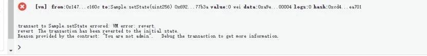

# Basic features of Solidity for writing smart contracts

Author: Chu Yuzhi ｜ FISCO BCOS Core Developer

As mentioned in the previous article, most of the current alliance chain platforms, including FISCO BCOS, use Solidity as a smart contract development language, so it is necessary to be familiar with and get started with Solidity。As a Turing-complete programming language designed for blockchain platforms, Solidity supports a variety of features such as function calls, modifiers, overloads, events, inheritance, etc., and has a wide range of influence and active community support in the blockchain community。But for those new to blockchain, Solidity is an unfamiliar language。The smart contract writing phase will start from the basic features, advanced features, design patterns and programming strategies of Solidity, taking readers to understand Solidity and master its application to better develop smart contracts。This article will focus on the basic features of Solidity, take you to develop a basic smart contract。

## Smart contract code structure

Any programming language has a canonical code structure that expresses how code is organized and written in a code file, as does Solidity。In this section, we'll look at the code structure of a smart contract through a simple contract example。

```
pragma solidity ^0.4.25;
contract Sample{
​
    //State variables
    address private _admin;
    uint private _state;
​
    //Modifier
    modifier onlyAdmin(){
        require(msg.sender == _admin, "You are not admin");      
        _;
    }
​
    //Events
    event SetState(uint value);
​
    //Constructor
    constructor() public{
        _admin = msg.sender;
    }
​
    //Functions
    function setState(uint value) public onlyAdmin{
        _state = value;
        emit SetState(value);
    }
​
    function getValue() public view returns (uint){
        return _state;
    }
​
}
```

The above procedure includes the following functions:

- Deploy contract via constructor
- Set contract status via setValue function
- Query contract status via getValue function

The entire contract is divided into the following components

- **State variable** - _ admin, _ state, these variables will be permanently saved, can also be modified by the function
- **Constructor** - Used to deploy and initialize contracts
- **Event** - SetState, function similar to log, record the occurrence of an event
- **Modifier** -onlyAdmin, used to add a layer to the function"coat"
- **Function** -setState, getState, for reading and writing state variables

The above components will be described one by one below。

### State variable

The state variable is the bone marrow of the contract, which records the business information of the contract。The user can modify these state variables through functions, and these modifications will also be included in the transaction；After the transaction is confirmed by the blockchain network, the modification becomes effective。

```
uint private _state;
```

State variables are declared as: [type] [access modifier - optional] [field name]

### Constructor

The constructor is used to initialize the contract, which allows the user to pass in some basic data and write it to the state variable。In the above example, the _ admin field is set as a prerequisite for the other functions shown later。

```
constructor() public{
    _admin = msg.sender;
} 
```

Unlike java, constructors do not support overloading and only one constructor can be specified。

### Function

function is used to read and write state variables。Modifications to variables will be included in the transaction and will not take effect until confirmed by the blockchain network。After taking effect, the changes will be permanently saved in the blockchain ledger。The function signature defines the function name, input and output parameters, access modifiers, and custom modifiers。

```
function setState(uint value) public onlyAdmin；
```

Functions can also return multiple return values:

```
function functionSample() public view returns(uint, uint){
    return (1,2);
}
```

In this contract, there is also a function with the view modifier。This view indicates that the function does not modify any state variables。Similar to view, there is the modifier pure, which indicates that the function is a pure function, even the state variables are not read, the operation of the function depends only on the parameters。

```
function add(uint a, uint b) public pure returns(uint){
    return a+b;
}
```

If you try to modify the state variable in the view function or access the state variable in the pure function, the compiler will report an error。

### Event

Events are similar to logs and are logged to the blockchain, and clients can subscribe to these events through web3。

#### Define events

```
event SetState(uint value);
```

#### Construct Event

```
emit SetState(value);
```

Here are a few points to note:

- The name of the event can be specified arbitrarily, not necessarily linked to the function name, but it is recommended to hook both in order to clearly express what happened

-When constructing an event, you can also not write emit, but because the event and the function are highly related in both name and parameter, it is easy to write the event as a function call by mistake, so it is not recommended。

```
function setState(uint value) public onlyAdmin{
    _state = value;
    //emit SetState(value);
    / / This can also be written, but it is not recommended, because it is easy to write setState by mistake
    SetState(value); 
}
```

- Solidity programming style should adopt certain specifications。View [Programming Style](https://learnblockchain.cn/docs/solidity/style-guide.html#id16)

### Modifier

Modifiers are a very important part of a contract。It hangs on the function declaration and provides some additional functionality for the function, such as checking, cleaning, etc。In this case, the modifier onlyAdmin requires that before the function is called, you need to check whether the caller of the function is the administrator set at the time of the function deployment(That is, the deployer of the contract)。

```
//Modifer
modifier onlyAdmin(){
    require(msg.sender == _admin, "You are not admin");      
    _;
}
​
...
//Functions
function setState(uint value) public onlyAdmin{
    ...
}
```

It is worth noting that the underscore "_" defined in the modifier indicates the call of the function and refers to the function modified by the developer with the modifier。In this case, the expression is the setState function call。

## Operation of Smart Contracts

Knowing the structure of the above smart contract example, you can run it directly, and there are many ways to run the contract, and you can take any one of them

-Method 1: You can use [FISCO BCOS Console](https://fisco-bcos-documentation.readthedocs.io/zh_CN/latest/docs/installation.html#id7)The way to deploy the contract

-Method 2: Use the online ide WEBASE-front run provided by the FISCO BCOS open source project WeBASE

- Method 3: Deploy and run the contract through the online ide remix, [remix address](http://remix.ethereum.org/)

This example uses remix as the running example。

### Compile

First, after typing the code in the file ide of remix, compile it through the compile button。A green check mark appears on the button after success:


### Deploy

After the compilation is successful, you can deploy the contract instance。


### setState

After the contract is deployed, we call setState(4)。Upon successful execution, a transaction receipt is generated containing the transaction execution information。


Here, the user can see the transaction execution status(status), Transaction Executor(from), transaction input and output(decoded input, decoded output)Transaction overhead(execution cost)and the transaction log(logs)。In logs, we see that the SetState event is thrown, and the parameter inside also records the value 4 passed in by the event。If we change the account to execute, the call will fail because the onlyAdmin modifier prevents the user from calling the。



### getState

After calling getState, you can directly see that the value obtained is 4, which is exactly the value we passed in by setState earlier:


## Solidity data type

In the previous example, we used data types such as uint。Due to the special design of the Solidity type, the data type of Solidity is also briefly introduced here。

### Integer series

Solidity provides a set of data types to represent integers, including unsigned integers and signed integers。Each type of integer can also be subdivided according to length, the specific subdivision type is as follows。

| Type| Length(Bit) | have symbols|
| ------- | -------- | ------ |
| uint    | 256      | 否|
| uint8   | 8        | 否|
| uint16  | 16       | 否|
| ...     | ...      | 否|
| uint256 | 256      | 否|
| int     | 256      | Yes|
| int8    | 8        | Yes|
| int16   | 16       | Yes|
| ...     | ...      | Yes|
| int256  | 256      | Yes|

### fixed length bytes series

Solidity provides the types bytes1 through bytes32, which are fixed-length byte arrays。Users can read the contents of fixed-length bytes。

```
    function bytesSample() public{
​
        bytes32 barray;
        //Initialize baarray
        //read brray[0]
        byte b = barray[0];
    }
```

Also, you can convert an integer type to bytes。

```
    uint256 s = 1;
    bytes32 b = bytes32(s);
```

Here is a key detail, Solidity takes the big endian encoding, the high address is stored in the small endian of the integer。For example, b [0] is the low address side, which stores the high side of the integer, so the value is 0；B [31] is 1。

```
    function bytesSample() public pure returns(byte, byte){
​
        uint256 value = 1;
        bytes32 b = bytes32(value);
        //Should be (0, 1)
        return (b[0], b[31]);
    }
```

### variable length bytes

From the above, the reader can understand the fixed-length byte array。In addition, Solidity provides a variable-length byte array: bytes。The use is similar to an array, which will be described later。

### string

The string provided by Solidity is essentially a string of UTF-8 encoded byte arrays, which is compatible with variable-length bytes。Currently Solidity has poor support for strings and no concept of characters。User can convert string to bytes。

```
    function stringSample() public view returns(bytes){
        string memory str = "abc";
        bytes memory b = bytes(str);
        //0x616263
        return b;
    }
```

Note that when converting string to bytes, the data content itself is not copied, as in the previous section, the str and b variables point to the same string abc。

### address

address represents the account address, which is indirectly generated by the private key and is a 20-byte data。Similarly, it can also be converted to bytes20。

```
    function addressSample() public view returns(bytes20){
​
        address me = msg.sender;
        bytes20 b = bytes20(me);
        return b;
    }
```

### mapping

Mapping represents mapping and is an extremely important data structure。There are several differences between it and the mapping in java:

-It cannot iterate keys because it only saves the hash of the key, not the key value. If you want to iterate, you can use the open source iterable hash class library
-If a key is not saved in mapping, the corresponding value can be read normally, but the value is null (all bytes are 0)。So it does not need to put, get and other operations, the user can directly operate it。

```
contract Sample{
​
    mapping(uint=>string) private values;
​
    function mappingSample() public view returns(bytes20){
        //put a key value pair
        values[10] = "hello";
​
        //read value
        string value = values[10];
​
    }
​
}
```

### array

If the array is a state variable, then operations such as push are supported:

```
contract Sample{
​
    string[] private arr;
​
    function arraySample() public view {
        arr.push("Hello");
        uint len = arr.length;//should be 1
        string value = arr[0];//should be Hello
      }
​
}
```

Arrays can also be used as local variables, but slightly differently:

```
function arraySample() public view returns(uint){
        //create an empty array of length 2
        uint[] memory p = new uint[](2);
        p[3] = 1;//THIS WILL THROW EXCEPTION 
        return p.length;
}
```

### struct

Solidity allows developers to customize structure objects。Structures can be stored as state variables or exist as local variables in functions。 

```
struct Person{
        uint age;
        string name;
    }
​
    Person private _person;
​
    function structExample() {
        Person memory p = Person(1, "alice");
        _person = p;
    }
```

This section only describes the more common data types, a more complete list can refer to the [Solidity official website](https://solidity.readthedocs.io/en/v0.6.3/types.html)。

#### global variable

In the constructor of the sample contract code, include msg.sender。It belongs to global variable。In smart contracts, global variables or global methods can be used to obtain some basic information about the current block and transaction, such as block height, block time, contract caller, etc。

The most commonly used global variable is the msg variable, which represents the calling context, and the common global variables are as follows

- **msg.sender**: the direct caller of the contract。

  Since it is a direct caller, when in user A->Contract 1->In the contract 2 call chain, if you use msg.sender in contract 2, you will get the address of contract 1。If you want to get user A, you can use tx.origin

- **tx.origin**： 交易的"Initiator"the starting point of the entire call chain。

- **msg.calldata**Contains complete call information, including function identifiers and parameters。The first 4 bytes of calldata are the function ID, which is the same as msg.sig。

- **msg.sig**The first 4 bytes of msg.calldata, used to identify the function。
- **block.number**: indicates the height of the current block。

- **now**Indicates the current timestamp。can also be represented by block.timestamp。

Only some common global variables are listed here, please refer to [Full Version](https://solidity.readthedocs.io/en/v0.4.24/units-and-global-variables.html)。

## Conclusion

This article introduces a simple example contract and introduces the basics of using Solidity to develop smart contracts。Readers can try to run the contract and feel the development of smart contracts。If you want to learn more about smart contract examples, recommend [official website](https://solidity.readthedocs.io/en/v0.6.2/solidity-by-example.html)Examples for readers to learn, or follow in a follow-up series on this topic。In the example of the official website, a number of cases such as voting, bidding, and micro-payment channels are provided, which are close to real life and are good learning materials。
