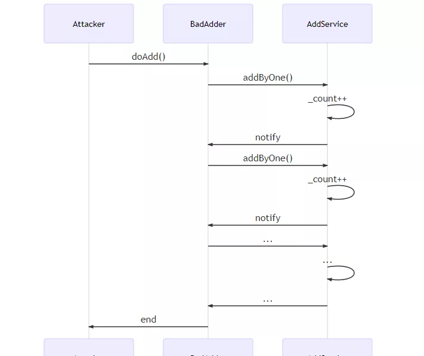

# Solidity design pattern for writing smart contracts

Author: Chu Yuzhi ｜ FISCO BCOS Core Developer

## Foreword

With the development of blockchain technology, more and more enterprises and individuals begin to combine blockchain with their own business。The unique advantages of blockchain, for example, data is open, transparent and immutable, which can facilitate business。But at the same time, there are some hidden dangers。The transparency of the data means that anyone can read it；Cannot be tampered with, meaning that information cannot be deleted once it is on the chain, and even the contract code cannot be changed。In addition, the openness of the contract, the callback mechanism, each of the characteristics can be used as an attack technique, a little careless, light contract is useless, heavy to face the risk of disclosure of corporate secrets。Therefore, before the business contract is put on the chain, the security and maintainability of the contract need to be fully considered in advance。Fortunately, through a lot of practice of Solidity language in recent years, developers continue to refine and summarize, has formed some"Design Pattern"To guide the daily development of common problems。

## Smart Contract Design Patterns Overview

In 2019, the IEEE included a paper from the University of Vienna entitled "Design Patterns For Smart Contracts In the Ethereum Ecosystem."。This paper analyzes the hot Solidity open source projects, combined with previous research results, sorted out 18 design patterns。These design patterns cover security, maintainability, lifecycle management, authentication, and more。

| Type| Mode|
| ------------------ | ------------------------------------------------------------ |
| Security           | 1. Checks-Effects-Interaction<br/>2. Emergency Stop<br/>3. Speed Bump<br/>4. Rate Limit<br/>5. Mutex<br/>6. Balance Limit |
| Maintenance         | 7. Data Segregation<br/>8. Satellite<br/>9. Contract Register<br/>10. Contract Relay |
| Lifecycle          | 11. Mortal<br/>12. Automatic Deprecation                     |
| Authorization      | 13. Ownership<br/>14. Access Restriction                     |
| Action And Control | 15. Pull Payment<br/>16. Commit And Reveal<br/>17. State Machine<br/>18. Oracle |

Next, this article will select the most common and common of these 18 design patterns, which have been extensively tested in actual development experience。

## Security(Security)

Smart contract writing, the primary consideration is security issues。In the blockchain world, there are countless malicious codes。If your contract contains cross-contract calls, be especially careful to verify that external calls are credible, especially if their logic is out of your control。If you're not defensive, those "malicious" external codes could ruin your contract。For example, external calls can cause code to be executed repeatedly through malicious callbacks, thus destroying the contract state, an attack known as Reentrance Attack。Here, a small experiment in reentry attacks is introduced to give the reader an understanding of why external calls can lead to contract breaches, while helping to better understand the two design patterns that will be introduced to improve contract security。

Here's a condensed example of a re-entry attack。The AddService contract is a simple counter, and each external contract can call addByOne of the AddService contract to increment the field _ count by one, while requiring each external contract to call the function at most once。In this way, the _ count field reflects exactly how many contracts AddService has been called by。At the end of the addByOne function, AddService calls the callback function notify for the external contract。The code for AddService is as follows:

```
contract AddService{

    uint private _count;
    mapping(address=>bool) private _adders;

    function addByOne() public {
        / / Mandatory that each address can only be called once
        require(_adders[msg.sender] == false, "You have added already");
        / / Count
        _count++;
        / / Call the callback function of the account
        AdderInterface adder = AdderInterface(msg.sender);
        adder.notify();
        / / Add the address to the called collection
        _adders[msg.sender] = true;   
    }
}

contract AdderInterface{
    function notify() public;  
}
```

If AddService is deployed as such, a malicious attacker can easily control the number of _ count in AddService, invalidating the counter altogether。The attacker only needs to deploy a contract BadAdder, which can be used to call AddService, which can achieve the attack effect。The BadAdder contract is as follows:

```

contract BadAdder is AdderInterface{

    AddService private _addService = //...;
    uint private _calls;

    / / callback
    function notify() public{
        if(_calls > 5){
            return;
        }
        _calls++;
        //Attention !!!!!!
        _addService.addByOne();
    }

    function doAdd() public{
        _addService.addByOne();    
    }
}
```

BadAdder in the callback function notify, in turn, continue to call AddService, due to AddService poor code design, require condition detection statement is easily bypassed, the attacker can directly hit the _ count field, so that it is arbitrarily repeatedly added。The timing diagram of the attack process is as follows:



In this example, AddService had difficulty knowing the caller's callback logic, but still trusted the external call, and the attacker took advantage of AddService's poor code arrangement, resulting in tragedy。In this example, the actual business significance is removed, and the only consequence of the attack is the distortion of the _ count value。Genuine re-entry attacks that can have serious business consequences。For example, in counting the number of votes, the number of votes will be changed beyond recognition。If you want to block this type of attack, the contract needs to follow a good coding pattern。

### Checks-Effects-Interaction - Ensure the status is complete before making external calls

This pattern is a coding style constraint that effectively avoids replay attacks。Typically, a function might have three parts:

-Checks: Parameter Validation
-Effects: Modify contract status
- Interaction: external interaction

This pattern requires contracts to organize code in the order Checks-Effects-Interaction。The advantage is that Checks-Effects has completed all the work related to the state of the contract itself before making the external call, making the state complete and logically self-consistent, so that the external call cannot be attacked with incomplete state。Review the previous AddService contract, did not follow this rule, in the case of its own state has not been updated to call the external code, the external code can naturally cross a knife, so that _ adders [msg.sender] = true permanently not called, thus invalidating the require statement。Let's review the original code in terms of checks-effects-interaction:

```
    //Checks
    require(_adders[msg.sender] == false, "You have added already");
    //Effects    
    _count++;
    //Interaction    
    AdderInterface adder = AdderInterface(msg.sender);
    adder.notify();
    //Effects
    _adders[msg.sender] = true;
```

With a slight adjustment of the order, satisfying the Checks-Effects-Interaction pattern, the tragedy is avoided:

```
    //Checks
    require(_adders[msg.sender] == false, "You have added already");
    //Effects    
    _count++;
    _adders[msg.sender] = true;
    //Interaction    
    AdderInterface adder = AdderInterface(msg.sender);
    adder.notify();
```

Since the _ adders mapping has been modified, when a malicious attacker wants to recursively call addByOne, the require line of defense will work to intercept the malicious call。Although this pattern is not the only way to resolve reentry attacks, it is still recommended that developers follow。

### Mutex - Prohibit Recursion

Mutex pattern is also an effective way to address re-entry attacks。It prevents the function from being called recursively by providing a simple modifier:

```
contract Mutex {
    bool locked;
    modifier noReentrancy() {
        / / Prevent recursion
        require(!locked, "Reentrancy detected");
        locked = true;
        _;
        locked = false;
    }

    / / Calling this function will throw a Reentry detected error
    function some() public noReentrancy{
        some();
    }
}
```

In this example, before calling the some function, the noReancy modifier is run to assign the locked variable to true。If some is called recursively at this point, the logic of the modifier is activated again, and the first line of code for the modifier throws an error because the locked property is already true。

## **Maintainability**

In blockchain, contracts cannot be changed once they are deployed。When a contract has a bug, you usually have to face the following problems:

1. How to deal with the business data already on the contract？
2. How to reduce the impact of the upgrade as much as possible, so that the rest of the functions are not affected？
3. What to do with other contracts that rely on it？

Reviewing object-oriented programming, the core idea is to separate the changing things from the unchanging things in order to block the spread of change in the system。As a result, well-designed code is usually organized to be highly modular, highly cohesive and low-coupling。Using this classic idea can solve the above problems。

### Data segregation - separation of data and logic

Before understanding the design pattern, take a look at the following contract code:

```
contract Computer{

    uint private _data;

    function setData(uint data) public {
        _data = data;
    }

    function compute() public view returns(uint){
        return _data * 10;
    }
}
```

This contract contains two capabilities, one is to store data(setData function)The other is the use of data for calculation(Compute function)。If the contract is deployed for a period of time and you find that the compute is incorrectly written, for example, you should not multiply by 10, but multiply by 20, it will lead to the question of how to upgrade the contract as described above。At this point, you can deploy a new contract and try to migrate the existing data to the new contract, but this is a heavy operation, on the one hand, to write the code of the migration tool, on the other hand, the original data is completely obsolete, empty of valuable node storage resources。

Therefore, it is necessary to be modular in advance when programming。If we will"Data"Seen as unchanging things, will"Logic"Seeing as something that can change, you can perfectly avoid the above problems。The Data Segregation (which means data separation) pattern is a good implementation of this idea。The model requires a business contract and a data contract: the data contract is only for data access, which is stable；Business contracts, on the other hand, perform logical operations through data contracts。

In conjunction with the previous example, we transfer data read and write operations specifically to a contract DataRepository

```
contract DataRepository{

    uint private _data;

    function setData(uint data) public {
        _data = data;
    }

    function getData() public view returns(uint){
        return _data;
    }
}
```

The calculation function is placed separately in a business contract:

```
contract Computer{
    DataRepository private _dataRepository;
    constructor(address addr){
        _dataRepository =DataRepository(addr);
    }

    / / Business code
    function compute() public view returns(uint){
        return _dataRepository.getData() * 10;
    }    
}
```

In this way, as long as the data contract is stable, the upgrade of the business contract is very lightweight。For example, when I want to replace Computer with ComputerV2, the original data can still be reused。

### Satellite - Decompose contract function

A complex contract usually consists of many functions, if these functions are all coupled in a contract, when a function needs to be updated, you have to deploy the entire contract, normal functions will be affected。The Satellite model addresses these issues using the single-duty principle, advocating the placement of contract subfunctions into subcontracts, with each subcontract (also known as a satellite contract) corresponding to only one function。When a sub-function needs to be modified, just create a new sub-contract and update its address to the main contract。

For a simple example, the setVariable function of the following contract is to calculate the input data (compute function) and store the calculation result in the contract state _ variable:

```
contract Base {
    uint public _variable;

    function setVariable(uint data) public {
        _variable = compute(data);
    }

    / / Calculation
    function compute(uint a) internal returns(uint){
        return a * 10;        
    }
}
```

After deployment, if you find that the compute function is incorrectly written and you want to multiply by a factor of 20, you must redeploy the entire contract。However, if you initially operate in Satellite mode, you only need to deploy the corresponding subcontract。

First, let's strip the compute function into a separate satellite contract:

```
contract Satellite {
    function compute(uint a) public returns(uint){
        return a * 10;        
    }
}
```

The main contract then relies on the subcontract to complete setVariable

```
contract Base {
    uint public _variable;

    function setVariable(uint data) public {
        _variable = _satellite.compute(data);
    }

     Satellite _satellite;
    / / Update sub-contract (satellite contract)
    function updateSatellite(address addr) public {
        _satellite = Satellite(addr);
    }
}
```

In this way, when we need to modify the compute function, we only need to deploy such a new contract and pass its address to Base.updateSatellite:

```
contract Satellite2{
    function compute(uint a) public returns(uint){
        return a * 20;        
    }    
}
```

### Contract Registry - Track Latest Contracts

In Satellite mode, if a primary contract depends on a subcontract, when the subcontract is upgraded, the primary contract needs to update the address reference to the subcontract, which is done through updateXXX, for example, the updateSatellite function described earlier。This type of interface is a maintainable interface and has nothing to do with the actual business. Too much exposure of this type of interface will affect the aesthetics of the main contract and greatly reduce the caller's experience。The Contract Registry design pattern elegantly solves this problem。In this design mode, there is a special contract Registry to track each upgrade of a subcontract, and the main contract can obtain the latest subcontract address by querying this Registyr contract。After the satellite contract is redeployed, the new address is updated via the Registry.update function。

```
contract Registry{

    address _current;
    address[] _previous;

    / / If the subcontract is upgraded, update the address through the update function
    function update(address newAddress) public{
        if(newAddress != _current){
            _previous.push(_current);
            _current = newAddress;
        }
    } 

    function getCurrent() public view returns(address){
        return _current;
    }
}
```

The main contract relies on Registry to get the latest satellite contract address。

```
contract Base {
    uint public _variable;

    function setVariable(uint data) public {
        Satellite satellite = Satellite(_registry.getCurrent());
        _variable = satellite.compute(data);
    }

    Registry private _registry = //...;
}
```

###  **Contract Relay - Agent invokes latest contract**

This design pattern solves the same problem as Contract Registry, i.e. the main contract can call the latest subcontract without exposing the maintenance interface。In this mode, there is a proxy contract, and the subcontract shares the same interface, responsible for passing the call request of the main contract to the real subcontract。After the satellite contract is redeployed, the new address is updated via the SatelliteProxy.update function。

```
contract SatelliteProxy{
    address _current;
    function compute(uint a) public returns(uint){
        Satellite satellite = Satellite(_current);   
        return satellite.compute(a);
    } 
    
    / / If the subcontract is upgraded, update the address through the update function
    function update(address newAddress) public{
        if(newAddress != _current){
            _current = newAddress;
        }
    }   
}


contract Satellite {
    function compute(uint a) public returns(uint){
        return a * 10;        
    }
}
```

The main contract depends on the SatelliteProxy:

```
contract Base {
    uint public _variable;

    function setVariable(uint data) public {
        _variable = _proxy.compute(data);
    }
    SatelliteProxy private _proxy = //...;
}
```


## (Lifecycle)

By default, the life of a contract is nearly infinite - unless the blockchain on which it depends is eliminated。But many times, users want to shorten the life of the contract。This section will introduce two simple patterns to end contract life early。

### Mortal - Allow contracts to self-destruct

There is a selfdestruct instruction in the bytecode to destroy the contract。So just expose the self-destruct interface:

```
contract Mortal{

    / / Self-destruct
    function destroy() public{
        selfdestruct(msg.sender);
    } 
}
```

### Automatic Deprecation - allows contracts to automatically stop services

If you want a contract to be out of service after a specified period without human intervention, you can use the Automatic Deprecation pattern。

```
contract AutoDeprecated{

    uint private _deadline;

    function setDeadline(uint time) public {
        _deadline = time;
    }

    modifier notExpired(){
        require(now <= _deadline);
        _;
    }

    function service() public notExpired{ 
        //some code    
    } 
}
```

When the user calls service, the notExpired modifier will first perform date detection, so that once a specific time has passed, the call will be intercepted at the notExpired layer due to expiration。

## Permissions (Authorization)

There are many administrative interfaces in the previous article, which can have serious consequences if they can be called by anyone, such as the self-destruct function above, which assumes that anyone can access it, and its severity is self-evident。Therefore, a set of permission control design patterns that ensure that only specific accounts can access is particularly important。

### Ownership

For permission control, you can use the ownership mode。This pattern guarantees that only the owner of the contract can call certain functions。First you need an Owned contract:

```
contract Owned{

    address public _owner;

    constructor() {
        _owner = msg.sender;
    }    

    modifier onlyOwner(){
        require(_owner == msg.sender);
        _;
    }
}
```

What if a business contract wants a function to be called only by the owner?？As follows:

```
contract Biz is Owned{
    function manage() public onlyOwner{
    }
}
```

Thus, when the manage function is called, the onlyOwner modifier runs first and detects whether the caller is consistent with the contract owner, thus intercepting unauthorized calls。

## Action and Control

These patterns are typically used in specific scenarios, and this section will focus on privacy-based coding patterns and design patterns for interacting with off-chain data。

### Commit-Reveal - Delay Secret Leak

On-chain data is open and transparent, once some private data on the chain, anyone can see, and can never withdraw。Commit And Reveal mode allows users to convert the data to be protected into unrecognizable data, such as a string of hash values, until a certain point to reveal the meaning of the hash value, revealing the true original value。In the voting scenario, for example, suppose that the voting content needs to be revealed after all participants have completed the voting to prevent participants from being affected by the number of votes during this period。We can look at the specific code used in this scenario:

```
contract CommitReveal {

    struct Commit {
        string choice; 
        string secret; 
        uint status;
    }

    mapping(address => mapping(bytes32 => Commit)) public userCommits;
    event LogCommit(bytes32, address);
    event LogReveal(bytes32, address, string, string);

    function commit(bytes32 commit) public {
        Commit storage userCommit = userCommits[msg.sender][commit];
        require(userCommit.status == 0);
        userCommit.status = 1; // committed
        emit LogCommit(commit, msg.sender);
    }

    function reveal(string choice, string secret, bytes32 commit) public {
        Commit storage userCommit = userCommits[msg.sender][commit];
        require(userCommit.status == 1);
        require(commit == keccak256(choice, secret));
        userCommit.choice = choice;
        userCommit.secret = secret;
        userCommit.status = 2;
        emit LogReveal(commit, msg.sender, choice, secret);
    }
}
```

### Oracle - Read Out-of-Chain Data

At present, the ecosystem of smart contracts on the chain is relatively closed, and it is impossible to obtain off-chain data, which affects the application scope of smart contracts。Off-chain data can greatly expand the use of smart contracts, such as in the insurance industry, where smart contracts can automatically execute claims if they can read unexpected events that occur in reality。Fetching external data is performed through an off-chain data layer called Oracle。When a business contract attempts to obtain external data, the query request is first placed in an Oracle-specific contract；Oracle listens to the contract, reads the query request, executes the query, and calls the business contract response interface to get the contract results。


The following defines an Oracle contract:

```
contract Oracle {
    address oracleSource = 0x123; // known source

    struct Request {
        bytes data;
        function(bytes memory) external callback;
}

    Request[] requests;
    event NewRequest(uint);
    modifier onlyByOracle() {
        require(msg.sender == oracleSource); _;
    }

    function query(bytes data, function(bytes memory) external callback) public {
        requests.push(Request(data, callback));
        emit NewRequest(requests.length - 1);
    }

    / / callback function, called by Oracle
    function reply(uint requestID, bytes response) public onlyByOracle() {
        requests[requestID].callback(response);
    }
}
```

Business-side contracts interact with Oracle contracts:

```
contract BizContract {
    Oracle _oracle;

    constructor(address oracle){
        _oracle = Oracle(oracle);
    }

    modifier onlyByOracle() {
        require(msg.sender == address(_oracle)); 
        _;
    }

    function updateExchangeRate() {
        _oracle.query("USD", this.oracleResponse);
    }

    / / callback function to read the response
    function oracleResponse(bytes response) onlyByOracle {
    // use the data
    }
}
```

## SUMMARY

This article covers a variety of design patterns such as security and maintainability, some of which are more principled, such as the Security and Maintenance design patterns；Some are partial practices, such as Authorization, Action And Control。These design patterns, especially practice classes, do not cover all scenarios。As you explore the actual business, you will encounter more and more specific scenarios and problems, and developers can refine and sublimate these patterns to precipitate design patterns for certain types of problems。The above design patterns are a powerful weapon for programmers, mastering them can deal with many known scenarios, but more should master the method of refining design patterns, so as to calmly deal with unknown areas, this process can not be separated from the in-depth exploration of the business, in-depth understanding of software engineering principles。