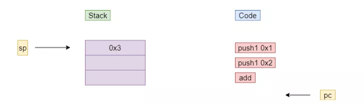
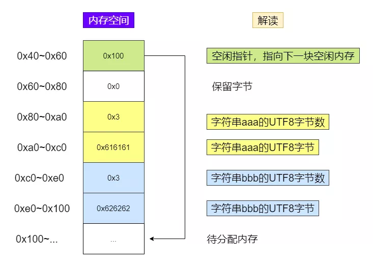

# Solidity Operation Principle of Smart Contract Writing

Author: Chu Yuzhi ｜ FISCO BCOS Core Developer

## Introduction

As a language for smart contracts, Solidity has both differences and similarities with other classic languages.。On the one hand, the properties that serve the blockchain make it different from other languages。For example, the deployment and invocation of contracts are confirmed by the blockchain network.；Execution costs need to be tightly controlled to prevent malicious code from consuming node resources。On the other hand, as a programming language, the implementation of Solidity does not deviate from the classical language, for example, Solidity contains a stack, heap-like design, the use of stacked virtual machines for bytecode processing.。The previous articles in this series have described how to develop Solidity programs, and in order to give readers a better understanding of why, this article will further introduce the inner workings of Solidity, focusing on the life cycle of Solidity programs and how EVM works.。

## Solidity Life Cycle

Like other languages, Solidity's code life cycle is inseparable from the four stages of compilation, deployment, execution, and destruction.。The following figure shows the complete life cycle of the Solidity program:


When compiled, the Solidity file generates bytecode。This is a kind of code similar to jvm bytecode。At deployment, the bytecode and construction parameters are built into a transaction, which is packaged into a block, which is passed through a network consensus process, and finally the contract is built on each block chain node and the contract address is returned to the user.。When the user is ready to call the function on the contract, the call request will also go through the process of transaction, block, consensus, and finally be executed by the EVM virtual machine on each node.。

Here is a sample program, we explore its life cycle through remix。

```
pragma solidity ^0.4.25;

contract Demo{
    uint private _state;
    constructor(uint state){
        _state = state;
    }
    function set(uint state) public {
        _state = state;
    }
}
```

### Compile

After the source code is compiled, you can get its binary through the ByteCode button:

```
608060405234801561001057600080fd5b506040516020806100ed83398101806040528101908080519060200190929190505050806000819055505060a4806100496000396000f300608060405260043610603f576000357c0100000000000000000000000000000000000000000000000000000000900463ffffffff16806360fe47b1146044575b600080fd5b348015604f57600080fd5b50606c60048036038101908080359060200190929190505050606e565b005b80600081905550505600a165627a7a723058204ed906444cc4c9aabd183c52b2d486dfc5dea9801260c337185dad20e11f811b0029
```

You can also get the corresponding bytecode (OpCode):

```
PUSH1 0x80 PUSH1 0x40 MSTORE CALLVALUE DUP1 ISZERO PUSH2 0x10 JUMPI PUSH1 0x0 DUP1 REVERT JUMPDEST POP PUSH1 0x40 MLOAD PUSH1 0x20 DUP1 PUSH2 0xED DUP4 CODECOPY DUP2 ADD DUP1 PUSH1 0x40 MSTORE DUP2 ADD SWAP1 DUP1 DUP1 MLOAD SWAP1 PUSH1 0x20 ADD SWAP1 SWAP3 SWAP2 SWAP1 POP POP POP DUP1 PUSH1 0x0 DUP2 SWAP1 SSTORE POP POP PUSH1 0xA4 DUP1 PUSH2 0x49 PUSH1 0x0 CODECOPY PUSH1 0x0 RETURN STOP PUSH1 0x80 PUSH1 0x40 MSTORE PUSH1 0x4 CALLDATASIZE LT PUSH1 0x3F JUMPI PUSH1 0x0 CALLDATALOAD PUSH29 0x100000000000000000000000000000000000000000000000000000000 SWAP1 DIV PUSH4 0xFFFFFFFF AND DUP1 PUSH4 0x60FE47B1 EQ PUSH1 0x44 JUMPI JUMPDEST PUSH1 0x0 DUP1 REVERT JUMPDEST CALLVALUE DUP1 ISZERO PUSH1 0x4F JUMPI PUSH1 0x0 DUP1 REVERT JUMPDEST POP PUSH1 0x6C PUSH1 0x4 DUP1 CALLDATASIZE SUB DUP2 ADD SWAP1 DUP1 DUP1 CALLDATALOAD SWAP1 PUSH1 0x20 ADD SWAP1 SWAP3 SWAP2 SWAP1 POP POP POP PUSH1 0x6E JUMP JUMPDEST STOP JUMPDEST DUP1 PUSH1 0x0 DUP2 SWAP1 SSTORE POP POP JUMP STOP LOG1 PUSH6 0x627A7A723058 KECCAK256 0x4e 0xd9 MOD DIFFICULTY 0x4c 0xc4 0xc9 0xaa 0xbd XOR EXTCODECOPY MSTORE 0xb2 0xd4 DUP7 0xdf 0xc5 0xde 0xa9 DUP1 SLT PUSH1 0xC3 CALLDATACOPY XOR 0x5d 0xad KECCAK256 0xe1 0x1f DUP2 SHL STOP 0x29 
```

The following instruction set is the code corresponding to the set function, which will be explained later on.。

```
JUMPDEST DUP1 PUSH1 0x0 DUP2 SWAP1 SSTORE POP POP JUMP STOP
```

### Deploy

After the compilation, you can deploy the code on remix and pass the construction parameters to 0x123.:


After the deployment is successful, you can get a transaction receipt:


Click on input to see the specific transaction input data.


In the above data, the yellow part happens to be the contract binary from the previous section.；The purple part, on the other hand, corresponds to the incoming construct parameter 0x123。These all suggest that contract deployments use transactions as a medium。Combined with blockchain transaction knowledge, we can restore the entire deployment process:

- Client will deploy the request(contract binary, construction parameters)as input data for the transaction to construct a transaction
- The transaction is rlp encoded and then signed by the sender with the private key
- Signed transactions are pushed to nodes on the blockchain
- After the blockchain node verifies the transaction, it is deposited into the transaction pool
- When it's the node's turn to block, package the transaction to build the block and broadcast it to other nodes.
- Other nodes verify blocks and achieve consensus。Different blockchains may use different consensus algorithms, and PBFT is used in FISCO BCOS to achieve consensus, which requires a three-stage submission (pre-prepare，prepare, commit）
- The node executes the transaction, as a result, the smart contract Demo is created, the storage space of the status field _ state is allocated, and is initialized to 0x123

### Execute

Depending on whether or not we have the modifier view, we can divide functions into two categories: calls and transactions.。Since it is determined at compile time that the call will not cause a change in the contract state, for such function calls, the node can directly provide a query without confirming with other blockchain nodes.。And because the transaction may cause a state change, it will be confirmed between networks.。The following will call set with the user.(0x10)For assumptions, look at the specific running process。First, the function set is not configured with the view / pure modifier, which means it may change the contract state。So this call information will be put into a transaction, through the transaction code, transaction signature, transaction push, transaction pool cache, packaging out of the block, network consensus and other processes, and finally handed over to the EVM of each node for execution.。In EVM, parameter 0xa is stored by SSTORE bytecode into contract field _ state。The bytecode first gets the address of the status field _ state and the new value 0xa from the stack, and then completes the actual storage。The following figure shows the running process:


Here is only a rough introduction to set(0xa)The next section will further introduce the working mechanism of EVM and the data storage mechanism.。

### Destruction

Since the contract cannot be tampered with once it is on the chain, the life of the contract can last until the underlying blockchain is completely shut down.。To manually destroy a contract, use the bytecode selfdestruct。Destruction contracts also require transaction confirmation and will not be repeated here.。

## Principle of EVM

In the previous article, we introduced how the Solidity program works.。After the transaction is confirmed, the bytecode is finally executed by the EVM.。For EVM, the above is just a passing note, and this section will detail its working mechanism.。

### Operation principle

An EVM is a stacked virtual machine whose core feature is that all operands are stored on the stack。Let's look at how it works through a simple piece of Solidity statement code.

```
uint a = 1;
uint b = 2;
uint c = a + b;
```

After this code is compiled, the resulting bytecode is as follows.

```
PUSH1 0x1
PUSH1 0x2
ADD
```

For the reader to better understand the concept, this is reduced to the above three statements, but the actual bytecode may be more complex and will be doped with statements such as SWAP and DUP.。We can see that in the above code, there are two instructions: PUSH1 and ADD, which have the following meanings:

- PUSH1: Push data to the top of the stack。
- ADD: POP two top stack elements, add them and press them back to the top of the stack。

The execution process is explained here in a semi-animated way.。In the following figure, sp represents the top of the stack pointer and pc represents the program counter.。After executing push1 0x1, both pc and sp move down:


Similarly, after executing push1 0x2, the pc and sp states are as follows:


Finally, when add is executed, both operands at the top of the stack are popped up as input to the add instruction, and the sum of the two is pushed onto the stack.




### Storage Exploration

During development, we often encounter confusing memory modifiers；When you read the open source code, you will also see various assembly operations directly against memory。Developers who do not understand the storage mechanism will be confused in these situations, so this section will explore the storage principles of EVM。In the previous article "[Basic Features of Solidity for Smart Contract Writing](http://mp.weixin.qq.com/s?__biz=MzA3MTI5Njg4Mw==&mid=2247485625&idx=1&sn=9af6032cbf0ad0a3f7f8b7e85faebc77&chksm=9f2efaa5a85973b3fb118b3f1a6e2cd6aef8c1852ee97e93d98afeae71975c3cffc24a0b28fd&scene=21#wechat_redirect)As we described in, a piece of Solidity code, which usually involves local variables, contract state variables。These variables are stored differently, and the following code shows the relationship between variables and how they are stored。

```
contract Demo{
    / / Status storage
    uint private _state;

    function set(uint state) public {
        / / Stack storage
        uint i = 0;
        / / memory storage
        string memory str = "aaa";
    }
}
```

#### Stack

The stack is used to store the operands of a bytecode instruction。In Solidity, local variables of types such as integers and fixed-length byte arrays are pushed into and out of the stack as instructions are run.。For example, in the following simple statement, the variable value 1 is read and pushed to the top of the stack by the PUSH operation:

```
uint i = 1;
```

For such variables, you cannot forcibly change how they are stored, and if you place the memory modifier before them, the compiler will report an error.。

#### Memory

Memory is similar to the heap in java, which is used to store"Object"。In Solidity programming, if a local variable is of a variable-length byte array, string, structure, etc., it is usually modified by the memory modifier to indicate that it is stored in memory.。

In this section, we will use strings as an example to analyze how memory stores these objects.。

##### 1. Object storage structure

The following will use the assembly statement to analyze the storage method of complex objects.。The assembly statement is used to invoke bytecode operations。The mload instruction will be used to call these bytecodes。mload(p)indicates that 32 bytes of data are read from address p。Developers can pass object variables directly into mload as pointers.。In the following code, after the mload call, the data variable holds the first 32 bytes of the string str in memory.。

```
string memory str = "aaa";
bytes32 data;
assembly{
    data := mload(str)
}  
```

Mastering mload, you can use this to analyze how string variables are stored.。The following code reveals how string data is stored:

```
function strStorage() public view returns(bytes32, bytes32){
    string memory str = "Hello";
    bytes32 data;
    bytes32 data2;
    assembly{
        data := mload(str)
        data2 := mload(add(str, 0x20))
    }   
    return (data, data2);
}
```

The data variable represents 0 to 31 bytes of str, and data2 represents 32 to 63 bytes of str.。The result of running the strStorage function is as follows:

```
0: bytes32: 0x0000000000000000000000000000000000000000000000000000000000000006
1: bytes32: 0xe4bda0e5a5bd0000000000000000000000000000000000000000000000000000
```

As you can see, the first data word gets a value of 6, which is exactly the string"Hello"Via UTF-8 Number of bytes after encoding。The second data word is saved as"Hello"UTF itself-8 Code。After mastering the storage format of strings, we can use assembly to modify, copy, and splice strings.。Readers can search Solidity's string library to learn how to implement string concat。

##### 2. Memory allocation method

Since memory is used to store objects, it necessarily involves how memory is allocated。The way memory is allocated is very simple, that is, sequential allocation.。Below we will assign two objects and look at their addresses:

```
function memAlloc() public view returns(bytes32, bytes32){
    string memory str = "aaa";
    string memory str2 = "bbb";
    bytes32 p1;
    bytes32 p2;
    assembly{
        p1 := str
        p2 := str2
    }   
    return (p1, p2);
}
```

After running this function, the return result will contain two data words:

```
0: bytes32: 0x0000000000000000000000000000000000000000000000000000000000000080
1: bytes32: 0x00000000000000000000000000000000000000000000000000000000000000c0
```

This means that the starting address of the first string str1 is 0x80 and the starting address of the second string str2 is 0xc0, between 64 bytes, which is exactly the space occupied by str1 itself.。The memory layout at this point is as follows, where one grid represents 32 bytes (a data word, and EVM uses 32 bytes as a data word instead of 4 bytes).



- 0x40 ~ 0x60: free pointer to save the available address, in this case 0x100, indicating that the new object will be allocated from 0x100。You can use mload.(0x40)Get the allocation address of the new object。
- 0x80 ~ 0xc0: Start address of object allocation。Here the string aaa is assigned
- 0xc0 ~ 0x100: The string bbb is allocated
- 0x100 ~...: Because it is sequential allocation, new objects will be allocated here.。

#### State Storage

As the name suggests, the state store is used to store the contract's state field。From the model, storage consists of multiple 32-byte storage slots。In the previous article, we introduced the set function of the Demo contract, where 0x0 represents the storage slot of the state variable _ state.。All fixed-length variables are placed sequentially into this set of slots。For mapping and arrays, the storage is more complicated. It occupies one slot and contains data that occupies other slots according to the corresponding rules. For example, in mapping, the storage slot of a data item is calculated by the key value k and the mapping's own slot p by keccak.。In terms of implementation, different chains may use different implementations, and the more classic is the MPT tree used by Ethereum.。Due to MPT tree performance, scalability and other issues, FISCO BCOS abandoned this structure, and adopted distributed storage, through rocksdb or mysql to store state data, so that the storage performance, scalability has been improved.。

## Conclusion

This article describes the operating principles of Solidity, which are summarized as follows。First, the Solidity source code is compiled into bytecode, and when deployed, the bytecode is confirmed across the network using the transaction as a carrier and a contract is formed on the node.；The contract function call, if it is a transaction type, is confirmed by the network and eventually executed by the EVM.。The EVM is a stacked virtual machine that reads the bytecode of the contract and executes the。During execution, it interacts with stack, memory, and contract storage。where the stack is used to store ordinary local variables, which are the operands of the bytecode；Memory is used to store objects, using length+body for storage, sequential allocation for memory allocation；State storage is used to store state variables。Understanding how Solidity works and the principles behind it is the only way to become a master of Solidity programming。