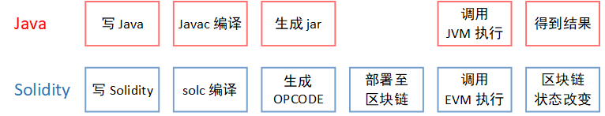
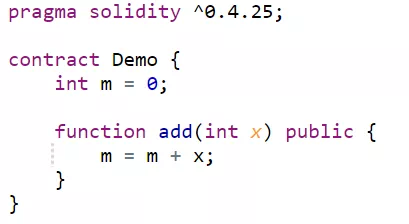
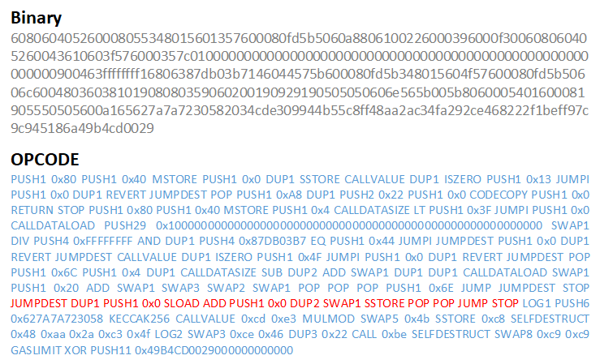
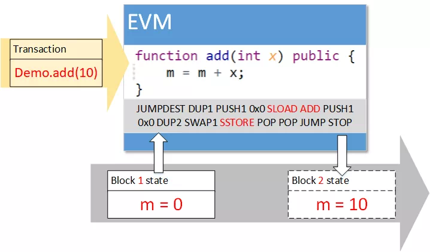

# Explain Solidity

Author ： SHI Xiang ｜ FISCO BCOS Core Developer

In the Bitcoin-only era, blockchain enabled simple value generation and transfer, but no more business models emerged。Ethereum has brought a dimensional improvement to the blockchain, blockchain-based applications are becoming more and more abundant, and various business models of blockchain are emerging at an accelerated pace。The reason for this is that Ethereum has brought a Turing-complete programming language to the blockchain。

The main function of the blockchain is to achieve consensus among multiple parties。In Bitcoin, the operations that require consensus are fixed and non-Turing complete。The consensus is only a change in the value owner。However, on Ethereum, developers can write their own logic that requires consensus, and Ethereum has customized the consensus logic through the smart contract language Solidity。 

## Introduction to Solidity

Solidity and Java have some similarities。Among the many programming languages, Java is the more mature。Java code is executed in the Java Virtual Machine (JVM)。The JVM masks operating system differences, making Java a cross-platform language。A set of Java code can be used on Windows, Linux, Mac, without worrying about operating system differences。

Solidity is similar to Java。After the code is written, you need to convert the code into binary through the compiler, which is Javac in Java and solc in Solidity。The generated binary code will be executed in the virtual machine。Java code is executed in the Java Virtual Machine (JVM), which in Solidity is a virtual machine EVM on the blockchain。

Solidity differs from Java in that Solidity is a language that serves the blockchain, and the code is executed on the blockchain。EVM is an executor on the blockchain。Each blockchain node has an EVM。After Solidity is executed in the EVM, the EVM makes changes to the blockchain's data。These data changes are referred to the consensus algorithm。At the same time, Solidity's operation is limited to the inside of EVM, and cannot access external uncertain systems or data, such as system clock, network file system, etc。

Solidity is designed to provide a unified set of logic for the blockchain, so that the same code runs on each node of the blockchain, and with the help of consensus algorithms, the blockchain data can be changed in a unified way to achieve globally consistent results。

## Solidity implementation details

Take the example of the Demo contract here, which has a global variable m and a function add(), to achieve the function of adding x values to the global variable m。

This contract can be compiled into binary by the contract compiler solc。Each word of binary (8 bit) represents an EVM opcode (OPCODE)。The binary compiled by the Demo contract and its corresponding OPCODE are as follows, which implements the functions of the complete Demo contract, including the loading of the contract, the invocation of the contract interface and the logic of exception handling。Among them, the red part is add()method implementation。

Add()function of the OPCODE**Red part**Excerpt, you can see that its specific implementation idea is the same as assembly code, is a stack-based operation。The SLOAD reads the data at the specified position on the blockchain into the top of the stack, ADD adds the two data at the top of the stack, and SSTORE writes the result of the addition to the top of the stack into the data of the next block of the blockchain to prepare for the consensus of the next block。

After the contract binary is deployed on the blockchain, the method in the contract is called by sending a transaction。The node loads the contract code into the EVM based on the transaction and executes the corresponding function add on the contract based on the transfer of the transaction()。

The EVM executes the contract code, reads the data of the current block from the blockchain, performs the addition operation, and writes the result to the state data corresponding to the next block (the block waiting for consensus)。 

After that, the consensus algorithm drops the block consensus to be executed, the block height increases, and the data on the blockchain is updated。

As can be seen from the above steps, the implementation of Solidity has many similarities to existing practices today。Compile, using traditional routines that convert code into binary executable by a virtual machine；execution, also in the same way as the traditional way, executing binary code with the stack as a buffer。

## Solidity Limitations and Improvements

Solidity is the first smart contract language to be applied on a large scale, and there are some areas for improvement。

**Solidity is not flexible enough。**The Solidity language is limited by its own stack depth, and the total number of function parameters and local parameters cannot exceed 16。To implement some more complex functions, it is inevitable that some chicken ribs。Solidity is a strongly typed language, but its type conversion is more troublesome。When converting an integer to a string, it needs to be converted to binary and then spliced。On string manipulation, some convenient functions are missing。

**Poor performance of Solidity。**In execution, the execution of OPCODE is an assembly executor simulated by a program, rather than directly using CPU resources。In terms of storage, Solidity's underlying storage unit is 32 bytes (256 bits), which requires high hard disk read and write requirements, wasting a lot of storage resources。

**In response to the above two points, FISCO BCOS provides a C++How to write a contract: precompiled contract。Developers can use C++Write the smart contract logic and build it into the node。**

The precompiled contract is called in the same way as the Solidity contract, and can be called directly from the contract address。FISCO BCOS provides parameter parsing to resolve the parameters of the call to C++Recognizable format。

Precompiled contracts break through the limitations of the Solidity language, with the help of the powerful C++Language, can be flexible to achieve a variety of logic, flexibility is greatly improved。Meanwhile, c++The performance advantages of the are also well utilized, and the logic written through precompiled contracts is improved compared to the Solidity language。

