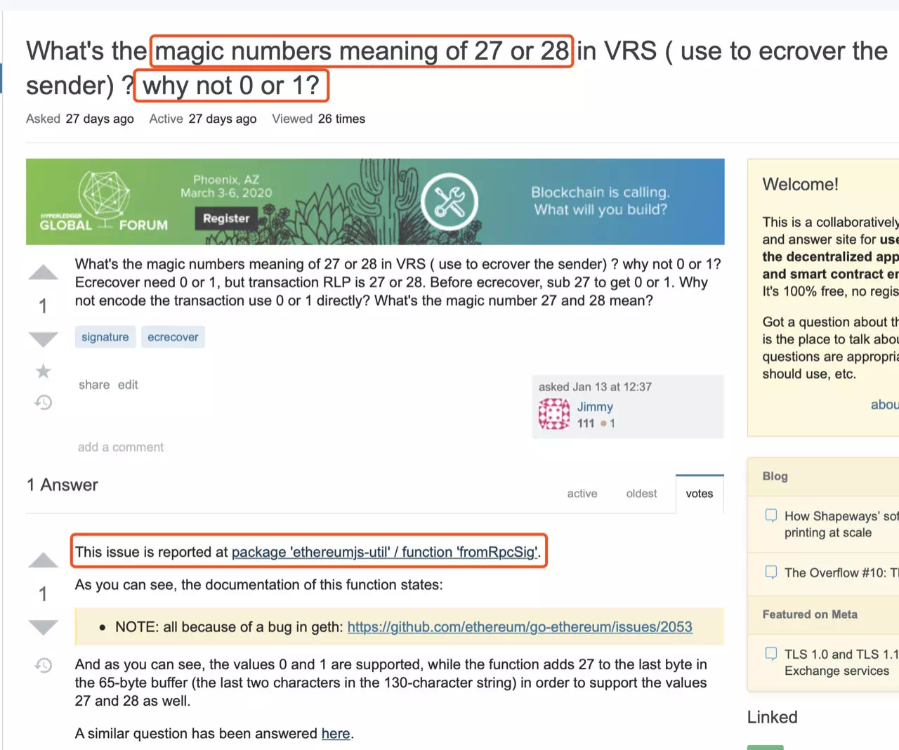
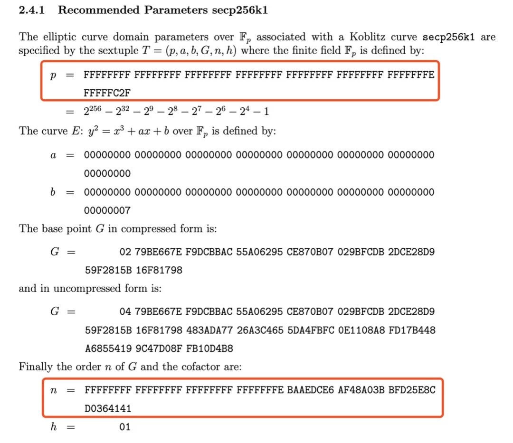

# An Exploration Caused by a Number - - Analysis of ECDSA

Author ： LI Hui-zhong ｜ Senior Architect, FISCO BCOS

The FISCO BCOS transaction signature algorithm is designed based on the ECDSA principle, which is also the transaction signature algorithm used by Bitcoin and Ethereum。This paper introduces the knowledge of ECDSA and Elliptic Curve Encryption (ECC), the Recover mechanism and implementation of ECDSA, and the underlying principles of FISCO BCOS transaction signing and verification。Content hard (shu) core (xue), welcome developers interested in cryptography principles, blockchain underlying principles to share。

## STORY BEGINS

The story starts with a magic number in Ethereum。

In the Ethereum Yellow Book, the description of transaction signatures talks about two special numbers "27, 28," which actually evolve from "0, 1" by adding a 27 to get "27, 28," so it is essentially a special number 27。What does this particular number 27 mean?？A detective journey begins..

## **It's like a bug**

The search found that there had been many previous discussions about the issue, including a Stack Exchange post stating that it was a design bug。There is also a related issue on the Ethereum source code github, which is labeled "type:The bug label。

There is a link in the Stack Exchange post that gives the code to fix the bug, see screenshot below (red box)。As can be seen in the comments and code, the fromRpcSig function has a special treatment for the magic number 27。In the signature from RPC, if the v value is less than 27 (possibly 0-3), then 27 is added directly as the new v value, and the fromRpcSig function is compatible with the original v value of ECDSA (that is, recoveryID) and the Ethereum v value in this way。

Is this really a bug designed by Ethereum？Back to the source code file of fromRpcSig just now, looking at the implementation of each interface in detail, we found that there is such a line of code "v: chainId ? recovery + (chainId * 2 + 35) : recovery + 27, "the code assigned by this line v reveals three messages, magic number 27, magic number 35, and ChainID。

So, more questions, what is the magic number 35？What is ChainID?？

## It's not like a bug

With these questions in mind, once again reviewing the relevant design materials, we see that the design of ChainID is described in Ethereum EIP155。In order to prevent the transaction of one chain from being submitted to another chain and causing replay attack, the design of ChainID is introduced, and the fork implementation is carried out at the position of block height 2,675,000。

Understand the role of ChainID, another question arises - in Ethereum, there is NetworkID to distinguish between different networks, why do you need ChainID？This is explained from the scope of NetworkID and ChainID。NetworkID is mainly used to isolate the chain at the network level. Nodes need to exchange NetworkID when they are connected to each other. Only when they have the same NetworkID can they complete the handshake connection。ChainID is the transaction layer that prevents transactions across different networks from being cross-duplicated。The main network NetworkID of Ethereum (ETH) and Classic Ethereum (ETC) is 1, and the ChainID mechanism is required to prevent cross-replay of transactions between ETH and ETC networks. The ChainID of the ETH main network is 1, and the ChainID of the ETC main network is 61。At this point, I still don't understand why it's 27 and why it's 35？Our Issue at EIP github#Seeing the exchange record of Jan and Buterin in 155, it seems that 27 is a product from Bitcoin。

Go along and open the github of the electric, we find the following code in the electric / electric / ecc.py

As can be seen from the code, when signing, electric adds 27 to the recid (recoveryID) that was originally only between 0 and 3, and a compression mark, plus 4 if there is compression, and the value of recid ranges from 27 to 34。So far, 27 and 35 probably come from this, Ethereum inherited the design of Bitcoin, in the Bitcoin source code Bitcoin / src / key.cpp CKey::The implementation is also determined in the SignCompact function, but why Bitcoin is designed this way is still unknown。

## **ECDSA is a bug**

At this point in the story, we have a general understanding of the past lives of the magic number 27 in the Ethereum code, but this is only the beginning of the story, which leads us to think further about the question: what is recoveryID?？In order to explain this problem, we need to start with the ECDSA algorithm and understand the principles behind it mathematically。ECDSA is the transaction signature algorithm used by FISCO BCOS, from which we will find that the ECDSA algorithm has a Recover mechanism, which is the real "bug" level function。

ECDSA (Elliptic Curve Digital Signature Algorithm) is a digital signature algorithm based on elliptic curves。Digital signature algorithm is the use of public and private key system similar to the ordinary signature written on paper, used to identify digital information methods, common digital signature algorithms include DSA, RSA and ECDSA。Elliptic curve cryptography (ECC) is a public key encryption algorithm based on elliptic curve mathematics, based on the elliptic curve discrete logarithm difficult problem, commonly used protocols such as ECDH, ECDSA and ECIES。The parameters of elliptic curves can be configured in a variety of ways, and there are many different curves, such as secp256k1, secp256r1, Curve25519, etc. There are some differences in the security of different curves, which are described in SafeCurves。

ECDSA algorithm mainly includes the following four key functions:

### Generate Key GenKey

- Select an elliptic curve E _ P(a,b), select the base point G, the order of G is n
- Select the random number d ∈ n as the private key and calculate the public key Q = d ⋅ G

### Signature Algorithm Sign

- Use the message digest algorithm for message m to get z = hash(m)
- Generate random numbers k ∈ n, calculate points(x, y)=k⋅G
- Take r = x mod n and reselect the random number k if r = 0
- Calculate s = k ^ − 1(z+rd) mod n, reselect the random number k if s = 0
- Above(r,s)Sign for ECDSA

### Validation Algorithm Verify

Using the public key Q and the message m, sign the(r,s)Perform validation。

- verify r, s ∈ n
- Calculate z = hash(m)
- Calculate u _ 1 = zs ^ − 1 mod n and u _ 2 = rs ^ − 1 mod n
- Calculation(x, y) = u1⋅G+u2⋅Q mod n
- Determine r = = x, if equal, the signature verification is successful

### Recovery Algorithm Recover

known message m and signature(r,s)recovery calculates the public key Q。

- verify r, s ∈ n
- Calculate R =(x, y)where x = r, r+n,r+2n..., substituted into the elliptic curve equation to obtain R
- Calculate z = hash(m)
- calculate u _ 1 = − zr ^ − 1 mod n and u _ 2 = sr ^ − 1 mod n
- Compute public key Q =(x’, y’)=u_1⋅G+u_2⋅R

To answer the question of recoveryID, we focus on "Recovery Algorithm Recover"。In the step of calculating R, we can see that there are multiple possibilities for the value of x, resulting in the possibility of multiple R, so there are also multiple possible results for the calculated Q, which needs to be compared with the known public key to determine which Q is correct。If the correct Q is not found throughout all of x, the message does not correspond to the signature, or is an unknown public key。

In order to determine the correct Q, you need to traverse all possible values of x and run multiple rounds of the Recover algorithm, which is expensive。**In order to improve the time efficiency of Recover, the idea of space-for-time is used to add a v value to the signature to quickly determine x and avoid traversal search heuristics, which is the recoveryID。**

In a blockchain system, the client signs each transaction and the node verifies the transaction signature。If the "verification algorithm is used," the node must first know the public key corresponding to the transaction, so it needs to carry the public key in each transaction, which requires a lot of bandwidth and storage。If you use the "Recover algorithm" and carry the recoveryID in the generated signature, you can quickly recover the public key corresponding to the transaction, calculate the user address based on the public key, and then perform the corresponding operation in the user address space。

A blockchain design philosophy is hidden here, the resources (assets, contracts) on the blockchain belong to a user, if you can construct a signature that matches the user's address, it is equivalent to mastering the user's private key, so the node does not need to determine the user's public key in advance, only from the signature to recover the public key, and then calculate the user address, you can perform the corresponding operation of the user address space。**FISCO BCOS designs and implements transaction signatures and checks based on this principle**。

## **Calculation of recoveryID**

Article on JavaSDK Performance Optimization ([Remember the Process of Improving JavaSDK Performance from 8000 to 30000](http://mp.weixin.qq.com/s?__biz=MzA3MTI5Njg4Mw==&mid=2247485438&idx=1&sn=2d68d0f051dd42a0c68dc9da39538ea9&chksm=9f2ef5e2a8597cf4a96620f95b16b734b0efd55d7463c4d0bf04b46b51acce4cf68794a480af&scene=21#wechat_redirect)) mentioned a key optimization point - the calculation of recoveryID, which is discussed carefully here。

ECDSA signature (r, s), where r is a point kG on an elliptic curve(x, y)The corresponding x mod n, which is equivalent to leaving only the X-axis coordinate-related values in the signature information and discarding the Y-axis-related values。In "Recovery Algorithm Recover," try to retrieve the value corresponding to the Y-axis to construct R, and then recover the public key。

Since r = x mod n, r, r+n,r+2n... may be a legal original x value, different elliptic curves have different numbers of such legal x values, FISCO BCOS uses secp256k1 curve there are two possible r, r+n。

Each X-axis coordinate corresponds to two possible Y-coordinates, so there are four possible Rs in FISCO BCOS(r, y) (r, -y) (r+n, y’) (r+n, -y’)。However, the probability of two X-axis coordinates for an r value is extremely low, so low that it can be ignored. These two small probability events are ignored in Ethereum。

How small is the probability of this small probability event?？This starts with the parameters of the secp256k1 curve, usually describing the points of an elliptic curve (x, y), the values of x and y are the result of mod p, p is the parameter of the curve, it is a large prime number, the previously mentioned n is also the parameter of the curve, equal to the number of points on the curve (the number of points on the curve is n*h, h is also a curve parameter, the curve h = 1), in secp256k1, the values of n and p are very close, as shown in the figure below。

Since r = x mod n, x is the result of mod p, r is the result of mod n, the range of x values is [0, p-1], and the range of r values is [0, n-1]。if r+n is also a point on the curve, then the value of r must be less than p-n with a probability of(p-n) / p, approximately 3.73*10 ^ -39, this probability is very small。

Based on the signature result (r, s) and the y value of the random point (x, y) generated during the signature process, recoveryID is calculated as follows:

1. id = y & 1;  / / The y coordinate of the kG point in the "Signature Algorithm Sign," the id value is set according to the parity, because y is the result of mod p, and its parity corresponds exactly to the positive and negative of the coordinate axis
2. id |= (x != r ? 2 : 0);  / / Small probability events, as explained earlier
3. if (s > n / 2) id = id ^ 1;  / / If the s calculated by the signature is greater than n / 2, it will take n-s as the value of s, so the corresponding conversion is done here, and the two conversions occur at the same time

[JavaSDK Performance Optimization](http://mp.weixin.qq.com/s?__biz=MzA3MTI5Njg4Mw==&mid=2247485438&idx=1&sn=2d68d0f051dd42a0c68dc9da39538ea9&chksm=9f2ef5e2a8597cf4a96620f95b16b734b0efd55d7463c4d0bf04b46b51acce4cf68794a480af&scene=21#wechat_redirect)The article is based on this calculation formula, the traversal search recoveryID to calculate to obtain, greatly improve the performance。

## Afterword

Start with a magical number, access relevant information, understand the design principles, and then break into the world of ECDSA, confused and wandering in a bunch of mathematical formulas, problem after problem。At first, I looked at the flowers in the fog, like I didn't understand them, and by virtue of Virgo's cleanliness, I finally resolved my doubts one by one。Exquisite cryptographic protocols, inscrutable mathematical theories, and a lot to learn as a blockchain code farmer。Only bitter its heart, its bones and muscles, treat every doubt, do not let go of every detail。There will come a day when the clouds will be lifted to see the sun, and the clouds will be kept to see the moon。

------

#### References

- [Ethereum yellow paper](https://ethereum.github.io/yellowpaper/paper.pdf)
- [Stack Exchange](https://ethereum.stackexchange.com/questions/78929/whats-the-magic-numbers-meaning-of-27-or-28-in-vrs-use-to-ecrover-the-sender/78930?newreg=a613981e27424bc4b1c2c0e00d939327)
- [ISSUE](https://github.com/ethereum/go-ethereum/issues/2053)
- [EIP155](https://github.com/ethereum/EIPs/blob/master/EIPS/eip-155.md)
- [EIP155 Issue](https://github.com/ethereum/eips/issues/155)
- [ChainID](https://chainid.network)
- [ECC wiki](https://en.wikipedia.org/wiki/Elliptic-curve_cryptography)
- [ECDSA wiki](https://en.wikipedia.org/wiki/Elliptic_Curve_Digital_Signature_Algorithm)
- [Curve25519 wiki](https://en.wikipedia.org/wiki/Curve25519)
- [SafeCurves](https://safecurves.cr.yp.to/index.html)
- [ECC SEC1](http://www.secg.org/sec1-v2.pdf)
- [ECC SEC2](https://www.secg.org/sec2-v2.pdf)

