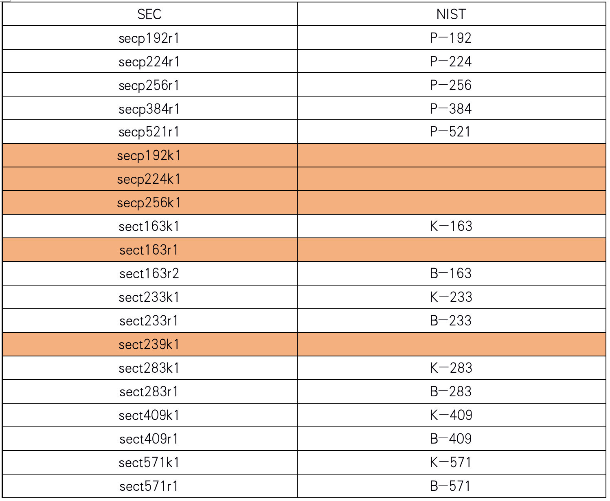
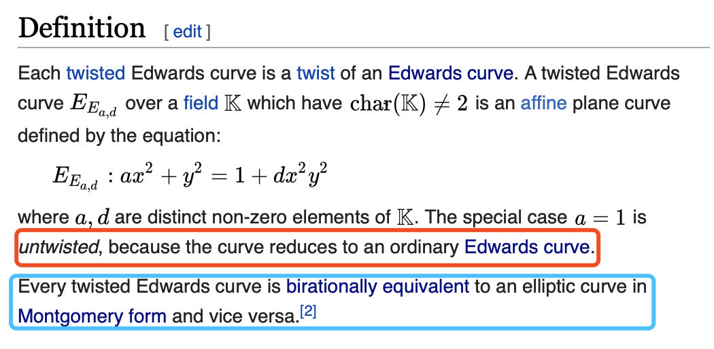
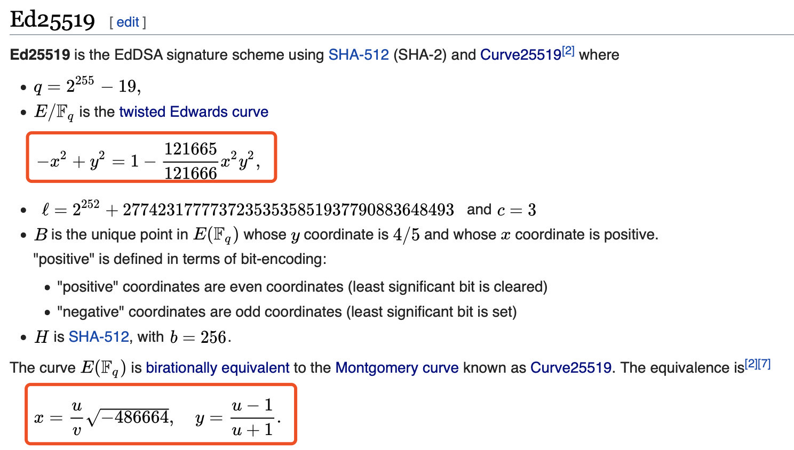

# A Journey to Seek the Roots and Ancestors of Elliptic Curves

Author ： LI Hui-zhong ｜ Senior Architect, FISCO BCOS

This paper introduces the common elliptic curves in cryptography and the relationship between them, introduces the naming rules of different standard systems, and attempts to describe the family relationship between elliptic curves.。The article attempts to clarify the elliptic curve related concepts and functions, does not involve complex mathematical proof and reasoning, welcome interested students to read。The author mainly refers to Wikipedia and related organizations to organize the information on the website, do not rule out the possibility of mistakes, welcome experts to criticize and correct。

## A question you may not have cared about.

In [A Number-Triggered Exploration - ECDSA Analysis](http://mp.weixin.qq.com/s?__biz=MzA3MTI5Njg4Mw==&mid=2247485497&idx=1&sn=44ac5977abbf92bd81e9013433a59f69&chksm=9f2efa25a8597333575c8bf0642c2e312e54d23867644021c9b2e353963d405e1d945e2a067d&scene=21#wechat_redirect)The elliptic curve secp256k1 mentioned in, it has some characteristics that can quickly calculate the recoveryID。Why is this secp256k1 so named？Not afraid of your jokes, I often misspelled it before figuring it out, writing sec256pk1, seck256p1, etc.。

## Bite the word secp256k1

To figure out the meaning of the name secp256k1 is actually very simple, search engines can quickly locate the answer for you, it comes from a password protocol standard, each letter and number represents a specific meaning, let's parse one by one。

### 1 、 Cryptographic Protocol Standards

The first part is "sec," short for Standards for Efficient Cryptography, a cryptographic protocol standard published by SECG.。SECG published "SEC 1" and "SEC 2" two elliptic curve protocol standards, in "SEC 2" in detail secp256k1 and other curve parameter definition。In addition to "sec," there are many other protocol standards for elliptic curves. From "SafeCurve," you can see that there are the following different types of standards。

"SafeCurve" has not been updated for a long time, and some standards have been updated many times. For example, NIST's standard FIPS 186 on digital signatures is currently in use in the fourth edition, and the fifth edition is also being drafted.。NIST is the National Institute of Standards and Technology in the United States, so NIST's standards are also American standards.。

「NIST FIPS 186-4 "standard defines several elliptic curve standards, such as NIST P-256、NIST P-384, etc., where the beginning NIST also represents the name of the cryptographic protocol standard。Subsequent descriptions are based on these two criteria.。

### 2. Finite field

The second part is "p," where p indicates that the elliptic curve is based on a prime finite field Fp.。A finite field is a concept in discrete mathematics, which is not expanded here; in simple terms, it is a set of a finite number of elements that can be added and multiplied with some unique properties.。Elliptic curves used in cryptography are based on finite fields, and in addition to the prime finite field Fp, there is another finite field F2m with a characteristic of 2 (due to format problems, 2m should be 2 to the power of m, the same below), Fp's size (number of elements) is p, F2m's size is 2m.。The elliptic curve based on Fp is:

The elliptic curve based on F2m is:

The sect163k1, sect163r1, etc. curves are also defined in "SEC 2," where t indicates that the curve is based on F2m。in "NIST FIPS 186-4 "in the set p-256、B-163 equal curve, P-representation based on Fp, B-Representation based on F2m。

### 3. Finite field size

Each elliptic curve E has a number of key parameters, including the base point G of order n and the coefficient h, where n is a large prime number, n*h is the number of points on the elliptic curve。For computational efficiency considerations, h is usually set to 1, 2, or 4。In layman's terms, the more points on an elliptic curve, the more secure that elliptic curve is, so the value of n is the key to affecting the safety of the curve。Elliptic curves are based on finite fields, and the points on the curve are elements of the finite field, so the size of the finite field determines the safety of the curve.。The third part "256" is a representation of the finite field size, and there are many more such as 192, 224, 384, etc., in "NIST FIPS 186."-4 "There is a table showing the different size configurations of Fp and F2m domains.。

The SEC standard in this setting is similar to the NIST standard, and we will see that the p-series curves have p192, p224, p256 (secp256k1 is one of them), p384, and p521, and the t / B series has t163 / B-163、t233/B-233 et al.。

### 4、Koblitz Curve

The fourth part "k" indicates that the curve is a Koblitz Curve, and from "SEC 2" you can see that there are also curves marked here as r (e.g. secp256r1), r indicates that the curve is a pseudo-random curve Pesudo.-Random Curve。The name Koblitz Curve is derived from the mathematician "Neal Koblitz," which is a special kind of curve, some of its parameters are carefully selected and set。Koblitz Curve has the property of self-homomorphism, which can greatly improve the computational efficiency through optimization.。In contrast, Pesudo-The corresponding parameters of Random Curve are calculated by random seeds, and there are standard test algorithms that can detect that all parameters are generated by random seeds.。corresponds to "**2. Finite field**"The two elliptic curves in the Koblitz Curve are reduced to

For example, secp256k1 corresponds to curve b = 7, which is represented as

in "NIST FIPS 186-4 "in the Koblitz Curve curve with" K "-"Mark the beginning, respectively, with K-163、K-233 et al.。

### **5. Last Mark**

To the fifth part "1," which represents the first four conditions to provide a variety of recommended parameter settings, in the SEC standard most of the bit is 1, that is, only one recommended parameter, sect163r2 is an exception.。Below, the curves recommended by the SEC and NIST standards are listed separately, and the larger part of the two are the same parameter settings.。

In the above table, both SEC and NIST appear in the same row, and although the two curves have different names, they have exactly the same parameters, which means they are actually the same.。Several SEC curves with orange shading do not have corresponding NIST curves, so the SEC standard contains more curves than NIST, and the secp256k1 mentioned at the beginning of this article is the SEC alone.。Speaking of which, I have to mention a serious gossip.。It is said that NIST recommended Pesudo-Random Curve, also known as the P and B series, does not publish random number selection rules, there is a suspicion that the NSA (National Security Agency) may have a backdoor and can easily crack these cryptographic protocols。Interested students can search for "Dual _ EC _ DRBG backdoor," the bigger gossip is that it is said that Satoshi Nakamoto chose secp256k1 as the curve of the Bitcoin signature algorithm instead of the more commonly used secp256r1, also because of this hidden risk.。

## **elliptic curve family spectrum**

The research found that "STD" records more detailed standards and curves than "SafeCurve," which feels like an elliptic curve family tree.。Looking through all the curves recorded by the site, it is found that most of them are still based on the curves in the "(2) finite domain," and the recommended parameters are different.。However, there are several exceptions in "other," E-222 with Edward Curve, Curve25519 with Montgomery Curve, Ed448 with Twisted Edward Curve。

What is Edward Curve?？What is Montgomery Curve?？What does Edward have to do with Twisted Edward Curve?？The above problem once again touched my knowledge blind spot, so the next had to take screenshots mainly, the content from Wikipedia, if you feel a little dizzy, you can directly skip to see the conclusion。Edward Curve is defined as follows:

"Montgomery Curve" is defined as follows:

"Twisted Edward Curve" is defined as follows:

"Curve25519" is defined as follows:

"Ed25519" is defined as follows:

According to Wikipedia, you can probably put together a few pieces of information:

The Edward Curve is a Twisted Edward Curve
2. Twisted Edward Curve and Montgomery Curve can be converted to each other
3. Both Edward Curve and Montgomery Curve have special properties, such as the ability to speed up calculations
Curve25519 is a curve, Ed25519 is a signature algorithm.
5. Curve25519 is also the selected Montgomery Curve, with higher computational efficiency
6. The curves used by Curve25519 and Ed25519 are consistent, one is the Montgomery representation and the other is the Twisted Edward Curve representation.
7. The name of 25519 comes from the finite field parameter p-2255 of the curve.- 19

In the process of reading Wikipedia found a name "Weierstrass equation," it turns out that it is the originator of these curves, in a domain k on any plane curve, can be expressed as Weierstrass equation。

It is not difficult to find that each of the formulas mentioned above is an evolutionary version of Weierstrass equation (Twisted Edward Curve doesn't seem to be, but it can be converted to Montgomery Curve, essentially the same).。

"STD" lists a number of other standards, such as Brainpool curve series, BN curve series, MNT curve series, etc., behind these series represent a unique curve generation philosophy, or in order to provide verifiable random numbers, or in order to provide the characteristics of Paring, or in order to improve the ability to resist attack, etc., each carefully selected parameter is a group of mathematicians The design of。

## **Afterword**

In ancient times, there were words to be interpreted, and the mystery of Chinese characters was revealed, which revealed the natural mechanism of life.；Now bite the words, find out the ellipse principle, uncover the curve family tree。Start with the name, decode secp256k1, clarify the standard；Finally name, ask Zu Weierstrass, pay tribute to the great god。

By understanding the intrinsic relationship between elliptic curves, a little more understanding of their design。Know more, don't know more, what is the mathematical principle of those special curves？Why higher computational efficiency？How much performance can be improved？... It's another late night, embracing the latest gains and mingling more confusion。The computer is playing "Cut off too fine nerves, will you sleep better..."

------

#### References

- [SEC1](https://www.secg.org/sec1-v2.pdf)
- [SEC2](https://www.secg.org/sec2-v2.pdf)
- [NIST](https://nvlpubs.nist.gov/nistpubs/FIPS/NIST.FIPS.186-4.pdf)
- [STD](https://neuromancer.sk/std/)
- [SafeCurves](https://safecurves.cr.yp.to)
- [Koblitz Curves](https://link.springer.com/content/pdf/10.1007%2F3-540-46766-1_22.pdf)
- [Weierstrass Equation](https://www.lmfdb.org/knowledge/show/ec.weierstrass_coeffs)
- [Montgomery Curve wiki](https://en.wikipedia.org/wiki/Montgomery_curve)
- [Twisted Edward Curve wiki](https://en.wikipedia.org/wiki/Twisted_Edwards_curve)
- [Edward Curve wiki](https://en.wikipedia.org/wiki/Twisted_Edwards_curve)
- [ECDSA wiki](https://en.wikipedia.org/wiki/EdDSA#Ed25519)
- [Curve25519 wiki](https://en.wikipedia.org/wiki/Curve25519)
- [Curve25519 paper](http://cr.yp.to/ecdh/curve25519-20060209.pdf)
- [Ed25519 paper](http://ed25519.cr.yp.to/ed25519-20110926.pdf)

