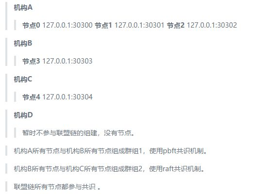

# FISCO BCOS State Secret Edition Deployment Example

Author: Liu Haifeng ｜ FISCO BCOS Open Source Community Contributor

As the underlying technology of blockchain continues to receive attention, more and more projects are using blockchain to solidify data。Recently, due to work needs, compared a number of domestic blockchain products, the actual deployment of several blockchain systems, and finally chose FISCO BCOS。In the actual deployment process, I have summarized this set of deployment processes that can be used in actual projects for reference by blockchain enthusiasts。

## Design a set of scenarios that cover actual project usage

When I decided to use FISCO BCOS, in order to cover the actual project usage as much as possible, I designed a set of scenarios, which contained most of the actual situation, and encountered a pit to fill the pit, and finally deployed successfully according to the designed scenario。Here is the scenario I designed:

1. Assume that multiple agencies form a coalition and that each agency sends a representative to the coalition committee(In this test networking deployment, it is assumed that there are four ABCD agencies)。

2. The alliance decided to use the state secret FISCO BCOS to form an alliance chain。

3. The alliance committee determines the alliance chain networking mode(The number of nodes, node distribution, group composition and information exchange methods are mainly confirmed)。

In this test, different ports of the same server are used to simulate different nodes, and copy instructions are used to simulate information exchange(The actual deployment can be delivered through the trust of alliance members such as U disk, mail, network message transmission, etc), the networking mode assumes the following



4. The alliance committee provides the chain certificate of the alliance chain(Self-built or apply to CA, this test is self-built using the enterprise deployment tool provided by FISCO BCOS)。

5. Each institution of the Alliance applies to the Alliance Committee for the institution certificate of the corresponding institution(This test was built using the enterprise-class deployment tools provided by FISCO BCOS)。

6. Each organization of the alliance, according to the alliance chain networking mode determined by the alliance committee, uses the enterprise deployment tool provided by FISCO BCOS to generate the node deployment program under the organization, and modifies the configuration file of the corresponding node deployment program according to the networking mode。

7. All agencies of the alliance deploy and start the subordinate node program to form the alliance chain。

8. Networking changes:

- Institution A thinks that it has too many subordinate nodes and consumes resources. It is ready to remove node 2 from group 1 and become a free node. It does not participate in consensus。At the same time, in order to improve the efficiency of business processing, node 1 is set as an observation node and does not participate in consensus。

- Institution D wants to join group 2 and add Institution D subordinate nodes:


- Institution D and Institution B want to form a new group with node 3 and node 5: Group 3。

9. Institution A and Institution D submit an application for network change to the Alliance Committee。

10. The Alliance Committee agrees to the network change application of Agency A and Agency D。

11. Institution A starts network change operation:

- Organization A or B of Group 1 uses the console or SDK to send instructions for node 2 to exit and node 1 to convert to an observation node based on the organization A's network change request approved by the Alliance Committee to complete the organization A's network change request。

12. Organization D starts network change operation:

- In step 5, institution D has applied to the Alliance Committee for institution D's institution certificate. Now, institution D uses the enterprise deployment tool provided by FISCO BCOS to generate the node deployment program under institution D. According to the new networking mode, modify the configuration file of the node deployment program, start the node, and prepare to join the alliance chain。

- Institution D sends a node 5 access request to Institution B or C in Group 2, and waits for Institution B or C to use the console or SDK to send an instruction for Node 5 to join Group 2 consensus。

- Institution B or C uses the console or sdk to send a consensus order for node 5 to join group 2 based on the organization D network change application approved by the Alliance Committee。

- Agency D and Agency B form Group 3 based on the Group 3 networking change application agreed by the Alliance Committee。

13 and ended。

## Deployment Alliance Chain Preparation

FISCO BCOS provides an enterprise-class deployment tool for deploying and using the alliance chain in real projects, which contains the various operations required to deploy the alliance chain。Alliance committees can use enterprise-level deployment tools to generate self-built chain certificates and issue self-built institution certificates to alliance member institutions. Alliance member institutions can use enterprise-level deployment tools to generate creation blocks of groups and node deployment procedures of institutions。

This test simulates the actual build process of the alliance chain and tests the deployment directory(Linux)For: / usr / local / rc3-test-BCOS /, hereinafter referred to as the directory rc3-test-BCOS。

- Environment requirements: python 2.7+/3.6+，openssl 1.0.2k+。

- Get the enterprise deployment tool: git clone https:/ / github.com / FISCO-BCOS / generator.git。

```eval_rst
.. note::
    -If you cannot download the enterprise deployment tool for a long time due to network problems, please try 'git clone https://gitee.com/FISCO-BCOS/generator.git`
```

- Upload the generator(or direct clone)is / usr / local / rc3-test-BCOS / generator /, hereinafter referred to as the directory generator。

- Ensure the operation permission of the generator: chmod -R 777 / usr / local / rc3-test-BCOS / generator /

- Install Enterprise Deployment Tools(Be sure to install correctly)：

```
	cd generator
  ./scripts/install.sh
  
  #View version:
  ./generator -v
  > INFO | v1.0.0-rc3
```

- Download the state secret version of FISCO BCOS:

```
	cd generator
  ./generator --download_fisco ./meta -g
```

The -g parameter indicates the national secret. If the -g parameter is removed, the normal FISCO BCOS is downloaded. After the command is executed, the national secret FISCO BCOS is downloaded to the generator / meta /。

- View State Secret FISCO BCOS version:

```
cd generator
./meta/fisco-bcos -v
```

```
> FISCO-BCOS Version : 2.0.0-rc3 gm
> Build Time              : 20190613 15:24:38
> Build Type              : Linux/clang/RelWithDebInfo
> Git Branch              : master
> Git Commit Hash      : a43952c544aa8252f7ac965e310148c099510410
```

As you can see, this test deployment uses the 'v1.0.0-rc3' version of the enterprise deployment tool, and the '2.0.0-rc3 gm' version of the FISCO BCOS(Seems to be the same as the deployment process for the rc2 version)。

## Certificate Description

Two sets of chain certificates and agency certificates are required for the FISCO BCOS State Secret Edition, namely the State Secret Certificate and the General Edition Certificate。

- Certificate chain:

```
> chain certificate - authority certificate - node certificate
>
> chain certificate - authority certificate - sdk certificate
```

- Certificates can be self-built and applied by CA companies. The enterprise deployment tool uses the 'openssl' tool to generate the certificate. If you want to use the certificate applied by CA companies, you can directly change the name of the certificate file to the specified name。
- Chain certificate common version 'ca.crt', corresponding to the private key 'ca.key'。Chain certificate national secret version 'gmca.crt', corresponding to the private key 'gmca.key'。
- The common version of the institution certificate 'agency.crt', the corresponding private key 'agency.key', the national version of the institution certificate 'gmagency.crt', the corresponding private key 'gmagency.key'。
-Note: The private key of the chain certificate needs to be kept by the Alliance Committee, and the private key of the agency certificate is kept by each agency, and the meaning of the certificate and private key is not extended here。
-When using FISCO BCOS enterprise-level deployment tool, all operations that require certificates need to combine chain certificates and agency certificates(.crt files)placed under 'generator / meta /'。

## Detailed steps to deploy the federation chain (with code for each step)

After trying, I performed the following sequence of operations and successfully deployed a federation chain that met the above scenario description。Because the steps are very detailed and contain a lot of code, they are placed separately in the link here: ["Hands-on Deploy FISCO BCOS Alliance Chain"](https://blog.csdn.net/FISCO_BCOS/article/details/95496272)(Warm Tip: This article is attached to each step of the code demonstration, copy the link to the PC side to open the experience is better。）

## Key Steps Summary

1. Alliance Committee and relevant members determine the networking mode；
2. Issuance of relevant certificates；
3. Prepare FISCO BCOS Enterprise Deployment Tool；
4. According to the networking mode, each organization collects the p2p connection information of the subordinate nodes of the group to be formed；
5. Each group generates and distributes Genesis blocks(File)；
6. Each organization generates node deployment procedures for adding points under the organization；
7. Each organization modifies the configuration file in the subordinate node deployment program according to the networking mode and starts the alliance chain。

## Write at the end

At this point, the deployment process for the actual project is complete。At the beginning of the deployment, I felt that the deployment of the entire system was very complicated. After many deployments, I felt that the process was quite reasonable and clear, because in the actual scenario, not one person was operating, but the entire alliance was working together, and it was actually very fast to deploy according to the organization form that the alliance chain should have. I also summed up some experience in many deployments:

-The first is to read more official technical documents and sort out the general process。
-The second is to solve the problem of certificates, which is like a throat for me. In actual business, certificates must be legally valid and issued by CA。I think the generation of certificates can be considered separate from the enterprise deployment tool as a tool for building test chains。Of course, in practice, if you don't pay attention to the legal effects of the data, you can also treat the certificate as just an encrypted public-private key pair。
-FISCO BCOS is currently in the stage of rapid iterative development, and some of the features introduced are very good, such as the blockchain browser。
- Adapt to the blockchain middleware platform WeBASE that supports the underlying platform of FISCO BCOS. It has comprehensive functions, is fast to get started, and saves a lot of time。

Overall FISCO BCOS experience is very good, looking forward to see more FISCO BCOS breakthrough。