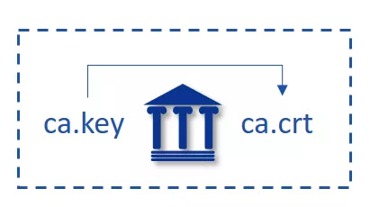

# FISCO BCOS Certificate Description

Author ： LI Hao Xuan ｜ FISCO BCOS Core Developer

alliance chain, multi-party participation on the chain is a collaborative relationship；The alliance chain is open to authorized organizations or institutions, with access mechanisms。In the admission mechanism, the certificate is an important credential for the parties to authenticate each other.；So to speak,**Certificate mechanism is the cornerstone of alliance chain network security**。

## Part1: FISCO BCOS Certificate Structure

FISCO BCOS network adopts CA-oriented access mechanism, uses the certificate format of x509 protocol, supports any multi-level certificate structure, and ensures information confidentiality, authentication, integrity and non-repudiation.。According to existing business scenarios, FISCO BCOS adopts a three-level certificate structure by default, with chain certificates, agency certificates, and node certificates from top to bottom.。


▲ Figure: Certificate format of x509 protocol

The certificate content includes the certificate version number, serial number, certificate signing algorithm, message digest algorithm and other generation information.；It also includes information such as the issuer, validity period, user, public key information, and cipher suites required for SSL communication.。The node loads the certificate and, when receiving the packet, verifies the certificate carried in the packet according to the cipher suite specified in the certificate and its message fields.。

## Part2: Role Definition

There are four roles in the certificate structure of FISCO BCOS, namely, the consortium chain committee, the consortium chain member body, and the consortium chain participant (node and SDK).。

### 1. Alliance Chain Committee

The affiliate chain committee has the root certificate of the affiliate chain, ca.crt, and the private key, ca.key. By using ca.key to issue the certificate to the affiliate chain member institutions, the affiliate chain committee is responsible for the admission and removal of the affiliate chain member institutions.。

### 2. Alliance chain member institutions

Alliance chain member institutions are those that have been approved by the Alliance Chain Committee to join the Alliance Chain.。Consortium chain member institutions have the institution private key agency.key and the institution certificate agency.crt issued by the root private key ca.key.。Alliance chain member organizations can issue node certificates through the private key of the organization, so as to configure the nodes and SDKs of the organization.。

### 3. Alliance Chain Participants

Consortium participants can interact with each other through running nodes or SDK Consortium. They have the node certificate node.crt and the private key node.key that communicate with other nodes.。When a federation chain participant runs a node or SDK, the root certificate ca.crt, the corresponding node certificate node.crt, and the private key node.key must be loaded.；Use pre-loaded certificates for authentication when communicating with other members。

## Part3: Certificate Generation Process

### 1. The Alliance Chain Committee initializes the root certificate ca.crt.

- locally generated private key ca.key；Self-signed root certificate generation ca.crt。



### 2. Alliance chain member institutions obtain institutional certificates agency.crt

- Locally generated private key agency.key；
- Generate the certificate request file agency.csr from the local private key；
- Send the certificate request file agency.csr to the federation chain committee；
- The consortium chain committee uses ca.key to issue the certificate request file agency.csr to obtain the certificate agency.crt of the consortium chain member body.；
- The consortium chain committee sends the consortium chain member body certificate agency.crt to the corresponding member。


### 3. The node / SDK obtains the certificate node.crt


- Locally generated private key node.key；

- Generate certificate request file node.csr from local private key；

- Send the certificate request file node.csr to the federated chain member；

- Alliance chain member organizations use agency.key to issue the certificate request file node.csr to obtain the node / SDK certificate node.crt；

- The consortium chain member organization sends the node certificate node.crt to the corresponding entity.。

  

▲ Figure: Description of node private key

## Part4: Certificate Generation Instance

Take the generation of the consortium chain member institution certificate as an example:

1. The institution first uses the institution's private key agency.key locally to generate the certificate request file agency.csr.；

```
openssl req -new -sha256 -subj "/CN=$name/O=fisco-bcos/OU=agency" -key ./agency.key -config ./cert.cnf -out ./agency.csr
```

2. The Alliance Chain Committee generates the certificate agency.crt from the certificate request file.；

```
openssl x509 -req -days 3650 -sha256 -CA ./ca.crt -CAkey ./ca.key -CAcreateserial -in ./agency.csr -out ./agency.crt  -extensions v4_req -extfile ./cert.cnf
```

cert.cnf in the above process is a certificate information configuration item, which can be set by default。

## Part5: Summary and Reference Documents

This paper introduces the relevant certificate description and its corresponding hierarchical architecture adopted by FISCO BCOS.；In a follow-up article, we'll explain how to use these digital certificates during the SSL handshake.。 

------

#### References

- [Certificate Description](https://fisco-bcos-documentation.readthedocs.io/zh_CN/latest/docs/manual/certificates.html)
- [Permission Control](https://fisco-bcos-documentation.readthedocs.io/zh_CN/latest/docs/manual/permission_control.html)
- [Node Admission](https://fisco-bcos-documentation.readthedocs.io/zh_CN/latest/docs/manual/node_management.html)

