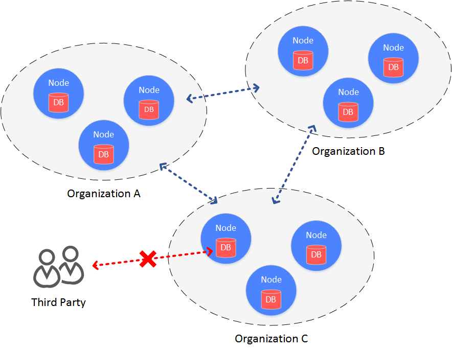
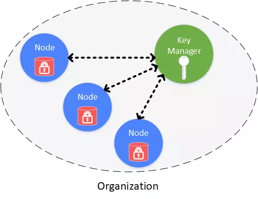

# FISCO BCOS DROP ENCRYPTION

Author ： SHI Xiang ｜ FISCO BCOS Core Developer

Blockchain deployment involves multiple parties. To simplify the construction of a multi-party collaboration environment, a public cloud is usually used to deploy blockchain.。Organizations deploy their own nodes to the cloud, allowing services to interact with nodes on the cloud to achieve multi-party collaboration.。In this architecture, security within the institution is high, especially in financial institutions。
Although the nodes are restricted to the "intranet" through the network isolation mechanism, data cannot be easily stolen through the network, but all data is hosted on the cloud, because all participants will save a copy of the data, in the network and system security measures There are omissions or improper operation and other extreme circumstances, there may be a data access situation。
In order to prevent data disks from being breached or stolen and avoid data leakage, FISCO BCOS introduces the function of "disk encryption."。

## Background Architecture

In the architecture of the alliance chain, a blockchain is built between institutions, and data is visible within each institution of the alliance chain.。
In some scenarios with high data security requirements, members within the alliance do not want organizations outside the alliance to have access to data on the alliance chain。At this point, you need to access the data on the federation chain.。

Access control for federated chain data is divided into two main areas.

- Access control of communication data on the chain
- Access Control of Node Storage Data

For access control of on-chain communication data, FISCO BCOS is done through node certificates and SSL.。This section focuses on access control for node storage data, i.e., drop disk encryption。



## main idea

Falling disk encryption is performed inside the institution。In the organization's intranet environment, each organization independently encrypts the hard drive data of the node。
When the hard disk of the machine where the node is located is taken away from the organization and the node is started on a network outside the organization's intranet, the hard disk data cannot be decrypted, the node cannot be started, and thus the data on the alliance chain cannot be stolen.。

## Programme architecture



Drop-disk encryption is performed within the organization, and each organization independently manages the security of its own hard drive data。In the intranet, the hard drive data of each node is encrypted。Access to all encrypted data, managed through Key Manager。
Key Manager is deployed in the organization's intranet and is a service dedicated to managing node hard disk data access keys.。When a node in the intranet is started, it obtains the access key for the encrypted data from the Key Manager to access its own encrypted data.。

Cryptographically protected objects include:

- Database stored locally on the node: rocksdb or leveldb
- Node private key: node.key, gmnode.key

## realization principle

The specific implementation process is accomplished through the dataKey held by the node itself and the global superKey managed by the Key Manager.。

### Node

- The node uses its own dataKey to encrypt and decrypt its own encrypted data (Encrypted Space).。
- The node itself does not store the dataKey on the local disk, but stores the encrypted cipherDataKey of the dataKey.。
- When the node is started, request the cipherDataKey from the Key Manager to obtain the dataKey。
- The dataKey is only in the node's memory. When the node is closed, the dataKey is automatically discarded.。

### Key Manager

Holds the global superKey, which is responsible for responding to authorization requests when all nodes are started.。

- Key Manager must be online at node startup to respond to node startup requests。
- When the node is started, the cipherDataKey is sent. The key manager decrypts the cipherDataKey with the superKey. If the decryption is successful, the node's dataK is returned to the node。
- Key Manager can only be accessed from the intranet. Key Manager cannot be accessed from the intranet outside the organization.。


## Related Operations

### Key Manager Actions

Start a key on each institution-The manger program is started with the following command, specifying the Key Manager:

```
# Parameters: port, superkey
./key-manager 31443 123xyz
```

### node operation

#### (1) Configure a new node dataKey

```
# Parameters: Key Manager IP, port, dataKey
bash key-manager/scripts/gen_data_secure_key.sh 127.0.0.1 31443 12345
```

Obtain the cipherDataKey. The script automatically prints the ini configuration required for disk encryption.(如下)。The cipherDataKey of the node is obtained: cipher _ data _ key = ed157f4588b86d61a2e1745efe71e6ea。

```
[storage_security]
enable=true
key_manager_ip=127.0.0.1
key_manager_port=31443
cipher_data_key=ed157f4588b86d61a2e1745efe71e6ea
```

Write the resulting encrypted ini configuration to the node configuration file (config.ini).。

#### (2) Encrypt the private key of the new node

Execute the script to encrypt the node private key:

```
# Parameter: ip port node private key file cipherDataKey
bash key-manager/scripts/encrypt_node_key.sh 127.0.0.1 31443 
nodes/127.0.0.1/node_127.0.0.1_0/conf/node.key 
ed157f4588b86d61a2e1745efe71e6ea
```

After execution, the node private key is automatically encrypted, and the file before encryption is backed up to the file node.key.bak.xxxxxx, please keep the backup private key and delete the backup private key generated on the node。

**注意**：

The state secret version needs to encrypt one more file than the non-state secret version:

- Non-state secret version: conf / node.key
- State secret version: conf / gmnode.key and conf / origin _ cert / node.key

#### (3) Start node

Start the node directly。If the hard disk where this node is located is taken out of the data center (intranet), Key Manager cannot be accessed。The node cannot get its own dataKey, cannot decrypt the hard disk data, and cannot decrypt its own private key, so it cannot start。

## Precautions

- Key Manager is a demo version. Currently, the superkey is specified at startup through the command line. In practical applications, you need to customize the way to load the superkey according to the security requirements, such as using an encryption machine to manage it.。
- Disk encryption is configured only for newly generated nodes. Once a node is started, it cannot be converted to a node with disk encryption.。
- The state secret version encrypts one more private key than the non-state secret version.。

------

#### Reference Links

[Key Manager source code](https://github.com/FISCO-BCOS/key-manager)

[Key Manager source gitee address](https://gitee.com/FISCO-BCOS/key-manager)
