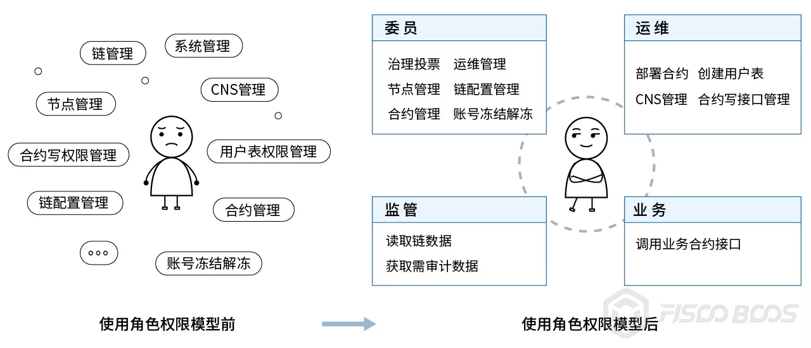

# The Implementation of Role Permission Model in FISCO BCOS

Author ： Bai Xingqiang ｜ FISCO BCOS Core Developer

## Introduction

The permission control of FISCO BCOS is realized by controlling the account's write permission to the table in the system。This permission control model is very flexible and powerful, and users can control almost any permission, for example, by controlling the write permission management of the permission table to assign permissions；By controlling the write permission management chain configuration, node identity management, contract deployment, user table creation, etc. of the table corresponding to the system contract；Manage the call of the contract write interface by controlling the write permission of the contract table。

However, absolute perfection does not exist。Powerful and flexible permission control also brings high learning costs: users need to understand the content of each permission item control and how to set it up, understand the difference between chain administrators and system administrators... A large number of concepts and operations are extremely demanding on users。

In order to reduce the difficulty of use and improve the user experience, FISCO BCOS v2.5 has optimized this function and added role-based permission control。Attributing different permissions to different roles, users can determine the permissions they have based on the roles to which the account belongs。At the same time, v2.5 introduces a role-based on-chain governance voting model to make governance operations more convenient。

## What is the role permission model？

After using the role permission model, users only need to remember the role, and the permissions corresponding to the role are self-evident, for example, the governance committee members have chain governance-related permissions, which greatly reduces the difficulty of user understanding and learning costs。



### Permissions corresponding to roles

Participants on the blockchain can be divided into governance, operation and maintenance, regulatory and business parties according to their roles。In order to avoid being both a referee and an athlete, the governance and operation and maintenance parties should be separated from each other's responsibilities and roles should be mutually exclusive。

- Governance side: the role is called the governance committee member, referred to as the member, responsible for blockchain governance。
- Operation and maintenance side: responsible for blockchain operation and maintenance, this role is added by the committee。
- Business side: The business side account is added to a contract by O & M, and the write interface of the contract can be called。
- Regulator: Regulator monitors the operation of the chain and can obtain records of changes in permissions and data to be audited during the chain operation。

The permissions corresponding to each role are shown in the following table。


### Details of Role Permissions Implementation

This section will briefly introduce the details of the implementation of permissions for members, operations and business roles, as well as the principles behind them, in order to better understand and use the role permissions feature。

There is no member account at the beginning of the chain, and when there is at least one member account, the rights of the member begin to be controlled。In the practical application of the alliance chain, the technical strength of multiple participants may not be the same, from the practical application scenario, we introduced the on-chain governance voting model, all governance operations require the number of valid votes / members>The effective threshold can only take effect. Users can add or delete members, modify weights, and modify the effective threshold of voting through the new chain governance precompiled contract。

There are several points worth noting about the voting model:

- Each voting operation, if it is a member vote, record the operation content and voting members, do not repeat the vote count
-For each voting operation, after the counting of votes, the number of valid votes / members is calculated. If it is greater than the effective threshold of this operation, the corresponding operation will take effect
- Vote set expiration time, according to the block height, blockLimit 10 times, fixed can not be changed

The addition and revocation of the operation and maintenance role must be operated by the member role。There is no O & M account at the beginning of the chain. When at least one O & M account exists, the permissions of O & M are controlled。The business account can call the query interface on the chain and the write interface of the specified contract for operation and maintenance。

### Compatibility Description

Currently, the role permission model is based on write permission control for various types of tables in the system。We have done our best to keep the same experience as the previous version, but for the sake of complete and strict permission control, the new chain of FISCO BCOS v2.5, the console grantPermissionManager command is no longer valid, the original PermissionManager permissions belong to the role of the committee。For pre-v2.5 chains, the directive is still valid。

## How to use role permissions？

This section will take "committee member addition and deletion" and "operation and maintenance addition and deletion" as examples for a brief practical demonstration, the document contains a richer role permissions related operations, welcome to move to [view](https://fisco-bcos-documentation.readthedocs.io/zh_CN/latest/docs/manual/permission_control.html)。

### Add and delete members

Use the get _ account.sh script included in console v1.0.10 or later to generate the following three accounts。After configuring the console, use the console's -pem option to load 3 private keys to start 3 consoles。

```
# Account number 10x61d88abf7ce4a7f8479cff9cc1422bef2dac9b9a.pem# Account number 20x85961172229aec21694d742a5bd577bedffcfec3.pem# Account number 30x0b6f526d797425540ea70becd7adac7d50f4a7c0.pem
```

#### Add account 1 as a member

Additional members require a vote by the Chain Governance Committee, and valid votes greater than the threshold are valid。Since only account 1 is a member, the vote on account 1 will take effect。


#### Use account 1 to add account 2 as a member

Since only account 1 is a member here, the judgment that the threshold is met takes effect immediately after voting with account 1。


#### Revoke the member authority of account number 2

At this time, there are two members in the system, account 1 and account 2, and the default voting threshold is 50%, so both members are required to vote to revoke the member authority of account 2, valid votes / total number of votes = 2 / 2 = 1>0.5 to meet the conditions。 

Account 1 votes to revoke the member authority of account 2, as shown in the following figure:


Account 2 operation vote to revoke the membership of account 2, as shown in the following figure:


### Add and delete operation and maintenance

Members can add and revoke O & M roles. The permissions of O & M roles include deploying contracts, creating tables, freezing and unfreezing deployed contracts, and using CNS services。

#### Use account 1 to add account 3 as operation and maintenance


#### Deploy HelloWorld with Account 3

Account 3 is an O & M role and can deploy contracts. The specific operations are as follows:


#### Deploy HelloWorld with Account 1

Account 1 is a member and does not have the permission to deploy the contract. Deploying the contract fails, as shown in the following figure:


#### Use account 1 to revoke the operation and maintenance permission of account 3

Account 1 is a member who can revoke operations, as shown below


## SUMMARY

As an important feature of the alliance chain, permission control needs to be flexible and powerful, but how to achieve a good user experience on this basis requires continuous improvement and optimization。The pre-FISCO BCOS v2.5 permission control is flexible and powerful, but at the same time, the community has received a lot of feedback that the threshold for understanding the use of permission control is too high。Through the role permissions, we hope to maintain the original function at the same time, lower the learning threshold, improve the user experience。The work of integrating and optimizing permission control is still in progress, and it is hoped that in the future, a permission control solution with full coverage from the bottom layer to the application will be realized。Welcome everyone to discuss the exchange, positive feedback experience and improvement suggestions。