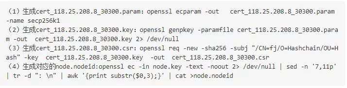
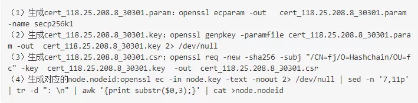
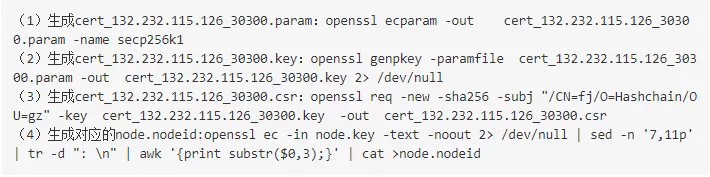
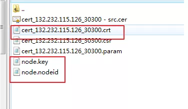
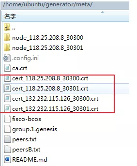
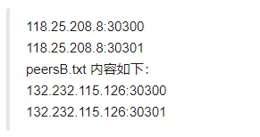
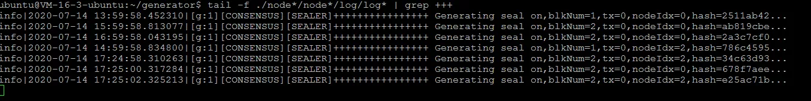

# Deployment Practice of Using the Underlying Node of the Third-Party CA Certificate on FISCO BCOS

Author: Lin Xuanming ｜ FISCO BCOS Open Source Community Contributor

How to Generate CA Certificate？Do nodes cross-validate certificates when they verify each other?？For such problems often encountered in the community, share some personal experience in deploying underlying nodes using third-party CA certificates, hoping to give you some reference and reference。

## Why you need to transform third-party CA certificates？

First, explain the background and reasons for my third-party CA certificate transformation:

- People in the community often ask about the transformation of third-party CA certificates, and I personally feel that this is a point of concern for everyone.。
- In some of our projects, the business specified to use a third-party CA certificate, and actual production needs required us to perform a CA transformation。
- In the judicial domain blockchain depository scenario, a certificate issued by a certificate authority with an electronic certification license is required to be used as an electronic certification。

In view of the above three points, I think everyone is very concerned about how to carry out third-party CA certificate transformation.。

The FISCO BCOS technical document provides a case of CFCA certificate transformation, but some details have yet to be improved, so I want to write a tutorial that combines production environment transformation, third-party CA cooperation, compliance, technical implementation, etc. Specific instructions to see if it can be helpful to other community users。

### In addition to the judicial domain, what other scenarios need to be involved by third-party CA agencies?？

Basically, third-party CA certificates may be used in blockchain scenarios that use CA certificates. Consider whether to use third-party CA certificates:

- Whether the alliance chain requires the relevant qualifications behind the third-party CA organization。
- In the alliance chain, the participants control whether the third-party CA institution is required to issue certificates as an impartial institution for node access management and subsequent control, so as to prevent problems such as arbitrary issuance of certificates in the self-built CA system that lead to node malfeasance.。

### Why do I need to configure the whitelist list in the two-level certificate mode？What will be the problem if it is not configured？

In the two-level certificate mode, a CA certificate provided by a third party is used as a chain certificate. If a whitelist is not configured, any CA certificate issuing node certificate can be connected to the chain.。

## practical operation step teaching

Next, let's take a look at the specific practical steps for deploying the underlying node using a third-party CA certificate.。

The main points of the transformation are:

- The underlying CA of FISCO BCOS provides a three-level mode by default, chain certificate--> Agency Certificate--> Node Certificate；
- In the real world, although the CA can provide a certificate issued at level 3, there are compliance risks in some scenarios；
- Our current practice is to remove the agency certificate from the chain certificate.--> Issuance of node certificates. The chain certificate is issued by the CA. Crt provided by the CA. It is used in conjunction with the whitelist mechanism to complete the deployment of basic underlying nodes.。

### Environmental preparation

1. Two test servers: 118.25.208.8, 132.232.115.126

The operating system is Ubuntu.:18.04

3. openssl tool Ubuntu 18.04 comes with openssl 1.1.1

4. Select the normal FISCO BCOS version 2.5.0, the node certificate algorithm used by the node is EC secp256k1 curve

5. Combined with [white list mechanism]

   https://fisco-bcos-documentation.readthedocs.io/zh_CN/latest/docs/manual/certificate_list.html#id2

Note: During the test, the node private key and the request certificate file are managed uniformly, but in the production environment, the node private key should be generated by the administrator of each institution and submitted to the CA, and the private key should be retained separately.。

### Foundation Certificate Preparation

##### Generate the base node private key and node certificate request file

Use the openssl tool to generate the corresponding node private key and node certificate request file, as well as the corresponding node.nodeid (nodeid is the hexadecimal representation of the public key).。(Note: The node.key in the node.nodeid generated in the fourth step of each node is modified by the cert _ IP _ port.key of the corresponding node. This operation is required by the underlying layer。）

- Production node 1 node _ 118.25.208.8 _ 30300 Related Files

- Production node 2 node _ 118.25.208.8 _ 30301 Related Files

- Production node 3 node _ 132.232.115.126 _ 30300 Related Files

- Production node 4 node _ 132.232.115.126 _ 30301 Related Files

(FISCO BCOS V2.5 version, using the private key and EC secp 256k1 curve algorithm)。

### The CA side issues the node certificate.

Submit the node.csr file of each node to the CA. The CA returns a CA.crt certificate as a chain certificate and four node certificates in pem format.。(Note: In FISCO BCOS, the CA returns the certificate in the following mode: root-> node -issuer: the content of the issuer certificate is mixed in the node certificate.。）

### building chain

- Step 1: Download the domestic image, cd ~ / & & git clone https://gitee.com/FISCO-BCOS/generator.git

- Step 2: Complete the installation, cd ~ / generator & & bash. / scripts / install.sh complete the installation, if the output usage: generator xxx, the installation is successful

- Step 3: Get the node binary and pull the latest fisco-bcos binary file to meta (domestic cdn), if FISCO output-BCOS Version : x.x.x-x indicates success.

- Step 4: Agency Assignment

  118.25.208.8 is selected as Institution A, and Institution A is responsible for the generation of the Genesis block.

  Select 132.232.115.126 as institution B

- Step 5: Use the CA.crt certificate provided by the CA as the chain certificate

  Manually create the dir _ chain _ ca directory in the directory of organization A and place CA.crt in the dir _ chain _ ca directory

- Step 6: Perform node certificate migration in the meta directories of institution A and institution B

  In the meta directory, manually create the corresponding node directory, where institution A is node _ 118.25.208.8 _ 30300 and node _ 118.25.208.8 _ 30301, and institution B is node _ 132.232.115.126 _ 30300 and node _ 132.232.115.126 _ 30301

  Each directory needs to store the corresponding node certificate, node private key and node Id, and distribute the node certificate generated by the CA, as well as the initially prepared node id, node private key and other files to the corresponding node directory, as shown in the figure.

- Step 7: Institution A collects all node certificates

  In the meta directory of institution A, collect the corresponding node certificates for subsequent generation of genesis blocks.。As shown in the figure:

- Step 8: Manually configure institution A to modify group _ genesis.ini in the conf folder to generate a genesis block

- Step 9: Modify node _ deployment.ini in the conf directory of organization A and organization B；Where p2p address is the external network address, rpc, channel address is the internal network address

- Step 10: Manually create the peers.txt file in the organization meta directory

  Create peers.txt and peersB.txt in institution A, and create peers.txt and peersA.txt in institution B. Take institution A as an example, the content of peers.txt is as follows:

- Step 11: Generate nodes in mechanism A and mechanism B, and execute commands in the generator of mechanism A. / generator--build _ install _ package. / meta / peersB.txt. / nodeA Generates the corresponding node of organization A；Execute the command in the generator of institution B. / generator--build _ install _ package. / meta / peersA.txt. / nodeB Generates the corresponding node of organization B
- step 12: Nodes running two agencies: bash. / nodeA / start _ all.sh and bash. / nodeB / start _ all.sh；The consensus state is normal as shown in the figure:

- Step 13: Console deployment and contract deployment testing

  Compare the console operation results corresponding to agency A and agency B, and the data is consistent to ensure that the consensus is normal.

- Step 14: Configure the whitelist in the config.ini of the corresponding node

So far, we have completed the transformation of the third-party CA certificate combined with the deployment of the underlying node.。From the process point of view, mainly in the chain certificate--> Agency Certificate--> The node certificate generation process has changed, and the peers.txt file and node directory need to be manually created in the meta directory.。

## Join the FISCO BCOS Open Source Community

Speaking of my bond with the FISCO BCOS open source community also stems from the CA certificate, in a government-enterprise project docking, the owner requires the bottom of the blockchain to adapt to the national secret, and use the CA certificate specified by the owner.。

In the early days, our team used the bottom layer of other blockchains, which could not be directly adapted to the national secret, and the transformation was difficult, long and costly.；Considering that many subsequent domestic projects will involve the adaptation of national secrets and CA transformation, we urgently need a complete set of blockchain underlying to support the above needs.。Through the introduction of friends in the circle, I learned about FISCO BCOS, and finally chose FISCO BCOS after in-depth technical research and feasibility analysis.。

FISCO BCOS open source community has created an atmosphere of open communication, welcome everyone in the community to discuss with me。

------

More details about the content shared in this issue can be found through [The Power of Magnetism](https://www.yc-l.com/article/49.html)Learn more。

The Yuan Magnetic Power Forum is a user exchange platform contributed by Lin Xuanming and his team to the FISCO BCOS open source community, mainly for sharing and learning FISCO BCOS and related technical knowledge.。Thank you for all kinds of contributions to the community, each of your participation will become a driving force for the growth of the community！