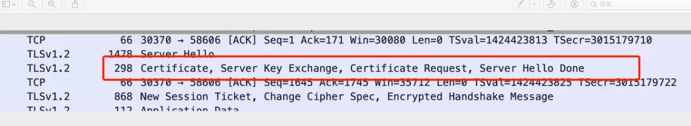
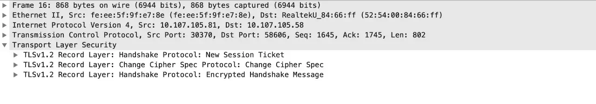

# TLS1.2 handshake process for FISCO BCOS

Author ： LI Hao Xuan ｜ FISCO BCOS Core Developer

### Write in front

As we said before, everything should be questioned on the Internet, so sending data packets in the traditional plaintext is undoubtedly very unsafe。Therefore, the https protocol requires encryption, so what needs to be done before encryption, this article will be the handshake before the establishment of the specific process of both sides of the communication analysis。

SSL communication process is TLS1.2**[1]** Content of。The ultimate goal is to transmit packets securely。At the heart of SSL communication is authentication through a certificate, followed by"Handshake"Interactively generate an asymmetric session master key for this communication。Then in this round of communication, the data packet is encrypted and decrypted by this session master key and only the ciphertext is passed on the network。

This article will take FISCO BCOS node communication two-way authentication as an example to explain how both parties to the communication load, use, verify the certificate, and how to generate the session master key.。

## Part 1 Master Key Settings

Network compression is mainly implemented at the P2P network layer, and the system framework is as follows: the master key in TLS is a symmetric key, that is, the keys used by the client and server are the same, and the process of handshake is that the two sides interact with some random numbers to complete the setting of the master key.。 

Let's take the DH key exchange algorithm x to negotiate the master key as an example. If the attacker is Eve, Eve can obtain the intermediate value of their transmission:

1. Alice and Bob first negotiate fair a large prime p, and the generator g, Eve can get p and g.；
2. Alice chooses a random integer a ∈ Zp, calculates A = g ^ a modp, sends A to Bob, and Eve can get A
3. Bob chooses a random integer b ∈ Zp, calculates B = g ^ b modp, sends B to Alice, and Eve can get B
4. Alice calculates S = B ^ a = g ^(ab) modp
5. Bob calculates s = a b = g(ab) modp

Through the above process, Alice and Bob negotiate a key S. Although Eve obtains the intermediate values A, B, p, g, according to the discrete logarithm problem, Eve cannot obtain the specific value of S.。

## Part 2 Certificate Validation

In the previous article, we talked about [the issuance process of certificates](https://mp.weixin.qq.com/s?__biz=MzU5NTg0MjA4MA==&mid=2247484692&idx=1&sn=3163aec2574ce0bf7d4f64e899e9bb6d&chksm=fe6a805bc91d094df15ed5c5988897d307ed519efbb0b26c2056ad35df3a491cea1e556ee70e&token=951660177&lang=zh_CN&scene=21#wechat_redirect)(Click to read), in this section will take the third-level certificate as an example to explain the certificate verification process。Certificate validation in the TLS handshake, which authenticates each other by loading a root certificate that both parties trust in advance。


▲ Thanks to Li Lianwen, the core developer of the community, for his contribution

- When the program starts, the local ca.crt and node.crt are loaded first；
- When a node verifies the certificate of the other node, it first uses the public key in the other node's node.crt to verify the attached signature. When the verification passes, it can confirm that the corresponding node has the node.key corresponding to the current node.crt.；
- The node then uses the information in agency.crt to verify that node.crt is a legitimate agent.；
- Finally, the node uses the information in locally loaded ca.crt to verify that agency.crt is issued by the Federation Chain Committee.；
- When both are verified, it means that the node.crt received by the node is issued by the locally loaded ca.crt。

## Part 3 TLS handshake process

The following figure shows the TLS handshake process obtained by capturing packets from two servers:


▲ Client side


▲ Server side

**In the process we see a total of 6 packets, namely:**

- The client hello sent by the client to the server.
- The server hello sent by the server to the client, sending the server certificate, and negotiating parameters
- The client certificate sent by the client to the server for parameter negotiation.
- The end flag sent by the server to the client. The handshake is complete.

### (1) client hello

In this step, the client initiates a connection request to the server and tells the server the following information:

```
{
TLS protocols supported by the client
Support xxx encryption algorithm
Random number required for key agreement process
}
```


### (2) server hello


After receiving the request from the client, the server responds to the request, including:

```
{
The TLS protocol I am using this time
This is my random number
This session our session id
This time we use the encryption algorithm
}
```

### (3) server communicate



As shown in the figure, it contains four parts:

```
{
server-side certificate
key exchange parameters server key exchange
Verify client request certificate request
Server hello done
}
```

(2)(3)The two-step operation can be summarized as follows: The server side made a response to the client side, "We use the xx algorithm to negotiate the session master key, this is my certificate, this is my negotiation parameters, please send me your certificate."。

### (4) client certificate

After receiving the certificate request from the server, the client sends its own certificate to the other party。

### (5) client communicate


In this step, the client uses the locally loaded ca.crt to verify the server certificate, and then performs parameter negotiation.

```
{
client key exchange parameters
the client 's verification result of the server - side certificate.
Transmission of content using ciphertext of session master key
client to(1)(2)(3)Signature of the process
}
```

### (6) server handshake established



After receiving the data packet, the server uses the session master key to encrypt and transmit the data packet.。

------

#### References

[【1】TLS(Transport Layer Security)](https://baike.baidu.com/item/TLS/2979545?fr=aladdin)The secure transport layer protocol is used to provide confidentiality and data integrity between two communicating applications。The protocol consists of two layers: TLS Record and TLS Handshake.。

[【2】Discrete Logarithm Problem](https://www.doc.ic.ac.uk/~mrh/330tutor/ch06s02.html)


