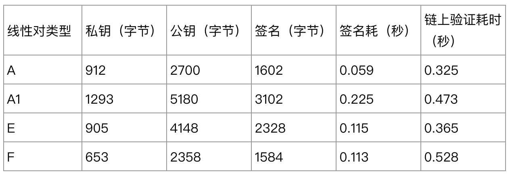
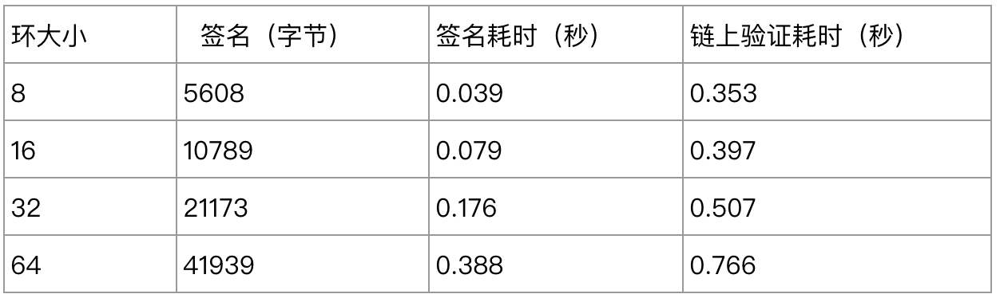
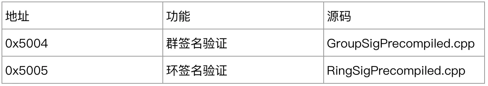

# FISCO BCOS Privacy Features: Implementation of Group / Ring Signature Technology

Author ： He Shuanghong ｜ FISCO BCOS Core Developer

## Foreword

Security and privacy has always been a hot topic in the field of blockchain, and it is also a strategic high ground for major mainstream blockchain platforms.。FISCO BCOS has made great efforts to address security and privacy from the bottom layer to applications, architectures to protocols, storage to networks, and has now implemented functional modules such as account management, disk encryption, secure communication, and permission control.。This article will introduce a group of ring signatures of FISCO BCOS privacy features.。

Group / ring signature is a special signature algorithm that was originally used in the blockchain field to implement hidden payments.。It can hide the identity of the signer well, allowing the node to verify the correctness of the transaction signature without exposing the public key information of the initiator of the transaction.。This feature has broad application prospects in the alliance chain.。

## What is a group / ring signature?

To understand group / ring signatures, you have to start with anonymity.。

In the real world, anonymity means that the subject's behavior does not reveal the subject's identity, a need that has existed almost since the dawn of human civilization.。

From a cryptographic point of view, anonymity has two meanings:

1. Given a ciphertext, its public key cannot be restored, mainly used for security analysis of cryptographic algorithms；
2. Users will not leak identity information in the process of using the password scheme, which is more in line with the semantics of the real world。

The earliest implicit concept of identity in cryptography is electronic signature, where the signer signs the message with a private key, and the verifier can use the signer's public key to verify the legitimacy of the signature.。In practice, public keys are often bound to certificates (except for identity-based encryption, where there is no certificate because identity is the public key), and the attributes of the certificate naturally reveal the identity information of the owner, so traditional signature schemes lack anonymity.。

In the early 1990s, Chaum and van Heyst(EUROCRYPT)The concept of group signature is proposed, which effectively solves the identity privacy problem of electronic signature.。

The "group" in a group signature can be understood as an organization.。There is a leader in the organization, the group owner, responsible for member management, and each member of the organization can**Anonymous**Signing on behalf of the organization。The main algorithms for group signature schemes include.

- Create a group, which is executed by the group owner to generate the group owner's private key and group public key；
- Add a group member, which is executed by the group owner to generate the private key and certificate of the group member. The certificate is used to prove the identity of the group member.；
- Generate a group signature, where group members sign information with a private key；
- Verify the group signature, the verifier can verify the legitimacy of the signature through the group public key, the verifier can determine that the signature does come from the group, but can not determine which group member's signature.；
- Open the group signature, the group owner can obtain the signer certificate through the signature information, so as to track the identity of the signer.。


Since the group signature has a group master role with absolute permissions, the anonymity of the group signature is relative.。This feature applies to scenarios that require regulatory intervention.。

In pursuit of complete anonymity, Rivest proposed in 2001 a group-owner-free scheme in which any member could join the organization spontaneously.。A parameter implied by the signature in this scheme forms a ring according to certain rules and is therefore named a ring signature。Essentially, both "group" and "ring" can be understood as an organization of multiple members, the difference being whether there is a leader that can open a signature.。
The process of the ring signature algorithm is as follows:

- Initialize the ring, which is executed by the ring members to generate the ring parameters, which are like the password for WeChat face-to-face group building, and any member who knows the parameters can join the ring.；
- Join the ring, performed by the ring members, and obtain the public-private key pair through the ring parameters；
- Generate ring signatures, where ring members sign information using a private key and any number of ring public keys；
- Verify the ring signature, the verifier can verify the validity of the signature through the ring parameters。

The ring signature scheme hides the signer's public key in the list of public keys used in the signature. The larger the list of public keys, the higher the anonymity, which is suitable for multi-party collaboration scenarios with higher privacy requirements.。

## Technical Selection of FISCO BCOS

At present, group / ring signatures are mainly used in voting, bidding, auction and other scenarios to protect the identity privacy of participants.。For alliance chains, multiple agencies within the same alliance collaborate and play games, and in some scenarios, protecting user identities is necessary.。

FISCO BCOS integrated group / ring signature scheme provides users with a tool that can guarantee identity anonymity。Based on the consideration of the complexity of the scheme and the computational cost on the chain, only the most necessary step, namely signature verification, is retained on the chain, while other algorithms are provided to the application layer in the form of independent functional components.。

The group signature scheme applied to the blockchain needs to meet the following two requirements:

1. In order to facilitate the management of members, it is necessary to support the withdrawal of group members.；
2. Considering the limited storage resources of the blockchain, the signature data cannot be too large and can be aligned to the standard RSA signature。

Therefore, we chose the first group signature scheme BBS04 Short Group Signatures, which was proposed by Boneh at CRYPTO in 2004.。

In order to facilitate accountability and prevent the signer from being framed, a scheme with accusation correlation and defamation resistance is needed, i.e., two ring signatures generated based on the same public key list can determine whether they are from the same signer.。Based on this consideration, we chose the first linkable ring signature scheme LSAG (Linkable Spontaneous Anonymous Group Signature for Ad Hoc Groups) proposed by Joseph in 2004.。

The BBS04 scheme is based on bilinear pair construction, and the group administrator can initialize the group according to different linear pairs.。The group signature storage and computation costs for different linear pair types are as follows:



where the group order of each linear pair is freely configurable, the default values are used in the above experiment。As you can see, the time overhead gap for on-chain verification is not large, and users can choose the appropriate linear pair type and group order according to their security and performance requirements.。

In the LSAG scheme, the storage and computation overhead of ring signatures for different ring sizes are as follows:



Since the ring signature length, signature and verification time are linearly related to the number of ring members, it is recommended that the number of ring members does not exceed 32 to prevent over-gas.。

## How to use group / ring signatures in FISCO BCOS

FISCO BCOS version 2.3 begins to integrate the signature verification algorithm of BBSO4 scheme and LSAG scheme in the form of precompiled contract.。Since these privacy features are not enabled by default, enabling these features requires turning on the CRYPTO _ EXTENSION compilation option and recompiling the source code。**2.5 and above versions are enabled by default, and users are no longer required to compile the source code**。

The group / ring signature precompiled contract address is assigned as follows:



To complete the precompiled contract call, you first need to declare the contract interface as a solidity contract.。

- ### group signature

```
// GroupSigPrecompiled.sol
pragma solidity ^0.4.24;
contract GroupSigPrecompiled {
     function groupSigVerify(string signature, string message, string gpkInfo, string paramInfo) public constant returns(bool);
}
```

- ### ring signature

```
// RingSigPrecompiled.sol
pragma solidity ^0.4.24;
contract RingSigPrecompiled {
     function ringSigVerify(string signature, string message, string paramInfo) public constant returns(bool);
}
```

Take the verification ring signature as an example (make sure that the above interface declaration contract already exists in the peer directory), instantiate the precompiled contract object in the business contract by address to complete the call to the verification interface:

```
// TestRingSig.sol
pragma solidity ^0.4.24;
import "./RingSigPrecompiled.sol";

contract TestRingSig {
    RingSigPrecompiled ringSig;
    function TestRingSig()
    {
        / / Instantiate the RingSigPrecompiled contract
        ringSig = RingSigPrecompiled(0x5005);
    }
    function verify(string signature, string message, string paramInfo) public constant returns(bool)
    {
        return ringSig.ringSigVerify(signature, message, paramInfo);
    }
}
```

In addition to the pre-compiled contract interface, FISCO BCOS provides two additional core modules for users to use, a complete group / ring signature library and a group / ring signature RPC server.。The signature library and server are independent of the blockchain platform, and users can also develop their own server based on the signature library.。The signature information can be stored on the chain, and then the validity of the signature can be verified by calling the verification interface in the contract.。

FISCO BCOS provides users with a development example of a group / ring signature, using the client as the entry point. The sample architecture is shown in the following figure:


The group / ring signing client calls the RPC interface of the server to complete the creation of the group / ring, the joining of members and the generation of the signature.；At the same time, the client interacts with the blockchain platform to put the signature information on the chain.；Finally, the client calls the signature on the precompiled contract verification chain.。For more operation steps and technical details, please refer to the Group / Ring Signing Client Guide。The reference link is as follows: https://github.com/FISCO-BCOS/group-signature-client/tree/master-2.0

## Direction of improvement

In academia, the development of group / ring signatures has matured, and many new schemes have been born based on different scenarios.。

For example, programs that support group members' active participation can effectively resist the framing behavior of group owners.；The revocable anonymity ring signature scheme allows the signer to convert the ring signature into an ordinary signature on specific occasions to prove his or her identity as a signer.；The scheme that supports the security of the preceding item can ensure that the disclosure of the user's private key does not affect the anonymity of the previous signature.。

At present, FISCO BCOS integrated group / ring signature schemes each have one. In the future, for more complex requirements, more support schemes will be added to provide users with more choices。At the same time, in view of the poor portability of existing client examples, plug-ins will be considered in the future to facilitate rapid business access.。

## Conclusion

Security and privacy is a complex, vast and challenging field。

The group / ring signature module only provides anonymity protection for user identities. How to build a more reliable and robust secure blockchain platform in combination with other cryptographic protocols？How to reduce user costs and overhead and provide multi-dimensional, highly available privacy protection services？The above problems need our continuous research and exploration.。

Finally, people with lofty ideals are welcome to join the FISCO BCOS security building to build an unbreakable wall of privacy.。