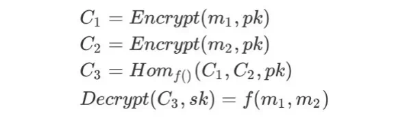
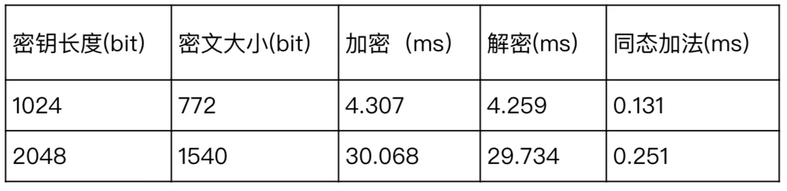
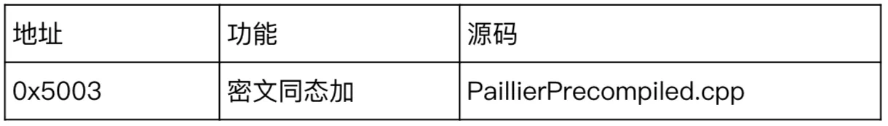

# On-chain ciphertext participation in computation？Homomorphic Encryption Reveals Avatar| FISCO BCOS Privacy Features

Author ： He Shuanghong ｜ FISCO BCOS Core Developer

## Foreword

As a distributed system, on the one hand, blockchain gives full play to the value of data through data sharing, co-governance and collaborative processing.。On the other hand, due to resource and privacy constraints, blockchain is only suitable for storing the lightest, most necessary, and non-privacy-risk data, such as hashes, metadata ciphertexts, etc.。The contradiction between data availability and privacy is becoming more and more obvious in the blockchain。

As the saying goes, "You can't have both a fish and a bear's paw," but cryptographers who specialize in intractable diseases don't agree, and have proposed a solution where ciphertexts can also participate in computations-**homomorphic encryption**（HE，Homomorphic Encryption）。This article will explain the definition of homomorphic encryption and the technical implementation in FISCO BCOS.。

## What is Homomorphic Encryption

Homomorphic encryption is an open problem that was raised in the 1970s to complete the processing of data without exposing it, focusing on**data processing security**。

Imagine such a scene, as a full of ideals of the second generation of the building, you live a boring life of rent collection every day, hoping to get rid of the shackles of the world, copper stink to pursue poetry and distance。You need to hire an agent to take on the chore of rent collection, but don't want it to pry into your monthly income from lying down。So, you ask the expert to build a set of equipment that will ensure that the agent can successfully complete the rent collection without revealing income information.。The kit includes envelopes, glue, wallets and magic scissors, each of which has a unique function:

1. Once the envelope is sealed with glue, only magic scissors can open it。
2. No matter how much money is in the envelope, the size and weight of the envelope will not change.。
3. After placing multiple envelopes in a wallet, the envelopes will be combined in pairs without opening them, and eventually become an envelope containing exactly the sum of the amounts of all the envelopes before the merger.。


You distribute the envelopes and glue to all the tenants and give the wallets to the agent。On the agreed day of paying the rent, the tenant puts the rent in an envelope, seals it and gives it to the agent.；The agent collects the envelope, puts it in his wallet, and finally gets an envelope full of all the rent, which he forwards to you；You use magic scissors to take it apart and get the rent。

In this scenario, the two properties of the envelope, a and b, are actually the characteristics of public key encryption, i.e. the ciphertext obtained using public key encryption can only be decrypted by someone who has the private key, and the ciphertext does not reveal the semantic information of the plaintext.；While c represents the property of additive homomorphism, two ciphertexts can be calculated, and the result decrypted is exactly the sum of the two original plaintexts。At this point, the full picture of homomorphic encryption is already on the horizon:

- Homomorphic encryption is essentially a public key encryption scheme that uses the public key pk for encryption and the private key sk for decryption.；
- Homomorphic encryption supports ciphertext computation, i.e. ciphertext generated by the same public key encryption performs f()The homomorphic operation of the function, which generates a new ciphertext that, when decrypted, is exactly equal to the two original plaintext calculations f()Result of function；
- The homomorphic encryption formula is described as follows:



Homomorphic encryption can be divided into fully homomorphic encryption (FHE, Fully Homomorphic Encryption) and semi-homomorphic encryption (SWHE, Somewhat Homomorphic Encryption).。FHE, as the name implies, supports any given f()function, but due to the high computational overhead, there is currently no practical FHE solution in academia；SWHE only supports some specific f()Functions, such as addition or multiplication, have been used in industry, especially in cloud computing, due to their low overhead.。

## FISCO BCOS Technology Selection

In the alliance chain, given the regulatory needs, the on-chain agency may need to upload some of the privacy data in the application, such as revenue accounts, product traffic, etc.。In order not to divulge confidentiality, the agency can encrypt this information using the regulator's public key, and after encryption, the information statistics can be completed by the agency.。In this scenario, homomorphic encryption can be leveraged due to the need to compute against the ciphertext。

FISCO BCOS provides users with a privacy protection tool that supports ciphertext processing by integrating homomorphic encryption。Encryption and decryption will expose plaintext data, based on security considerations, only suitable for completion under the chain, the chain only retains the homomorphic operation interface, encryption and decryption interface is provided to the application layer in the form of an independent algorithm library.。In the choice of homomorphic encryption scheme, for the consideration of computational overhead, the lightweight additive homomorphic scheme is preferred.；Given the limited storage resources of the blockchain, the ciphertext cannot be too large and can be aligned to the standard RSA encryption algorithm.。

Combining the above two points, we have chosen an additive homomorphic scheme with the above characteristics.-Key Cryptosystems Based on Composite Degree Residency Classes, proposed by Paillier at EUROCRYPT in 1999。The experimental analysis of the Paillier scheme is as follows:



The public-private key pair is obtained by the RSA key generation algorithm, as you can see from the above table, the overhead is positively related to the key length.。Currently, 1024-bit RSA keys are no longer secure. We recommend that you use keys with 2048 bits or more.。

## How to use homomorphic encryption in FISCO BCOS

FISCO BCOS version 2.3 integrates the ciphertext homomorphic addition interface of the Paillier scheme in the form of a precompiled contract。To enable homomorphic encryption, you need to turn on the CRYPTO _ EXTENSION compilation option and recompile the source code (**2.5 and above versions are enabled by default, and users are no longer required to compile the source code**）。Homomorphic encryption precompiled contract addresses are assigned as follows:



To complete the precompiled contract call, you first need to declare the contract interface as a Solidity contract.。

```
// PaillierPrecompiled.sol
pragma solidity ^0.4.24;
contract PaillierPrecompiled{
    function paillierAdd(string cipher1, string cipher2) public constant returns(string);
}
```

The precompiled contract object can then be instantiated by address in the business contract to complete the call of the homomorphic plus interface.。

```
// CallPaillier.sol
pragma solidity ^0.4.24;
import "./PaillierPrecompiled.sol";
contract CallPaillier {
    PaillierPrecompiled paillier;
    constructor() public
    {
        / / Instantiate the PaillierPrecompiled contract
        paillier = PaillierPrecompiled(0x5003);
    }
    function add(string cipher1, string cipher2) public constant
    returns(string)
    {
        return paillier.paillierAdd(cipher1, cipher2);
    }
}
```

The public-private key generation, encryption and decryption interfaces in the Paillier scheme are provided to developers as independent password libraries.。The current password library contains a full version of the Java language Paillier scheme, as well as a C language version of the homomorphic plus interface for precompiled contract calls.。[The password library is as follows](https://github.com/FISCO-BCOS/paillier-lib)。

## Future directions for improvement

Currently, only the Java version of the homomorphic encryption algorithm library is accessible to developers. In the future, based on actual needs, we will align the SDK language type of FISCO BCOS and provide multi-language versions of the homomorphic encryption library.。Homomorphic encryption has always been a difficult problem in the cryptography community, and there are still great challenges in performance and usability in order to achieve fully homomorphic encryption calculations, FISCO BCOS will continue to pay attention to the technical progress in this field.。

## Conclusion

Safe way Xiu Yuan Xi, FISCO BCOS will search up and down。Currently, FISCO BCOS has been configured with a variety of cryptographic tools, including group signatures, ring signatures, and homomorphic encryption. Next, we will implement and integrate customized privacy protection solutions for specific scenarios.。Welcome everyone to use and pay attention to the application of homomorphic encryption technology in privacy protection scenarios, discuss exchanges, actively feedback, and build a more secure and reliable FISCO BCOS platform.。