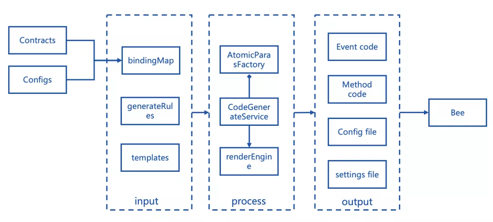
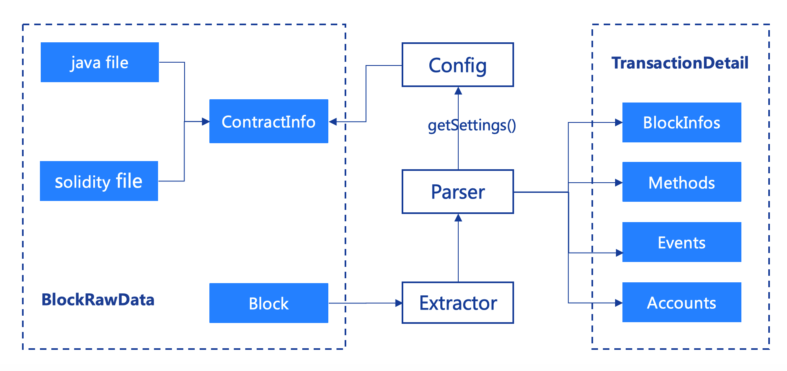

# Walk around WeBASE's Zoo

Author ： MAO Jiayu ｜ FISCO BCOS Core Developer

**Author language**: Open source software, the Garden of Eden beyond the tide of commercialization in the minds of masters；It's the cathedrals and bazaars where geeks gather；It is a beloved poem of technology lovers；But in my eyes, the world of open source software is a zoo。

Open source organizations love to take animals to name software or make LOGO, these names have long been as popular as spring rain。Such as a face of serious, agile, resembling a lion Tomcat。And Python, two fat and stupid python images have become popular all over the world。Linux, on the other hand, uses a penguin named Tux as its mascot, and Tux has now started making video games, commercials, and even a girlfriend named Gown。Inspired by the splendor of scenery in the open source community zoo, we named two data export-related components in WeBASE, Monkey and Bee, respectively。

This article will introduce you to the miraculous Monkey and the focused Bee。**WeBASE is a middleware platform built between blockchain applications and FISCO BCOS nodes**To abstract commonalities in technology and business architecture to form generic and experience-friendly components, simplifying the blockchain application development process。

## WeBASE-Codegen - Monkey's Monkey King

WeBASE-Codegen-Monkey (hereafter referred to as Monkey) is the code generation component of the WeBASE data export tool。Can help users automatically generate data export components, further improve the efficiency of research and development, help developers reduce the burden。We developed Monkey, whose name is inspired by Monkey King - Monkey King Monkey King。

Monkey provides an executable shell script: generate _ bee.sh。Automatically generate WeBASE-Collect-Bee with simple configuration and smart contract files on request。After the script is executed, Monkey will automatically exit, as if it were a changing Monkey King, coming from the clouds and driving away in the fog。The Monkey startup script automatically downloads code, loads contracts, builds and generates business code, compiles data export component code, and starts data export applications。The main execution steps of generate _ bee.sh are as follows:

In step 3, the script will automatically place the developer's configuration file to the specified configuration path。 Step 5: After Monkey is started, it will generate logs, function codes, configuration and setup files according to the order, and place them on the path required by Bee。Step 8, Bee can load the required code and configuration files as you like at startup。Developers can also obtain the required files of various scripts or parameters at a pre-agreed path。

The execution process of generate _ bee.sh is just as described in Journey to the West: "Seeing his ferocity (the need for customized development of data export is complex), even if he uses the external method (reading the configuration of the environment and contract), he pulls out a handful of hair (downloading the code, assembling the configuration and compiling the Monkey code), chews it in his mouth (running the monkey code, automatically generating the configuration and code of Bee),！'(Start executing Bee's code) That is, change into three or two hundred little monkeys, and accumulate clusters around them (automatically build the database and table and successfully start exporting data)。』

Monkey King has the power of seventy-two changes, Monkey has the function of automatically generating the required code, so that the data export system can be used out of the box Monkey generated code and other files, can be divided into four categories:

1. Code that parses specific logs generated based on contracts and configurations；
2. Code that is parsed based on specific functions generated by contracts and configurations；
3. The configuration file generated based on the configuration；
4. Settings files generated based on contracts and configurations。

In the figure above, different types of Paras generate different code files。Among them:

- EventGenerateParas: Contains the generation of log (Event) related code and scripts。

  For example, the definition of log entity and repository parsed in the contract file, as well as the code parsed by each different log, the BO class of the log, and the database table building statement of the log。

- MethodGenerateParas: contains the function (Method) related code and script generation。

  Such as the definition of the functions hibernate entity and repository parsed in the contract file, as well as the code parsed by each different function, the BO class of the function, and the database table statement of the function。

- ConfigGenerateParas: Contains the Bee project's database table creation script and database configuration file。
-SettingsParas: json import settings file containing grafana dashboard and table _ panel。

As mentioned above, for the convenience of developers, one-time configuration。In addition to generating and executing code, the general configuration of the relevant blockchain software and data export components is also put into the configuration of the Monkey system and automatically passed to the configuration file of Bee。Monkey system integrates Beetl as a template engine, no matter how complex the contract, how cumbersome configuration, can be simplified, quickly generated。Monkey loads the Java file corresponding to Solidy compiled by the developer and uses reflection technology to obtain the Class information of the contract file。

After Monkey is started, a template engine for code generation is created. The AtomicParas mentioned above is the necessary raw material for starting the engine。As shown above, the call steps through these three cores:

1. The engine calls getTemplateFilePath()method to get the file path of the render template；
2. Through getBindingMap()method to get all the parameters needed for rendering；
3. Through getGeneratedFilePath()Obtain the specific path of the generated file。

The code generation engine can be quickly started to perform rendering, and finally complete the automatic generation of the required files。

Of course, the Monkey King legend will not end, Monkey system provides a lot of powerful and flexible configuration, to meet the unique personalized needs of developers。Monkey King's journey will not be limited to data export, the future will also be involved in more areas, for everyone to bring more surprises.....

## WeBASE-Collect-Bee Bee

WeBASE-Collect-Bee (hereinafter referred to as Bee) is a data export component based on the FISCO BCOS platform in WeBASE. It supports exporting blockchain data to databases such as Mysql。

Why is it called Bee?？Throughout the ages, the literati have left many poems and essays that sing about bees: through the flowers, the willows fly like arrows, and the sticks look for fragrance like falling stars。Small bodies can carry weight, and thin wings of instruments can ride the wind。- Wu Chengen

Bee system is just like a bee colony, focus as one, hard work。If the service does not stop, the data export task will not stop。Bees walk back and forth among the flowers of the blockchain, looking for sweet, floating business data between blocks, and exporting massive amounts of blockchain data to storage in a stable and efficient manner for developers to perform analysis, calculations and queries。The tiny tiny bee is light, which fits the "light" temperament of the Bee system design。

With the help of Monkey, following the principle of "contract over configuration," developers only need to modify a few configurations, supplemented by the certificate that comes with the link and the contract file after development and compilation, after executing the script, you can quickly obtain the packaged executable Jar package, and even start running directly。The lightness of the bee is also reflected in the systematic extraction and abstraction of a large number of configuration items。According to the individual needs of developers, flexible configuration, on demand。

The system architecture diagram is shown below. In addition to the core modules, the modules of the Bee system are pluggable。For example, whether it is necessary to introduce enhanced functional modules such as visual data analysis, integrated test interface, monitoring and supervisor process management。

In order to make the thin wings of the honeybee device dance lighter, we refactored it in the latest V1.1.0 to further split the original single project according to the functional granularity。In this way, developers can choose to deploy an executable Jar package directly。You can also introduce Jar packages on demand to embed specified function modules into your own projects。The above modules are based on Springboot2 development, support personalized configuration。

As shown in the figure above, each Jar functions as its name:

-core: Packaged as an executable BootJar package with a built-in Restful API out of the box, making it easier for developers to get data export services。At the same time, core itself is also an example, showing developers how to combine the Jar package of each functional module to develop a fully functional data export system。
-parser: Encapsulates the function of block parsing。The method signature of the entry can be passed into a block to obtain a fully parsed BlockInfoBO bean object, which contains the parsed data。
-extractor: further encapsulates the logic of the web3j SDK, which can conveniently call the on-chain function and obtain the data of the blockchain。
-db: Encapsulates the logic of data storage, theoretically supports various mainstream databases, and supports strict testing in practice to store data to Mysql 5.6 and above Community Edition。
-common: encapsulates some common data structures, tool classes, and common parameters。

Although the tiny body of the bee is light, the collaboration of the swarm can carry the weight。

In order to cope with the storage of massive amounts of data, such as single table data more than 1KW, single library capacity of more than 1T scenarios, Bee integrated sharding-jdbc, supports configurable multi-data source storage, read and write separation, sub-database sub-table。

In order to speed up data export, the Bee system has carried out multiple rounds of performance optimization, greatly improving the efficiency of data export under stand-alone deployment。At the same time, relying on the integration of Elastic-Job, the ability to obtain distributed task coordination services, Bee supports multi-active deployment of instances, scale-out, flexible scaling。

The work of bees is divided into three types, and the task performers of the Bee system are also divided into three categories: task schedulers, block collectors, and block processors。

As shown in the figure above, the specific three types of task performers are described as follows:

**The Queen Bee (Dispatcher)**：

The distributed coordination service ensures that only one thread runs, which is responsible for detecting the current block height of the blockchain and the details of the pulled tasks, preparing the tasks, detecting the fork status of the blocks, detecting the timeout status and error status of the tasks, and performing re-pulling based on pre-defined policies。The preparation task means that Dispatcher will maintain the database based on the dimensions of the block: create a status record for each block and insert it into the system table of block _ task _ pool。

**The drone (Extractor)**：

Share the same threads as Depot, the total number of threads can be specified by the configuration file, but the shard of task execution is automatically scheduled by the Distributed Coordination Service。The task performed by the Extractor is to pull the block task corresponding to the serial number of the shard from the block _ task _ pool system table maintained by the Dispatcher, then download the block data of the specified block height from the blockchain, and modify the task execution status of the block _ task _ pool system table。

**Worker bee (Depot)**：

Share the same threads as Extractor, the total number of threads can be specified by the configuration file, but the shard of task execution is automatically scheduled by the Distributed Coordination Service。Depot can directly obtain the block content from the extractor, and then perform data export tasks, successively perform block parsing, content conversion processing, storage database, and finally modify the task execution status of the block _ task _ pool system table。

The advantage of this design is that the data exchange overhead of switching between different blocks in different threads is isolated, which greatly improves the efficiency of processing。At the same time, you can increase the speed of data export by increasing the number of deployed instances and increasing the number of processing thread collections。If you compare content conversion and content storage to the brewing and storage of nectar, then block resolution is like the collection of pollen - a task that makes the worker bees toil day and night, and best interprets the phrase "flying willows like arrows through flowers, sticky catkins like falling stars."。

As shown in the figure above, the results of block parsing are divided into four categories: block basic information, account information, function information, and log information。The following is a brief idea of the analysis:

1. Contract loading: Before executing, the parser loads the BIN, ABI and configuration information of the contract and calculates the MethodId of all contract functions。

2, account resolution: according to the Block can obtain the block contract address, according to the contract address to obtain runcode, and then through the pre-loaded contract BIN information, identify the type of account, and finally resolve the account。

3, function resolution: if the function is a constructor, as described in 1, you can resolve the value of the function。

If the function is not a constructor, the to field in the transaction is the contract address。As described in 2, the contract to which the function belongs can be obtained based on the contract address。The function name can be obtained by comparing the input attached to the transaction with the preloaded methodId。

After the contract and function name of the function are accurately located, the transactionHandler is automatically triggered and the corresponding parsing work is performed。

4. Event resolution:You can get the contract name based on the mapping of the transactionHash resolved in step 2 to the contract name。Based on a specific contract name, the eventHandler under that contract is automatically triggered and the corresponding parsing work is performed。

5. Block resolution:Obtain the summary information of the block based on the property resolution of the obtained Block object。

All of these parsing steps, the same block is done by a worker bee, each worker bee for a thread。These threads are distributed and managed by distributed coordination services through a collection of threads, thus achieving the effects of "flying like an arrow" and "falling like a star."。Bee system strictly follows the principle of "skill specificity" and is committed to providing data export services for FISCO BCOS。

## SUMMARY

WeBASE's community is still thriving, welcome to WeBASE's Zoo Walk, join us to discover and explore more interesting stories, and look forward to having you in the future Zoo Story。

------

#### Link Guide

- [blockchain underlying platform FISCO BCOS code warehouse](https://github.com/FISCO-BCOS/FISCO-BCOS/tree/master-2.0)

- [FISCO BCOS Technical Documentation](https://fisco-bcos-documentation.readthedocs.io/zh_CN/latest/)

- [WeBASE code repository](https://github.com/WeBankFinTech/WeBASE)

- [WeBASE Technical Documentation](https://webasedoc.readthedocs.io/zh_CN/latest/index.html)

