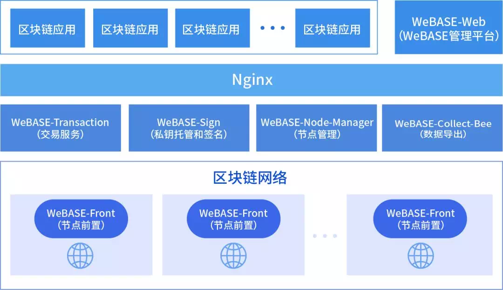
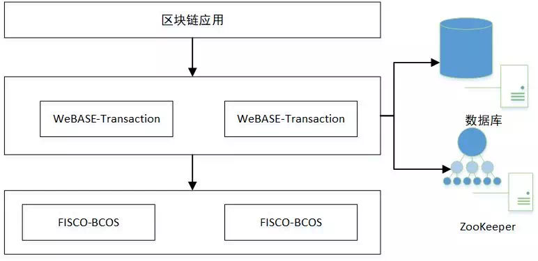
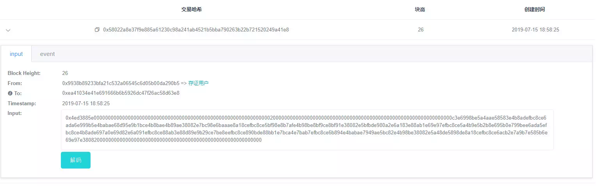
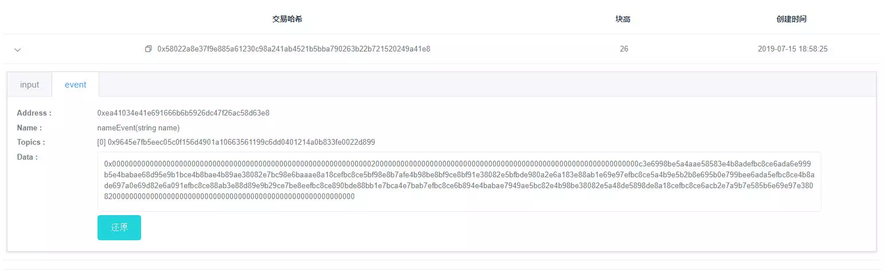
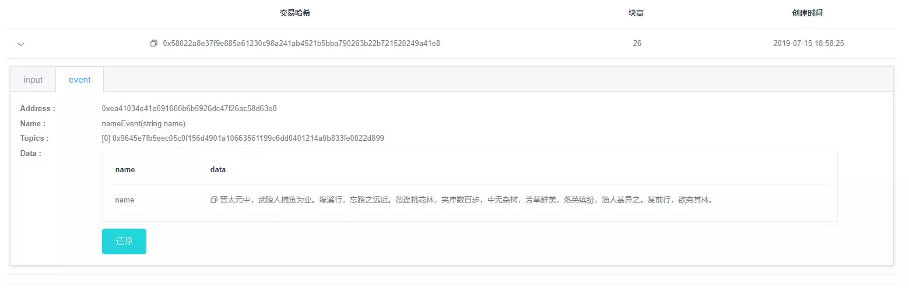
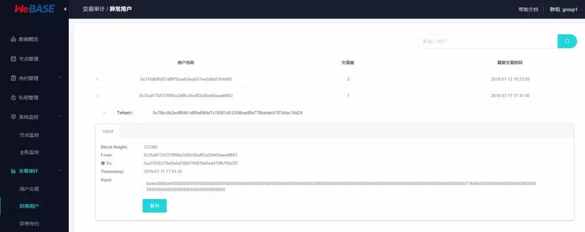

# Talk about two or three things about the WeBASE deal

Author ： LIU Mingzhen ｜ FISCO BCOS Core Developer

On July 2, 2019, the blockchain middleware platform WeBASE is officially open source, and the first thing that comes to mind is: what is WeBASE and what is it used for？WeBASE, short for WeBank Blockchain Application Software Extension, is a set of common components built between blockchain applications and FISCO BCOS nodes。The purpose of developing this set of common components is to shield the complexity of the underlying blockchain, reduce the threshold for developers, and improve the development efficiency of blockchain applications。WeBASE mainly includes: node front, node management, transaction link, data export, Web management platform and other subsystems。The full deployment architecture is shown below:

To learn more about WeBASE, please click to go to: "[FISCO BCOS welcomes the blockchain middleware platform WeBASE, application landing speed](https://mp.weixin.qq.com/s?__biz=MzA3MTI5Njg4Mw==&mid=2247485307&idx=1&sn=40b0002d3d261be7c2daadd73697a131&chksm=9f2ef567a8597c719225f87a490ea3307a537518cbbcd04a1c5881828a3d4ba1ae7714609522&token=773706277&lang=zh_CN#rd)》。We plan to push WeBASE series of articles, with you to experience WeBASE "simple but not simple"。This article is the first in a series of articles, "Talking about WeBASE Trading Two or Three Things," and intends to talk about some of WeBASE's work on trading-related aspects。

## The concept, basic data structure and process of trading

A transaction can be thought of as a request data sent to the blockchain system for deploying a contract, calling the contract interface, in order to achieve the objectives of maintaining the life cycle of the contract, managing assets, and exchanging value。The basic data structure of the transaction includes sender, receiver, transaction data, etc。

A complete trading process can be divided into trade construction and**On-chain execution, trade display, trade audit**Three steps:

- First, the user can construct a transaction, sign the transaction with his private key, and send it to the chain (through interfaces such as sendRawTransaction)；The chain then receives the transaction and hands it over to the multiple node mechanism to execute the relevant smart contract code and generate the status data specified by the transaction；Finally, the transaction is packaged into a block and stored with the state data。A closing transaction is recognized, and the recognized transaction is generally considered to be transactional and consistent。
- As the transaction is confirmed, a corresponding transaction receipt (receipt) is generated, which corresponds to the transaction and is stored in the block, which is used to store some information generated during the execution of the transaction, such as result codes, logs, and the amount of gas consumed。Users can use the transaction hash to query the transaction, and the transaction receipt is displayed to the user。
- Over time, the number of transactions on the chain has increased, requiring analysis of transactions on the chain to assist in monitoring and auditing chain behavior to ensure the proper and compliant operation of the chain。

Now that you have a preliminary understanding of the transaction, let's explore in detail the role and role of WeBASE in the three steps of the transaction。

## Trading on the Chain

There are many ways to send transactions to the chain through WeBASE, the more common are WeBASE management platform and transaction chain agent subsystem, the former by the WeBAS management platform to provide a contract IDE, you can deploy and call the contract interface, not to repeat here。Today we focus on the following**Transaction on-chain agent subsystem ([WeBASE-Transaction](https://webasedoc.readthedocs.io/zh_CN/latest/docs/WeBASE-Transaction/index.html)）**。

At present, blockchain developers mainly face the following pain points:

- The high cost of learning blockchain - do not want to pay attention to the details of the blockchain, want to use the traditional way to call the blockchain service。

-The peak of real business may exceed the processing power of blockchain-a cache system is needed to cut peaks and valleys。

To address these pain points, WeBASE-Transaction came into being。WeBASE-Transaction is a service system summarized from many blockchain certificate storage projects to help you quickly build blockchain applications. Its main function is to receive stateless transaction requests, cache them in the database, and then asynchronously upload the chain. The service supports distributed tasks, multi-active deployment, and remote disaster recovery。The deployment architecture is as follows:

As you can see from the deployment diagram, WeBASE-Transaction has the following features:

- **Asynchronous on-chain, overload protection**: The blockchain request first caches the database, cuts peaks and valleys, and the service uses a reasonable speed to asynchronously upload the chain。

- **Multi-active deployment, distributed tasks**: Use Zookeeper to coordinate distributed tasks, divide the chain into multiple distributed tasks, deploy multiple tasks, and perform remote disaster recovery。

- **Error retry, real-time alignment**: The service automatically checks the on-chain status and retries the error to achieve real-time alignment between the database and the on-chain status。

## Transaction Display

The transaction chain represents that the data is finally written into the block chain。Run excitedly to report to the boss: our data on the chain！The boss was pleased and curious。The blockchain is so advanced, how to display the data written to the blockchain？What does a blockchain transaction look like?？

At this point you can build a WeBASE management platform。The build method can be viewed in the [Installation and Deployment Document](https://webasedoc.readthedocs.io/zh_CN/latest/docs/WeBASE-Install/index.html)》。You can view the [WeBASE Management Platform User Manual](https://webasedoc.readthedocs.io/zh_CN/latest/docs/WeBASE-Console-Suit/index.html#webase)》。After the setup is complete, open the WeBASE management platform and you will find that the transaction is like this: sender, recipient, transaction input data, etc。After the transaction is executed, a transaction receipt is generated。The transaction receipt contains an event, which records the event log during the execution of the transaction。

After the boss saw the first feeling, it must be mixed。At this point you tap the "decode" button to translate the transaction from a string of "0x gobbledygook" into something humans can read。Which user is linked by which contract method, at a glance。The boss will cast a approving glance after seeing it。At this time, you must have a feeling that the whole world, who give up me。

## Transaction Audit

The deal is on the chain, and it's on display, but it's not enough。Each institution in the alliance chain shares and transfers data on the chain in accordance with the regulations established by the Alliance Chain Committee。These regulations are often literal, compliance, lack of regulation and auditing。Therefore, in order to regulate how everyone uses the chain's computing and storage resources and to avoid abuse of the chain's computing and storage resources by certain institutions, there is an urgent need for a set of services to assist in monitoring and auditing chain behavior。The transaction audit provided by the WeBASE management platform is a set of services that assist in the regulation and audit of behavior on the chain。It combines blockchain data, WeBASE management platform private key management and contract management data, blockchain data as raw materials, private key management and contract management as the basis for a comprehensive data analysis function。

Key indicators of transaction audit:

| Statistics on the number of user transactions| Monitor the daily trading volume of each external trading account on the chain|
| -------------------- | ------------------------------------------------------------ |
| Statistics on the number of user subclass transactions| Monitor the daily trading volume of each type for each external trading account on the chain|
| Abnormal transaction user monitoring| Monitoring abnormal transaction users on the chain (transaction users that are not registered on the blockchain middleware platform)|
| Abnormal contract deployment monitoring| Monitor the deployment of contracts on the chain, non-whitelisted contracts (contracts not registered on the blockchain middleware platform)|

The transaction audit interface is as follows

WeBASE management platform provides visual decentralized contract deployment, transaction monitoring, audit functions, easy to identify abnormal users, abnormal contracts, as well as abnormal trading volume, to provide a basis for alliance chain governance。

## Return to the original heart

Here, we can see a transaction, from the assembly to the blockchain node, and then the node executes the drop into the transaction receipt, transaction and state, to the transaction display, transaction after-the-fact audit and supervision。WeBASE is involved in the assembly of the chain, the transaction display, the transaction audit, basically can be said that WeBASE is involved in the whole process of the transaction。

In the process of assembling the chain, it provides a transaction chain agent subsystem, which effectively shields the complexity of the underlying blockchain, reduces the threshold for developers, and helps developers build alliance chain applications at high speed。During the transaction display process, WeBASE has built a visual management platform to display transactions in three dimensions, making it easy for developers to monitor and view transaction data in real time。In the process of post-transaction audit and supervision, it also provides comprehensive data analysis functions to assist in the behavior of the supervision and audit chain, and effectively govern the alliance chain。

------

#### Link Guide

- [blockchain underlying platform FISCO BCOS code warehouse](https://github.com/FISCO-BCOS/FISCO-BCOS/tree/master-2.0)

- [FISCO BCOS Technical Documentation](https://fisco-bcos-documentation.readthedocs.io/zh_CN/latest/)

- [WeBASE code repository](https://github.com/WeBankFinTech/WeBASE)

- [WeBASE Technical Documentation](https://webasedoc.readthedocs.io/zh_CN/latest/index.html)

