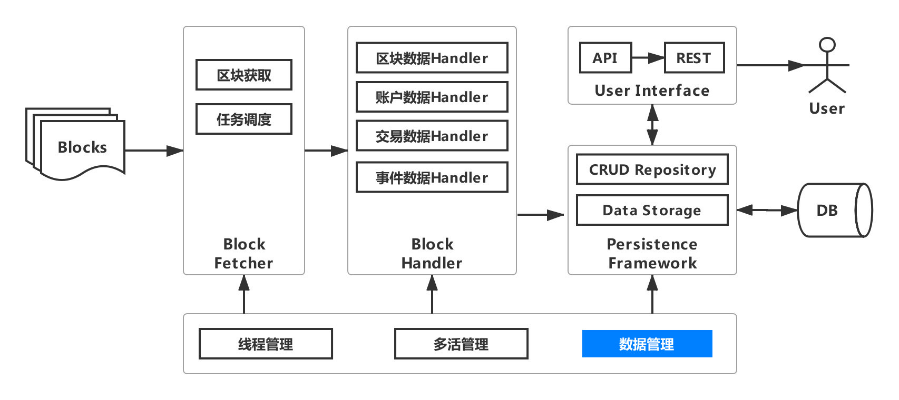

# WeBASE data export: help blockchain big data scenarios quickly land

Author ： ZHANG Long ｜ FISCO BCOS Core Developer

With the rapid development of blockchain technology, various applications have sprung up, the data on the chain is growing exponentially, blockchain-based big data scenarios have become a battleground for military strategists, and data analysis has also become a rigid demand。

However, due to the storage characteristics of the data on the chain, it can only be obtained directly from the chain through the interface, which requires a large amount of code to be written for the smart contract interface, which is costly；At the same time read data from the chain, in addition to the network overhead, but also need to perform decoding operations, and even traverse the MPT tree, etc., read performance is poor；More importantly, global data processing cannot be performed directly on the chain, which cannot meet the needs of big data scenarios, such as complex queries, big data mining and analysis。

To meet the needs of users, we are committed to providing an automated and intelligent data export solution, and through continuous iteration and improvement, to meet the various demands of users based on data export, helping blockchain big data scenarios to land quickly。This article will start from the user needs, layer by layer to uncover**WeBASE Data Export**The Mystery of Component Function, Feature and Architecture Evolution。

WeBASE is a middleware platform built between blockchain applications and FISCO BCOS nodes, abstracting commonalities in technology and business architecture, forming universal and experience-friendly components, and simplifying the blockchain application development process。

### The user said: the performance of obtaining data on the chain is poor, and it is not convenient for big data processing, so there is WeBASE-Collect-Bee

For users, they want to have raw data to support big data processing, but due to the unique chain storage structure of the blockchain and the codec operation and state tree designed for security, the performance of reading data from the chain is very poor, so we designed [WeBASE-Collect-Bee](https://github.com/WeBankFinTech/WeBASE-Collect-Bee/tree/master ) 。

The preliminary architecture of WeBASE-Collect-Bee is shown in the figure below. Its purpose is to reduce the development threshold for obtaining block data, improve data acquisition efficiency, and support big data processing. Users only need to perform simple configuration to export block data to a specified storage medium, such as a database that supports complex relational queries, big data mining, or big data platforms。


WeBASE-Collect-Bee consists of three modules: a block acquisition module, a block processing module, and a persistence module。

- Block acquisition module: obtain the corresponding block according to the block ID；
- Block data processing: parsing block data, block transaction data；
- Account data processing: parsing blockchain account data。

Users only need to provide the relevant configuration of the chain and database configuration, you can export the data on the chain with one click, and then you can use SQL to operate the data in the database. At the same time, as long as the WeBASE-Collect-Bee service is running normally, the database can synchronize the data on the chain in almost real time。

### Users say: business data acquisition workload, and not easy to maintain and reuse, there is WeBASE-Codegen-Monkey

Only block data is not enough, users are more concerned about business data, that is, transaction data。The transaction data is linked by calling the smart contract method, and in order to view the execution of the transaction, there is a large amount of log data in the transaction, that is, event data, which is very important for business analysis。

To obtain transaction data and event data, each transaction and event on the blockchain must be parsed according to the smart contract, and the core modules include at least: transaction / event and data parsing, database access interface, POJO, SQL several modules。

As shown in the figure below, assuming that our business contains 2 smart contracts, each smart contract contains 2 interfaces and 2 events, each module needs to write code independently, then at least 32 code files or scripts need to be written, the workload is quite large, the maintenance is complex, and can not be reused。


Based on this, we designed [WeBASE-Codegen-Monkey](https://github.com/WeBankFinTech/WeBASE-Codegen-Monkey) 。WeBASE-Codegen-Monkey is used to generate all the core code for parsing and storing transaction / event data。Users do not need to write any code, only need to provide smart contract files, WeBASE-Codegen-Monkey will automatically parse the contract, generate all the code files to obtain transaction / event data, and automatically and WeBASE-Collect-Bee assembly into a separate service。The WeBASE-Codegen-Monkey architecture is shown in the following figure。


WeBASE-Codegen-Monkey includes contract parsing module, code template module, code generation module, component assembly module。

- Contract parsing module: parse the smart contract file to obtain the transaction and event objects in the contract；
- Code template module: used to generate a code template for obtaining transaction / event data；
-Code generation module: according to the obtained transaction and event object, fill the code template, generate the code file；
-Component assembly module: used to assemble the generated code and WeBASE-Collect-Bee into a separate service。

Due to the addition of transaction / event data acquisition, the corresponding WeBASE-Collect-Bee architecture evolves as follows, adding a transaction data processing module and an event data processing module。Users only need to provide smart contract files to get almost all the data on the chain。


From the user's point of view, you only need to place the certificate file and smart contract file of the chain in the specified directory, then configure the node and database, and set the package name of the smart contract。

```
#### Node IP and communication port, group number。NODE _ NAME can be any combination of characters and numbers
system.nodeStr=[NODE_NAME]@[IP]:[PORT]
system.groupId=[GROUP_ID]

#### Database information. For the time being, only MySQL is supported；serverTimezone is used to set the time zone
system.dbUrl=jdbc:mysql://[IP]:[PORT]/[database]?useSSL=false&serverTimezone=GMT%2b8&useUnicode=true&characterEncoding=UTF-8
system.dbUser=[user_name]
system.dbPassword=[password]

# Package name of the contract Java file
monitor.contractPackName = [package name specified when compiling Solidity contract]
```

### The user said: with the data, to use also need to develop data access interface, inconvenient, there is a user interface

For users, although we have exported all the data that users care about to the DB, and the name of each table corresponds to the transaction method / event name, the field name is intuitive and easy to understand, but if users want to use the data in their own system, they also need to write a large number of database access interfaces。Based on this, WeBASE-Collect-Bee added**User Interface Module**, As shown in the figure below。


The user interface module provides two data access methods, one is the API method, which supports local calls from the user system；The other is REST, which can be accessed through http, reducing business coupling and supporting cross-platform calls。

The user interface is divided into four types of interfaces according to data type: block data interface, account data interface, transaction data interface and event data interface。Each type of interface supports block height, hash, or account-based queries, as well as complex queries based on time and specific fields。The user interface allows users to interface with their own systems at zero cost when using data export components。

In addition, in order to facilitate users to verify and view visual data, the data export component integrates the Swagger plug-in. After users complete the deployment of the data export service, they can enter http://your_ip:port / swagger-ui.html, view all user interfaces, and enter query conditions to perform visual queries, as shown in the following figure。


### The user said: with the data and query interface, but not intuitive enough, the boss can not understand, there is Grafana integration

In order to display blockchain data in a more real-time and visual way to meet the needs of non-technical personnel such as products and operations, based on lightweight considerations, we finally chose the visual data plug-in Grafana。

However, Grafana display data needs to write a dashboard template for each table data, learning and writing templates is very expensive。But don't worry, WeBASE-Code-Monkey will automatically generate Grafana scripts。Users only need to install Grafana and configure the data source, and then import the generated Dashboard template script. The data visualization can be completed within 1 minute, as shown in the following figure。


### The user says: a service exports data too slowly, what if the service hangs, there will be multi-threaded processing and distributed deployment

For the data export service, once the performance of the chain is very high, exceeding the TPS of the single-machine data export, then the latest data will never be obtained in the DB, and the data will become older and older, obviously unable to meet the business demand for data。At the same time, the risk of stand-alone processing is that the system stability is very poor, once the stand-alone service is suspended, the latest data cannot be obtained, and the user interface cannot be used for interaction。Therefore, we have introduced multi-threaded processing and distributed deployment. The architecture evolution is shown in the following figure。


#### Thread Management

Thread management is relatively simple. You only need to turn off the multi-active switch, turn on the single-node task mode, and set the number of blocks processed by independent threads。As follows, the system opens four threads by default for block capture and processing。

```
#### When this parameter is false, enter the single-node task mode
system.multiLiving=false
#### The number of multithreaded download fragments. The download progress is updated only after all download tasks of the fragment are completed。
system.crawlBatchUnit=100
```

#### Multi-live management

To further improve the efficiency of data export and ensure system stability and fault tolerance, we integrate Elastic-Job to support distributed deployment, task sharding, elastic scaling, parallel scheduling, and customized process tasks。In a distributed environment, the data export component first captures the block through a SimpleJob, and then processes the block through a DataflowJob。

Considering the cost of using Elastic-Job, the system automatically generates all the configurations of task shards and execution policies. Except for a few necessary configurations, you can configure and deploy multiple tasks without doing anything。The necessary configuration is as follows。

```
#### Enter multi-node task mode when this parameter is true
system.multiLiving=true

#### Zookeeper configuration information, ip and port
regcenter.serverList=ip:port
#### The namespace of zookeeper
regcenter.namespace=namespace
```

### The user said: the amount of exported data is too large, query and storage performance can not keep up, easy to collapse, there is a sub-database sub-table

When there is a large amount of data on the blockchain, exporting to a single database or a single business table will cause huge pressure on operation and maintenance, resulting in the degradation of database performance。Generally speaking, the data threshold of a single database instance is within 1TB, and the data threshold of a single database table is within 10G, which is a reasonable range。

If the amount of data exceeds this threshold, it is recommended to shard the data。Split the data in the same table into multiple tables or multiple tables in the same database。Data export introduces the data management module, and the architecture evolution is shown in the following figure。



The data management module integrates Sharding-JDBC and supports database and table splitting and read / write splitting。You only need to set the number of shards, and the system automatically generates the shard policy configuration。If you need to support read / write separation, you can configure it in the generated WeBASE-Collect-Bee. For more information, see [Advanced Data Export Configuration](https://webasedoc.readthedocs.io/zh_CN/latest/docs/WeBASE-Collect-Bee/install.html)。At the user interface layer, users can use the same set of interfaces without feeling like they are operating in the same library or table。

```
#### transaction and event data sharding configuration
system.contractName.[methodName or eventName].shardingNO=XXX
#### Block and Account Data Shard Configuration
system.sys.[sysTableName].shardingNO
```

### The user says that if a temporary fork or service exception occurs on the chain and the DB data is inconsistent, there will be exception handling and monitoring alarms

Data Export Service is designed to export on-chain data。On the premise of ensuring performance, stability and scalability, if a non-highly consistent consensus mechanism is selected, there will be a certain probability of temporary forks on the chain, resulting in dirty data in the database；Or the data export service cannot export the latest data on the chain due to network / service anomalies。

In order to ensure data correctness and data consistency, the data export component adds an exception management module and monitoring scripts. So far, the data export component has become very powerful. The complete architecture is shown in the following figure。


#### Exception Handling

Exception handling is mainly to verify the correctness of the imported DB data, if a non-highly consistent consensus mechanism is selected, there will be a certain probability of temporary forks on the chain, which may lead to inconsistencies between the data in the DB and the data on the chain。

Based on the theory that the probability of bifurcation on the chain of six blocks is close to zero, the exception management module performs a hash check on the last six blocks before each data export, and if they are consistent, continue to export。If inconsistent, all chunk data greater than or equal to the height of the abnormal chunk is rolled back, and then re-pulled and imported。

#### Monitor alarm

Even if a distributed deployment ensures the stability of the data export service, it cannot guarantee whether the data on the chain is actually exported。The monitor script monitor.sh is used to monitor whether the data on the chain is actually exported。Mainly based on two dimensions:

-For a period of time, the data in the DB starts to lag behind the data on the chain until a certain threshold is reached；
-The block height on the chain increases, and the block height in the DB remains unchanged for a period of time。

Users can configure it according to the actual situation, as shown below。

```
#### Alarm threshold when the progress of data export lags behind the chain height, and output alarm log
threshold=20
#### If the current block has a high growth rate, but the number of exported blocks has increased by less than or equal to 1, an alarm log is output
warn_number=1
```

## Users, though

### Users say: historical data on the chain is worthless, capturing the full amount is a waste of resources and only wants the most recent data。

The data export component supports pulling data from a specific time or a specific block height, which requires only a simple configuration, as follows。

```
#### Set the starting height for data export
system.startBlockHeight=XXXX
#### Set the start time for data export
system.startDate=XXXX
```

### User says: I want only partial transaction / event data, or just partial field data in transaction / event。

In actual scenarios, users may not need full data, but only data of a specific transaction / event or data of a specific field in a specific transaction / event. Data export supports personalized export, which can be configured as follows。

```
#### Set whether to export specific transaction or event data. All data is exported by default
monitor.[contractName].[methodName/eventName].generated=on/off
#### Ignore specific fields of specific contract specific event and do not crawl
monitor.[contractName].[methodName/eventName].ignoreParam=XXX,XXX
```

### Users say: the chain of data growth is not fast, the thread has been idle waste of machine resources。

The data export component can flexibly configure the frequency of data capture tasks, which can be modified through the following configuration items。

```
#### Grabbing frequency of all methods and events. By default, it is polled every 5 seconds
monitor.default.frequency=5
```

### The user says that the individual fields of the transaction / event are of the string type, and the database defaults to 255, which will cause an error to be reported in the database。

Data export is VARCHAR by default for bytes and string types in smart contracts(255)This design is designed to save database resources and meet most scenarios, but there are also individual fields that exceed 255 lengths, resulting in inconsistent data。Therefore, the data export component provides configuration for ultra-long fields, which can effectively and reasonably utilize database storage space and avoid waste of resources。

```
#### Configure the length of a specific field in the database for a specific transaction / event in a specific contract
length.[contractName].[methodName or eventName].[paraName]=1024
```

### The user said: exporting raw data is not what I want, such as the latest balance of an account, not all change history。

The data export component exports the full amount of data on the chain, including all historical data。According to the specific data requirements of users, the data export component supports local compilation, copying the execution package to run on other servers, after the execution of generate _ bee.sh, will generate a complete WeBASE-Collect-Bee service project, users can carry out secondary development based on the project source code, modify the strategy of importing data。

### The user said: The overall service function is very powerful, but I only want to integrate some functions into my own system。

The data export service takes into account the coupling of modules and splits the entire WeBASE-Collect-Bee into block acquisition, data parsing, database operations, and public modules。

## Users can not only say

For any one program, there is no perfect, only the most suitable。The data export component is dedicated to solving blockchain big data scenarios, not only for specific business requirements, but also as a powerful tool throughout development, testing and operation for a blockchain project, improving the efficiency of research and development, testing and operation。

For the needs of users, our consistent attitude is: welcome to say, but not afraid to say, if necessary, you have to say。In the face of like-minded partners, we have already given the answer: chat, always waiting；Welcome with both hands。

In addition to actively participating in the field of blockchain technology open source, we are also committed to building an open source ecology with the majority of users, users can not only say, but also join us, there are not only cutting-edge black technology, but also poetry and distance！

------

#### Link Guide

- [blockchain underlying platform FISCO BCOS code warehouse](https://github.com/FISCO-BCOS/FISCO-BCOS/tree/master-2.0)

- [FISCO BCOS Technical Documentation](https://fisco-bcos-documentation.readthedocs.io/zh_CN/latest/)

- [Data Export Code Warehouse]( https://github.com/WeBankFinTech/WeBASE-Codegen-Monkey)

- [Data Export Technical Documentation](https://webasedoc.readthedocs.io/zh_CN/latest/docs/WeBASE-Codegen-Monkey/index.html)

