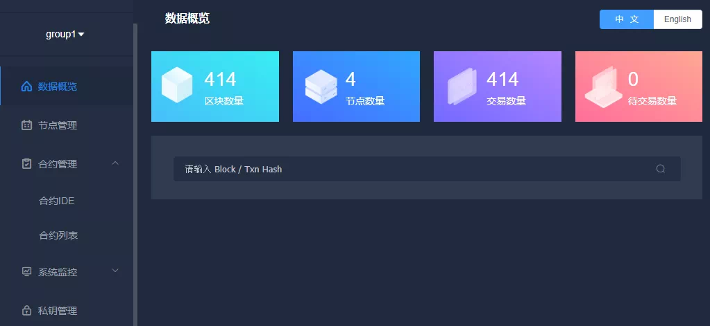
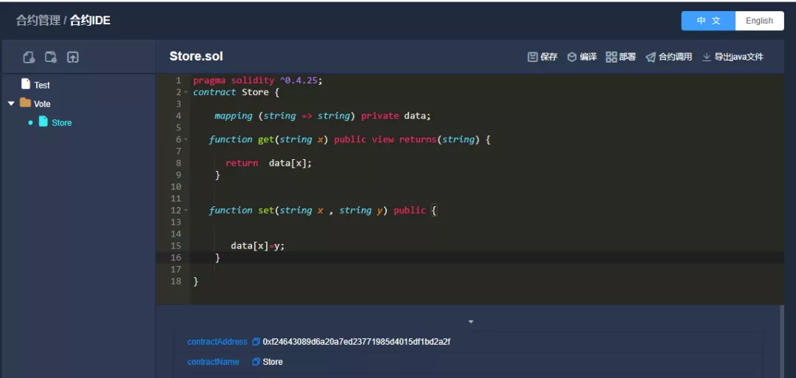
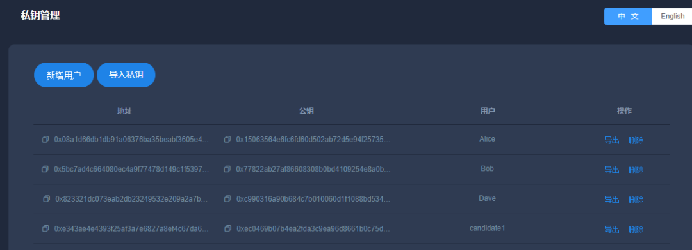
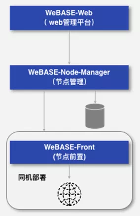

# Function Analysis of Pre-Component of WeBASE Node

Author ： He Shuoyan ｜ FISCO BCOS Core Developer

The FISCO BCOS tethering script has given developers the ultimate tethering experience, how can you quickly build a blockchain visual interface to interact with the blockchain, WeBASE-Front is the fastest component that can meet this expectation。WeBASE-Front provides developers with a subset of the smallest blockchain interaction features, lightweight and easy to install, without the need to install any third-party components。After building a node, build WeBASE-Front. You can open the interface in the browser to quickly start the blockchain experience。

WeBASE-Front also offers a lot of friendly and useful features:

- On the WeBASE-Front homepage, developers can view the block information, transaction information, group information, number of nodes, and node status of the blockchain**The core information of the blockchain network is clear at a glance**。
-WeBASE-Front provides a contract development IDE for developers to write and debug smart contracts**Quickly develop your own blockchain applications**。
-WeBASE-Front integrates the Web3SDK and encapsulates the Web3SDK interface. Developers can call the WeBASE-Front interface to interact with blockchain nodes through HTTP requests。This approach shields the limitations of the SDK language**Developers of any language can interact with the blockchain by calling the WeBASE-Front interface**。

Of course, the functionality of WeBASE-Front is not limited to this。As a member of the WeBASE family, this component is used in conjunction with WeBASE-Node-Manager and WeBASE-Web, as a node front, to monitor the blockchain network in an all-round way, realizing enterprise-level blockchain monitoring functions。

## Function Introduction

WeBASE-Front has five main features:

### I. Data Overview

Display common data that developers care about:**Block height, number of nodes, total number of transactions, number of pending transactions,**And support block information and transaction information query。

### II. Node Management

Displays the**Number of nodes, node ID, block height, pbftview, and node running status**and supports dynamic switching of blockchain clusters。

### III. Contract Management

This is the core feature of WeBASE-Front, and developers can**Write, compile, debug contracts**， 以及**JAVA class for generating contracts with one click**The deployed contracts will be stored in the H2 embedded database, and historical contracts can be queried in the contract list。

### IV. System Monitoring

System monitoring is divided into two aspects:

1. Performance metrics monitoring of node servers, including**CPU, hard disk, memory, upstream bandwidth, downstream bandwidth**；
2. Performance metrics monitoring of blockchain nodes, including**block height, pbftview, and number of transactions to be packaged**。

After the node is running for a long time, you can view the performance of the server through this function。

### V. Private key management

Generate elliptic curve public-private key pairs, supporting**Import Export Private Key**and supports aliasing the address to facilitate address memory。You need to create a public-private key pair before deploying a contract。

## technical analysis

WeBASE-Front is based on FISCO BCOS**spring-boot-starter**(Please refer to the link at the end of the article) A development example of the project。**Web3SDK interface encapsulation, dynamic group switching, deployment call contract (without generating JAVA classes), public-private key pair generation,**These common features please refer to the WeBASE-Front code, developers can learn from and write their own springboot applications。 

For ease of installation and use, WeBASE-Front uses a lightweight**H2 Embedded Database**The backend uses the SSH framework and uses JPA to access the database；Front End Adopt**VUE**Framework development, front-end resources are built into the back-end springboot service, no need to install and configure nginx and mysql these steps, directly start the Java service to access the interface。

The generated public and private keys and deployed contracts are stored in the H2 database for easy query history。The performance monitoring function uses the**sigar**Data Collection Components。The collected data will also be stored in the H2 database, but only the most recent week's monitoring data will be saved。

## Deployment method

As a node front, WeBASE-Front needs to be deployed on the same machine as the node。When deploying multiple nodes on one machine, we recommend that you deploy only one WeBASE-Front service。

There are three ways to deploy WeBASE-Front:

1. Separate deployment is used as an independent console, and is equipped with an interface. The deployment is simple and quick. Just download the WeBASE-Front application and replace the node certificate to start。We recommend that beginners and developers use this deployment method to query information about the blockchain and develop and debug smart contracts。(Please refer to the link at the end of the article for installation)

2. In method 1, WeBASE-Front is used as a visualization console, and the private key is encrypted and stored in the H2 database by default. If a more secure private key protection scheme is required, it can be deployed and used together with the WeBASE-Sign service, and the private key is stored in WeBASE-Sign. The WeBASE-Sign service is responsible for signing transaction data, providing a more secure private key protection scheme。

   This method deploys the WeBASE-Sign service on the basis of Method 1. If the security requirements for the private key are high, use this deployment method。(WeBASE-Sign service please refer to the link at the end of the article)

3. Deploy and use WeBASE-Node-Manager and WeBASE-Web service together. Here, WeBASE-Front is only used as a node front, and multiple node fronts are managed by WeBASE-Node-Manager. WeBASE-Node-Manager has an authentication login system implemented by spring security, and will pull the block information and transaction information on the chain and store it in the Mysql database。It is recommended to use this method in the production environment. The architecture diagram is as follows。(Please refer to the link at the end of the article for WeBASE installation and deployment)

## SUMMARY

As a convenient and powerful blockchain component, WeBASE-Front can be used independently as a visual console for developers to interact with the blockchain. It can also be used in conjunction with WeBASE-Node-Manager and WeBASE-Web to implement blockchain monitoring in production environments。

WeBASE-Front is still under continuous optimization and development, and will add more and more features in the future, such as the system management function of adding and deleting nodes in the alliance chain, and the transaction resolution function。Of course, continuous iterative upgrades will maintain its ease of use and convenience。Welcome community friends to mention PR and ISSUE, participate in optimization together。

------

#### Link Guide

- [Spring-boot-starter](https://github.com/FISCO-BCOS/spring-boot-starter/tree/master-2.0)

- [Sigar Data Collection Component](https://www.jianshu.com/p/c3d88dd617bf)

- [WeBASE-Front Separate Installation Deployment Instructions](https://webasedoc.readthedocs.io/zh_CN/latest/docs/WeBASE-Install/developer.html#)

- [WeBASE-Sign Service](https://webasedoc.readthedocs.io/zh_CN/latest/docs/WeBASE-Sign/index.html)

- [WeBASE installation deployment](https://webasedoc.readthedocs.io/zh_CN/latest/docs/WeBASE-Install/enterprise.html)

