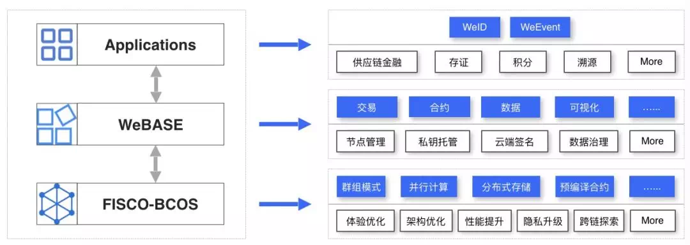

# FISCO BCOS welcomes the blockchain middleware platform WeBASE, application landing speed

With the development of blockchain technology, more and more developers are developing a variety of rich applications based on a stable and efficient blockchain underlying platform, combined with smart contracts and on-chain interfaces, followed by more demand for the ease of use of blockchain systems, the speed of application development, and the richness of business components。

Facing the underlying platform, "naked writing" smart contracts and the underlying code is technically feasible, and further providing "what you see is what you get" and "out of the box" this threshold-free experience is motivated by feedback from community developers, such as

-Lack of easy-to-use smart contract development tools, contract development and debugging efficiency is not high, it is difficult to easily manage the configuration information of each node in the chain and observe its running status。

- The presentation of blocks, transactions, receipts and other data on the blockchain is not friendly enough, making it difficult to conduct flexible and multi-dimensional analysis of the massive data on the chain。

- A common audit tool is required for the various accounts involved in the business and the transactions they conduct in order to detect and eliminate anomalies in a timely manner。

In response to the continuing needs of the open source community and the open sharing of the results of its long-term exploration, the member of the FISCO BCOS Open Source Working Group, WeBank, contributes a high-speed channel from the bottom of the blockchain to the application landing。

**On July 2, WeBASE, a blockchain middleware platform developed by WeBank, was officially launched. The platform supports the underlying FISCO BCOS platform**For a variety of objects, such as developers, operators, and according to different scenarios, including development, debugging, deployment, auditing, etc., to create a wealth of functional components and utilities, providing a friendly, visual operating environment。

Deploying WeBASE based on the underlying FISCO BCOS platform can simplify the blockchain application development process, greatly reduce the time and labor costs for enterprises to build blockchain applications and conduct operational analysis, so that developers can easily control the blockchain network and focus on application development and business landing。

**WeBASE code warehouse address**：https://github.com/WeBankFinTech/WeBASE

## Introduction to WeBASE

**WeBASE (WeBank Blockchain Application Software Extension) is a middleware platform built between blockchain applications and FISCO BCOS nodes**As shown in the following figure, developers can deploy WeBASE interactive modules such as browsers, management desks, and other tools on top of blockchain nodes, and can also develop applications based on WeBASE built-in components and APIs。

WeBASE's "**Simple but not simple**This is reflected in the following aspects:

Provide a friendly smart contract development platform, support online compilation, debugging, testing, deployment of smart contracts, with an efficient editing environment, the first to support Solidity smart contract language。

Second, on the basis of SDK packaging Restful style API interface, Restful interface is more intuitive, good scalability, can easily adapt to a variety of programming languages。The transaction data can be coded and decoded through the interface, and the details of the data on the chain can be displayed in an all-round and multi-dimensional manner on devices including web pages and mobile terminals。

Third, the blockchain management platform is the preferred workbench for operations administrators. It can view the data statistics on the chain, the details of each block, and the multi-dimensional statistical data of each node, and monitor the health of the nodes in an all-round way。

Fourth, the data export component can be configured to export chain data to relational databases, big data processing and other systems, in order to diversify the chain data processing, such as data mining, building business models and so on。

## WeBASE's overall architecture and design principles

The complete architecture of WeBASE is shown in the following figure:

The design concept of WeBASE is to solve a problem with one subsystem and run without deploying all subsystems, so the following principles are followed at the beginning of the design:

**On-demand deployment**WeBASE abstraction abstracts the common features of application development to form various service components, such as business access, private key management, transaction queues, contract development, data export, and auditing. Developers deploy the required components as needed。

**Microservices architecture**WeBASE uses a microservice architecture, based on the spring-boot framework, and provides Restful-style interfaces。

**zero coupling**: All WeBASE subsystems exist independently, can be deployed and run independently, and provide services for different scenarios, avoiding the redundant burden of "whole family bucket"。

**Customizable**: The front-end experience often has the developer's own business performance, such as different styles, different interaction styles, different brand performance, etc. Therefore, WeBASE adopts the design of separating the front and back ends, the back-end interface is stable and extensible, and the front-end page is freely customized by the developer。

## Application Development Process Based on WeBASE

The WeBASE-based application development process has a new experience, and the following diagram visually compares the differences between the two development processes

Obviously, based on WeBASE application development, the process is greatly simplified。Smart contract development tools, perfect data visualization platform, simple transaction chain way, reduce the development threshold, making the development efficiency greatly improved。And for the application after the launch of the transaction audit, data export, three-dimensional monitoring and other aspects of the management, WeBASE provides a series of complete components, can effectively avoid developers and enterprises repeatedly break the road。

## WeBASE's Next Step

Today,**WeBASE open source is just a small step, in the future, WeBASE will have plans to open more features**：

- Provide more business-proven components that face the business field, facilitate integration into applications with common models, and establish blockchain application development best practices and standard architectures；
- Provide various industry solutions and reference implementations；
- Provide more friendly access for cloud vendors。

## Community Developer Experience

- **Network Technical Director Lin Dongyi** GUANGZHOU PINGO SOFTWARE CO., LTD

> PAGO Software is a cloud computing company that is exploring the integration of cloud computing and blockchain innovation。WeBASE has the characteristics of friendly interface design, convenient management and good integration of cloud ecology, which makes the cloud on the blockchain easier, and we can focus more on the business scenarios of blockchain and cloud computing。

- **Architect Wei Wei** Baofu Network Technology (Shanghai) Co., Ltd

> WeBASE is easy to operate, the community documentation is very complete, covering all kinds of components required by the enterprise, pluggable architecture design, according to the required combination, help us solve the worries of blockchain technology, shorten the process of business data, and quickly realize business value。

- **CTO Jin Zhaokang** Hangzhou Yibi Technology Co., Ltd

> WeBASE's alliance governance, pre-management capabilities make managing a blockchain as easy as managing a chat group。The timely response of the community and the rapid iteration of functions reflect the strength of the top blockchain service providers in China。

- **Blockchain Architect Sun Yaopu** Full Chain Link Co., Ltd

> WeBASE each system module provides a wealth of deployment documents, clear deployment steps, according to the deployment documents can be quickly deployed and used, the UI design and layout of the system is also very reasonable。
>
> The registration and login function meets the customer's requirements for blockchain information query permission management and reduces the development workload；The system integrates the java interface of FISCO BCOS, provides a rich call interface, reduces the development workload, and reduces the difficulty of using the blockchain。
>
> The system provides smart contract editing, compilation and deployment functions, making smart contract development more convenient。

- **Founder Zhang Long** Drop into the sea(Guangzhou)Information Technology Limited

> Judi Chenghai is a middleware provider that focuses on deep blockchain mining, and we need to provide packaged interfaces directly to customers to reduce their development workload。Due to the special nature of our products, we need to be compatible with multiple ecosystems and inclusive of multiple consensus mechanisms, so our development workload is very large！
>
> However, WeBASE has encapsulated various interfaces very well, and can be quickly connected with only a little exposure！We hope that WeBASE can continue to support the open source community, and we are willing to continue to pay and contribute to it。

