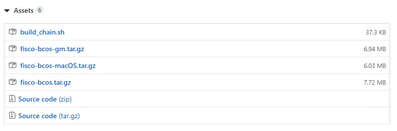

# FISCO BCOS fast way to build chain

Author ： Bai Xingqiang ｜ FISCO BCOS Core Developer

Like many developers, when the team first started to build the chain, they also went through the stage of confusion: which version to install, how to compile for so long is still prone to errors？With several nodes, what IP ports are used？Where do certificates come from and where do they go?？How do I verify that my chain is really up？...

I believe that the engineers who started from the FISCO BCOS1.X version have a small volcano in their hearts, facing super-long documents and super-many operation steps...... Every time a version is deployed, it takes a lot of time, and the engineers can almost spread an egg on their heads。The data shows that if a software is not used for 15 minutes, users will be lost。
In order to extinguish the small volcano in everyone's heart and play the blockchain happily together, FISCO BCOS's ease of use optimization is imperative。The team's first goal is to get developers**Set up a development test chain in 5 minutes**, which requires a summoning-like command from Harry Potter, which we call**build_chain**。
This article will talk about the birth of the build _ chain script and how current scripts can help。

## Birth of the build _ chain script

The first is to remove the compilation step, the source code compilation not only needs to install the download dependency, but also needs to configure the development environment, even if these two steps go well, the compilation process may also fail due to lack of memory, not to mention the download dependency is often affected by the network speed caused by the download failure。So we provide a pre-compiled binary distribution package that lets users skip the lengthy compilation phase。
Immediately we found a new problem, even though binary distribution packages are available for different platforms, the user's environment is ever-changing, and the installation of the dynamic libraries on which the precompiled program depends becomes a problem。
So we thought of providing a statically compiled binary distribution package that is compatible with a variety of Linux 64-bit operating systems and does not rely on any other libraries, saving time and effort。In order to achieve static compilation, we do not hesitate to re-implement some functions to remove the dependence on external libraries that do not provide .a。
Next we try to reduce the deployment steps and reduce the pressure on users。

Too many configuration items are too flexible, we optimize the configuration, all configurations provide appropriate default values, delete configuration items that do not need flexible customization。
The configuration file in json format is not intuitive enough to read, and manual modification is easy to cause errors due to format problems. We replace it with a clearer ini file。
Manual deployment of system contracts is too cumbersome. We use precompiled contracts to implement built-in system contracts to manage on-chain configurations。
The node directory structure of manual construction and tool script construction is not unified. We organize documents, unify the directory structure created by tools, and provide auxiliary scripts。

After the above optimizations, we think there can be a more lightweight deployment method, and we can try to complete everything in the deployment process through a script。
Scripts are lighter and faster than large, full deployment tools；Scripts can be simpler than manual deployment。In this way, the build _ chain script was born。

## Help provided by the build _ chain script

This script can complete environment check, parameter analysis, FISCO BCOS binary distribution package download, public and private key certificate generation, configuration file generation and tool script generation, etc. It supports MacOS, Linux 64bit, docker mode and national secret version construction。
However, after actual use, we found that under the network conditions at home, the script takes a long time to download the binary distribution package, resulting in a FISCO BCOS chain that cannot be completed within 5 minutes。
In order to achieve the goal of 5 minutes to build the chain, we have added CDN support, even if the network conditions are not very good, you can also smoothly complete the chain in 5 minutes。The heart of the small volcano extinguished。

Specifically, the help that the build _ chain script can provide includes the following:

### Environmental inspection

The build _ chain script needs to use OpenSSL to generate the relevant certificate files that the node needs to use, while FISCO BCOS 2.0 requires OpenSSL 1.0.2 or later。The script can continue execution only if a version of the program that meets the requirements is found。
Note that MacOS comes with LibreSSL, so you need to use brew install OpenSSL to install OpenSSL。

### Parsing Parameters

The build _ chain script supports many custom parameters, such as -p to specify the port range used by the node, -f to build a network with a specified configuration, -g to build a secret version, -v to specify the FISCO BCOS program version number, and -o to specify the output path. [See details](https://fisco-bcos-documentation.readthedocs.io/zh_CN/latest/docs/manual/build_chain.html#id4)

### Get FISCO BCOS executable

FISCO BCOS provides standard and secret versions of precompiled executable programs that can run on most x64 Linux machines。In addition, for the convenience of developers debugging, while providing a MacOS version of the executable program。

-build _ chain script will download the corresponding executable program according to the operating system and whether the country secret。
-When downloading executable programs from GitHub is slow, it will automatically switch to CDN download。As can be seen in the figure below, fisco-bcos.tar.gz is only 7.72M。
-When the version is not specified with the -v option, the script will automatically pull the latest version released by FISCO BCOS on GitHub. When the -v option is used, the executable program of the specified version is downloaded。

In addition to the official clear Ubuntu 16.04+and CentOS 7.2+In production, it is recommended to use the source code to compile the obtained executable program, and then use the -b option and the -f option to build the blockchain network。

###  Generate private key certificate

FISCO BCOS supports certificate chains. By default, the three-level certificate chain structure is used. The self-signed CA certificate is used as the root certificate of the chain. The authority certificate issued by the CA is used to distinguish the authorities, and then the authority private key is used to issue the certificate used by the node。
The conf directory of the node contains three files: ca.crt, node.key, and node.crt. The node uses these three files to establish a two-way SSL link and uses node.key to sign the block in the consensus process。
If it is the state secret version, the script will download the TaSSL tool and generate the certificate file of the state secret version。

###  Generate configuration files and tool scripts

The build _ chain script has a built-in configuration file template for FISCO BCOS nodes, which is modified according to the parameters specified by the user to generate the configuration file used by the node([Can view the description of the configuration file](https://fisco-bcos-documentation.readthedocs.io/zh_CN/latest/docs/manual/configuration.html))。

At the same time, in order to facilitate users to start and stop nodes, start.sh and stop.sh will also be generated under the node directory ([can view the node directory structure description](https://fisco-bcos-documentation.readthedocs.io/zh_CN/latest/docs/manual/build_chain.html#id5)）。

## SUMMARY

Here are a few tips for the FISCO BCOS team to improve deployment speed and achieve rapid chain building:

- 1. Provide statically compiled binary distribution packages, compatible with multiple operating systems, allowing users to skip the lengthy compilation phase。
- 2. Simplify the configuration, maximize the use of default parameters that can guarantee the maximum success rate, minimize the information that users need to pay attention to, and users only need to pay attention to a small amount of network configuration。
- 3. Standardized directory structure, whether it is a one-click chain, enterprise-level chain, manual chain... the goal is the same, reducing the complexity of differentiation。
-4. Using the script skillfully, the build chain script can automatically string up a series of routine operation steps from preparing the environment to starting all chain nodes, and automatically handle various possible small exceptions, making the whole process seem flowing。
-5. Optimize the dependency library address, network speed, etc., greatly reduce the user's waiting consumption, talk and laugh, the chain has been set up。

For students and production environments who want to learn more by building manually, we recommend that you use the enterprise deployment tool generator provided by us。
In terms of performance and ease of use, it is worthwhile to make more efforts, we will continue to work hard to optimize, and community participants are very welcome to make optimization suggestions and bugs。

------

#### Reference Links

**Enterprise Deployment Tools generator**：https://fisco-bcos-documentation.readthedocs.io/zh_CN/latest/docs/enterprise_tools/index.html

