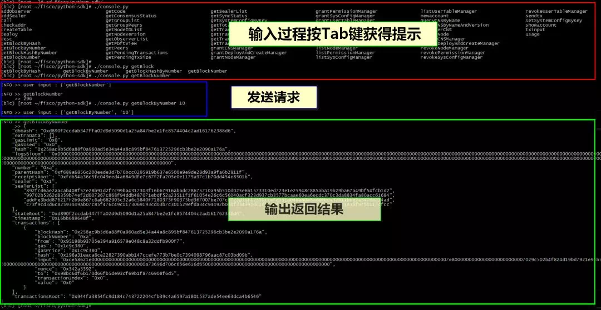
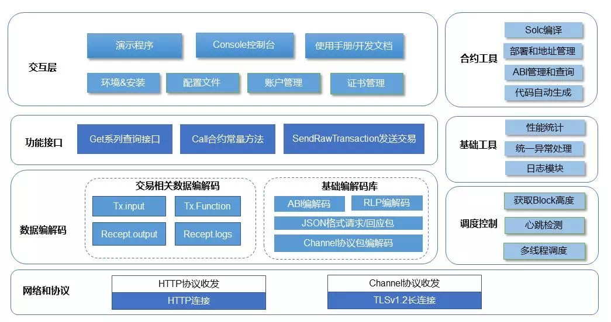
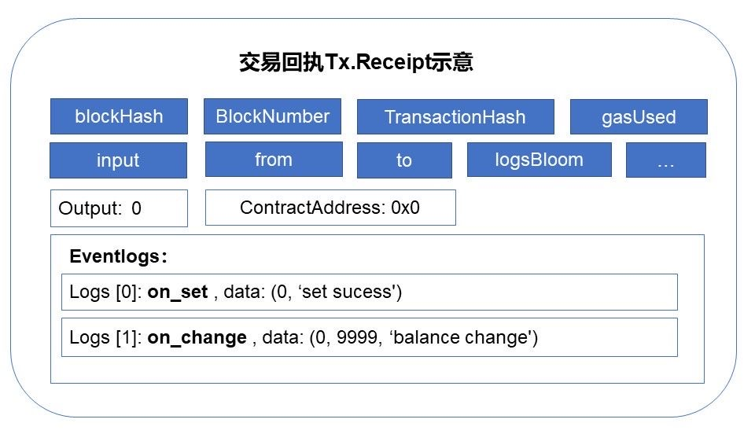

# Although the sparrow is small, it has all five internal organs.| From Python-SDK Talk about FISCO BCOS Multilingual SDK

Author: Zhang Kaixiang ｜ Chief Architect, FISCO BCOS

FISCO BCOS 2.0 has its own official console since its release. After continuous use and polishing by the community, it is strong enough, perfect and friendly。

The community also has blockchain applications developed in various development languages. In order to meet the needs of developers to facilitate the management of blockchain nodes, Python is currently-SDK and Nodejs-The SDK is already on the shelves, and the go language version is already on the way.。

----

In this article, the author is most familiar with Python-Take SDK as an example, and share some details about SDK development, including the application development process, protocol coding and decoding, network communication, and security issues.。

FISCO BCOS comes with its own quick build feature, after five minutes of one-click chain, developers only need to connect to the blockchain node, write contracts, issue transactions。

The console and SDK are positioned to help users quickly access the blockchain, develop and test smart contracts, and implement business logic.。According to "**Occam Razor**"The design philosophy should be as light, modular, and shallow as possible, without introducing redundant features, and without creating an additional burden on users and secondary developers."。

The client console and SDK are like a well-controlled and well-configured express for developers and users to drive, relax and enjoy the road of blockchain applications.。

## Console Experience

First, combine the whole process from preparing the environment to calling the contract, and experience the console. The command line interface style is as follows:



#### 1. Prepare the environment

Before you begin, please**Read through user manuals and development documentation (very important！link at the end of the article)**According to the documentation, step by step initializes the environment, installs the dependency library, and currently Python-SDK supports Linux / Mac / Windows operating systems。

To connect to a blockchain node, you need to modify the local configuration file and enter the corresponding network port of the blockchain node. If you select the Channel protocol, you need to configure the corresponding client certificate。

#### 2. Online Experience

After configuring the network, you can run the get series of commands in the console。Try the feel and get in touch with FISCO BCOS。Confirm that the chain is working properly. Common commands include getNodeVersion, getBlockNumber, getPeers, and getSyncStatus. You can use the console usage or help command to learn about all supported commands.。

#### 3. Create an account

Create a new account, a public-private key pair that represents your identity, and send transactions signed with the private key。The created account is saved in the local file system in keystore format, and the user can set a password to protect this file, taking care to remember the password used to create the account。

The account-related commands provided by the console are**newaccount, showaccount**(parameters are account name and password)。If you want to use the new account you just created to sign the transaction, remember to configure it to the appropriate location in the client _ config.py file。

In addition, if the account information requires a high level of protection, secondary development is possible。Put it into secure areas such as encryption machines and TEEs, and develop solutions such as key fragmentation and mnemonics.。

#### 4. Preparation of contracts

Write a smart contract, or modify and customize it according to the smart contract example in the SDK to implement your own business logic.。This article focuses on the Solidity smart contract, FISCO BCOS also has a "pre-compiled contract," using C.++Development, need to compile jointly with FISCO BCOS underlying code。

#### 5. Compile deployment

Compile the contract to obtain the ABI interface file and BIN binary file of the contract.。Python-The bcos _ solc.py file in the SDK can help developers simplify compiler configuration and invocation. At the same time, as long as the contract path and compiler path information are correctly configured, run the console deployment or call contract interface instructions directly, and try to compile the contract automatically.。

If the contract is deployed independently, you can use the deploy command of the console, and the new contract address will be obtained after the deployment command is successful.。The reference command is. / console.py deploy SimpleInfo save, where SimpleInfo is the contract name (no suffix required), and the final"**save**"is optional, if you specify"**save**"the new contract address is recorded in a local file for subsequent use.。

#### 6. Call the contract:

Use the call or sendtx command to specify the contract name, contract address, method name, and corresponding parameters to call the on-chain contract.。

Refer to the command. / console.py sendtx SimpleInfo last setbalance 100, that is, select the SimpleInfo contract and point to the address of its most recently deployed success (with"**last**"refers to, you can save the tedious operation of copying and pasting the contract address), call the setbalance interface, pass in the parameter 100。

After the transaction consensus is completed, the console will automatically print the method return code and transaction Event log information list in the transaction receipt for the user to view.。

If everything is normal, you can basically follow the path of blockchain application here.。

It is worth mentioning that FISCO BCOS several language versions of the console, all support the Tab key to prompt instructions and automatic completion, to help users smooth and error-free operation, improve the user experience。

Still further, if you want a rich, visually interactive page experience, use the WeBASE middleware platform。

## Learn More (Dive Deeper)

The module combination of the whole SDK is as follows, it can be said that although the sparrow is small, the five internal organs are complete.。



### Function Interface

Supporting interactive modules such as the console is a fully encapsulated, out-of-the-box functional interface API, including:

#### 1. get series

Many "get" beginning of the interface, used to obtain a variety of information on the chain, including blocks, transactions, receipts, status, system information, and so on.。Although dozens of get interfaces, but its implementation logic is basically the same, are specified command words and parameter lists, requests and processing responses, the implementation is also very fast.。

#### 2. call

Constant method corresponding to contract。The so-called constant method means that the corresponding code in the contract does not modify the state, the request will not be broadcast across the network, only run on the specified node.。

#### 3. sendRawTransaction

Build a transaction, sign it with the account's private key, send it to the chain, this transaction is broadcast, consensus processing is performed, and the generated status data is confirmed by the entire network。Deploying a new contract is actually a transaction, but you don't need to specify the target contract address.。

Related is**sendRawTransactionGetReceipt**The name is long, in**sendRawTransaction**On the basis of the increase in the process of obtaining receipts**，**Used to simplify the closed-loop process from issuing transactions to obtaining receipts。

#### 4.More

The API for FISCO BCOS's global system configuration, node management, CNS, permissions and other system-level functions, which is based on the system contract on the read-write chain, see the end of the article for a detailed list of instructions.。
Developers can refer to the console and client / bcosclient.py and other code for secondary development to achieve more cool features.。In addition, a series of development libraries and gadgets are built into the SDK to help manage accounts, output logs, unified exception handling, and simple performance and time-consuming statistics.。

## Contract development related

Around contract development, Python-The SDK implements contract compilation and deployment, contract address localization management, ABI interface file management, and supports automatic code generation (see codegen.py). A command line can generate code for direct use by the business side, such as

python codegen.py contracts/SimpleInfo.abi。

The ABI file compiled by the solidity contract is a good thing.。The full name of ABI is**Application Binary Interface**(application binary interface), which details the contract interface information, including method name, parameter list and type, method type (constant method, or transaction method), and Event log format definition, etc.。

For ABI management, see client / datatype _ parser.py, load and parse ABI files (default is JSON format), according to the method name, method 4-byte signature, method type and other dimensions, flexible query method list and method definition, and for method definition, input data encoding and decoding, parsing transaction return values, Event logs, etc.。

With the ABI definition in hand, the manipulation of the contract is simply arbitrary, developers read the ABI description, basically can fully understand the input and output of a contract, and the contract without obstacles to dialogue, this "**Programming for Remote Interface**"The idea is very similar to classic software design such as WSDL, IDL, ACE, ProtoBuffer, and gRPC.。

In fact, the most cumbersome part of the entire SDK is the ABI codec. In order to be compatible with EVM, FISCO BCOS uses ABI encoding for transaction processing and is compatible with the RLP protocol.。

ABI, RLP has established strict specifications, the basic data types, arrays and variable-length data, function methods, parameter lists, etc. have specific coding and decoding methods, otherwise the components can not communicate with each other, the data can not be parsed, the virtual machine "does not know" the input transactions, can not execute the contract.。

If you write the codec here by yourself, it will take a lot of time, even if you are proficient, to ensure that the test passes and the version is compatible, fortunately, there is already eth on github.-abi、eth-utils, rlp and a series of open source projects (mostly MIT loose license agreement), can be introduced into these projects and revised according to specific needs (retain the original author's statement and copyright open source license), can save a lot of work, to thank the authors of these projects, open source is cool.！

## Transaction data structure related

In addition to the basic codec, you also need to implement the FISCO BCOS transaction structure, focusing on the randomid and blocklimit fields added to support parallel processing transactions, the fiscoChainId and groupId fields added to support group features, and the transaction output added to the transaction receipt.。

The blocklimit of a transaction is defined as "the transaction lifecycle, the block height of the transaction to be processed at the latest," and the SDK needs to periodically query the current block height on the chain to determine the lifecycle of the current transaction (for example, this transaction is allowed to be processed within the next 100 blocks).。

For developers, a clear understanding of the transaction input (tx.input), transaction receipt (tx.receipt), transaction output(tx.output)is very important。


When a transaction calls a method in a contract, it first combines the method name with a list of parameter types, such as**'set(string,uint256,address)'**Keccak this paragraph of text-256 (SHA-3)Compute and intercept the first 4 bytes as the "method signature" (signature), and then perform ABI encoding on the incoming parameters in turn according to the type definition, and"Method signature"Splicing a string of binary data as input data for the transaction。

And other fields of the transaction structure (from, to, groupid, randomid, etc.) together with RLP encoding, and signed with the account private key, to obtain a piece of binary request data, sent by sendRawTransaction to the node, after the node receives, immediately return the transaction Hash to the client.。

The transaction is confirmed by the network consensus on the chain, and after the processing is completed, the detailed results of the transaction processing can be obtained through the getTransactionReceipt interface (the transaction Hash obtained before the incoming).。



The following fields are particularly critical in transaction receipts.

#### 1. contractAddress

Valid only when contract transactions are deployed, indicating the address of the new contract。

#### 2. output

The return value of the corresponding method, which can be used to determine the final result of the business logic (depending on how the contract is written).。

#### 3. Logs

If you write some Event logs in the contract code, you can decode the detailed information in the logs field of receipt.。Event logs can be used to help clients monitor and track transaction processing results, and can even help developers debug the contract execution process, which is equivalent to typing debug logs in the contract.。Of course, when the contract is officially released, the debugged Event log should be cleared and only the necessary logs should be retained to avoid redundant information being stored on the chain.。

Python-The SDK client has built-in methods for parsing fields such as "method signature" (find the corresponding method definition based on the 4-byte signature), transaction input / output, and receipt.logs.。

When using the console command line, as long as the contract name is attached to the command line (provided that the user knows what contract the transaction is calling), the relevant data can also be automatically parsed, for example:. / console.py getTransactionReceipt 0x79b98dbb56d2eea289f756e212d5b6e5c08960beaaaempa33c。

This thoughtful little design can help developers intuitively explore the context of blockchain transactions, be clear about all kinds of information at a glance, and not get lost in the sea of hexadecimal characters like gobbledygook.。

## network protocol

Finally, let's talk about the two network protocols of FISCO BCOS: JSON RPC and Channel Long Connect.。


JSON RPC connections do not have certificate verification and communication encryption. It is recommended to use them in a secure and trusted environment, such as a local machine or an intranet. It is generally used for O & M management and statistical analysis.。

The format of JSON RPC is quite simple and universal. Various language libraries have built-in JSON codec and HTTP request protocol implementation, which generally do not need to be developed by themselves, and you can even use curl, telnet and other tools to send and receive, such as:

```
// Request
curl -X POST --data '{"jsonrpc":"2.0","method":"getBlockNumber","params":[1],"id":1}' http://127.0.0.1:8545 |jq
// Result
{    "id": 1,    "jsonrpc": "2.0",    "result": "0x1"    }
```

Channel protocol is a unique protocol of FISCO BCOS. Channel protocol is characterized by security and efficiency, supports two-way real-time communication, and can be used for remote calls and even public network communication.。

If you use the channel long connection method, you need to obtain the SDK certificate from the blockchain node and place it in the corresponding path of the SDK project.。

The packet format of this protocol is shown below and is a TLV(Tag/Length/Value)Extended implementation of style:


**Format Description:**

1. All shaping number codes are network-ordered, big endian；
2. Length actually contains the length of the entire packet from the first field to the last field (data)；
3. Baotou (Length+Type+Seq+Result) is a fixed length, which is (4+2+32+4) = 42 bytes；
4. The actual length of the data body varies according to the specific content, and the number of bytes is Length-42 bytes。

**The main points of channel long connection communication and data transmission and reception are as follows:**

- 1. Using TLSv1.2 secure transmission, a certificate needs to be loaded between the SDK and the node, and a long connection can be established after handshaking and verification with the certificate。

- 2. Long connections are maintained with heartbeat packets, which need to be initiated regularly。

- 3. Data is encoded into streaming data transmission by packet, so when sending and receiving data, it is necessary to continuously obtain data from the socket stream, and judge whether the length is legal, whether the data is received, and whether it can be correctly parsed according to the format of the data packet.。


- 4. The Channel protocol supports two-way communication. The SDK can actively request nodes, and nodes may also push messages to the SDK, such as blockchain system notifications, data update notifications, and AMOP cross-agency messages.。

- 5. Design asynchronous, queued, callback message processing mechanism, according to the message sequence number, instruction type, status code and other dimensions, correctly handle the message。Python-The SDK uses multithreading and the Promise library to process messages as quickly and elegantly as possible.。

Developers with some experience in socke streaming data programming will not be difficult to understand this protocol and implement it。For channel protocol implementation, see client / channelpack.py for packet parsing and client / channelhandler.py for communication and data sending and receiving.。

## SUMMARY

Python-The development of the SDK began in mid-June this year, and it took only a week to write the first available version, and then to carve out the details of user interaction, as well as code optimization, documentation improvement, and multiple rounds of testing to ensure quality, the rest of the team to implement the Nodejs version of the SDK in about the same time.。
In general, with some basic code references, developing a FISCO BCOS language-specific SDK is still quite agile and freehand, and it's not difficult at all, Just for fun.。
During the development and iteration of the SDK in various languages, the FISCO BCOS team and community developers have been communicating, incorporating high-quality pull requests and continuously optimizing the experience.。

Community developers are welcome to continue to improve the existing SDK or contribute FISCO BCOS SDK in more languages according to the actual situation of their usage scenarios, so as to help more developers walk on the blockchain smoothly.。
Finally, I would like to thank Jago, Mr. An, Xiaobai, wheat and other students, as well as many community developers for their interest in Python.-Important contribution of SDK。

------

#### References

- [FISCO BCOS Official Console](https://github.com/FISCO-BCOS/console/tree/master-2.0)
- [Python-SDK](https://github.com/FISCO-BCOS/python-sdk)
- [Nodejs-SDK](https://github.com/FISCO-BCOS/nodejs-sdk)
- [FISCO BCOS INSTALLATION](https://fisco-bcos-documentation.readthedocs.io/zh_CN/latest/docs/installation.html#fisco-bcos)
- [Contract Development Tutorial](https://fisco-bcos-documentation.readthedocs.io/zh_CN/latest/docs/manual/smart_contract.html)
- [WeBASE](https://fintech.webank.com/webase)
- [ABI](https://solidity.readthedocs.io/en/latest/abi-spec.html)
- [RLP](https://github.com/ethereum/wiki/wiki/RLP)
- [Transaction Data Structure](https://fisco-bcos-documentation.readthedocs.io/zh_CN/latest/docs/design/protocol_description.html)
- [RPC Principle](https://fisco-bcos-documentation.readthedocs.io/zh_CN/latest/docs/design/rpc.html)
- [Channel Protocol Definition](https://fisco-bcos-documentation.readthedocs.io/zh_CN/latest/docs/design/protocol_description.html#channelmessage-v1)
- [SDK Certificate](https://fisco-bcos-documentation.readthedocs.io/zh_CN/latest/docs/manual/certificates.html)
- [AMOP Cross-Agency](https://fisco-bcos-documentation.readthedocs.io/zh_CN/latest/docs/manual/amop_protocol.html)

