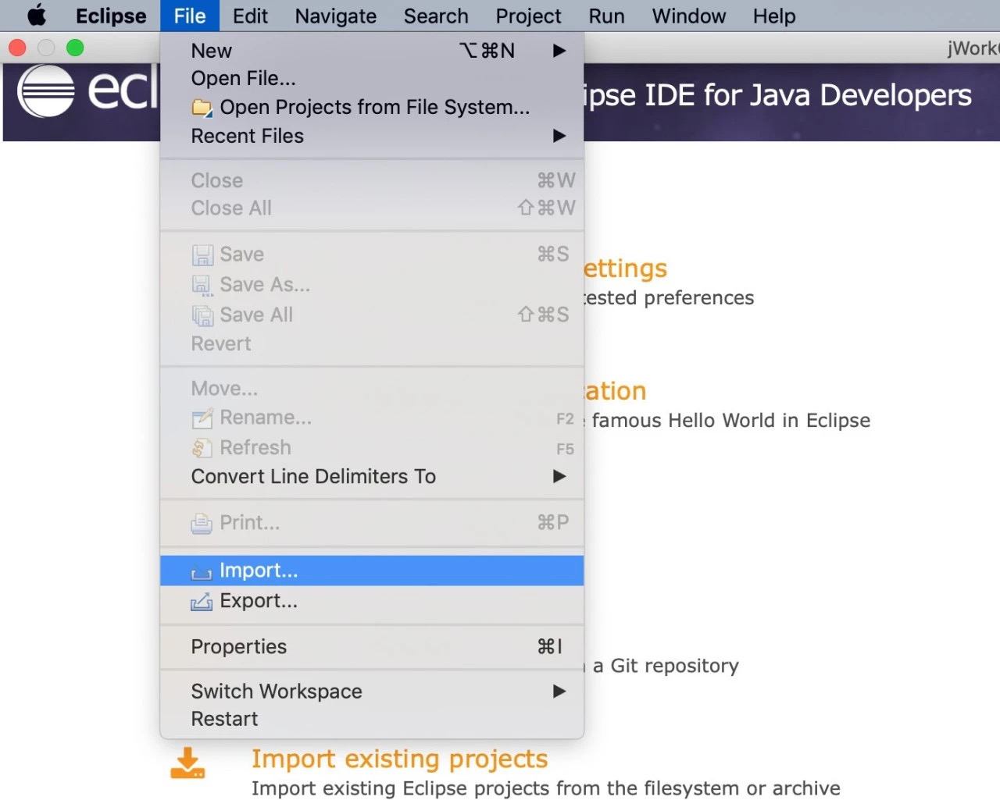

# Teach you how to use JavaSDK in Eclipse

Author ： WANG Zhang ｜ FISCO BCOS Core Developer

Eclipse is one of the current mainstream Java IDE, this article will be hands-on, guide how to create FISCO BCOS JavaSDK applications in Eclipse。

This article first describes how to create a new project in Eclipse, introduce JavaSDK dependencies into the project, interact with the blockchain through configuration, and finally get the blockchain's block high validation to create the project。At the same time, this article will also introduce a more convenient way to use it in actual development, and import the sample projects already provided into Eclipse.。

**Note:**

The article project is built in Gradle mode. Please make sure that the following environments are installed correctly: 1. Java 1.8 or later；2、

##### Preconditions:

Refer to [Installation Documentation](https://fisco-bcos-documentation.readthedocs.io/zh_CN/latest/docs/installation.html)Completed the construction of the FISCO BCOS blockchain. Functional testing requires interaction with blockchain nodes。

## **Eclipse Creating a New Project**

### Creating a Gradle Project

Open Eclipse, right-click and select the Project option under New, as shown in the following figure:


In the New Project dialog box that appears, select Gradle = > Gradle Project and click Next:


Click Next again and enter the project name in the following interface, where the project name is sample。


Click Finish and wait for the project to initialize。


After the project is initialized, a new Gradle project has been created。Next, we need to modify the build.gradle file of the project to introduce the maven library of the JavaSDK and the dependent version。

### Project introduces JavaSDK dependencies

Open the build.gradle file and add the required maven library to the repositories:

```
repositories   { 
    / / other maven libraries
    / / solidity compiler maven library
    maven { url"https://dl.bintray.com/ethereum/maven/" } 
    / / JavaSDK snapshot version maven library
    maven{ url "https://oss.sonatype.org/content/repositories/snapshots"} 
    / / JavaSDK maven library
    maven { url"http://maven.aliyun.com/nexus/content/groups/public/" } 
     / / general maven library
     mavenCentral() 
    }
```

Add dependency version of JavaSDK in dependencies:

```
dependencies { 
       / / Other Dependencies

       / / Log dependency
       compile ('org.slf4j:slf4j-log4j12:1.7.25') 
       / / JavaSDK dependency, version 2.1.0
       compile ("org.fisco-bcos:web3sdk:2.1.0") 
   }
```

Then right click on the project name: Gradle = > Refresh Gradle Project Refresh Project。


**注意**: To refresh the project, you may need to download the JAR-dependent package from the remote Maven library. Please ensure that the network is unblocked. The download process will take some time.。

### Certificates and Profiles

JavaSDK service running depends on the applicationContext.xml configuration file and certificate。View [Configuration Reference](https://fisco-bcos-documentation.readthedocs.io/zh_CN/latest/docs/sdk/java_sdk.html#fisco-bcos)。Copy the configuration file applicationContext.xml and the certificate file ca.crt sdk.crt sdk.key to the project src / main / resources directory。


### Create a Run Test Class

At this point, we have completed the creation of the new project, introduced and completed the configuration of the JavaSDK, and now let's test the functionality of the project。

### Create a class package

Right-click the project name, select New = > Package, and enter the package name. Here, use org.fisco.bcos.test。


### Create a test class

Right click on the package name and select 'New = > Class "。


Enter the class name and click Finish, where the class name uses NodeVersionTest。


The function of the test class is to call the getBlockNumber interface to get the current block height:

```
package org.fisco.bcos.test;

import org.fisco.bcos.channel.client.Service;
import org.fisco.bcos.web3j.protocol.Web3j;
import org.fisco.bcos.web3j.protocol.channel.ChannelEthereumService;
import org.fisco.bcos.web3j.protocol.core.methods.response.BlockNumber;
import org.springframework.context.ApplicationContext;
import org.springframework.context.support.ClassPathXmlApplicationContext;

public class NodeVersionTest {
 public static void main(String[] args) throws Exception {
  
  ApplicationContext context = new ClassPathXmlApplicationContext("classpath:applicationContext.xml");
  Service service = context.getBean(Service.class);
  service.run();

  ChannelEthereumService channelEthereumService = new ChannelEthereumService();
  channelEthereumService.setChannelService(service);
  / / Web3j object
  Web3j web3j = Web3j.build(channelEthereumService, service.getGroupId());
  / / Call the getBlockNumber interface to obtain the
  BlockNumber blockNumber = web3j.getBlockNumber().send();
  System.out.println("BlockNumber: " + blockNumber.getBlockNumber());
  System.exit(-1);
 }
}
```

Right-click the NodeVersionTest.java file and select Run As = > Java Application Run Test Class。


Run results:


## Eclipse Import Project

As can be seen from the above process, the process of creating a new project requires more configuration processes, in order to facilitate the use of users, we provide the existing sample project asset-App, users can quickly import it into Eclipse, and quickly modify and develop their own applications based on the sample.。Please refer to [asset-App Project Details](https://fisco-bcos-documentation.readthedocs.io/zh_CN/latest/docs/tutorial/sdk_application.html)。

### Download asset-app project engineering

Download [asset-app](https://github.com/FISCO-BCOS/LargeFiles/raw/master/tools/asset-app.tar.gz)After downloading, extract locally to the specified path。

[asset-app gitee download](https://gitee.com/FISCO-BCOS/LargeFiles/raw/master/tools/asset-app.tar.gz)

### Import Engineering

Open Eclipse Select: File => Import => Gradle => Existing Gradle Project。




Click Next and select Asset-app path, click Finish and wait for the project to load。


After the project is loaded, right-click the project name: Gradle = > Refresh Gradle Project Refresh Project。


ok! asset-The app project has been loaded normally。

