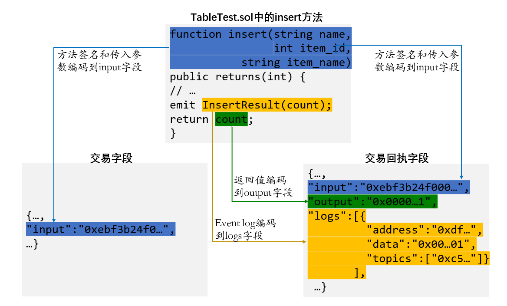

# FISCO BCOS Trade Resolution Tool Guide

Author ： Liao Feiqiang ｜ FISCO BCOS Core Developer

> This article will introduce FISCO BCOS's transaction parsing tool, which helps developers easily and quickly parse the input, output, and logs fields in transactions and transaction receipts to help blockchain application development。

Community users often ask: does FISCO BCOS's smart contract support getting the return value directly after sending the transaction?？What is stored in the input, output and logs fields in the transaction and transaction receipt, very curious, can you understand it?？How to solve？

Now, let the FISCO BCOS transaction parsing tool unravel this mystery！

## What: Parse what？

The parsing tool parses three important fields in the transaction and transaction receipt, namely input, output, and logs.。What do these three fields represent and what does it have to do with smart contracts?？Please give a picture below for analysis.。



In order to highlight the key points in the figure, only the key codes related to the transaction resolution fields in the TableTest.sol contract are shown (the TableTest.sol contract is a sample contract provided by the console, which is used to create the sample table t _ test and provides methods for adding, deleting, and modifying。The complete contract code can be found in the console directory contracts / consolidation / or directly through the document, please refer to: https://fisco-bcos-documentation.readthedocs.io/zh_CN/latest/docs/manual/smart_contract.html#crud）。

The transaction and transaction receipt fields, again highlighting only the input, output, and logs fields to be parsed, and omitting the other fields。The transaction information contains the input field, and the transaction receipt information contains the input, output, and logs fields.**(Note:**Transaction receipts returned by FISCO BCOS 2.0.0 and above contain the input field**）。

As you can see from the figure, the blue part is the signature of the insert method, the method signature part and the parameters passed in to call the method, which will be encoded into the input field (hexadecimal string) of the transaction and transaction receipt。

The green part is the return value of the method, which will be encoded into the output field of the transaction receipt (hexadecimal string)。Here can answer a user's question,**That is, FISCO BCOS smart contracts support the return value after sending a transaction, which will be encoded and saved in the output field of the transaction receipt, and the return value can be parsed using the transaction parsing tool.**。

The orange part is the event of the method call, which can record the event log information, which will be encoded into the logs field of the transaction receipt (where address is the call contract address, data is the hexadecimal encoding of the event log data, and topic is the hexadecimal encoding of the event signature)。

It follows that the input, output, and event log of the contract method are encoded in the input, output, and logs fields corresponding to the transaction and transaction receipt.。To know which method of a contract is called for a transaction or transaction receipt, and what data the input, output, and event log are, all you have to do is parse these three fields, which is exactly what the transaction parsing tool is trying to solve.！

## How: How to use？

Transaction resolution is a feature provided by web3sdk 2.0.4 and above。Its use is very simple, the trilogy is as follows:

### step 1: Introducing web3sdk 2.0.5 dependencies

**The Gradle Project**:

compile ('org.fisco-bcos:web3sdk:2.0.5')

**The Maven Project**:

<dependency>

  <groupId>org.fisco-bcos</groupId>

  <artifactId>web3sdk</artifactId>

  <version>2.0.5</version>

</dependency>

### step 2: Create a transaction resolution object TransactionDecoder

Use the TransactionDecoderFactory factory class to create a transaction resolution object, TransactionDecoder, in two ways:

1. TransactionDecoder buildTransactionDecoder(String abi, String bin)The input parameters are the abi and bin strings of the contract (the bin string is not used for the time being, you can directly input an empty string)。
2. TransactionDecoder buildTransactionDecoder(String contractName), the incoming contract name。You need to create the Solidity directory in the root directory of the application, place the contract related to the transaction in the Solidity directory, and obtain the transaction resolution object by specifying the contract name.。

**注意**: Before creating a transaction resolution object, make sure to resolve the contract corresponding to the transaction (that is, the transaction is generated by calling the contract), you can directly provide the solidity contract or the user compiles it, and then passes it into the abi of the contract, both methods can create a transaction resolution object.。

### step 3: Call the transaction resolution object for the resolution task.

TransactionDecoder provides methods to return java objects and json strings (the json string form of java objects), respectively, for input, output, and logs.。For detailed design documents, please refer to: https://fisco-bcos-documentation.readthedocs.io/zh_CN/latest/docs/sdk/sdk.html#id11。

Java objects are convenient for the server to process data, and json strings are convenient for the client to process data.。

The list of methods for transaction resolution objects is as follows:

| Parsing input| InputAndOutputResult decodeInputReturnObject(String input)   |
| ---------- | ------------------------------------------------------------ |
|            | String decodeInputReturnJson(String input)                   |
| Parsing output| InputAndOutputResult decodeOutputReturnObject(String input, String output) |
|            | String decodeOutputReturnJson(String input, String output)   |
| Parsing logs| Map<String, List<List<EventResultEntity>>> decodeEventReturnObject(List<Log> logList) |
|            | String decodeEventReturnJson(List<Log> logList)              |

The structure of the InputAndOutputResult class, the ResultEntity class, and the EventResultEntity class is as follows:

```
public class InputAndOutputResult {
   private String function;             / / method signature
   private String methodID;             / / Method signature encoded string for method selector
   private List<ResultEntity> result;   / / Data list
 }
public class ResultEntity {
   private String name;   / / Field name
   private String type;   / / Field type
   private Object data;   / / field value
 }
public class EventResultEntity extends ResultEntity {
   private boolean indexed;  / / The indexed flag. True indicates that the event field is decorated with the indexed keyword.
 }
```

Depending on the transaction object, you can get its input field；Depending on the transaction receipt object, you can get its input, output, and logs fields。Call the method corresponding to the transaction resolution object to resolve the relevant fields.。

**注意**If parsing FISCO BCOS versions prior to 2.0.0(namely rc1, rc2, rc3 version)The output field in the returned transaction receipt, because the method of parsing the output field requires the input field, but the input field is missing in the transaction receipt, you can query the getTransactionByHash method of the web3j object to obtain the transaction object based on the hash field in the transaction receipt, and then obtain the input field from the transaction object to parse the output field。

Parsing example:

The following example parses the insert method that calls the TableTest contract, with the input parameter(fruit, 1 ,apple)The transaction and transaction receipt generated when the return value is 1 (representing 1 new record)。The input, output, and logs fields are parsed, and the results are as follows:

| input  | java object: [function = insert(string,int256,string), methodID=0xebf3b24f, result=[ResultEntity [name=name, type=string, data=fruit], ResultEntity [name=item_id, type=int256, data=1], ResultEntity [name=item_name, type=string, data=apple]]] |
| ------ | ------------------------------------------------------------ |
|        | json string:{"function":"insert(string,int256,string)","methodID":"0xebf3b24f","result":[{"name":"name","type":"string","data":"fruit"},{"name":"item_id","type":"int256","data":1},{"name":"item_name","type":"string","data":"apple"}]} |
| output | java object: [function = insert(string,int256,string), methodID=0xebf3b24f, result=[ResultEntity [name=, type=int256, data=1]]] |
|        | json string:{"function":"insert(string,int256,string)","methodID":"0xebf3b24f","result":[{"name":"","type":"int256","data":1}]} |
| logs   | Java objects:{InsertResult(int256)=[[EventResultEntity [name=count, type=int256, data=1, indexed=false]]]} |
|        | json string:{"InsertResult(int256)":[[{"name":"count","type":"int256","data":1,"indexed":false}]]} |

According to the analysis result, according to the input, output, and logs fields in the abi and transaction receipt of the TableTest.sol contract, the transaction parsing tool can parse the contract method name, parameter type, parameter value, return type, return value, and event log data of the call.。This is what we expect from transaction resolution.！

## Where: Where to use the scene？

Is a hero, must be useful！The places where the trade resolution tool enters include the following scenarios.

- **Console**: The console version 1.0.4 has used the transaction resolution tool to resolve the transaction of the query, the transaction receipt, and the relevant fields when the contract is called.。[specific usage](https://fisco-bcos-documentation.readthedocs.io/zh_CN/latest/docs/console/console.html#call)
- **Blockchain Browser, WeBASE Management Platform**Used to decode fields in transactions and transaction receipts for easy display of transaction details。
- **blockchain application based on web3sdk**: The more important significance is to obtain the return value of the contract method, in the past, for the method of sending transactions, it is customary to use event to record data, and the return value of the method is idle.。You can now use the return value and use the transaction parsing tool to parse the return value to help business development.。

In short, where transaction field parsing is required, the transaction parsing tool can be called！