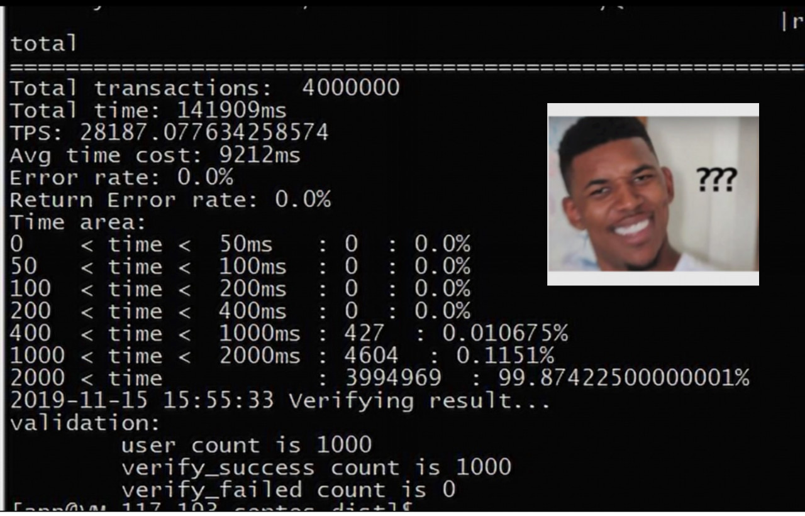

# Practice of performance pressure measurement tool Caliper in FISCO BCOS platform

Author: Li Chen Xi | FISCO BCOS Core Developer

**Hyperledger Caliper officially announces support for the FISCO BCOS platform in version 0.2.0**。

Regarding how to use Caliper to perform pressure testing on FISCO BCOS, the developer has made painstaking efforts to make a comprehensive summary of how to deploy Caliper and how to customize test cases. Welcome to [FISCO BCOS official document](https://fisco-bcos-documentation.readthedocs.io/zh_CN/latest/docs/tutorial/stress_testing.html)Learn how to use:

This article will analyze Caliper in depth so that you can better use Caliper pressure measurement FISCO BCOS.。

## Why Adapt to Caliper？

For blockchain developers and users, performance is an important consideration in evaluating a blockchain platform.。FISCO BCOS has always been a continuous performance tracking of FISCO BCOS through the stress test program and stress test script included in the Java SDK.。

Although these stress testing methods are fully capable of evaluating the performance requirements of the underlying developers of FISCO BCOS, when the stress testing requirements extend from the underlying developers to external users who need to test custom contracts and scenarios, the traditional stress testing methods will be somewhat inadequate, and the areas that need to be improved are mainly focused on the following points。

### Ways to extend test scenarios need to be streamlined

At present, the test scenarios directly supported by the pressure test program are representative transfer scenarios and simulations of adding, deleting, modifying and checking data tables. If you want to test custom contracts and scenarios, you need to write your own test program according to the template.。
The SDK itself already provides a wealth of APIs to help users write such programs, but users still need to handle details such as contract compilation and API conversion, pressure thread pools, etc.。
Although a user may only have one test requirement point, there are thousands of people, and when the needs of different users are accumulated, the repetitive workload becomes considerable.。

**Therefore, we hope to have a test framework to help us deal with these trivial details, so that we can focus more on constructing the pressure test scene itself.**。

### The definition of performance indicators needs to be unified.

For the problem of how to calculate the performance indicators, FISCO BCOS has formed a set of standardized calculation methods, but when the user writes the test program, due to the flexibility of the test program itself, the user can define how to calculate the performance indicators.。
Taking the transaction processing capacity indicator TPS as an example, some users may feel that the local signature time of the transaction should not be attributed to the time taken by the remote node to process the transaction, or they may think that the calculation method of total transaction volume / total time is not accurate enough, and prefer to use the method of calculating the average of multiple samples in the pressure measurement process.。
It can be seen that the negative effect of flexibility is the lack of a uniform measure of performance on all sides.。
**Therefore, we hope to have a test system with its own standard performance indicator definition, and the best user can not directly intervene in the calculation process of performance indicators.**。

### The way the results are presented needs to be optimized

Command-line-based stress testing programs are written more for the low-level developers of FISCO BCOS, so they are used in a more "low-level" way.。When external users want to use the stress test program included in the Java SDK for testing, they may see the following test results:

Although it is not difficult to understand the meaning of each statistic, it can still seem clumsy and inconvenient to show and introduce it to the outside world。
**Therefore, we hope to have a test tool that can output an intuitive test report after the test is completed to facilitate user understanding and dissemination** 。
In the spirit of "Don't Repeat the Wheel," we are looking to the open source community to have ready-made tools to address the pain points of FISCO BCOS testing tools。After thorough research, we found the Hyperledger Caliper project。

Caliper is a general-purpose blockchain performance testing tool。"Caliper"The original meaning of the word is the ruler, Caliper aims to provide a common baseline for the testing of blockchain platforms.。Caliper is completely open source, so users don't need to worry about the problem of not being able to verify the pressure test results because the test tool is not open source。
At the same time, the Hyperledger project has set up a performance and scalability working group (PWSG), which is responsible for the formal and standardized definition of various performance indicators (TPS, latency, resource utilization, etc.)。
Caliper can easily connect to a variety of blockchain platforms and shield the underlying details, users only need to be responsible for designing the specific test process, you can obtain the visual performance test report of Caliper output.。It can be seen that the Caliper with these characteristics can meet the needs of FISCO BCOS for pressure measurement tools.。

FISCO BCOS's adaptation to the Caliper framework began immediately, and in retrospect, the overall workload is not heavy, but the main time overhead is spent on the development brother because he is not familiar with Node.js (Caliper mainly uses Node.js for development) and learned for a period of time, which also confirms the easy integration of Caliper from the side.。

## What does Caliper look like?？

The architecture diagram of Caliper is shown in the figure above.。In Caliper, the Caliper CLI is responsible for providing easy-to-use command-line tools for the internal Caliper Core (interface and core layer)。The interface and core layer include blockchain adaptation interface, resource monitoring module, performance analysis module and report generation module.。

### Blockchain Adaptation API

Contains interfaces for operations such as deploying smart contracts on the back-end blockchain, invoking contracts, and querying status from the ledger, which are primarily provided by the blockchain dominator。Each blockchain adapter uses the corresponding blockchain SDK or RESTful API to implement these interfaces. Caliper integrates the blockchain system into the Caliper framework through the interfaces provided by these adapters. Currently, in addition to FISCO BCOS, Caliper also supports blockchain systems such as Fabric and Iroha.。

### Resource Monitoring Module

Provides support for starting / stopping the monitor and obtaining the resource consumption status of the backend blockchain system. The scope of resource monitoring includes CPU, memory, and network IO.。Caliper currently provides two monitors, one is to monitor local / remote docker containers, and the other is to monitor local processes。

### Performance Analysis Module

Provides support for reading predefined performance statistics (including TPS, latency, number of successful transactions, etc.) and printing benchmark results。When the blockchain adaptation interface is called, key metrics for each transaction (such as the time the transaction was created, the time the transaction was submitted, the results returned by the transaction, etc.) are recorded and used to generate final predefined performance metrics statistics。

### Report Generation Module

Mainly responsible for beautifying the performance data obtained from the performance analysis module and generating HTML format test reports.。
The upper layer of Caliper is the application layer, which is responsible for testing the blockchain system.。Each test needs to set the corresponding test configuration file and define the test parameters of the back-end blockchain network information.。Based on these configurations, Caliper can complete the performance test of the blockchain system.。
Caliper comes pre-built with a default benchmark engine to help testers quickly understand the framework and implement their own tests, and the next section describes how to use the benchmark engine。Of course, testers can also use the blockchain adaptation API to test their own blockchain systems without using the test framework.。

## Test process

Caliper's default benchmarking engine uses the Master / Client pattern to implement the testing process。 

The entire testing process is driven by the Master process and consists of the following three phases。

- **Preparation phase**At this stage, the Master process uses the blockchain configuration file to create and initialize internal blockchain objects, deploys smart contracts according to the parameters specified in the configuration, and starts monitoring objects to monitor the resource consumption of the backend blockchain system；

- **Testing Phase**: At this stage, the Master process performs tests according to the configuration file, and will generate tasks according to the defined load and assign them to the client child process。Finally, the performance statistics returned by each client are stored for subsequent analysis.。

- **Reporting Phase**Analyze the statistics of all Client processes for each test round and automatically generate HTML reports。

The Client process is mainly responsible for specific interaction with the back-end blockchain system.。In Local mode, the Master process uses the Node.js cluster module to launch multiple local clients (child processes) to perform actual test work。

Because Node.js is inherently single-threaded, local Client child process clusters are used to improve Client performance on multi-core machines.。In actual use, the greater the number of Client child processes (if the number of CPU cores can support it), the higher the transaction sending and processing power of Caliper.。

In this mode, the total workload is evenly distributed to the sub-processes, each of which is equivalent to a blockchain client, and the sub-processes have temporarily generated contexts that can interact independently with the back-end blockchain system.。The child process context usually contains the client's identification and encryption information, and the context will be automatically released after the test, these details do not need to be concerned by the user.。

The Client process starts during the first round of testing and is destroyed after all tests are completed。

The user-defined test module on the far right of the figure is used to realize the functions of transaction generation and up-chaining.。In this way, testers can implement their own test logic and integrate it with the benchmark engine。The test module mainly implements 3 functions, all of which should return a Promise object:

- **init**will be called by the Client at the beginning of each test run。Required parameters include the current blockchain object, context, and user-defined parameters read from the benchmark configuration file.。Within this function, the blockchain object and context can be saved for later use, and other initialization work can also be implemented here.；

- **run**Use Caliper's blockchain adaptation API to generate transactions and put them on the chain.。Client will call this function repeatedly based on workload；

- **end**: Used to be called at the end of each round of testing, and any work that needs to clean up the environment at the end is performed here。

Caliper makes pressure testing FISCO BCOS elegant, and FISCO BCOS fixes and improves some of Caliper's bugs and performance issues in the process of adapting to Caliper。

Caliper is still evolving, and features such as a friendly GUI interface, distributed test framework, and Prometheus monitoring system will be added in the future, and FISCO BCOS will continue to iteratively optimize test tools to meet user performance testing needs.。