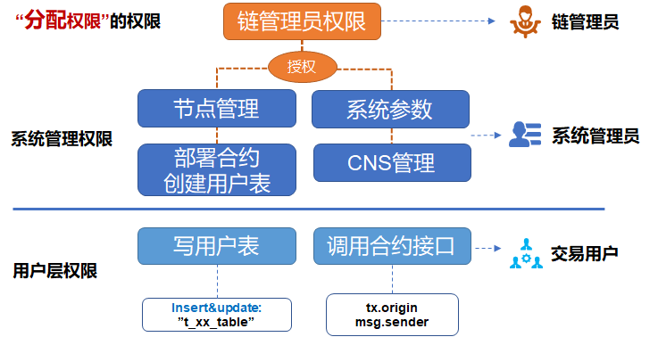

# FISCO BCOS Permission Control at a Glance

Author: Zhang Kaixiang ｜ Chief Architect, FISCO BCOS

**Author language**

In the multi-party alliance chain, the division of labor and cooperation between the parties should also be done.**Clear responsibilities, each perform their own duties**。There is no need for chain managers to "be both referees and athletes" to participate in business transactions, and users who only participate in transactions do not have to worry about the development and deployment of smart contracts.。At the same time,"DO separation"(Separation of development and operation and maintenance) is a mature practice in the industry, and overstepping your authority poses risks that could ultimately undermine your reputation and cause loss of assets.。

Clear, easy to use, comprehensive**Permission control ability**, both for information security, and for improving the governance of the alliance, are essential。

This article is about FISCO BCOS permission control this matter, the author from the FISCO BCOS permission classification, typical alliance chain role design, permission control operation basic steps and so on.。

## Permission classification of FISCO BCOS

FISCO BCOS in the chain just set up, in order to facilitate rapid development and experience, the default does not do any permission control。However, if this chain is used to provide enterprise-level services, it is important to design and implement a permissions control strategy from the outset.。 Permission classification of FISCO BCOS:




### 1. Chain administrator permissions

即**Permissions to assign permissions**If you define account A as the chain administrator, A can assign permissions to accounts B, C, and D.；You can set up multiple administrators. If you do not set up an administrator, any account can modify various permissions indiscriminately.。

### 2. System management authority

Currently includes 4:

- Node management permissions (adding or deleting consensus nodes or observing nodes)
- Permission to modify system parameters
- Modify CNS contract naming permissions
- Can contracts be deployed and table creation permissions

The deployment contract and table creation are "two-in-one" controls, when using the CRUD contract, we recommend that the deployment contract together with the table used in the contract built (written in the contract constructor), otherwise the next read and write table transactions may encounter "missing table" error.。If the business process requires dynamic table creation, the permissions for dynamic table creation should also be assigned to only a few accounts, otherwise various obsolete tables may appear on the chain。

### 3. User Table Permissions

At the granularity of the user table, control whether certain accounts can**Overwrite a user table**to prevent the user table from being accidentally modified by others, this permission depends on the FISCO BCOS CRUD contract writing。In addition,**Read User Table**Not controlled by permissions；If you want to control the privacy of data, you need to introduce technologies such as data encryption and zero knowledge.。

### 4. Contract Interface Permissions

A contract can include multiple interfaces, because the logic in the contract is closely related to the business, the interface granularity of the permission control is implemented by the developer, the developer can judge the msg.sender or tx.organ, decide whether to allow this call to continue processing.。

The FISCO BCOS console provides a series of commands to control permissions, which can be easily used by users.**Grant, Cancel(revoke), View(list)**For various permissions, see the documentation on the console。

## Typical Rights Management Role Design in Alliance Chain

In the alliance chain, different roles perform their duties, division of labor and cooperation, the typical role design can refer to:

### 1. Chain Manager

A committee is usually selected by multiple parties involved in the chain, and one or more agencies can be granted administrator privileges for personnel management and authority allocation。The chain administrator is not responsible for node management, modifying system parameters, deploying contracts and other system management operations.。

### 2. System Administrator

Designated business operators or system operation and maintenance personnel, assign various permissions as needed, responsible for daily on-chain management, including node addition and deletion, system parameter modification, etc.。The chain administrator assigns permissions according to the governance rules agreed upon by everyone, for example, only the specified accounts are allowed to deploy contracts, and they are given contract deployment permissions so that other accounts cannot deploy contracts at will.。

### 3. Transaction Users

Users send business transaction requests to the blockchain. Business transactions mainly call contracts and read and write user tables, which can be flexibly controlled according to business logic, combined with user table permissions and contract interface permissions.。

### 4. Regulators

Which system and user table permissions are assigned to the supervisor, you can refer to the specific regulatory rules, such as the supervisor read-only all data, there is no need to set special permissions。

Managing accounts with different roles is another complex issue, one that needs to be clearly differentiated, easy to use, and secure；In case the account is lost, you need to support recovery. If the account is leaked, reset it. We will introduce it in another article later.。

## Basic steps for privilege control operations

### step1

First set up one or more chain administrator roles using the console grantPermissionManager command。 **Tips**: When logging in to the console, the command line is entered in the clear text of the private key, while the grantPermissionManager command is entered in the "account address," be careful to distinguish。如：

User private key: 3bed914595c159cbce70ec5fb6aff3d6797e0c5ee5a7a9224a21cae8932d84a4

Corresponding address: 0xf1585b8d0e08a0a00fff662e24d67ba95a438256

Then the command line to log in to the console is:

```
./start.sh 1 3bed914595c159cbce70ec5fb6aff3d6797e0c5ee5a7a9224a21cae8932d84a4
```

The command line to assign administrator privileges is:

```
grantPermissionManager 0xf1585b8d0e08a0a00fff662e24d67ba95a438256
```

When this account gets the chain administrator permissions, exit the current console or switch to another terminal window, log in once with the private key of this account, and you can perform subsequent operations as a chain administrator.。

**Tips**: Be sure to remember the correspondence between the administrator address and the private key, otherwise once the administrator permissions are set, only the administrator can assign permissions to other accounts, and the settings of other accounts will report no permissions.。

### step2

Log in to the console with the chain administrator account, and assign node management permissions, system parameter modification permissions, CNS permissions, deployment contract and table creation permissions to other system administrator accounts in turn according to the management policy.。Then log on to the console with the private key of a system administrator account with the appropriate permissions, such as an account with deployment and table creation permissions, for the next step.。

### step3

When a developer writes a CRUD contract, once the contract creates a user table on the chain, you can use the grantUserTableManager command in the console to specify which accounts can create the table and add or delete data to the table. The command line is

```
grantUserTableManager   t_order  0xf1585b8d0e08a0a00fff662e24d67ba95a438256
```

Authorize 0xf1585b8d0e08a0a00fff662e24d67ba95a438256 to operate this account**t_order**Table, but other accounts can not, if you want to read and write the table, continue to add permissions, an account with read and write permissions on a table can have multiple。

### step4

For an interface in the Solidity contract, you can refer to this code for control.

```
 		function testFunction() public returns(int256)
{
        require(msg.sender == tx.origin); / / The effect of this line is to prohibit contract adjustment.
         if(msg.sender != address(0x156dff526b422b17c4f576e6c0b243179eaa8407) )  / / Here is an example, the account address is written directly in clear text, which can actually be handled flexibly during development.。
        { return -1;    }  / / If the caller and the preset authorized caller are different, return
    }
```

msg.sender is the address of the caller of the current contract, either the user or another contract (when the contract is called)；tx.origin is the real user who initiated the transaction, and the user who signed the transaction。

## Summary and references

This article describes some of the interfaces and capabilities that FISCOBCOS provides at the basic level, and the reasonableness and sophistication of permission control will ultimately depend on the user, and you can continue to explore the scenario governance and security control of different chains in depth to arrive at best practices.。

#### References

- [P2P network detailed design](https://fisco-bcos-documentation.readthedocs.io/zh_CN/latest/docs/design/p2p/p2p.html)

- [Permission Control Design](https://fisco-bcos-documentation.readthedocs.io/zh_CN/latest/docs/design/security_control/permission_control.html)

- [Documentation for Console](https://fisco-bcos-documentation.readthedocs.io/zh_CN/latest/docs/console/console.html)

- [Introduction to Permission Control Practice](https://fisco-bcos-documentation.readthedocs.io/zh_CN/latest/docs/manual/permission_control.html)

- [Introduction to CRUD Contract Development](https://fisco-bcos-documentation.readthedocs.io/zh_CN/latest/docs/manual/smart_contract.html#crud)

- [CRUD Contract Application Example](https://fisco-bcos-documentation.readthedocs.io/zh_CN/latest/docs/tutorial/sdk_application.html)

------

#### Group Friends Q & A

**@ Li Xiran**A few questions:

1) The administrator assigns table permissions, is this operation possible on each node？

2) Create a role, this operation is not every node can operate？

If the answer to the above two questions is yes, is it possible to modify the data of the entire network as long as you have the super permissions of one node?？

**@ Light Path**Yes. Before establishing the chain, you must first negotiate which account or accounts will assume the role of the chain administrator. The roles will be assigned as soon as the chain is established. For details, see FISCO BCOS permission control related documents.。

Thank you for participating in this topic discussion of small partners！Open source community, because you are more beautiful！


