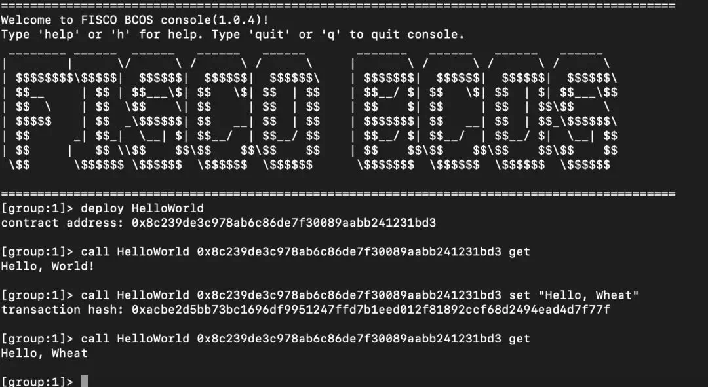

# FISCO BCOS zero-based entry, five steps to easily build applications

Author ： LI Hui-zhong ｜ Senior Architect, FISCO BCOS

This article is for developers of FISCO BCOS, which is a high-purity, ultra-concentrated and minimalist way to share how to quickly build your first DAPP application based on FISCO BCOS。

The community often asks: The FISCO BCOS project has 10W+Line source code, 10W+Word description document, dozens of subprojects, how should I start, how to get started？
Don't panic, the five-step introductory book is ready！！！

## Step 1: Build a chain of FISCO BCOS

The installation documentation gives a basket of details, but this article is to tell you succinctly:**Three steps to summon FISCO BCOS!**

(Please create the fisco directory in the home directory first, and then operate in this directory)

```bash
$ curl -LO https://github.com/FISCO-BCOS/FISCO-BCOS/releases/download/v2.11.0/build_chain.sh && chmod u+x build_chain.sh
```

```eval_rst
.. note::
    -If the build _ chain.sh script cannot be downloaded for a long time due to network problems, please try 'curl-#LO https://gitee.com/FISCO-BCOS/FISCO-BCOS/raw/master-2.0/tools/build_chain.sh && chmod u+x build_chain.sh`
```

Run the 'build _ chain.sh' script to start the four nodes:

```bash
$ bash build_chain.sh -l 127.0.0.1:4 -p 30300,20200,8545
$ bash nodes/127.0.0.1/start_all.sh
```

You can do this by executing '*ps -ef | grep -v grep | grep fisco-bcos*'See that four nodes are already running。


Of course, if you still need to read the detailed documentation, please refer to the "installation": https://fisco-bcos-documentation.readthedocs.io/zh_CN/latest/docs/installation.html#fisco-bcos

## Step 2: Install an interactive console

The console is a tool that can interactively access the blockchain and make blockchain data read and write requests。Without much explanation,**four steps to complete the console installation**

To download the console:

```bash
$ curl -#LO https://github.com/FISCO-BCOS/console/releases/download/v2.9.2/download_console.sh && bash download_console.sh -c 1.2.0
```

```eval_rst
.. note::
    -If you cannot download the console for a long time due to network problems, please try the command 'curl-#LO https://gitee.com/FISCO-BCOS/console/raw/master-2.0/tools/download_console.sh && bash download_console.sh -c 1.2.0`
```

Configure and start the console:

```bash
$ cp -n console/conf/applicationContext-sample.xml console/conf/applicationContext.xml
$ cp nodes/127.0.0.1/sdk/* console/conf/
$ cd console && ./start.sh
```

At this point, you have entered the console interface, you can view the command list through help, get the node connection list through getPeers, and exit the console through the exit or quit command。

At the same time, the console has a built-in HelloWorld contract, you can directly call deploy HelloWorld to deploy, and then call HelloWorld to access。



## Step 3: Write a Solidity contract

Tutorial documentation is still a step-by-step guide, but in fact！Follow business contract writing**Trilogy:****Storage design ->Interface design ->logical implementation,**It is enough to successfully complete the business contract。

If you are still used to reading detailed documents, please refer to the "tutorial": https://fisco-bcos-documentation.readthedocs.io/zh_CN/latest/docs/tutorial/sdk_application.html

Take the asset transfer application in the document as an example to support the asset registration, query, and transfer functions of users on the chain

- **Storage design: Design storage table structure based on distributed storage**

| account | asset_value |
| ------- | ----------- |
| alice   | 10000       |
| bob     | 20000       |

- **Interface design: Design contract interfaces based on business requirements**

```
/ / Query the asset amount
function select(string account) public constant returns(int256, uint256)

/ / Asset Registration
function register(string account, uint256 amount) public returns(int256)

/ / Asset transfer
function transfer(string from_asset_account, string to_asset_account, uint256 amount) public returns(int256)
```

- **Logic implementation: based on the CRUD interface, to achieve business logic**

asset.sol contract: https://fisco-bcos-documentation.readthedocs.io/zh_CN/latest/docs/tutorial/sdk_application.html


## Step 4: Contract Compilation and Deployment

Solidity contracts need to be converted by a compiler into machine (virtual machine) executable binaries, which are combinations of a series of OpCodes that the virtual machine will parse and execute to implement the contract business logic。

The compiled contract needs to be deployed to the blockchain through a tool (written to the blockchain ledger) before it can be accessed according to the contract interface description file (ABI)。

Well, the old problem is committed, and nagging about the principle, or talk about it**How to complete contract compilation and deployment with one click without brain:**

Refer to the deployment command of the description document [Console]: https://fisco-bcos-documentation.readthedocs.io/zh_CN/latest/docs/console/console.html

Place Assert.sol in the console / solidity / contract directory and run deploy Assert.sol on the console to compile and deploy the contract。


## Step 5: Develop the business

Continue to assume that you are using Java to develop your business, and of course assume that you are familiar with common tools such as eclipse, gradle, and spring。

1. Create a Gradle Java project asset-client through IntelliJ IDEA or Eclipse；

2. Compile build.gradle and add the maven library dependency；

**repositories increase**：maven {url "http：//maven.aliyun.com/nexus/content/groups/public/"}maven{url "https：//dl.bintray.com/ethereum/maven/" }

**Dependencies increase**：compile ('org.fisco-bcos:web3sdk:2.0.4'){exclude group: 'org.ethereum'}

3. Copy the relevant configuration files (applicationContext.xml, log.properties, ca.crt, node.crt, node.key) of the console configuration directory (console / conf /) in the second step to the main / resource directory of the asset-client project；

4. Compile the generated java file (console / consolidation / java /*)Copy to the main / java directory of the asset-client project；

5. Create a new AssetClient class in the main / java directory. Asset.java has implemented the deploy, load, select, register, and transfer interfaces。

Specific code can refer to the sample project: https://github.com/FISCO-BCOS/LargeFiles/raw/master/tools/asset-app.tar.gz

[sample project gitee download address] https://gitee.com/FISCO-BCOS/LargeFiles/raw/master/tools/asset-app.tar.gz

Here, you have completed the first FISCO BCOS-based application development！If you have questions about the development process or optimization suggestions, you can enter the technical exchange group through the public number to discuss with us。
