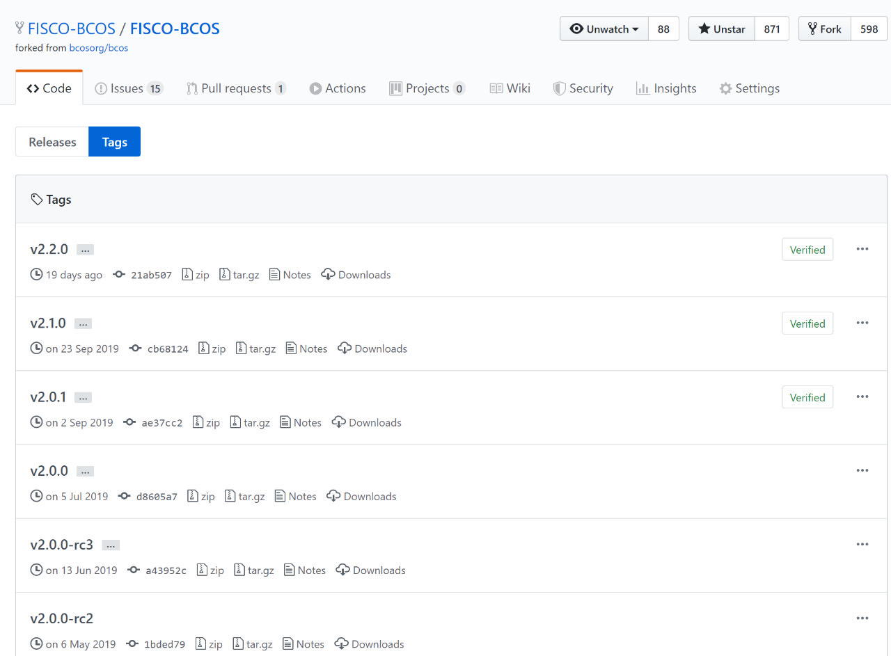

# Demystifying FISCO BCOS Open Source Project Development Collaboration

Author ： SHI Xiang ｜ FISCO BCOS Core Developer

**Author language**

Since the development of the first version of FISCO BCOS 2.0, the node code of FISCO BCOS has reached more than 110,000 lines, and the code is still rapidly iterating.。

Such a large amount of code input, for the development process, is a huge test。How to ensure code quality？How to get in order?？

This article will reveal the process of submitting PR, and see how Cheng Xuyuan (Yuan) collaborates on development during this process.。

## What is PR?？

Everyone develops their own code locally, and when the code is ready, they submit a "request form" to the FISCO BCOS main warehouse, requesting the main warehouse to pull the developed code for merging, this "request form" is PR (Pull Request, pull code request)。

In PR, other developers will review the code, and CI (continuous integration tool) will conduct a preliminary check on the specification and correctness of the code.。When the PR meets the requirements, it can be combined.。

When we open the PR list of FISCO BCOS, we can see many PR records of everyone。Experienced veteran driver (wheeli) in control of the overall situation, there used to want to give birth to monkeys for him Liao teacher (fqliao) in excellence, there is the program yuan little sister (cyjseagull) in the rescue, there are new cat lovers (vita)-dounai) in a small trial bull knife。

Let's take a look at a PR mentioned by her little sister cyjseagull.。This PR is in Open status, indicating that it is under review。She requested that the developed code be merged into the feature.-2.3.0 Branch。JimmyShi22, wheeli and other younger brothers are reviewing and agreeing, and will be ticked later.。

We continue to look down at this PR, cyjseagull's little sister's code has been challenged by the little brothers, giving some Review comments。The consensus module and the synchronization module are independent of each other and have no dependencies。The node tree topology logic TreeTopology.h she developed should be put into a lower-level module.。The little sister happily agreed。 

Usually, a PR needs to be modified repeatedly based on Review before it can be merged.。

In addition, PR will also be a variety of CI (integration test) check, cyjseagull little sister is very stable, through all the checks。However, a PR requires the consent of at least two Reviewers to merge。

This PR also lacks a person's consent, the button is gray, can not be clicked。Under normal circumstances, if the number of people who agree is sufficient, you can click the button to merge the code into the relevant branch。

## FISCO BCOS branch strategy

After understanding the concept of PR, we have two problems to solve:

- How to integrate code without affecting each other when multiple people are developing at the same time?？
- The combined code requires further manual testing before it can be released, and at what stage does the testing intervene to be able to test more effectively without affecting the development of others?？

FISCO BCOS uses the classic branching strategy Gitflow to manage the entire development, testing and release process, let's take a look at Gitflow。

In Gitflow, there are five types of branches: master, develop, feature, release, and hot fix.。Different branches have different functions。

The development, testing, and release phases of FISCO BCOS code correspond to the above branches。

### feature Branch

FISCO BCOS code development, is based on a feature (feature).。

Multiple people develop at the same time, based on their own features-xxx branch in progress。On the main repository of FISCO BCOS, we can see that there are many of these feature branches, each of which belongs to one (or more) Cheng Xuyuan (Yuan)。

They usually write code in their local warehouse and submit it to their respective feature in the form of PR.-On xxx branch。The PR submitted by cyjseagull's little sister in the previous section is in this state.。

When feature-After the development of the xxx branch, the test is involved and the "feature test" is carried out.。Bugs fixed during testing are also submitted to this feature branch in PR mode.。The purpose of feature testing is to ensure that this feature functions correctly。

### develop Branch

The develop branch (dev in FISCO BCOS), which is used to merge multiple feature branches。

When the Feature Test passes, the feature-The xxx branch can be merged into the dev branch。

The merger process is also done in a PR manner.。When multiple features are merged into the dev branch at the same time, they must be merged in order.。Joining dev's feature branch first will bring conflict to the later feature branch。The feature branch that is merged later needs to resolve the conflict before merging into dev。

### release Branch

When we have accumulated some developed features, we need to release the code.。At this time, pull the release from the dev branch-xxx branch for "release testing"。

When the feature branch is merged into the dev branch, only the integrity of the feature can be guaranteed, but the influence between features cannot be guaranteed.。When multiple features are merged into the dev branch, the final overall test needs to be done before the release.。The bug found at this time is directly merged into the release branch in the form of PR.。

In this way, the release branch does not affect the development of other developers on the feature branch during testing, nor does it affect the integration of features into the dev branch.。

### master branch

Master is the main branch, providing available code to the outside。

When the Release Test is complete, you can merge the releases branch into the master branch。

The release branch is also merged into the master branch in the form of PR.。At the same time, the release branch also joins the dev branch。After joining the master branch, tag the new master branch。Publish Complete！The final version is based on the tag, and the code can be downloaded directly from the tag.。

### hot fix branch

After the code is released, if there are minor bugs or minor optimizations, pull a hot fix from the master branch.-xxx branch, quickly fix on it。

After the repair and test are completed, merge the master and dev branches at the same time。Master plays a small version of tag。If a bug with a wide range of changes occurs, fix it on the feature or release branch according to the current release status of the project.。

## FISCO BCOS branch strategy

Understand the PR and branch strategy, then to the stage of PR。

- If you just want to modify small bugs and make small optimizations, you can directly PR to the master branch。
- If you want to develop for a feature, you can communicate with the community about the solution and pull your own feature from the dev.-Xxx branch, you can start rolling！Then use PR to submit the code。In order to avoid major changes in the Review, you need to mention PR as much as possible to show your thinking.。PR does not require the function to be fully available, only the feature branch is available when the final development is completed.。

The specific steps of PR can also be referred to [How to Contribute to FISCO BCOS](https://mp.weixin.qq.com/s/_w_auH8X4SQQWO3lhfNrbQ)

Welcome everyone to actively mention PR and make FISCO BCOS better together。

------

#### References

[FISCO BCOS Warehouse](https://github.com/FISCO-BCOS/FISCO-BCOS/tree/master-2.0)

[cyjseagull little sister's PR](https://github.com/FISCO-BCOS/FISCO-BCOS/pull/1316)

[git-flow](https://nvie.com/posts/a-successful-git-branching-model/)