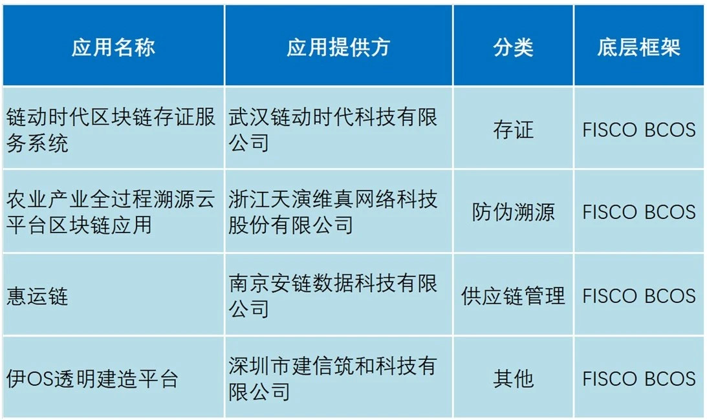
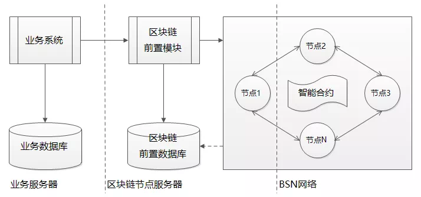
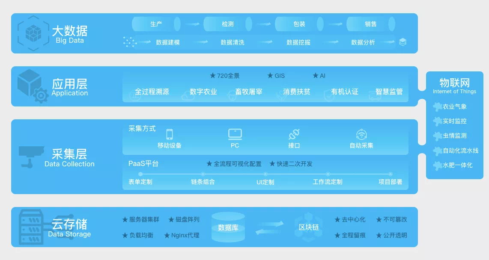
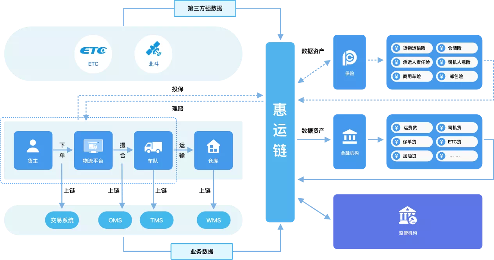
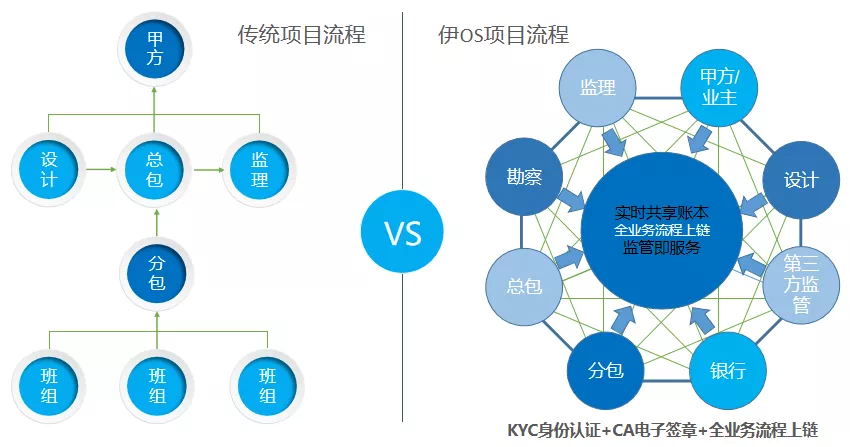

# The first batch of "officially designated blockchain applications" of BSN was released, and four applications of FISCO BCOS community were selected

After more than a month of solicitation, BSN recently announced the list of the first batch of "officially designated blockchain applications," four of which are based on the underlying research and development of FISCO BCOS blockchain, covering areas such as certificate storage, anti-counterfeiting traceability, supply chain management, etc。In line with the purpose of "showing the most suitable blockchain applications to the users who need them most," the BSN Development Alliance Developer Committee reviewed and comprehensively considered the submitted works according to the application access mechanism, and this time prioritized 12 blockchain applications of 9 categories as the first batch of designated applications selected for BSN。

The four applications based on the underlying research and development of FISCO BCOS blockchain are: blockchain depository service system in the era of chain movement, blockchain application of the whole process traceability cloud platform for the agricultural industry, Huiyun chain, and iOS transparent construction platform。

## Chain moving era: blockchain certificate of deposit service system

The blockchain certificate depository service system (hereinafter referred to as the "inBC certificate depository system") is based on the FISCO BCOS alliance chain on BSN。The inBC certificate storage system helps users to expand existing business systems based on API interfaces to achieve the preservation of electronic evidence and call verification。Can be widely used in electronic contracts, copyright protection, certificates, anti-counterfeiting traceability, public welfare donations and other scenarios and fields。

## Tian Yan Wei Zhen: the whole process of agricultural industry traceability cloud platform blockchain application

The platform fully combines technologies such as Internet of Things, blockchain, cloud computing, big data and geographic information, and realizes the "integration, visualization, networking and desktop" of information collection, audit processing, control execution and scientific decision-making in the software environment of graphical interface。By connecting all aspects of production, processing, warehousing, logistics and consumption, the platform sorts out unified product standards and control processes, standardizes the production and operation behavior of enterprises, improves the quality control ability of enterprises, and effectively guarantees the quality of products。At the same time, this information will be opened to consumers simultaneously to enhance consumer awareness and build consumer trust。

At present, Suzhou Yangcheng Lake hairy crab industry association collective trademark anti-counterfeiting traceability system, Gannan navel orange quality and safety traceability demonstration project and other applications are using the platform。

## Safety Chain Data: Benefit Chain

Huiyun Chain is a financial solution for logistics insurance supply chain provided by Anchain Technology for logistics car-free carrier platforms, insurance, banks and other enterprises。In the business scenario of freight transaction and transportation logistics management, it refines the documents and information of multi-party collaboration, connects logistics companies, insurance institutions, financial institutions and other ecological chain nodes into the alliance chain through the application of blockchain technology, optimizes resource utilization, improves the overall collaboration efficiency of the logistics industry, and uses trusted data to promote the integration of insurance and financial institutions with the logistics industry。

At present, the cooperative users of Huiyun Chain include Nanjing Rongmaotong Smart Logistics Technology Co., Ltd., Jiangsu Xinning Modern Logistics Co., Ltd., Pacific Insurance, China Merchants Bank, etc。

## Jianxin Zhuhe: IOS Transparent Construction Platform

IOS Transparent Construction Platform is a life cycle management system for the construction industry based on the application of blockchain technology developed by Shenzhen Jianxin Zhuhe Technology Co., Ltd。The platform focuses on building a complete credit ecosystem for engineering projects, using blockchain, big data and other cutting-edge technology to assist Party A in the implementation of the project life cycle management, so that project responsibilities can be traced, project management transparency, so that the process becomes fair and just。At present, the platform has provided services for the future building projects of China Xiong'an Group and Shenzhen Academy of Construction Sciences。

## What is the "BSN official designated application"？

The BSN Development Alliance Developer Committee has divided 14 relatively common blockchain application classifications and "other" classifications based on customer needs and the distribution of industry products, totaling 15 application classifications。Classification covers supply chain management, supply chain finance, judicial deposit, electronic contracts, anti-counterfeiting traceability and other aspects。Only 3 representative product solutions are introduced under each blockchain application classification。After the proposal is approved by the Developer Committee, it will be used as a blockchain application officially designated and recommended by BSN and widely recommended in various channels of BSN。The second batch of designated applications are also in preparation for the launch. If you want to join the BSN official designated application, please contact the community assistant。