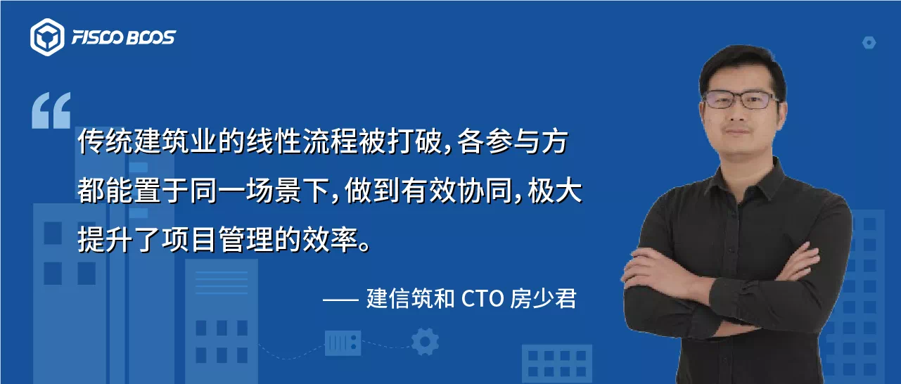
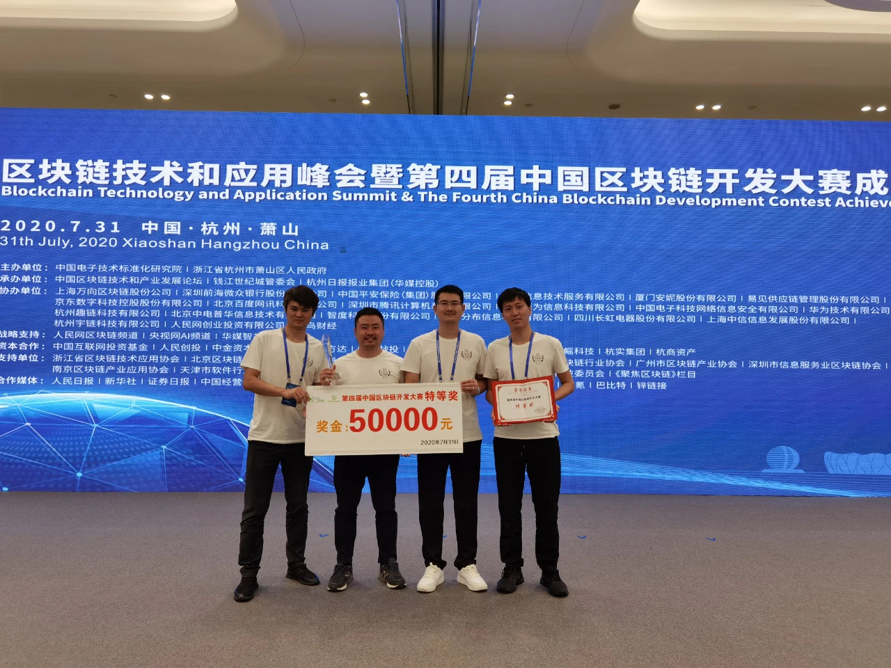
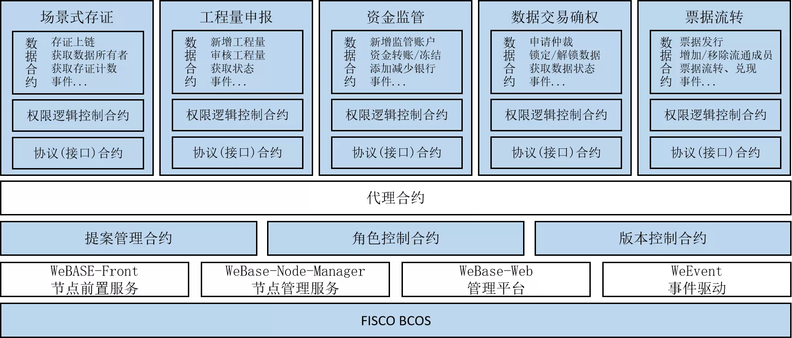

# Create full-scene transparent management, and join hands with FISCO BCOS to help digitize the construction industry

Author ： Fang Shaojun ｜ Jianxinzhu and CTO

The public number dialog box replies to [Jianxin Zhuhe] to obtain the PDF of the scheme

As the era of Industry 4.0 continues to advance, blockchain is gradually moving away from pure technological self-appreciation and financial labels, penetrating into various physical industries。

In the traditional construction scenario, the industry information is not transparent, poor management coordination, information level is not high "chronic disease," making the construction project to promote the process of management difficulties, accountability difficulties, supervision difficulties, trust difficulties。"Blockchain+The combination of "build," using blockchain technology, targets these industry pain points and proposes practical solutions at the application level。

The "IOS Transparent Construction Solution" developed by Shenzhen Jianxin Zhuhe Technology Co., Ltd. (hereinafter referred to as "Jianxin Zhuhe") based on the FISCO BCOS blockchain platform is a typical representative of the scenario-based application of blockchain technology in the construction industry。

With the leading advantage of the full-scene management model, the solution was selected as one of the first officially designated applications of the blockchain service network BSN, and won the crown at the 4th China Blockchain Development Competition in 2020 hosted by the China Electronics Standardization Institute of the Ministry of Industry and Information Technology。

## information asymmetry+Management is difficult to coordinate, construction industry pain point to be broken

In the traditional construction industry, "information asymmetry+Difficult management coordination "is an important factor restricting the development of the industry。The upstream and downstream chain of the construction industry is very long, and if the information between the participants in each link of the industrial chain is not transparent, the communication and management costs of work collaboration are invisibly improved。Such as the construction side and the designer for the design of the wrangling, the main body between the payment account period of the node control fuzzy and other issues emerge in an endless stream, slowing down the overall progress of the project。At the same time, opaque information also makes it difficult for Party A to achieve full-process management penetration, management is not timely, not in place for the project buried the risk of violations, further pushing up the cost of trust, which in turn increases the difficulty of work collaboration。

In the traditional industry, the degree of informatization of the construction industry has been at a low level, the construction process involves owners and investors, regulators, agents, consultants, designers, constructors, supervisors, operators and many other units, at the same time, with the current expansion of the scale of investment in various types of projects, project management and capital supervision pressure, these problems restrict the healthy growth of the construction industry ecology。Therefore, one of the ways to break the traditional construction industry is to break the status quo as soon as possible and use information technology to promote the construction industry to achieve project management "full scene, full subject, full process transparent collaboration," while blockchain is a unique means to accelerate the process of technology。

In this context, Jianxin Zhuhe joined the FISCO BCOS blockchain open source ecology, based on FISCO BCOS blockchain technology to create a full life cycle management system for the construction industry - "IOS Transparent Construction Solution" to promote the construction industry to achieve "full scene transparent management"。The solution uses blockchain distributed storage / sharing, smart contracts and other technologies to integrate with existing mature IT tools in the construction industry, such as design software, cost systems, smart construction sites, BIM systems, etc., and combines advanced technologies such as big data and artificial intelligence to effectively eliminate industry pain points and build a transparent construction platform with management penetration, openness and transparency, information sharing, and credit evaluation。

## With the help of blockchain technology, the construction achieves full-scene penetration management

"IOS Transparent Construction Solution" adopts blockchain technologies such as scenario-based certificate storage, digital signatures, encryption algorithms, and smart contracts, breaking the original single-line task framework and realizing decentralized task collaboration and data flow。The participants in the original project chain (industrial chain), such as project side, design, construction, survey, general contracting, subcontracting, supervision, team, etc., placed in the same task scenario, no longer has a strict upstream and downstream process relationship, the original easy to form each other constraints of "logistics, capital flow, information flow" can also be organically coordinated。

At the same time, due to the existence of the smart contract trigger mechanism, the flow of engineering funds has a clear regulatory direction, and every step of the flow of funds can be transparent, which will further ensure that the use of funds is reasonable, compliant and legal。At the same time, the transparency of engineering funds also makes the quality and safety of the project more secure, forming a virtuous circle of the construction industry。

"IOS Transparent Construction Solution" can not only realize the management of multiple bid sections for a single project, but also realize the management of multiple projects, which has been widely used in the construction industry to effectively improve the efficiency of project operation。By the end of May 2020, more than 300 projects were running on the IOS platform, with more than 400 participating units。100 under construction in a group+In a pipe network project, the IOS system assists the project leader in comprehensively managing the process, progress, quality and safety of on-site construction, and successfully implements the project problem solving rate from 60% to 80% through the reward and punishment mechanism。

Jianxinzhu and CTO Fang Shaojun said that when blockchain technology meets the construction industry, it can not only "overlook" the whole process of the project, such as file sharing, fund supervision, project quantity declaration, quality and safety, performance appraisal, etc., but also effectively light up the "blind spot" in the original project management, project settlement and fund supervision, and "pre-task distribution - real-time supervision - post-responsibility traceability" has since formed an efficient。

## FISCO BCOS Selected in 10,000-Word Report to Work Together to Reshape the Construction Credit Ecology

In order to effectively create the "IOS Transparent Construction Solution," CCB has selected FISCO BCOS。"In order to select the underlying platform of the blockchain, our team made a research report of more than ten thousand words, and finally chose FISCO BCOS, mainly because it has a rare language advantage, ecological components, node deployment and technical support are very rich, easy to use and efficient."。"Fang Shaojun introduced that on the bottom of FISCO BCOS technology, Jianxin Zhuhe effectively completed the systematic construction of five business scenarios: scenario-based deposit, project volume declaration, capital supervision, data transaction confirmation and bill flow。

The "IOS Transparent Construction Solution" based on FISCO BCOS blockchain technology can ensure one-to-one correspondence between logistics flow and information flow, transparent supervision of capital flow, traceability of logistics and high matching of capital to account during project implementation, which is not only the project management process reengineering of blockchain in the construction industry, but also the credit ecological remodeling under the new "full scene" management mode。

------

**The community has long solicited blockchain applications based on FISCO BCOS. If you have an application that is being developed or has been launched, please click "Read the original" to tell us that your application deserves to be seen by more people。**