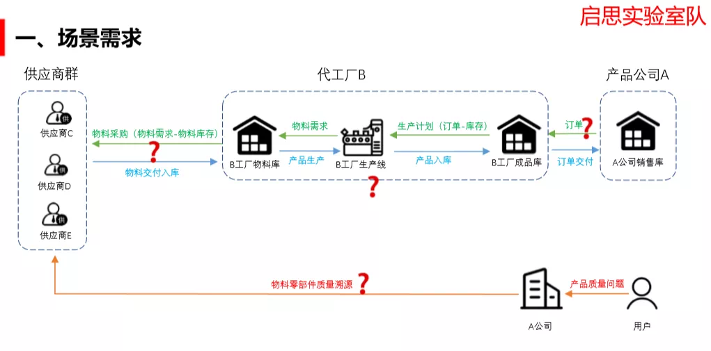

# Changhong Qisi Lab: Manufacturing Production Synergy and Quality Traceability Program

Author: Enlightenment Laboratory

## Why Choose Production Collaboration and Quality Traceability Scenarios？

Our work (hereinafter "we" refers to the Qisi Laboratory team) is to establish a trusted and contractual information flow within the enterprise through blockchain technology on the basis of manufacturing data informationization, and then use multi-level chains to open up the manufacturing enterprise supply chain and product downstream data information management, the establishment of multiple nodes, to achieve the manufacturing enterprise rules contract execution and data trust management, so as to achieve the effect of reducing costs and improving efficiency。

Speaking of which, many friends may wonder why we chose this scene to cut in？First of all, Qisi Laboratory (composed of members of the blockchain research team of the Information Security Laboratory of Sichuan Changhong Electric Appliance Co., Ltd.) itself focuses on the application research of blockchain technology, and cooperates with mainstream blockchain infrastructure technology providers to provide blockchain-based smart home and industrial Internet solutions。At the same time, driven by the development of the entire industrial Internet and 5G, the traditional manufacturing capacity is facing a large degree of iterative upgrade, the team has been focused on manufacturing, and strive to find a breakthrough point, the use of blockchain technology to help this wave of manufacturing upgrades。Secondly, in the traditional manufacturing industry, when the product quality problems, often face the quality of material parts can not be traced, difficult to pursue responsibility for the difficulties。The specific pain points are shown in the following figure: Company A in the figure is the product company and the sales company；Company B is the principal producer of Company A's products；Supplier C, Supplier D and Supplier E are designated material suppliers of Company A。



After analysis and research, we have sorted out several major needs in the traditional manufacturing industry:

**Requirement 1: Production planning and material matching automation**

Company B makes a production plan based on the difference between Company A's order and the existing finished product inventory, and then analyzes the difference。Calculate the required materials according to the production quantity of the product。Production materials are removed from the inventory of the material library and the quantity of materials required is fed back directly to the supplier and prepaid。

**Requirement 2: Material suppliers respond to material identification in a timely manner**

Supplier C, Supplier D, and Supplier E receive material demand orders for shipment and warehousing。At the same time, supplier C, supplier D, supplier E material matching unique identification, information on the chain。

**Requirement 3: Financial Credible Liquidation**

Establish a financial automatic clearing mechanism according to the agreement in the links of order issuance, material procurement, logistics transportation, order delivery, etc。

**Demand 4: After-sales quality traceability**

After-sales based on the unique identification of the material's trusted responsibility and quality traceability, to achieve timely response。

## Some Considerations on Selection of Bottom Layer

After understanding the requirements, the next step is technical implementation, in the underlying selection, team architect Kang Hongjuan mainly from the following points to consider:

- Good practical operability。The blockchain application layer is closely aligned with the actual business, especially at the contract layer, and redeveloping and deploying business contracts will inevitably lead to repeated debugging。Therefore, the underlying complete support is very important for the success of the project。
- Complete service layer functional components。The interaction between the user layer and the chain layer must go through the "grafting" of the intermediate service layer, and these "grafting modules" are universal, in addition to the basic chain layer functions, the completeness of the common components of the service layer is also crucial。
- Friendly open source atmosphere。The greatest joy for tech geeks is open source。

After understanding the evaluation, the team finally chose FISCO BCOS as the bottom layer, mainly for two reasons:

-FISCO BCOS is a safe and controllable domestic open source alliance chain, which can meet and meet the needs of domestic enterprises；
- High community activity, rich application scenarios, and timely response to developers' technical support。

In addition, FISCO BCOS has the advantages of timely version iteration, strong performance, and rich service middleware。

## Smart Contract Solutions

In summary, based on the actual business needs and combined with the advantages of blockchain technology, we build four key levels, including "basic layer, core layer, service layer and user layer," covering core database, business contract, data analysis, message analysis, user management, business management and other functions, and build an order-based production collaboration vertical solution in the field of industrial Internet。

In this article, we focus on sharing the smart contract solutions, which are shown in the following figure。This program includes product contracts, settlement contracts, production contracts, stocking contracts and licensing contracts, each of which will be described below。


### Product Contract

This contract is used to complete product registration, product ownership change and product traceability during product production。

Steps are as follows:

- Complete relationship setup for related contracts；
- the admin of the contract authorizes certain addresses to become a product producer；
-product manufacturer calls updateProductPrice to set the product price；
-customer needs to compare the price with getProductPrice before placing a production order with the manufacturer, and then place a production order with the manufacturer through the payment contract；
-After the manufacturer obtains the order through the payment contract, the product is produced；
-Before producing a product, the manufacturer will check whether the raw material reserves of his product are sufficient through the Material contract, and if sufficient, the production of the product will be registered registerProduct on the chain；
- The product manufacturer delivers, customer confirms receipt of the goods, confirms the order, completes the change of funds and product ownership。

```
/ / The manufacturer msg.sender updates the price of its productType product
function updateProductPrice(uint256 productType, uint256 newPrice) public
​
/ / Get the price of productType from manufacturer _ to
function getProductPrice(address _to, uint256 productType) public view returns(uint256 price)
​
/ / Set up the supplier's raw material contract
function setMaterialContract(address _materialContract) public onlyOwner
​
/ / Set up a payment contract
function setPaymentContract(address _paymentContract) public onlyOwner
​
/ / Product manufacturers set their own product batch number, ID, material batch and other information
function registerProduct(uint256 productType, uint256 id, uint256 batchNumber, uint256[] memory materialBatches) public
​
/ / Replace product ownership, deliver product
function transferProducts(address from, address to, uint256 productType, uint256 count) public
​
/ / Get product details
function details(uint256 id) public view returns(Product memory)
​
/ / Get the array of products owned by msg.sender
function getMyProducts(uint256 productType) public view returns(uint256[] memory myProductIDs)
​
/ / Get the raw materials of a certain product for which products
function trace(uint256 materialBatchNum) public view returns(uint256[] memory ids)
```

### settlement contract

Responsible for user assets, the specific steps are as follows:

- Balance and Prepayment Queue；
- Product ownership change(Manual confirmation)Automatic settlement in process；
-If funds are insufficient, operations such as stocking, warehousing, etc. cannot be performed；
-Recharge / direct consumption / advance payment, balance inquiry and other related functions。

### production contract

Have inventory production number and owned product queue, and raw material batch queue:

-Obtain orders to be produced, determine whether the inventory of raw materials meets the demand, and if not, place production orders through settlement contracts and advance payments to stocking contracts；
-By calculating the raw material queue, the external unique identification is generated, and the batch information of the raw material is written into the product for production(External)Warehousing(Invoke the generation entry of the product contract)。Maintain inventory production numbers and owned product queues；
- outbound(Product ownership change entry for external call product contracts)The number of products produced under this contract and the owned product queue of the owned product queue inventory contract are maintained and settled through the settlement contract。

### stocking contract

Responsible for the upstream manufacturers for stocking:

-By calling the production stocking number to stock up on manufacturer B, calculate the number of existing parts, and call the parts from outside(Fill in the batch, quantity and other information)；
- outbound(External call)The batch information of the part information is written to manufacturer B, and its own data queue is maintained, and the settlement contract is automatically called for settlement after completion。

Supplement: Because parts are not like products with one thing and one code, multiple parts only correspond to a certain batch, and there is no need for a separate parts contract to maintain the parts。

### Authorized contract

Through different permission levels, access restrictions are imposed on functions in each contract, and role conventions and call permissions between various contracts。For example, ordinary users do not have the right to place orders with suppliers, and suppliers cannot provide ordinary users with finished goods。

```
/ / Does address have role permission
function hasRole(bytes32 role, address account) public view returns (bool)
​
/ / get the number of members of role permission
function getRoleMemberCount(bytes32 role) public view returns (uint256)
​
/ / get members based on role and index
function getRoleMember(bytes32 role, uint256 index) public view returns (address)
​
/ / Get the manager of the role role
function getRoleAdmin(bytes32 role) public view returns (bytes32)
​
/ / Grant role permission to an account
function grantRole(bytes32 role, address account) public virtual
​
/ / Remove the role permission of account
function revokeRole(bytes32 role, address account) public virtual
​
/ / account gives up the role permission
function revokeRole(bytes32 role, address account) public virtual
```

## Smart Contract Solutions

Throughout the development of smart contracts, the main thing is actually the combing of the entire production process。First of all, we first combed the requirements, and then developed a usable version for the solidity language, on this basis, the relevant calls to establish a simple restful server, complete the testing of each interface, there is a complete set of demonstrable process, and finally the relevant development to complete the reproduction of the contract。