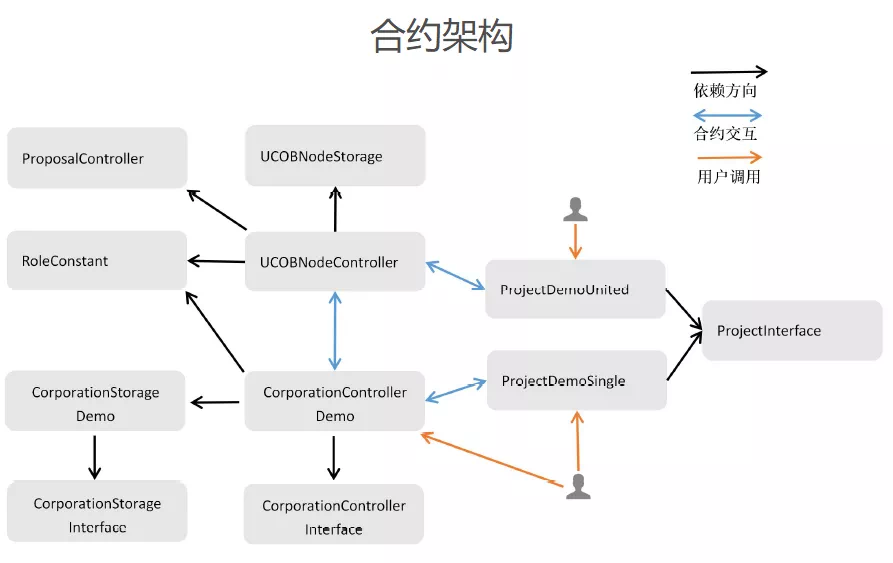

# How to Realize "On-chain Collaboration and Governance" among Multi-enterprises

Author: Zhu Lipai ｜ Senior Blockchain Developer (Shenzhen Jianxin Zhuhe Technology Co., Ltd.)

## Why choose a multi-party collaborative governance scenario between enterprises？

Many of you may wonder why there is such a seemingly wild idea as a "joint company on the blockchain."？First of all, blockchain technology is very suitable for "multi-party collaborative governance" scenarios。The open governance capacity of a polycentric autonomous organization is reflected in the fact that anyone with the appropriate credentials can openly exercise governance。Inspired by this, I would like to achieve a similar function based on the alliance chain: all parties to the alliance have pre-agreed governance capabilities to ensure that the governance process is fair, just, open, traceable and non-repudiation through blockchain technology。Secondly, there is a real scenario demand for "multi-party collaborative governance" between the company's actual business dealings。

For example, the general business transactions between companies often involve projects, funds two categories, if more than one company needs to jointly manage a project, and there are financial transactions, you can consider using blockchain technology to achieve "on-chain collaboration and governance."。You can maintain a consistent global view of the progress of the project, and at the same time, any signature confirmation process is triggered by the corresponding private key signature, making it easier to achieve responsibility to the person。

## On-chain Collaboration and Governance Realization Ideas

Each company exists as a separate "company contract" on the blockchain, and as long as the "company contract interface" is implemented, the company's internal business logic and internal organizational relationships can be customized。When a company wants to join a joint venture, it first applies and deploys its own "corporate contract."；A proposal is then initiated by a member already in the consortium with the newly deployed "Company Contract Address" as a parameter；Upon approval by a majority of the members of the syndicate, you can formally become a member of the syndicate。The projects in which each company participates will exist separately in the form of a "joint project contract" in which any member company of the joint company can initiate joint projects。

First, develop a "joint project contract" based on the "project contract interface" and deploy it to the blockchain；and initiate the proposal with the "address of the joint project contract" as a parameter in the proposal；Each of the joint companies can view the contract based on the contract address in the proposal and decide whether to vote for the proposal；When approved by a majority of the member companies of the joint company, it becomes a "joint project contract."。

## Design Ideas and Key Logic of Blockchain Smart Contract

### Contract Design Ideas

In the contract design, refer to the FISCO BCOS open source community "[Solidity programming strategy for smart contract writing](http://mp.weixin.qq.com/s?__biz=MzA3MTI5Njg4Mw==&mid=2247485719&idx=1&sn=2466598f695c56d2865388b7db423196&chksm=9f2efb0ba859721d757cd12f9ff19b3f2af21c00781f31970b1fa156de73d72ca49b12fc0200&scene=21#wechat_redirect)The idea in the article, using the "data, management, control" hierarchical design method。This smart contract solution mainly has three modules: joint governance module, company module, project module, contract interaction mainly occurs between the contracts of these three modules。



- **Joint Governance Module**: Proposal and Voting System, Joint Company Member Management System, Joint Inter-Company Fund Flow System；
- **Company Module**: Single company management system, single company internal capital flow system；
- **Project Module**: Joint project management of multiple companies, internal project management of a single company。

Among them, the "alliance management module" centralizes the management of "company module" contracts and "project module" contracts, and the management mechanism is mainly "voting-registration."；Company contracts and project contracts customize business logic based on the implementation of the corresponding interface contract method and are chained in the form of separate contracts。

In terms of contract function, there are mainly the following points:

- Vote registration function, only if the number of votes exceeds a certain rate, the new company can become a member of the joint company, the new project can be recognized as a joint project；
- Project management features such as project administrator settings；
- Role-based permission control, custom roles and permissions；
- Fund transfers, including inter-company transfers (involving cross-contract calls) and intra-company transfers；
- Fund issuance function, based on voting to decide whether to issue funds。

### Contract code implementation of key logic

Here is the contract code implementation of some key logic in the project, taking the ownership transfer of the "storage smart contract" as an example。This project adopts the idea of "storage, logic, control" hierarchical design, the deployer must transfer the contract ownership relationship to the controller smart contract after deploying the "storage smart contract," the storage contract method is as follows

```
function transferOwnership(address newOwner) public onlyOwner {
require(newOwner != address(0), "Ownable: new owner is the zero address");
emit OwnershipTransferred(_owner, newOwner);
_owner = newOwner;
}
```

The above "newOwner" parameter must be the corresponding "controller contract" address。In this way, the "storage-like smart contract" passes through the decorator "modifier onlyOwner."()It ensures that only the corresponding "controller smart contract" can modify the data of the "storage smart contract."。After deployment, you can verify ownership of the Storage Class Contract in the Controller Contract by using the following method。

```

function checkUCOBNodeStorageSafety() public view returns (bool) {
return ucobNodeStorage.owner()==address(this);
}
```

The code logic of a controller-class smart contract can be upgraded by voting to decide whether to upgrade。

```

function changeUCOBNodeStorageOwner(bytes32 proposalId) public {
require(proposalPassed(proposalId,...));
...
ucobNodeStorage.transferOwnership(UCOBNodeControllerAddress);
...
}
```

When the vote is passed, the ownership of the "storage smart contract" will be transferred to the new "controller contract" address, the data will not change, but the business logic will be "upgraded."。
