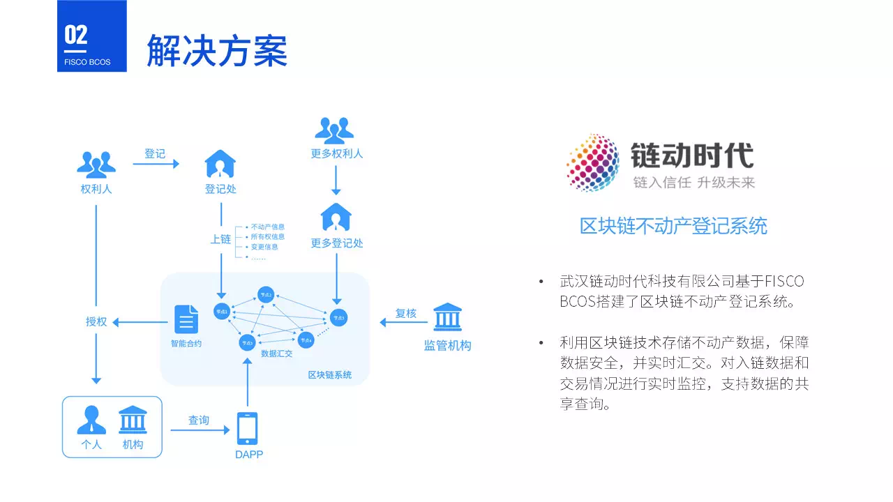
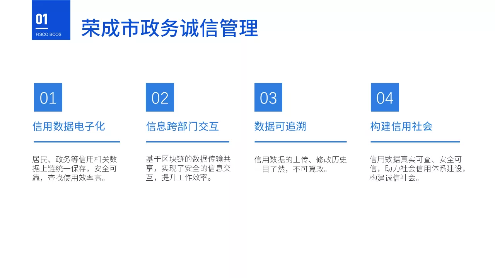
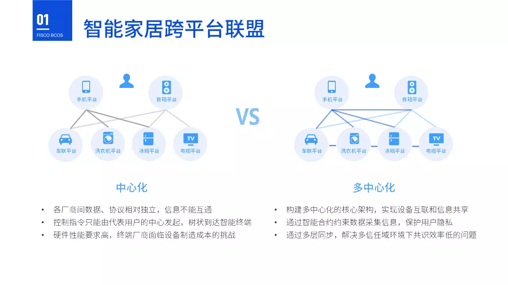
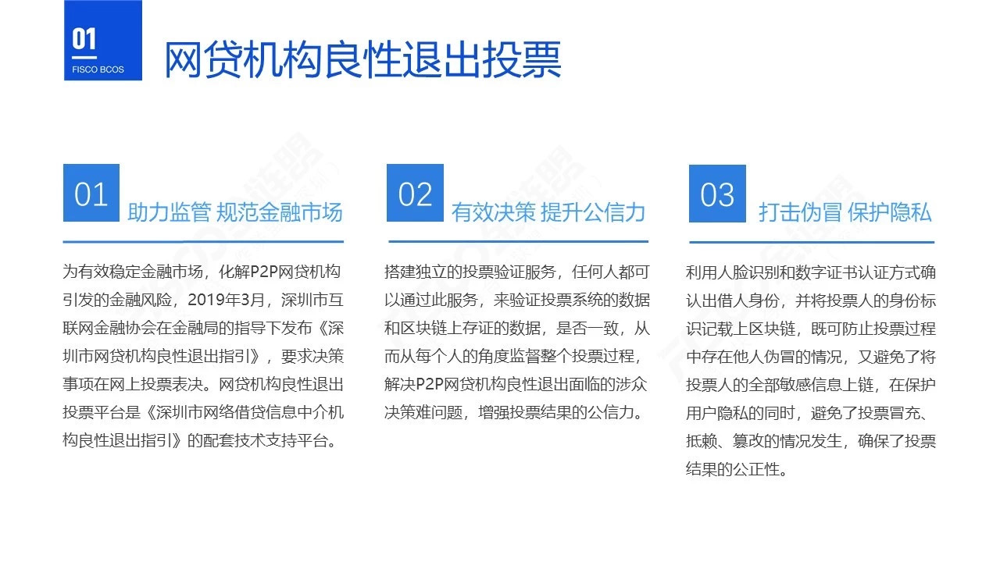
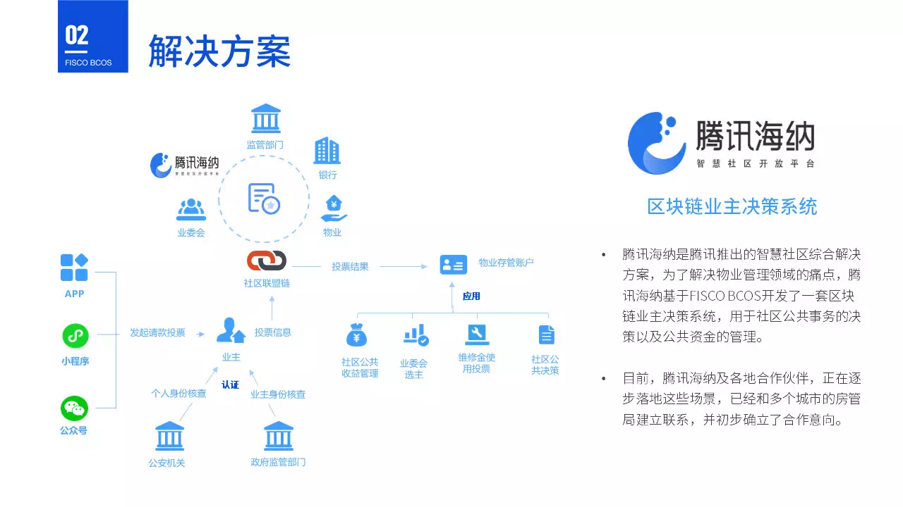

# What industries has blockchain revolutionized?？Attached application case download

According to Xinhua News Agency on the evening of October 25, the Political Bureau of the CPC Central Committee conducted the 18th collective study on the current situation and trend of blockchain technology development on the afternoon of October 24.。While presiding over the study, Xi Jinping, general secretary of the CPC Central Committee, stressed that the integrated application of blockchain technology plays an important role in new technological innovation and industrial transformation.。**We should take blockchain as an important breakthrough in independent innovation of core technologies, clarify the main direction of attack, increase investment, focus on conquering a number of key core technologies, and accelerate the development of blockchain technology and industrial innovation.。**

**The report pointed out that the application of blockchain technology has extended to digital finance, Internet of Things, intelligent manufacturing, supply chain management, digital asset trading and other fields.。**

As an open-source bottom-level platform that integrates practical achievements, FISCO BCOS has brought together tens of thousands of community members, over 1,000 enterprises and institutions to participate in the ecological construction of the blockchain industry since it was opened in 2017, and has extensively landed mature application cases in various industries, including government affairs, finance, public welfare, medical care, education, transportation, copyright, commodity traceability, supply chain, recruitment, agriculture, social networking, games, etc.。

We have selected typical application scenarios and compiled blockchain application cases to quickly understand the current status and prospects of blockchain applications in the industry.。

**[FISCO BCOS open source community] public number background reply "case," you can download the full HD。**

## Full text of FISCO BCOS Case Refinement

## Case Solicitation

If you have an application case or application plan, please contact us through the public number, FISCO BCOS open source community will provide resources, technology and other comprehensive support。

## About Us

FISCO BCOS is the first enterprise-level financial alliance chain underlying platform led by domestic enterprises, open source, secure and controllable, providing reliable and free infrastructure for all walks of life to carry out blockchain applications.://github.com/fisco-bcos, welcome to download experience。

The platform was created by the open source working group established by the Financial Blockchain Cooperation Alliance (Shenzhen) (referred to as: Golden Chain Alliance), which was officially opened to the outside world in December 2017, with members including Boyan Technology, Huawei, SZSE, Digital China, Sifang Jingchuang, Tencent, WeBank, Yepi Technology and Yuexiu Jinke.。