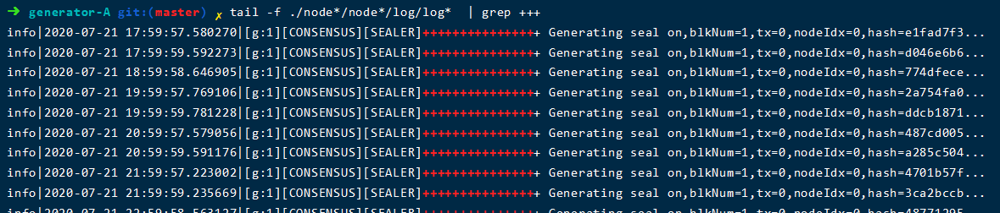

# Multi-machine deployment-Single Group Dual Mechanism Dual Node Networking Mode Actual Combat

Author ： Pu Canglong(Xiao Yue)Member of the Center for Blockchain and Applied Research, Shanghai University of International Business and Economics

## 0. Needs Analysis

There are two servers, then the next organization of each machine generates a node, two connected to one, that is: dual-organization dual-node single group.。

## 1. Download and install the operation and maintenance deployment tool

> *It is assumed that there is nothing on the machine, because the user who compiles the client using the source code does not have to take the last step.*

Download

``` bash
cd ~/ && git clone https://github.com/FISCO-BCOS/generator.git
```

安装(This action requires the user to have sudo privileges)
``` bash
cd ~/generator && bash ./scripts/install.sh
```

Check whether the installation is successful. If the installation is successful, output usage: generator xxx

``` bash
./generator -h
```

Get Node Binary
pull the latest fisco-bcos binary to meta

```bash
./generator --download_fisco ./meta
```

Check Binary Version

If successful, output FISCO-BCOS Version : x.x.x-x

```bash
./meta/fisco-bcos -v
```

The problem encountered here is that the binary file pull thief is slow。
Then I cloned the generator locally and found it was:


The download _ fisco function of the tool class is the main card here.。No cdn friend can vim modify this url as follows:

```bash
fisco official cdn
https://www.fisco.com.cn/cdn/fisco-bcos/releases/download/
or direct download:
https://xiaoyue-blog.oss-cn-hangzhou.aliyuncs.com/fisco-bcos.tar.gz
```

This is my OSS, open to use the master tap ah。

It will be over in less than a second.。Then this is installed:


---

## 2. Alliance chain initialization

come to kangkang topology


Because the official tutorial is on a machine with nodes 1,2。If it is divided, there is actually no difference between 1,2。Because it is on two machines, there will be no port conflict。If the port is not opened, an error may be reported. We recommend that you whitelist the two computers.。For more information, please refer to: [Port opening for FSICO BCOS multi-machine deployment](https://blog.csdn.net/xiaoyue2019/article/details/107401334)

|机构|Node|rpc port|channel port|p2p port|
|---|---|---|---|---|
|Institution A|Node 1|8545|20200|30300|
|Institution B|Node 2|8545|20200|30300|

### 2.1 Mechanism initialization

Initialization mechanism AB

```bash
cd ~/generator
cp -r ~/generator ~/generator-A
cp -r ~/generator ~/generator-B
```

### 2.2 Chain initialization

Generate chain certificate ca.crt & chain private key ca.key

```bash
./generator --generate_chain_certificate ./dir_chain_ca
```

chain certificate and chain private key in '. / dir _ chain _ ca'

---

## 3. Building Groups

### 3.1 Initialization mechanism A

Generate Certificate for Authority A

```bash
./generator --generate_agency_certificate ./dir_agency_ca ./dir_chain_ca agencyA
```

The certificate authority sends the certificate to the institution, which is placed in the meta directory.

```bash
cp ./dir_agency_ca/agencyA/* ~/generator-A/meta/
```

### 3.2 Initialization mechanism B

Generate Certificate for Authority B

```bash
./generator --generate_agency_certificate ./dir_agency_ca ./dir_chain_ca agencyB
```

The certificate authority sends the certificate to the institution, which is placed in the meta directory.

```bash
cp ./dir_agency_ca/agencyB/* ~/generator-B/meta/
```

### 3.3 Institution A Modifies Profile

Enter institution A to modify the node _ deployment.ini node configuration file and generate the node configuration folder。

```bash
cd ~/generator-A
cat > ./conf/node_deployment.ini<<EOF
[group]
group_id=1
[node0]
; host ip for the communication among peers.
; Please use your ssh login ip.
p2p_ip=you_ip
; listen ip for the communication between sdk clients.
; This ip is the same as p2p_ip for physical host.
; But for virtual host e.g. vps servers, it is usually different from p2p_ip.
; You can check accessible addresses of your network card.
; Please seehttps://tecadmin.net/check-ip-address-ubuntu-18-04-desktop/
; for more instructions.
rpc_ip=0.0.0.0
channel_ip=0.0.0.0
p2p_listen_port=30300
channel_listen_port=20200
jsonrpc_listen_port=8545
EOF
```

### 3.4 Institution B Modifies Configuration File

Enter institution B to modify node _ deployment.ini node configuration file and generate node configuration folder。

```bash
cd ~/generator-B
cat > ./conf/node_deployment.ini<<EOF
[group]
group_id=1
[node0]
; host ip for the communication among peers.
; Please use your ssh login ip.
p2p_ip=you_ip_B
; listen ip for the communication between sdk clients.
; This ip is the same as p2p_ip for physical host.
; But for virtual host e.g. vps servers, it is usually different from p2p_ip.
; You can check accessible addresses of your network card.
; Please seehttps://tecadmin.net/check-ip-address-ubuntu-18-04-desktop/
; for more instructions.
rpc_ip=0.0.0.0
channel_ip=0.0.0.0
p2p_listen_port=30300
channel_listen_port=20200
jsonrpc_listen_port=8545
EOF
```

### 3.5 Organization A generates and sends node information

Generate the certificate and P2P connection address file of the institution node A, and generate the certificate based on the modified node _ depostion.ini.

```bash
cd ~/generator-A
./generator --generate_all_certificates ./agencyA_node_info
```

When the organization generates a node, it needs to specify the P2P connection address of other nodes, where Organization A sends the P2P connection organization to Organization B.

```bash
cp ./agencyA_node_info/peers.txt ~/generator-B/meta/peersA.txt
```

### 3.6 Organization B generates and sends node information

Generate the certificate and P2P connection address file of the institution node A, and generate the certificate based on the modified node _ depostion.ini.

```bash
cd ~/generator-B
./generator --generate_all_certificates ./agencyB_node_info
```

Because the creation block needs to be generated, this institution must require a node certificate.。In addition to sending the P2P connection address, the B organization also sends the node certificate.。

```bash
cp ./agencyB_node_info/cert*.crt ~/generator-A/meta/
cp ./agencyB_node_info/peers.txt ~/generator-A/meta/peersB.txt
```

### 3.7 Institution A Generates Group 1 Genesis Block

to generate the Genesis block。Here can actually be generated by that agency through negotiation, not necessarily A.。

```bash
cd ~/generator-A
cat > ./conf/group_genesis.ini<< EOF
[group]
group_id=1
;i am xiaoyue
;my blog-s cnmf.net.cn
;yea i love you~
[nodes]
node0=you_ip:30300
node1=you_ip_b:30300
EOF
./generator --create_group_genesis ./group
```

Send the creation block of group1 to institution b

```bash
cp ./group/group.1.genesis ~/generator-B/meta
```

## 3.8 Organization A generates the node to which it belongs.

Generate Node for Agency A

```bash
cd ~/generator-A
./generator --build_install_package ./meta/peersB.txt ./nodeA
```

Start Node

```bash
bash ./nodeA/start_all.sh
```

There are two points to note:
1. It is no problem that the ports are consistent between the production node configuration file and the Genesis block configuration file, because I do not test on one machine and there will be no port conflicts。However, it is embarrassing that when copying mechanism B to machine B, it cannot run.。
2. The default IP address of the rpc is 127.0.0.1. If the rpc is turned on, a warning will be issued:


If you must enable the rpc test, you can also refer to the preceding statement to enable the firewall ip whitelist.。

---

## 4. Mechanism B transfers and generates nodes.

Compression: 'tar cvf B.tar generator-B`
Unzip: 'tar xvf B.tar'
Then upload download operation

### 4.1 Generate & Start Node:

```bash
./generator --build_install_package ./meta/peersA.txt ./nodeB
```

Agency B Start Node:

```bash
bash ./nodeB/start_all.sh
```

---

### Z. View consensus status

```bash
tail -f ./node*/node*/log/log*  | grep +++
```

The correct echo is as follows:



Here's another question。It is the above-mentioned self-confidence is not tested, resulting in the wrong ip loss leading to consensus failure, this time is not echoed.。Just delete the following regular。Can see the log error, through the error to find the reason can not be consensus。

---

You can contact me from:

**Blog:** [https://cnmf.net.cn/](https://cnmf.net.cn/)

**GitHub:** [https://github.com/xiaoyue2019](https://github.com/xiaoyue2019)

**CSDN:** [https://blog.csdn.net/xiaoyue2019](https://blog.csdn.net/xiaoyue2019)

welcome to our community to blow water duck


*Reference: < https://fisco-bcos-documentation.readthedocs.io/zh_CN/latest/docs/enterprise_tools/tutorial_detail_operation.html>*
